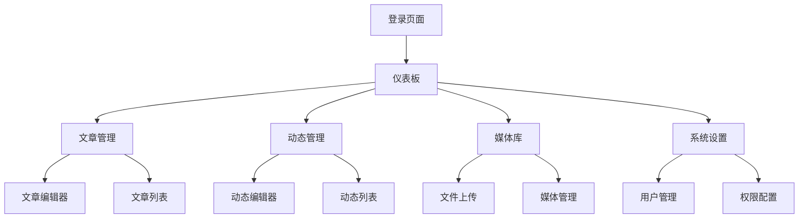

## 1. 产品概述
Firefly博客后端管理系统是一个独立的内容管理平台，专为管理博客的Markdown文章、动态内容和媒体资源而设计。系统提供直观的界面让管理员轻松创建、编辑和管理博客内容。

解决博客内容管理的效率问题，为博客管理员提供专业的内容管理工具，提升内容发布和维护的便捷性。

## 2. 核心功能

### 2.1 用户角色
| 角色 | 注册方式 | 核心权限 |
|------|----------|----------|
| 超级管理员 | 初始创建 | 系统管理、用户管理、所有内容管理 |
| 内容管理员 | 超级管理员创建 | 文章管理、动态管理、媒体文件管理 |
| 编辑 | 超级管理员创建 | 文章编辑、动态发布 |

### 2.2 功能模块
博客后端管理系统包含以下核心页面：
1. **登录页面**：用户认证、密码重置
2. **仪表板**：数据统计、快捷操作、系统状态
3. **文章管理**：文章列表、文章编辑、文章发布、分类管理
4. **动态管理**：动态列表、动态编辑、图片管理
5. **媒体库**：文件上传、图片管理、文件分类
6. **系统设置**：用户管理、权限配置、系统配置

### 2.3 页面详情
| 页面名称 | 模块名称 | 功能描述 |
|----------|----------|----------|
| 登录页面 | 用户登录 | 输入用户名密码进行身份验证，支持记住登录状态 |
| 登录页面 | 密码重置 | 通过邮箱重置用户密码 |
| 仪表板 | 数据统计 | 显示文章总数、动态总数、媒体文件数量、今日访问量 |
| 仪表板 | 快捷操作 | 快速发布文章、上传图片、查看最新评论 |
| 仪表板 | 系统状态 | 显示系统运行状态、存储空间使用情况 |
| 文章管理 | 文章列表 | 显示所有文章，支持搜索、筛选、分页、批量操作 |
| 文章管理 | 文章编辑器 | Markdown编辑器，支持实时预览、图片插入、代码高亮 |
| 文章管理 | 文章发布 | 设置文章标题、分类、标签、发布时间、封面图片 |
| 文章管理 | 分类管理 | 创建、编辑、删除文章分类 |
| 动态管理 | 动态列表 | 显示所有动态，支持按时间筛选、搜索 |
| 动态管理 | 动态编辑器 | 编辑动态内容，支持多张图片上传和排列 |
| 动态管理 | 图片管理 | 管理动态中的图片，支持拖拽排序、删除 |
| 媒体库 | 文件上传 | 支持拖拽上传、批量上传、进度显示 |
| 媒体库 | 图片管理 | 图片预览、缩略图生成、图片信息编辑 |
| 媒体库 | 文件分类 | 创建文件夹、文件标签、分类管理 |
| 系统设置 | 用户管理 | 添加用户、编辑用户信息、分配权限 |
| 系统设置 | 权限配置 | 设置不同角色的权限范围 |
| 系统设置 | 系统配置 | 配置博客基本信息、SEO设置、评论设置 |

## 3. 核心流程

### 管理员操作流程
1. 管理员访问系统登录页面，输入用户名密码进行登录
2. 登录成功后进入仪表板，查看系统概览和数据统计
3. 在文章管理页面，可以查看现有文章列表，点击新建文章进入编辑器
4. 在文章编辑器中，使用Markdown格式编写内容，实时预览效果
5. 设置文章分类、标签、封面图等属性，保存或发布文章
6. 在动态管理页面，编辑动态内容并上传多张图片
7. 在媒体库中上传和管理图片文件，支持批量操作
8. 在系统设置中管理用户权限和系统配置

## 4. 用户界面设计

### 4.1 设计风格
- **主色调**：深蓝色(#1e40af)为主，白色背景，灰色辅助
- **按钮样式**：圆角矩形，主要操作为实心按钮，次要操作为边框按钮
- **字体**：系统字体栈，主要文字14-16px，标题18-24px
- **布局风格**：左侧导航栏 + 右侧内容区的经典管理后台布局
- **图标风格**：使用简洁的线性图标，统一图标库

### 4.2 页面设计概述
| 页面名称 | 模块名称 | UI元素 |
|----------|----------|--------|
| 登录页面 | 登录表单 | 居中卡片布局，包含logo、用户名输入框、密码输入框、登录按钮 |
| 仪表板 | 数据统计 | 卡片式布局，显示关键数据的数字和趋势图标 |
| 文章管理 | 文章列表 | 表格形式显示，包含标题、分类、状态、发布时间、操作按钮 |
| 文章编辑器 | 编辑器 | 左侧Markdown输入区，右侧实时预览区，顶部工具栏 |
| 动态管理 | 动态列表 | 卡片式布局，显示动态内容和图片缩略图 |
| 媒体库 | 文件网格 | 网格布局显示文件缩略图，支持列表/网格视图切换 |

### 4.3 响应式设计
- 采用桌面端优先的设计方案
- 支持平板和移动端自适应
- 导航栏在移动端变为汉堡菜单
- 表格在移动端支持横向滚动