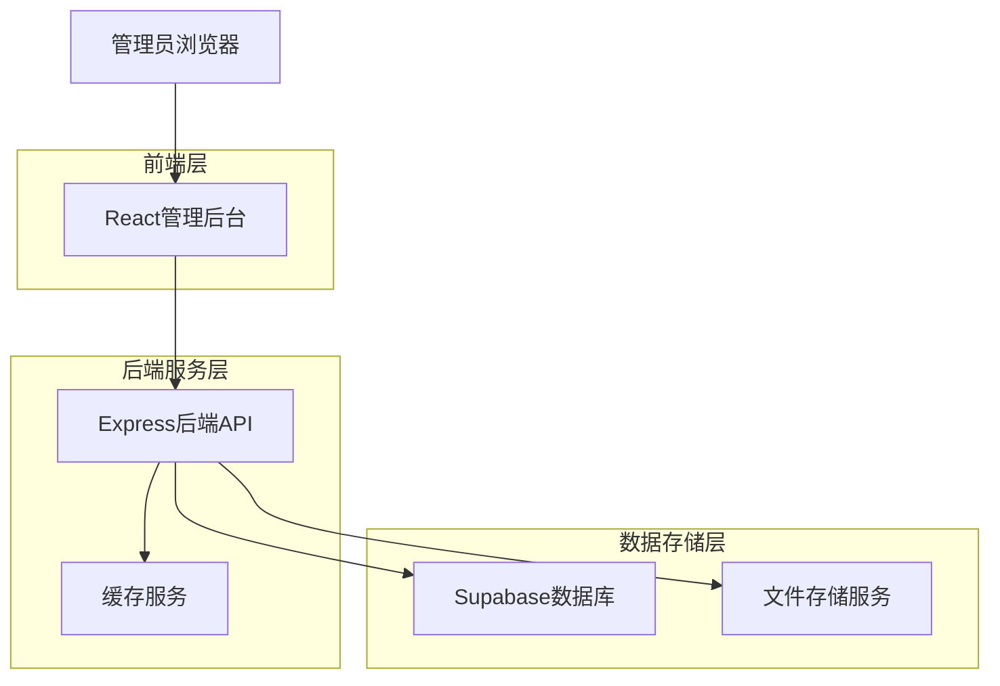
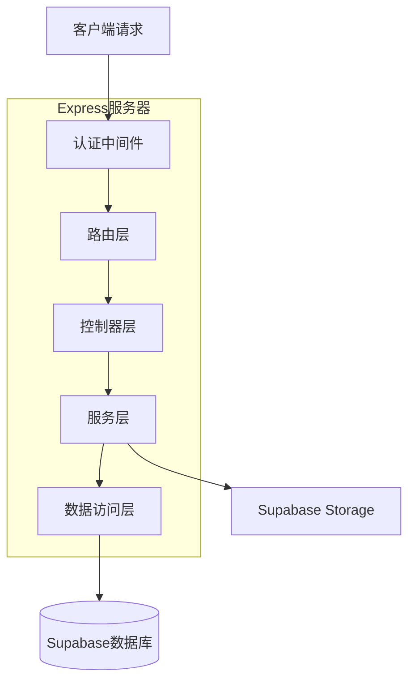
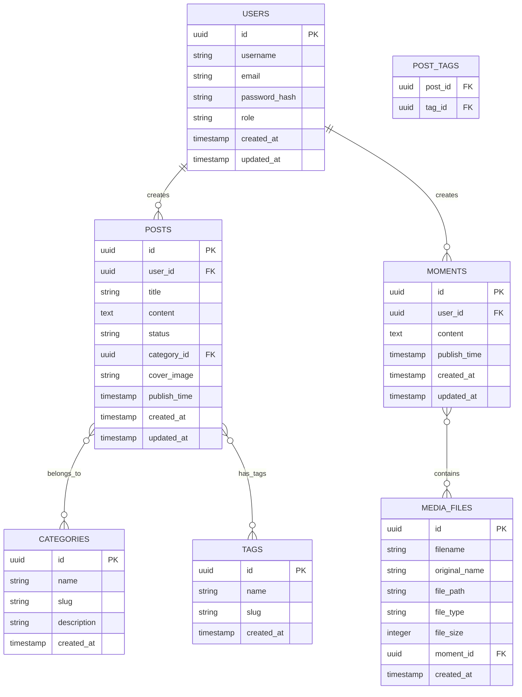

## 1. 架构设计



## 2. 技术描述

- **前端**: React@18 + TypeScript + Vite + TailwindCSS
- **初始化工具**: vite-init
- **后端**: Express@4 + TypeScript + Node.js
- **数据库**: Supabase (PostgreSQL)
- **文件存储**: Supabase Storage
- **身份验证**: Supabase Auth
- **缓存**: Redis (可选，用于高性能场景)

## 3. 路由定义

| 路由 | 目的 |
|------|------|
| /login | 登录页面，管理员身份验证 |
| /dashboard | 仪表板，显示系统概览和数据统计 |
| /posts | 文章管理页面，文章列表和管理 |
| /posts/new | 新建文章页面，Markdown编辑器 |
| /posts/edit/:id | 编辑文章页面 |
| /moments | 动态管理页面，动态列表和管理 |
| /moments/new | 新建动态页面 |
| /moments/edit/:id | 编辑动态页面 |
| /media | 媒体库页面，文件管理和上传 |
| /settings | 系统设置页面，用户和权限管理 |
| /settings/users | 用户管理页面 |
| /settings/permissions | 权限配置页面 |

## 4. API定义

### 4.1 认证相关API

**用户登录**
```
POST /api/auth/login
```

请求参数：
| 参数名 | 参数类型 | 是否必需 | 描述 |
|--------|----------|----------|------|
| username | string | true | 用户名 |
| password | string | true | 密码 |

响应参数：
| 参数名 | 参数类型 | 描述 |
|--------|----------|------|
| token | string | JWT令牌 |
| user | object | 用户信息 |

### 4.2 文章管理API

**获取文章列表**
```
GET /api/posts
```

查询参数：
| 参数名 | 参数类型 | 描述 |
|--------|----------|------|
| page | number | 页码 |
| limit | number | 每页数量 |
| category | string | 分类筛选 |
| status | string | 状态筛选 |

**创建文章**
```
POST /api/posts
```

请求体：
| 参数名 | 参数类型 | 是否必需 | 描述 |
|--------|----------|----------|------|
| title | string | true | 文章标题 |
| content | string | true | Markdown内容 |
| category | string | true | 分类 |
| tags | array | false | 标签数组 |
| cover_image | string | false | 封面图片URL |
| status | string | true | 发布状态 |

### 4.3 动态管理API

**获取动态列表**
```
GET /api/moments
```

**创建动态**
```
POST /api/moments
```

请求体：
| 参数名 | 参数类型 | 是否必需 | 描述 |
|--------|----------|----------|------|
| content | string | true | 动态内容 |
| images | array | false | 图片URL数组 |
| publish_time | string | false | 发布时间 |

### 4.4 媒体管理API

**上传文件**
```
POST /api/media/upload
```

请求体：
| 参数名 | 参数类型 | 是否必需 | 描述 |
|--------|----------|----------|------|
| file | file | true | 文件 |
| folder | string | false | 文件夹路径 |

**获取文件列表**
```
GET /api/media
```

## 5. 服务器架构图



## 6. 数据模型

### 6.1 数据模型定义



### 6.2 数据定义语言

**用户表 (users)**
```sql
-- 创建用户表
CREATE TABLE users (
  id UUID PRIMARY KEY DEFAULT gen_random_uuid(),
  username VARCHAR(50) UNIQUE NOT NULL,
  email VARCHAR(255) UNIQUE NOT NULL,
  password_hash VARCHAR(255) NOT NULL,
  role VARCHAR(20) DEFAULT 'editor' CHECK (role IN ('super_admin', 'admin', 'editor')),
  created_at TIMESTAMP WITH TIME ZONE DEFAULT NOW(),
  updated_at TIMESTAMP WITH TIME ZONE DEFAULT NOW()
);

-- 创建索引
CREATE INDEX idx_users_username ON users(username);
CREATE INDEX idx_users_email ON users(email);
CREATE INDEX idx_users_role ON users(role);
```

**文章表 (posts)**
```sql
-- 创建文章表
CREATE TABLE posts (
  id UUID PRIMARY KEY DEFAULT gen_random_uuid(),
  user_id UUID REFERENCES users(id) ON DELETE CASCADE,
  title VARCHAR(255) NOT NULL,
  content TEXT NOT NULL,
  status VARCHAR(20) DEFAULT 'draft' CHECK (status IN ('draft', 'published', 'archived')),
  category_id UUID REFERENCES categories(id),
  cover_image VARCHAR(500),
  publish_time TIMESTAMP WITH TIME ZONE,
  created_at TIMESTAMP WITH TIME ZONE DEFAULT NOW(),
  updated_at TIMESTAMP WITH TIME ZONE DEFAULT NOW()
);

-- 创建索引
CREATE INDEX idx_posts_user_id ON posts(user_id);
CREATE INDEX idx_posts_status ON posts(status);
CREATE INDEX idx_posts_category_id ON posts(category_id);
CREATE INDEX idx_posts_publish_time ON posts(publish_time DESC);
CREATE INDEX idx_posts_created_at ON posts(created_at DESC);
```

**分类表 (categories)**
```sql
-- 创建分类表
CREATE TABLE categories (
  id UUID PRIMARY KEY DEFAULT gen_random_uuid(),
  name VARCHAR(100) NOT NULL,
  slug VARCHAR(100) UNIQUE NOT NULL,
  description TEXT,
  created_at TIMESTAMP WITH TIME ZONE DEFAULT NOW()
);

-- 创建索引
CREATE INDEX idx_categories_slug ON categories(slug);
```

**标签表 (tags)**
```sql
-- 创建标签表
CREATE TABLE tags (
  id UUID PRIMARY KEY DEFAULT gen_random_uuid(),
  name VARCHAR(50) NOT NULL,
  slug VARCHAR(50) UNIQUE NOT NULL,
  created_at TIMESTAMP WITH TIME ZONE DEFAULT NOW()
);

-- 创建索引
CREATE INDEX idx_tags_slug ON tags(slug);
```

**文章标签关联表 (post_tags)**
```sql
-- 创建文章标签关联表
CREATE TABLE post_tags (
  post_id UUID REFERENCES posts(id) ON DELETE CASCADE,
  tag_id UUID REFERENCES tags(id) ON DELETE CASCADE,
  PRIMARY KEY (post_id, tag_id)
);

-- 创建索引
CREATE INDEX idx_post_tags_post_id ON post_tags(post_id);
CREATE INDEX idx_post_tags_tag_id ON post_tags(tag_id);
```

**动态表 (moments)**
```sql
-- 创建动态表
CREATE TABLE moments (
  id UUID PRIMARY KEY DEFAULT gen_random_uuid(),
  user_id UUID REFERENCES users(id) ON DELETE CASCADE,
  content TEXT NOT NULL,
  publish_time TIMESTAMP WITH TIME ZONE DEFAULT NOW(),
  created_at TIMESTAMP WITH TIME ZONE DEFAULT NOW(),
  updated_at TIMESTAMP WITH TIME ZONE DEFAULT NOW()
);

-- 创建索引
CREATE INDEX idx_moments_user_id ON moments(user_id);
CREATE INDEX idx_moments_publish_time ON moments(publish_time DESC);
```

**媒体文件表 (media_files)**
```sql
-- 创建媒体文件表
CREATE TABLE media_files (
  id UUID PRIMARY KEY DEFAULT gen_random_uuid(),
  filename VARCHAR(255) NOT NULL,
  original_name VARCHAR(255) NOT NULL,
  file_path VARCHAR(500) NOT NULL,
  file_type VARCHAR(100) NOT NULL,
  file_size BIGINT NOT NULL,
  moment_id UUID REFERENCES moments(id) ON DELETE SET NULL,
  created_at TIMESTAMP WITH TIME ZONE DEFAULT NOW()
);

-- 创建索引
CREATE INDEX idx_media_files_moment_id ON media_files(moment_id);
CREATE INDEX idx_media_files_file_type ON media_files(file_type);
CREATE INDEX idx_media_files_created_at ON media_files(created_at DESC);
```

**Supabase权限设置**
```sql
-- 为匿名用户授予基本读取权限
GRANT SELECT ON users TO anon;
GRANT SELECT ON posts TO anon;
GRANT SELECT ON categories TO anon;
GRANT SELECT ON tags TO anon;
GRANT SELECT ON post_tags TO anon;
GRANT SELECT ON moments TO anon;
GRANT SELECT ON media_files TO anon;

-- 为认证用户授予全部权限
GRANT ALL PRIVILEGES ON users TO authenticated;
GRANT ALL PRIVILEGES ON posts TO authenticated;
GRANT ALL PRIVILEGES ON categories TO authenticated;
GRANT ALL PRIVILEGES ON tags TO authenticated;
GRANT ALL PRIVILEGES ON post_tags TO authenticated;
GRANT ALL PRIVILEGES ON moments TO authenticated;
GRANT ALL PRIVILEGES ON media_files TO authenticated;
```