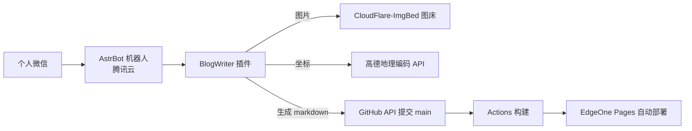

> 灵感来了，掏出手机，发一条微信，动态就上线了。这才是写博客该有的样子。

---

# 背景：为什么我懒得更新博客

之前写博客（[Firefly Astro 静态站](/posts/技术分享/记录博客文件的最佳存储方式)）有个很烦的问题：**想发一条动态，流程太长**。

- ❌ 得开电脑、开编辑器、改 markdown 文件
- ❌ 图片要先传到图床上，手动拿链接
- ❌ 足迹要填省份、城市，还得查经纬度
- ❌ 提交、构建、部署，一步都不能少

灵感是即时的，流程是繁琐的。很多时候想想这个流程，算了不发了。

后来我折腾出了一个方案：**用 AstrBot 把博客的后台搬进微信**。现在发动态就像聊天一样简单。

---

# 整体架构

博客是静态站，源码在 GitHub，push 到 main 自动构建部署（EdgeOne Pages）。所以整个方案的关键只有一件事：**把「写文件 + 提交」自动化**。



这套链路里，我只需要在微信里说话，剩下的全部自动。

---

# 怎么用

## 命令速查

| 命令 | 示例 | 效果 |
|---|---|---|
| `/动态` | `/动态 今天去了公园 #日常` | 发一条动态，可附图片 |
| `/笔记` | `/笔记 日常随笔 标题` | 发笔记，正文随后续消息追加 |
| `/足迹` | `/足迹 陕西 华阴市华山 去找宝宝了 #旅游` | 发足迹，坐标自动获取 |
| `/发布` | `/发布` | 结束会话，提交到博客 |
| `/取消` | `/取消` | 放弃当前会话 |

## 发一条带图的动态

```
我：/动态 今晚的晚霞真好看 #日常
机器人：动态已创建：今晚的晚霞真好看，标签：#日常
        可以直接发图片（可多发），发完说 /发布。
我：[图片]
机器人：已收到 1 张图片（共 1 张）。发 /发布 结束，发 /取消 放弃。
我：/发布
机器人：发布成功 ✅
        文件：src/content/moments/2026-08-11.md
        博客：https://blog.tsh520.cn/moments/2026-08-11
```

几分钟后刷新博客，动态已经上线了。

## 足迹是最爽的

足迹的痛点本来是坐标——谁记得华阴市华山的经纬度？插件会拿「省份 + 地点」去调**高德地理编码**，坐标自动填好：

```
我：/足迹 陕西 华阴市华山 去找宝宝了 #旅游 #2026
机器人：足迹已创建：陕西 华阴市华山（坐标将用高德地理编码获取）。
我：[照片][照片]
我：/发布
```

生成的文件长这样：

```yaml
---
date: 2026-08-11
province: 陕西
city: 华阴市华山
experience: 去找宝宝了
visitCount: 1
lat: 34.477861
lng: 110.084789
photos:
  - https://img.tsh520.cn/file/blog/moments/xxx.jpg
tags:
  - 旅游
  - "2026"
---
```

什么都不用查，拍照发图，坐标自己来。

---

# 方便在哪

✅ **手机随手发**：灵感来了直接发，不用开电脑  
✅ **图片自动上链**：微信收图 → 自动传图床 → 链接自动写进文章，不用手动传  
✅ **足迹坐标自动化**：高德地理编码，输入地名就有经纬度  
✅ **标签自定义**：`#日常` `#2026` 随手打，自动合并默认标签  
✅ **构建部署全自动**：GitHub 提交 → Actions 构建 → 页面自动上线  
✅ **增量发布**：图片失败/坐标失败都会中止，绝不产生半成品提交  

---

# 这套方案踩过的坑

方案看着简单，做起来还是有不少坑的，都记下来了：

- ⚠️ **微信的图片是临时文件**：个人微信适配器收图后存在 `data/temp`，消息处理完就被清理。所以插件必须在收到图片的瞬间就读进内存，发布时直接用。
- ⚠️ **YAML 引号会炸构建**：`published` 加引号会变成字符串，Astro 的 schema 直接报错；纯数字标签（`#2026`）也必须加引号，否则被解析成数字。格式必须和现有数据一字不差。
- ⚠️ **监听器会抢占对话**：拦截所有消息的监听器如果乱回复，会把机器人的正常聊天抢走。非白名单用户必须静默忽略，只放行博客相关命令。
- ⚠️ **图床接口要看文档**：上传接口、认证方式（Bearer Token）、响应格式（数组），都得对着文档来，不能凭猜。

---

# 结语

博客的本质是记录。记录的门槛越低，记录得越多。

现在这套方案让我做到了「**想到什么就发什么**」：路边看到一只猫，拍张照发过去，一条动态上线；到了一个地方，随手一条消息，足迹就记下了——连经纬度都不用我操心。

技术栈一句话总结：**AstrBot（微信入口）+ BlogWriter 插件（命令解析与生成）+ CloudFlare-ImgBed（图床）+ 高德（坐标）+ GitHub API（提交）+ EdgeOne Pages（部署）**，全链路零服务器成本（复用现有部署），一次搭好，永久受益。

如果你也是静态博客，也想让更新变得像聊天一样简单，这个思路值得抄。
