## 为什么需要 LangChain

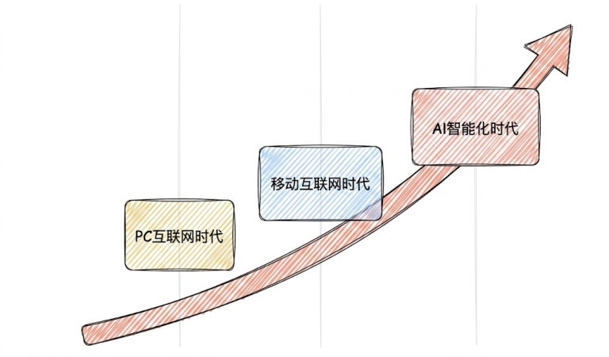
*图：从 PC 互联网时代、移动互联网时代一路走到 AI 智能化时代，应用形态的演进取向*

### 应用形态的三次跃迁

课程开篇用一条一路上扬的曲线，把"从传统应用到智能体"的演进串了起来，三个时代依次是：

| 时代 | 应用形态 |
| --- | --- |
| PC 互联网时代 | 传统应用 |
| 移动互联网时代 | 移动应用 |
| AI 智能化时代 | **智能体（Agent）** |

曲线之所以上扬，是因为每跃迁一次，应用能做的事就上了一个台阶，一直到 AI 智能化时代，应用形态变成会自己规划、自己调用工具、自己动手完成的**智能体**。这就是本节标题的完整含义——**从传统应用到智能体时代**，也是"为什么需要 LangChain"这个问题的起点：要造智能体，光有一个大模型是不够的。

### 单一的大模型有局限

一个大模型自己做不到这些事：

- **没有实时数据**：训练数据是"冻结"的，问"现在的热门影片"它答不准
- **会幻觉**：遇到训练时没学过的内容，它会编造答案
- **不能操作外部系统**：查数据库、调 API、读文件都不行
- **没有记忆**：每次对话都是独立的（第 3 章学过：模型是无状态的）

所以要构建真正实用的 AI 应用，必须把大模型与**外部工具、数据源和记忆机制**有机结合——这正是 LangChain 要解决的问题。

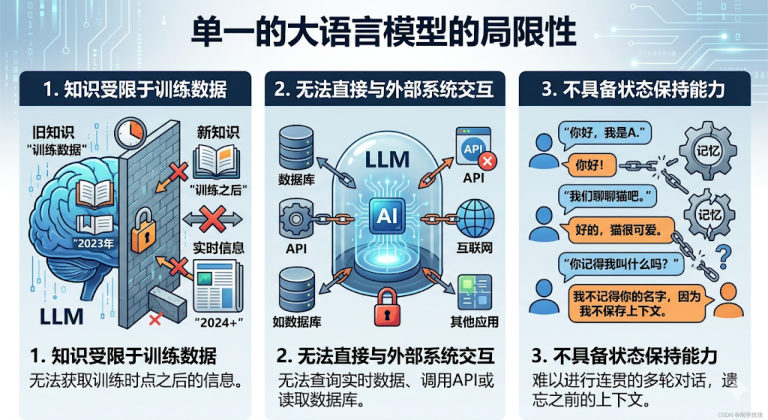
*图：单一的大语言模型的三大局限——知识受训练数据限制、无法直接与外部系统交互、不具备状态保持能力*

### LangChain 的定位

LangChain 是大模型与应用之间的**中间层**，可统一调用各类大模型、管理提示词与上下文，还能集成外部工具和数据源。核心定位三点：

1. **打通大模型与外部资源**：统一接口对接数据库、检索引擎、API、文件系统等
2. **封装底层复杂逻辑**：抽象工具调用、记忆等能力，降低智能体开发难度
3. **支撑多智能体协作**：依托 LangGraph 等生态，从单智能体拓展至多智能体协作

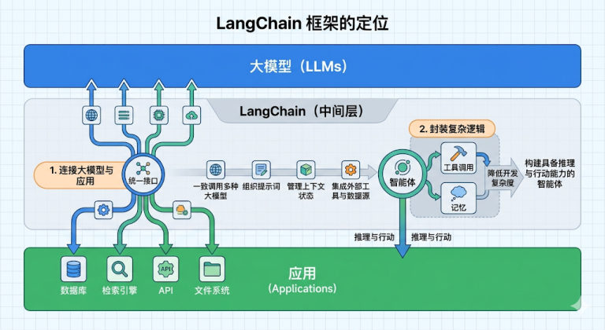
*图：LangChain 作为大模型与应用之间的中间层——对上统一调用各类大模型，对下连接数据库、检索引擎、API、文件系统*

### 课程对定位的完整表述

上面三点是压缩后的版本，课程里还有几句更完整的说法：

- **LangChain，是当前构建生产级 AI 智能体系统的首选。**
- 完整表述：LangChain 作为大模型与应用间的中间层，可统一调用各类大模型、管理提示词与上下文，还能集成外部工具和数据源，**快速搭建具备推理、行动能力的智能体**。
- 第 3 点"支撑多智能体协作"的完整说法：依托 LangGraph 等生态，从单智能体拓展至多智能体协作，**可构建工业级智能体**。

### 六类典型应用场景

| 场景 | 解决什么痛点 | 怎么做 |
| --- | --- | --- |
| 检索增强生成（RAG） | 知识滞后、幻觉 | 检索外部知识库并向量化，让模型基于最新资料回答 |
| Agent 智能体 | LLM 无法直接执行复杂任务 | 把模型当"推理引擎"，自主规划并调用外部工具 |
| 对话系统与聊天机器人 | 多轮对话的"记忆"流失 | 集成记忆管理，记住用户偏好和历史交互 |
| 多模态应用 | 只有文本 | 融合图像识别、语音转文字等能力 |
| 自动化写作与格式化生成 | 格式不标准、质量不稳定 | 配合提示词模板与输出解析器 |
| 数据连接与结构化处理 | 非结构化数据难利用 | 从 PDF/Excel 提取信息、自然语言转 SQL |

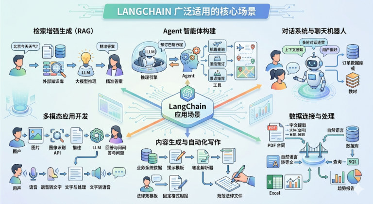
*图：LangChain 广泛适用的六大核心场景全景——RAG、Agent 智能体、对话机器人、多模态、内容生成、数据连接与处理*

### 六类场景的完整表述（课程原文）

上表是压缩版，课程对六大场景的完整说法是"**痛点 + 功能**"成对给出的：

1. **检索增强生成（RAG）**——**痛点**：解决大模型知识滞后（无实时数据）和幻觉问题；**功能**：检索外部知识库（文档 / 数据库）并向量化，让模型基于最新、最相关的资料回答。
2. **Agent 智能体构建**——**痛点**：解决 LLM 无法直接执行复杂任务的问题；**功能**：将模型作为"推理引擎"，自主规划路径并动态调用外部工具（如订票、查报告、写 SQL），实现复杂任务。
3. **对话系统与聊天机器人**——**痛点**：解决多轮对话中的"记忆"流失问题；**功能**：集成记忆管理系统，记住用户偏好和历史交互，并结合**私有数据（如教育教材、订单库）**提供专业服务。
4. **多模态应用开发**——**痛点**：跨越单一文本交互的限制；**功能**：融合图像识别、语音转文字等技术，让模型具备处理音视频和图片的综合推理能力。
5. **自动化写作与格式化生成**——**痛点**：解决生成内容格式不标准、质量不稳定的问题；**功能**：配合提示词模板（Templates）与输出解析器（Parsers），自动产出规范的报告、合同或邮件。
6. **数据连接与结构化处理**——**痛点**：解决非结构化数据难以被模型直接利用的问题；**功能**：**强大的数据连接能力使大模型能够与各种数据源和结构化数据交互**——比如从 PDF、Excel 中提取关键信息，或实现自然语言与 SQL 的自动转换。

## 大模型相关岗位介绍

课程给的判断很直接：**应用开发是大模型最值得关注的方向——应用为王！** 学习 LangChain 框架，就是为了高效开发大模型应用。

### 五层技术栈与对应岗位

整个"AI 大模型与 Agent 应用开发"的架构可以分成五层，每层都对应一类岗位：

| 层 | 层里有什么 | 对应岗位 |
| --- | --- | --- |
| **应用与（Agent）层** | **B 端应用**：智能制造、智能客服、在线诊疗……；**C 端应用**：AI 翻译、AI 问答、文生图/视频……；**G 端应用**：城市大脑、智慧交通、在线业务；**AI 智能体（Agent）**：代码助手（Coding Agent）、自动化工作流、简历筛选助手 | **大模型与 Agent 应用开发工程师** |
| **行业/多模态应用大模型层** | 行业大模型：制造、医疗、金融、电商；多模态模型：文本、图像、音频、视频 | 大模型微调 / 算法工程师 |
| **通用大模型（Foundation Models）层** | 通用大模型：文心一言、通义千问、ChatGPT、豆包；LLM 推理引擎：Ollama、localAI | 大模型基座开发 / 优化工程师 |
| **海量数据与治理层** | 结构化 / 非结构化数据；数据处理 / 清洗 / 标注（Postman 数据接口） | 数据开发 / 清洗工程师 |
| **算力与 Infra 基础设施层** | 算力：GPU / NPU 数据中心；Infra 平台：K8s、Docker、Dify 部署 | 大模型运维、Infra 工程师 |

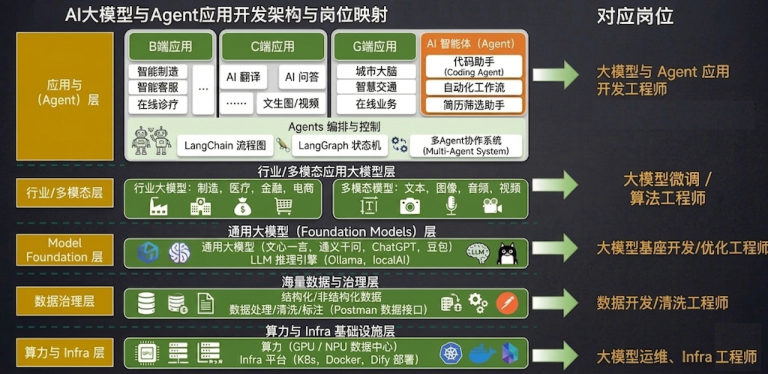
*图：AI 大模型与 Agent 应用开发的完整架构与岗位映射——从底层的算力与 Infra、海量数据与治理，往上是 Model Foundation、行业/多模态应用大模型，最上面是应用与（Agent）层*

### Agents 编排与控制

应用与 Agent 层里还有一块独立的"**Agents 编排与控制**"，列出的三样东西正好是这门课后面要一路学下去的工具：

- **LangChain 流程图**：把任务串成流程
- **LangGraph 状态机**：需要状态、分支、循环的复杂编排
- **多 Agent 协作系统（Multi-Agent System）**：多个智能体分工协作

> [!TIP]
> 看清楚这张图的位置关系就明白了：越往上层越贴近业务，而"应用与 Agent 层"正是这门课的主线——LangChain（流程图）→ LangGraph（状态机）→ 多 Agent 协作系统。

## LangChain 是什么

### 发展时间线（五个阶段）

| 阶段 | 时间 | 标志 |
| --- | --- | --- |
| 诞生 | 2022-10 | Harrison Chase 创建；名字来自 **Language + Chain**（链接语言模型与各类资源） |
| 探索期 | 2022Q4–2023Q1 | 初版聚焦 PromptTemplate、LLMChain，社区迅速走红 |
| 体系化 | 2023Q2–Q4 | 引入 Tool、Agent、Retrieval；推出 LangChain Hub 与 LangSmith |
| 平台化 | 2024–2025 上半年 | LangGraph 与 LangServe 发布，从框架走向平台 |
| 深层智能体 | 2025 下半年至今 | 推出 Deep Agent（定位 Agent Harness，智能体执行框架） |

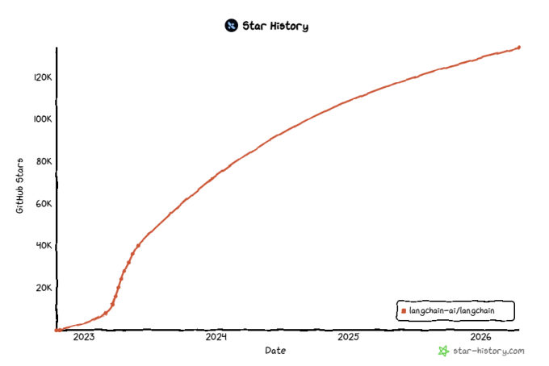
*图：LangChain 在 GitHub 上的 Star 增长曲线——从 2022 年开源起一路攀升到 12 万以上*

### 时间线的阶段细节

上表每格只有一句话，课程对五个阶段还有更完整的描述，几处细节值得记：

- **诞生（2022-10）**：Harrison Chase（**哈里森·蔡斯**）当时的身份是**哈佛大学的机器学习项目工程师**；名字取自 **Language**（语言模型）与 **Chain**（链式连接），体现的核心设计理念是"链接大语言模型与其他各种计算资源和数据，构建强大的 AI 应用"。
- **探索期（2022Q4–2023Q1）**：凭前瞻性设计在开源社区迅速走红，**GitHub Star 数快速破万**，成为早期最受关注的大模型应用框架。
- **体系化（2023Q2–Q4）**：引入 Tool、Agent、Retrieval，形成 **"大模型 + 工具调用 + 记忆"** 的核心架构；同期推出 LangChain Hub 与 LangSmith，**初步构建了从开发、调试到部署的生态闭环**。
- **平台化（2024–2025 上半年）**：LangGraph 为**工作流管理提供了有向图基础**，LangServe 则**解决了服务化部署的难题**——至此生态完成从"开发框架"到"智能体平台"的跃升。
- **深层智能体（2025 下半年至今）**：Deep Agent 官方定位为 **Agent Harness（智能体执行框架）**，运行在 LangGraph 与 LangChain 之上，标志着生态进入新阶段——让开发者可构建基于多智能体的复杂化智能体系统。

> [!NOTE]
> 五个阶段的关键词连起来就是一条主线：**框架**（PromptTemplate / LLMChain）→ **体系**（Tool / Agent / Retrieval + Hub / LangSmith）→ **平台**（LangGraph / LangServe）→ **多智能体**（Deep Agent）。

### 两个重要版本：v0.3 的痛与 v1.x 的重构

LangChain 长期因 API 变动频繁被戏称为"版本碎钞机"。2024 年起团队把链和智能体标记为弃用，转向基于 LangGraph 的统一智能体抽象；同时 GPT-4 之后"工具调用、结构化输出、系统提示词"都成了模型自带能力，再包一层显得多此一举——**这一阶段开发者大规模流失**。

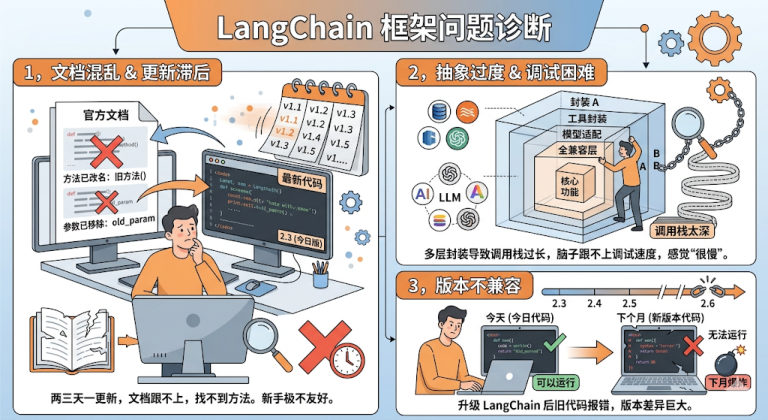
*图：LangChain 框架被吐槽的三大问题——文档混乱且更新滞后、抽象过度导致调试困难、版本不兼容*

2025-10-20 发布 **LangChain v1.0.0 + LangGraph v1.0.0**，是里程碑事件：官方首次明确 **API 稳定保证（2.0 前无破坏性变更）**。

| 维度 | v0.3（过渡版） | **v1.2（生产级稳定版）** |
| --- | --- | --- |
| 核心架构 | 以"链（Chain）"为核心 | 从"链式调用"转向**智能体框架** |
| Agent 构建 | `initialize_agent` 等旧 API + AgentExecutor | 官方标准入口 **`create_agent`**，底层基于 LangGraph |
| 工具定义 | `@tool` / Tool 类，类型安全较弱 | 支持 **Pydantic Schema** 定义工具，类型安全 |
| 结构化输出 | JSON Parser + 正则，稳定性差 | **一等公民**，直接绑定 Pydantic 类，由模型底层保证 |
| 输出解析 | 纯文本 + 手动解析 | 标准化 `content_blocks`（推理/文本/工具调用统一为对象） |
| 扩展机制 | 缺乏系统性扩展方式 | **Middleware 中间件**系统，可拦截各生命周期 |
| 异步性能 | 一般 | 优化后响应速度提升 30%+ |
| 包结构 | 较混乱、耦合高 | 主 `langchain` 包保持轻量，旧功能迁至 `langchain-classic` |
| Python 要求 | >= 3.9 | **>= 3.10** |

> [!IMPORTANT]
> 学习与新建项目**一律用 v1.x**（本课程就是 1.2）。看到网上老教程里的 `initialize_agent`、`LLMChain`、`AgentExecutor`，要知道那是 v0.3 的写法，在 1.x 里已经移除或迁到 `langchain-classic`。

### 版本对比补全：多模态、包结构与推荐用途

上表之外，课程对比表里还有三个维度：

| 维度 | v0.3 | **v1.2** |
| --- | --- | --- |
| 多模态支持 | 支持不完善，**无法无缝集成图像、音频**等多模态数据 | **完善了多模态适配**，可轻松实现多模态对话、多模态 RAG 等功能 |
| 包结构与依赖 | 包结构相对混乱、各模块耦合度较高；`langchain` 包为直接依赖；内部从 **Pydantic v1 升级到 v2**，对依赖版本要求更严格 | 包结构清晰，主 `langchain` 包保持轻量，旧功能（如 Chains）被迁移至 `langchain-classic`；**`@langchain/core` 作为对等依赖**，版本管理更灵活 |
| 推荐用途 | 只适用于**维护依赖 v0.3 的老旧项目**，不推荐用于新项目开发 | **所有新项目和学习 LangChain 的首选版本**；官方承诺 1.x 版本系列不会引入破坏性变更，保证了长期稳定性 |

而 v1.0 发布这件事，课程还补了一条背景：**发布同期完成 1.2 亿美元融资，估值超 12 亿美元**，印证其作为 AI 基础设施的战略价值。

### v1.2 的主要模块

| 包 | 作用 |
| --- | --- |
| `langchain-core` | 核心 API：Runnable、BaseMessage 等 |
| `langchain` | 主包（轻量）：`create_agent`、`init_chat_model` 等 |
| `langchain-classic` | 冗余/不推荐使用的经典 API（0.x 常用、1.x 移除的都在这） |
| `langchain-community` | 第三方集成（合作伙伴包如 langchain-openai、langchain-anthropic，按需安装） |
| `langgraph` | 深度整合 LangGraph 1.0，协调多个 Chain/Agent/Tools，支持循环调用 |

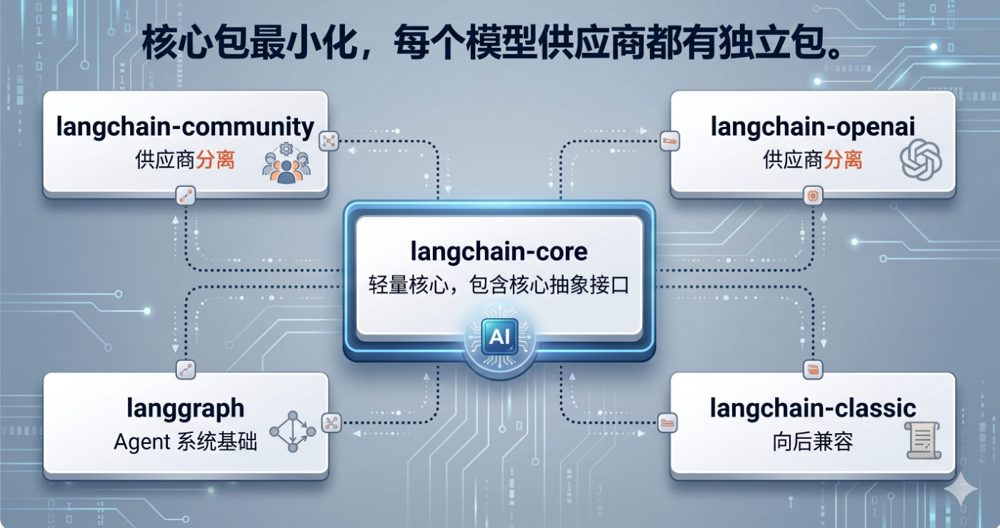
*图：v1.2 的包结构——核心包最小化，langchain-core 只保留核心抽象接口，模型供应商与旧 API 各自拆成独立包*

> [!TIP]
> 官方原话的意思：**不要试图学完 LangChain 的所有 API**，那是不可能的。搞懂核心逻辑与核心模块，其它用到再查——把它当**工具箱**，不是教科书。

文档地址：

- 中文文档：https://docs.langchain.org.cn/oss/python/langchain/overview
- 英文文档：https://docs.langchain.com/oss/python/langchain/overview
- API 查询（最常查）：https://reference.langchain.com/python/langchain/

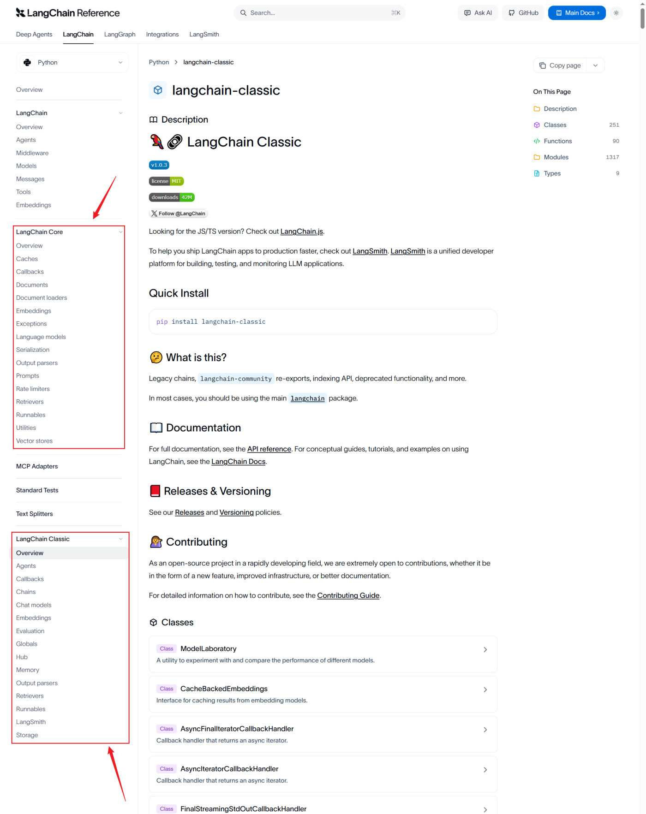
*图：API 文档查询页——LangChain、LangChain Core、LangChain Classic 等模块的接口都在这里查*

### 官网与 GitHub 组织

文档之前，课程先给了生态的两个总入口：

- 官网：https://www.langchain.com/
- GitHub 组织：https://github.com/langchain-ai

## LangChain 家族四大支柱

截至 2025-11，LangChain 已从一个框架成长为覆盖智能体全生命周期的技术生态，四大支柱分别对应四个层次：

| 支柱 | 层次 | 一句话 |
| --- | --- | --- |
| **LangChain** | 基础能力层 | 智能体开发的基石（模型调用、工具与中间件集成、智能体构建） |
| **LangGraph** | 运行时编排层 | 复杂工作流的编排引擎（把智能体抽象成有向图） |
| **Deep Agent** | 智能体抽象层 | 智能体执行框架（Agent Harness），自带规划/文件系统/子智能体 |
| **LangSmith** | 监控与评估层 | 可视化监控与测试平台（追踪调用链路） |

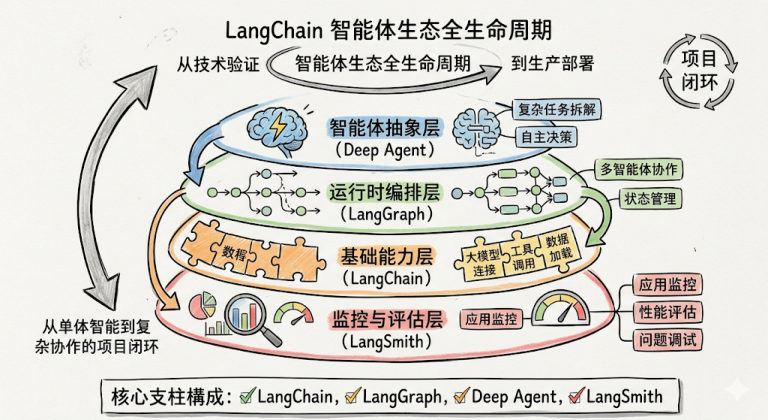
*图：LangChain 生态的四层结构——智能体抽象层（Deep Agent）、运行时编排层（LangGraph）、基础能力层（LangChain）、监控与评估层（LangSmith）*

### 官方文档入口

- 官方对四大支柱的解释：https://docs.langchain.com/oss/python/concepts/products
- 官方文档（三者对比，LangChain / LangGraph / Deep Agents 怎么选）：https://docs.langchain.com/oss/python/langchain/overview

### LangChain：智能体开发的基石

LangChain 是整个生态的**核心与起点**，为开发者提供模型调用、工具与中间件集成、智能体构建等一整套基础能力。其核心价值有三条：

1. **统一的模型抽象层**：屏蔽不同模型服务提供商（OpenAI、Anthropic、Ollama 等）的接口差异，提供一致的调用方式。
2. **高度模块化的设计**：用 Message、Tool、Agent、Middleware 等组件实现灵活的组合与扩展。
3. **丰富的集成生态**：预置了丰富的数据源、API、中间件等，构成强大的 AI 能力枢纽。

> [!NOTE]
> 在整体架构中，**LangChain 如同智能体的操作系统内核**，是所有上层能力构建的基础。
> 课程给出的结论：**如果你需要构建简单的智能体应用、无需复杂的编排需求，那就选择 LangChain。**

### LangGraph：把智能体变成一张图

把智能体内部抽象为一张**有向图**：

- **节点（Node）**：代表独立的功能单元或决策点
- **边（Edge）**：定义节点之间的流转条件与路径
- **状态（State）**：共享上下文，在节点间传递并持久化

通俗理解：**LangChain = 能力抽象层（有什么能力）**，**LangGraph = 执行与编排层（怎么跑）**。官方强调"快速起步用 LangChain，复杂控制用 LangGraph，二者并行协同"。

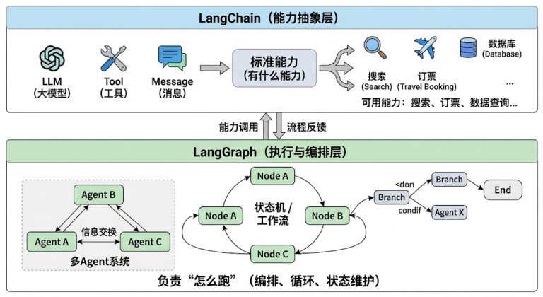
*图：两层分工——LangChain 提供标准能力（有什么能力），LangGraph 用状态机、工作流与多 Agent 系统负责"怎么跑"*

### 图式结构带来了什么

课程对 LangGraph 的这个卖点有一句原话：**通过这种图式结构，LangGraph 让智能体的工作流节点交互变得显式、可控、可观测。**

对比一下就明白了：链式调用是一条道走到黑，而图有节点、有边、有状态——节点之间的路径写在代码里看得见（**显式**），分支与循环都能表达（**可控**，LangGraph 还支持循环调用），每一步的共享状态也都留得下（**可观测**）。任务一旦从"一条指令"变成"多步骤、有状态"，这三样就是刚需。

### Deep Agent：执行框架

构建于 LangChain 与 LangGraph 之上，增加了规划能力、文件系统、子 Agent 等高级功能。核心能力：

- **显式规划**：自主生成、执行并动态调整多步任务计划
- **虚拟文件系统**：为智能体提供结构化的中间结果与知识存储
- **子智能体**：支持任务在多个智能体之间分解与协作
- **长期记忆**：结合 LangGraph 状态存储，跨对话积累经验
- **可扩展中间件**：嵌入安全审计、性能监控或自定义业务逻辑

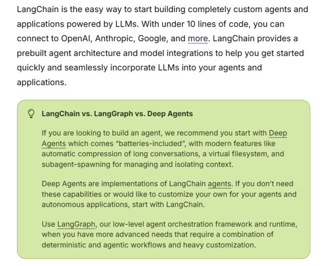
*图：官方文档给出的三者选择建议——想开箱即用地做智能体从 Deep Agents 起步，需要自己定制就用 LangChain，更复杂的确定性工作流编排上 LangGraph*

### Deep Agent 的定位补充

课程还专门交代了 Deep Agent 的定位与目标：

- 它是**新推出的全新组件**，官方定位为 **Agent Harness（智能体执行框架）**；
- 它的目标：**让开发者无须从零构建复杂的控制逻辑，即可创建具备深度规划、长期记忆与多专家协作能力的智能体**；
- 顺带一句关系说明：三个框架**不是竞争关系，并非互斥**，复杂项目完全可以同时用到这三层。

> [!NOTE]
> 三者**不是竞争关系**：从 LangChain 快速搭建，用 LangGraph 打磨生产稳定性，再用 Deep Agent 赋予更强的自主能力——这才是完整的生态玩法。

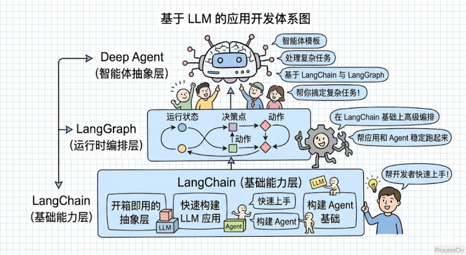
*图：基于 LLM 的应用开发体系图——LangChain 打底（基础能力层），LangGraph 居中做高级编排，Deep Agent 在上层处理复杂任务*

### LangSmith：让智能体的运行过程可见

单靠 print 调试已经不够用了。LangSmith 是官方的**可视化监控与测试平台**，跟踪、记录、分析智能体运行时的完整调用链路：

| 能力 | 说明 |
| --- | --- |
| 全链路追踪 | 可视化每一步的提示词、模型输出、工具使用 |
| 调试与优化 | 发现异常行为与性能瓶颈 |
| 评测与质量控制 | 支持人工与自动化评测 |
| 团队协作 | 共享测试集与调用记录 |

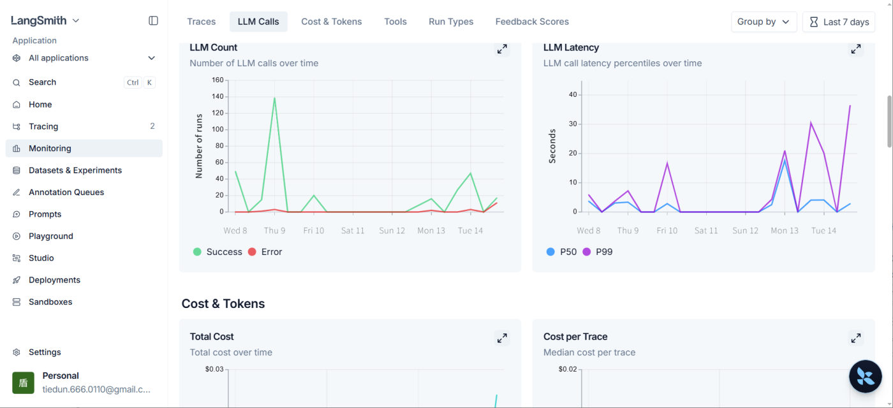
*图：LangSmith 的监控看板——LLM 调用次数与成功/失败曲线、延迟分位数（P50/P99）、成本与 Token 消耗*

### LangSmith 官网与质量闭环

- LangSmith 官网：https://www.langchain.com/langsmith
- 课程对它的收尾评价：**LangSmith 的引入使得智能体的开发、调试与运维形成了完整的质量闭环。**

## 开发前的前置知识

| 方向 | 需要掌握 |
| --- | --- |
| Python 基础 | 变量、流程控制、函数与参数机制、**类与对象、装饰器**；常用容器、JSON、异常处理；模块导入、包管理、线程与协程 |
| 大模型基础 | LLM、Token、Prompt、Embedding 的概念；用过豆包/千问/DeepSeek 等；了解 OpenAI/Anthropic/阿里云百炼/DeepSeek 等平台 |

> [!TIP]
> 这两块正是前面几章的内容——装饰器（函数进阶）、异常处理、JSON、面向对象（第 6 章）都会在 LangChain 里反复用到。

### LangChain 生态支持 Python 与 JavaScript

课程特意点明：**LangChain 生态支持包括 Python 和 JavaScript 两种语言实现**，其中 **Python 版本仍是功能最完整、更新最及时、社区最活跃的核心实现**——本课程讲的也是 Python 版。

> [!NOTE]
> Python 基础清单里的"模块导入、**包管理**"，课程推荐用 pip 或 conda——这正是下一篇《开发环境搭建（conda）》要动手做的事。

## 相关

- [大模型应用场景与技术选型](/posts/编程学习/langchain学习笔记/02-大模型应用场景与技术选型/)
- [开发环境搭建（conda）](/posts/编程学习/langchain学习笔记/03-开发环境搭建-conda/)

## 练习题

### 一、回忆填空（写完再展开对答案）

1. LangChain 的名字来自 ____（语言模型）和 ____（链式连接）的组合
2. 单一的大模型有四个局限：没有 ____、会 ____、不能操作外部系统、没有 ____
3. LangChain 的定位是大模型与应用之间的 ____，核心定位三点：打通 ____、封装 ____、支撑 ____
4. LangChain 1.0/1.2 发布时间是 ____；官方承诺 ____ 版本之前无破坏性变更
5. v1.x 的 Agent 标准构建入口是 ____，底层基于 ____
6. v1.x 把旧功能迁移到 ____ 包，主 langchain 包保持轻量
7. 四大支柱：____（基础能力层）、____（运行时编排层）、____（智能体抽象层）、____（监控与评估层）
8. LangGraph 把智能体抽象成有向图：____ 是功能单元、____ 定义流转、____ 是共享上下文
9. LangChain 1.2 要求 Python 版本 ____ 以上

> [!TIP]- 填空答案（做完再点开）
> 1. Language / Chain　2. 实时数据 / 幻觉 / 记忆　3. 中间层 / 大模型与外部资源、底层复杂逻辑、多智能体协作　4. 2025-10-20 / 2.0　5. `create_agent` / LangGraph　6. `langchain-classic`　7. LangChain、LangGraph、Deep Agent、LangSmith　8. 节点 / 边 / 状态　9. 3.10

### 二、概念自测

- [ ] **2-1** 用自己的话说清楚：为什么"只调大模型 API"做不出实用的 AI 应用？
- [ ] **2-2** LangChain 和 LangGraph 的分工是什么？（用"有什么能力"和"怎么跑"来回答）
- [ ] **2-3** 网上看到一段代码用了 `initialize_agent` 和 `AgentExecutor`，你怎么判断它的版本？在 1.x 里应该用什么替代？

> [!TIP]- 参考答案（做完再点开）
> **2-1** 因为大模型本身无状态、知识冻结、会幻觉、也碰不到外部系统。要做出实用应用，必须给它接上**外部数据**（RAG）、**工具**（调用 API/数据库）、**记忆**（多轮上下文）——这些"胶水"工作就是 LangChain 的活。
> **2-2** LangChain 是**能力抽象层**，负责"有什么能力"（把 LLM、Tool、Message 标准化）；LangGraph 是**执行与编排层**，负责"怎么跑"（状态机、工作流、多 Agent 协作）。简单场景只用 LangChain，需要多步骤/有状态编排时上 LangGraph。
> **2-3** `initialize_agent`、`AgentExecutor` 是 **v0.3** 的旧 API（1.x 里已移除，迁移到 `langchain-classic`）。1.x 里用 **`create_agent`** 构建智能体。