## 大模型应用的技术特点

课程对这一章的总起只有一句话：**大模型应用的技术特点——门槛低，天花板高。**

- **门槛低**：不需要自己训练模型，会写提示词就能做出能用的东西（后面"四种开发场景"里的纯 Prompt 就是最低门槛的形态）。
- **天花板高**：同一个应用可以一路往上加能力——加外部知识（RAG）、加工具与行动能力（Agent + Function Calling）、加多智能体协作……能解决的问题越来越复杂。

> [!NOTE]
> 这一章就是按"门槛低 → 天花板高"的顺序铺开的：先讲 RAG 与 Agent 两大核心场景，再讲四种开发场景怎么选。

## RAG：给大模型接上外部知识

### 为什么要 RAG

| 问题 | 说明 |
| --- | --- |
| **知识冻结** | 模型规模越大，训练成本与周期越高，**无法实时学到最新信息**，答不了"请推荐现在的热门影片"这类时间敏感问题 |
| **幻觉** | 涉及从未学过的信息时，模型不会说"不知道"，转而**臆想和编造** |

打个比方：LLM 考试时遇到陌生领域本想"放飞自我"，而 RAG 给了它提示和思路——**正确率能从 60% 提到 90%**。

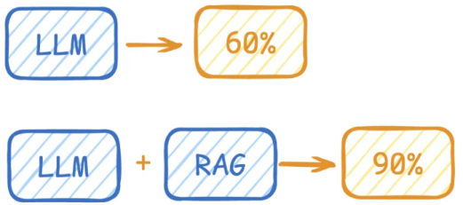
*图：只用 LLM 答题正确率约 60%，LLM + RAG 给到提示和思路后提升到 90%*

### RAG 是什么

**Retrieval-Augmented Generation（检索增强生成）**：先从知识库里**检索**出相关资料，把资料作为**上下文**拼进提示词，再让模型**生成**答案。

整个流程：

```text
本地文件（PDF/Word/TXT/二维表…）
   ↓ 文档加载器 Unstructured Loader
   ↓ 文本切分 Text Splitter  →  Text Chunk / Text Chunk / Text Chunk
   ↓ 嵌入模型 Embedding Model →  向量嵌入 Vector Embeddings
   ↓ 存储 & 索引 Store & Index →  向量数据库 Vector Database

用户提问 User Query
   ↓ 嵌入模型 → 向量嵌入
   ↓ 相似度搜索 Similarity Search（在向量数据库里找最相似的向量）
   ↓
Prompt = 检索到的 Context + User Query  →  LLM  →  回答
```

三步的对应关系：**检索** = 从库里找相关资料；**增强** = 把资料拼进提示词；**生成** = 模型基于资料作答。

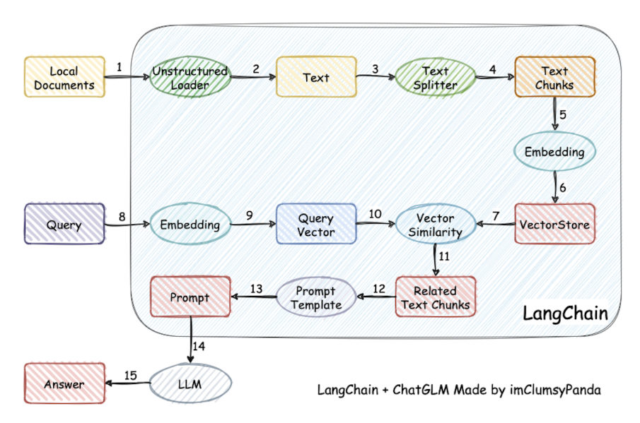
*图：RAG 的完整链路（15 步）——本地文档加载 → 文本切分 → 嵌入模型向量化 → 存进向量库；查询侧再向量化 → 向量相似度检索 → 取出相关 chunk 交给提示词模板 → LLM 生成答案*

### 三步在流程图里的位置（第 10 / 13 / 15 步）

课程把"检索、增强、生成"三步钉在了具体的步号上——**检索可以理解为第 10 步，增强理解为第 13 步（这里的提示词包含检索到的数据），生成理解为第 15 步**（对应上面这张 15 步流程图）。

换成 9 步流程图的粒度，同一件事是这么分布的：

| 三步 | 15 步流程图 | 9 步流程图（知识更新 / 知识检索两条链） |
| --- | --- | --- |
| **检索** | 第 **10** 步：向量相似度搜索 Vector Similarity | 第 **6** 步"知识检索" + 第 **7** 步"知识重排序" |
| **增强** | 第 **13** 步：提示词 Prompt（提示词里带上检索到的数据） | 第 **8** 步"增强" |
| **生成** | 第 **15** 步：交给 LLM，输出回答 | 第 **9** 步"生成" |

> [!NOTE]
> 两张图讲的是一条链路，差别只在粒度。9 步图把它拆成上下两条：上半条是**知识更新**——1 文件解析、2 文件切割、3 向量化、4 知识入库；下半条是**知识检索**——5 query 提问、6 知识检索、7 知识重排序、8 增强、9 生成。这也正是"RAG 离线建库 + 在线问答"两条链路的分工。

### 四个难点

| 难点 | 具体问题 |
| --- | --- |
| 1. 文件解析 | PDF 内部还有图片、表格，图片上还有文字，都要处理 |
| 2. 文件切割 | 没有固定格式，切多大、在哪切都影响效果 |
| 3. 知识检索 | 文档一多，召回准确率会下降 |
| 4. 知识重排序 | 需要对初步召回的结果再精排 |

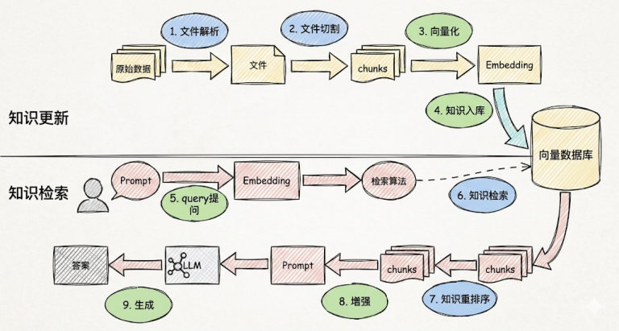
*图：RAG 的两条链路——知识更新（文件解析 → 文件切割 → 向量化 → 知识入库）与知识检索（query 提问 → 知识检索 → 知识重排序 → 增强 → 生成）*

**Reranker（重排器）**：RAG 应用中文档数量增加会让召回准确率下降，引入 reranker 可以对初步召回的较多 chunk（如 top 20 / top 50）做精排，提高准确率，避免 LLM 处理无关信息。

| 用不用 reranker | 结论 |
| --- | --- |
| 适合 | 追求**高精度、高相关性**的场景，如专业知识库、客服系统 |
| 不适合 | 对**响应时间要求高**的服务——它会增加召回时间与检索延迟 |
| 成本 | reranker 增强型 RAG 比普通矢量搜索贵，但仍比"纯靠 LLM 生成答案"便宜 |

## Agent：让大模型自己动手

### Agent 是什么

充分利用 LLM 的推理决策能力，通过增加**规划、记忆和工具调用**的能力，构造一个能够**独立思考、逐步完成给定目标**的智能体。这个架构由 OpenAI 的翁丽莲（Lilian Weng）在 2023-06 的博客中首次提出。

用一个公式表示：

```text
Agent = LLM + Planning + Tools + Memory + Action
```

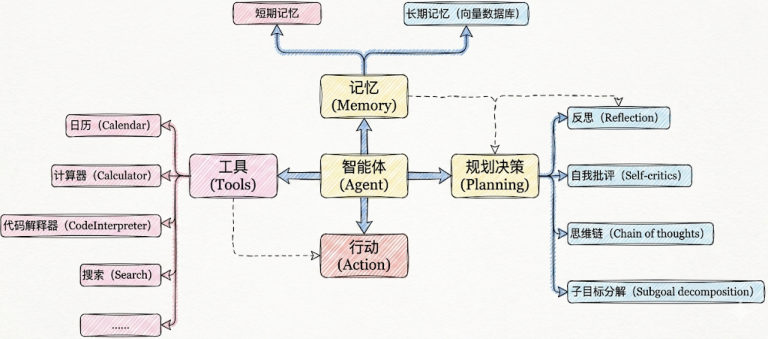
*图：AI Agent 架构总览——智能体居中，连着记忆（短期记忆 / 长期记忆向量数据库）、工具（日历、计算器、代码解释器、搜索…）、行动，以及规划决策（反思、自我批评、思维链、子目标分解）*

通俗类比——"打车去西藏玩"：

- **规划**：先规划路线，再订酒店、订饭店……
- **调用工具**：通过 Function Calling / MCP 调滴滴、携程、美团
- **记忆**：聊到订酒店时得知道是"西藏路上的酒店"，不能聊着聊着忘了最初目的地
- **行动**：真去执行，不能纸上谈兵


*图：更朴素的类比——原始人靠"决策能力 + 记忆能力"才能造出长矛、鱼钩这些工具，进而钓鱼、烤鱼；智能体也是"会用工具"才谈得上解决问题*

### 五个核心要素

| 要素 | 说明 |
| --- | --- |
| 1. 大模型（LLM）作为"大脑" | 提供推理、规划和知识理解，是决策中枢，能呈现推理和规划过程 |
| 2. 规划决策（Planning） | 任务分解、反思与自省；用思维链（Chain of Thought）把目标拆成子任务，再用反馈优化策略 |
| 3. 工具使用（Tool Use） | 调用外部工具（API、数据库）扩展能力边界 |
| 4. 记忆（Memory） | 留存知识与交互习惯，处理重复工作时可调用以前的经验 |
| 5. 行动（Action） | 实际执行决策：软件接口操作（自动订票）到物理交互（机器人搬运） |

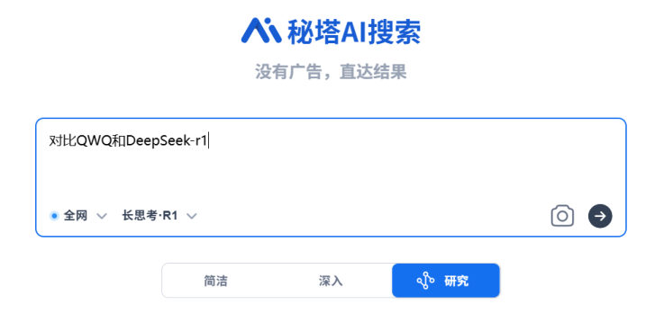
*图：规划决策的实例——把问题交给带"研究"模式的大模型搜索（秘塔 AI 搜索），先提问再让它自己拆步骤*

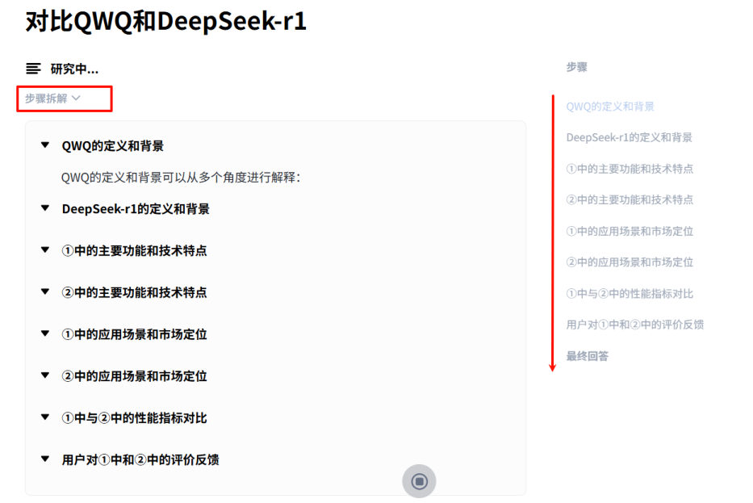
*图：思维链与子目标分解的真实样子——模型先把任务拆成"步骤"，再逐个补齐定义、背景、功能、场景、指标对比等子任务，这就是 Planning*

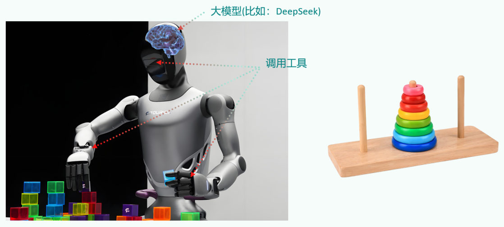
*图：工具使用与行动——大模型（如 DeepSeek）充当"大脑"，通过调用工具驱动机器人完成叠积木这类物理任务*

### 智能体的完整工作流程

课程把智能体跑完一个任务的完整计划流程写了出来——**先读取以前工作的经验和记忆，之后规划子目标并使用相应工具去处理问题，最后输出给用户并完成反思**。

另外，前面"打车去西藏玩"的类比里其实还有一个开头就被点名的角色：**大脑中枢——规划行程的你**。上面那四件事（规划、调用工具、记忆、行动）都挂在它下面，讲的是同一个意思——智能体要像办事的人一样，先拿主意，再动手，还得记得住。

> [!TIP]
> 注意流程的最后一环是"**反思**"：一次任务跑完的复盘会回流到记忆里，成为下次"读取以前工作的经验和记忆"时能读到的东西。这也是 Agent 五个核心要素里"规划决策（Planning）"要包含"反思与自省"的原因。

### 短期记忆 vs 长期记忆

| | 短期记忆 | 长期记忆 |
| --- | --- | --- |
| 范围 | 单次对话周期内的上下文 | **跨多个会话或时间周期** |
| 限制 | 受**上下文窗口长度**限制 | 存储并调用核心知识、非即时任务 |
| 例子 | 这一轮聊了什么 | 用户偏好、过去执行过的指令 |
| 实现 | 会话历史（第 3 章的"滚雪球"） | 模型参数微调、知识图谱、**向量数据库** |

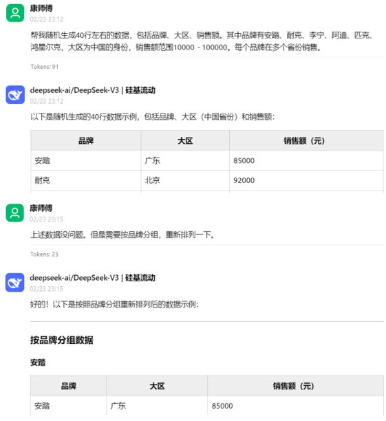
*图：短期记忆的直观例子——模型记住了上一轮刚生成的表格，用户只说"按品牌分组重新排列一下"，它就直接照做*

> [!NOTE]
> 上下文窗口这些年涨得很快：早期的 ChatGPT 约 8k token、GPT-4 约 32k；现在不少模型已支持 100 万 token 甚至更多（相当于 2000 万字文本）。但**窗口再大也有上限**，所以长期记忆依然要靠外部存储。

### 各家模型的上下文窗口（课程给出的数字）

| 模型 | 上下文窗口 |
| --- | --- |
| ChatGPT | 约 8k token |
| GPT-4 | 约 32k token |
| OpenAI GPT-5.5 / GPT-5.4 Pro | **100 万 Token（1M）** |
| Anthropic Claude Opus 4.7 | **200 万 Token** |
| DeepSeek-V4-Pro | **100 万 Token** |
| 更大的模型 | 已支持 **1000 万 token**——相当于 **2000 万字文本或 20 小时视频** |

百万级窗口已经是主流，但**有上限就装不下无限的历史**：短期记忆受窗口限制，跨会话的偏好与经验（长期记忆）仍然要靠**模型参数微调、知识图谱或向量数据库**来存。

## 四种开发场景

| 场景 | 做什么 | 类比 |
| --- | --- | --- |
| 1. 纯 Prompt | Prompt 是操作大模型的**唯一接口** | 你说一句、它回一句，你再接一句 |
| 2. Agent + Function Calling | Agent：AI 主动提要求；Function Calling：需要对接外部系统时执行某个函数 | 你问"明天去杭州要带伞吗"，它让你先看天气预报，你告诉它，它再回答 |
| 3. RAG | 需要补充领域知识时使用：Embeddings 把文字转成**向量**，向量数据库存向量，向量搜索找最相似的向量 | 答题时翻书找相关内容，再结合题目组织答案（智能客服用得最广） |
| 4. Fine-tuning（精调/微调） | 让模型长期记住领域知识，活学活用 | 努力学习考试内容，**成本最高**，前面几种解决不了再用 |

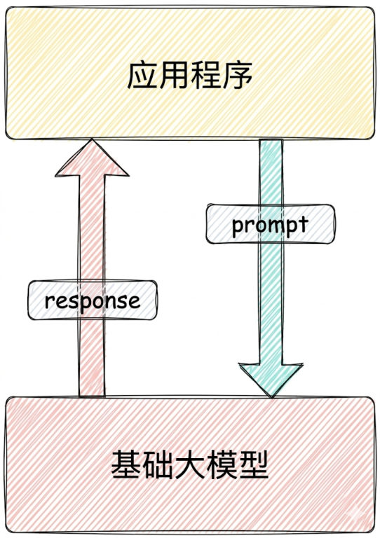
*图：场景一（纯 Prompt）——应用程序只和基础大模型打交道，prompt 进去、response 出来*

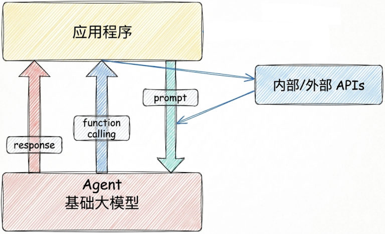
*图：场景二（Agent + Function Calling）——模型升级成 Agent，会主动发起 function calling 去调用内部/外部 API*

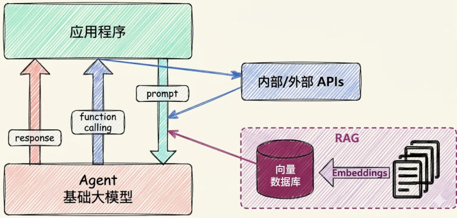
*图：场景三（RAG）——在 Function Calling 之外再加一条检索链路：Embeddings 写入向量数据库，问答时先检索再交给模型*

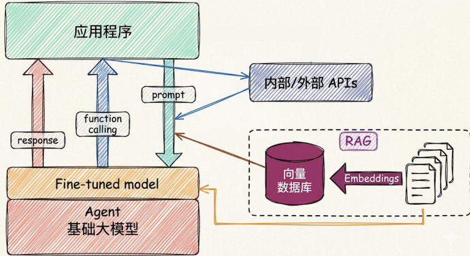
*图：场景四（Fine-tuning）——在基础大模型之上叠一个微调模型，同时仍可调用外部 API 与 RAG*

### 怎么选

面对一个需求，从**成本最低**的方案开始试：先纯 Prompt（改提示词能解决就不写代码）→ 不够就上 RAG（缺知识）或 Agent + Function Calling（要动手）→ 还不行才考虑 Fine-tuning（成本最高）。

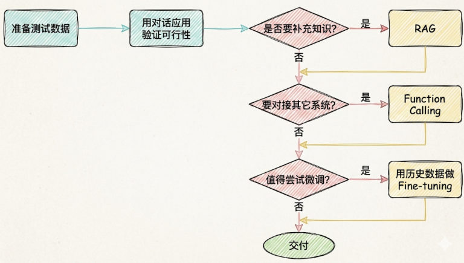
*图：技术选型的常用思路——先用测试数据以对话应用验证可行性，再依次问"要不要补充知识（RAG）→ 要不要对接其它系统（Function Calling）→ 值不值得用历史数据微调（Fine-tuning）"，都不需要就直接交付*

## 相关

- [LangChain概述与生态](/posts/编程学习/langchain学习笔记/01-langchain概述与生态/)
- [开发环境搭建（conda）](/posts/编程学习/langchain学习笔记/03-开发环境搭建-conda/)

## 练习题

### 一、回忆填空（写完再展开对答案）

1. 大模型应用的技术特点是门槛 ____、天花板 ____；门槛最低的形态是纯 ____，往上依次可以加 ____、加工具与行动能力、加多智能体协作
2. RAG 要治的两个毛病：知识 ____（无法实时学到最新信息，答不了"现在热门影片"这类问题）与 ____（没学过也不说"不知道"，转而臆想编造）；课程打的比方是正确率从 ____ 提到 ____
3. RAG 全称 ____，中文 ____；三步分别是 ____（从库里找相关资料）、____（把资料拼进提示词）、____（模型基于资料作答）
4. RAG 的链路：本地文件 → 文档加载器 → 文本 ____（切成 Text Chunk）→ ____ 模型（转成向量嵌入）→ 存进向量 ____；用户提问也要先向量化，再做 ____ 搜索，最后 Prompt = ____ + User Query 交给 LLM
5. 三步在 15 步流程图里的位置：检索是第 ____ 步、增强是第 ____ 步、生成是第 ____ 步；换成 9 步图就是上下两条链——知识 ____（解析→切割→向量化→入库）与知识 ____（提问→检索→____→增强→生成）
6. RAG 四个难点：文件 ____（PDF 里还有图片、表格、图上的文字）、文件 ____（切多大、在哪切都影响效果）、知识 ____（文档一多召回准确率下降）、知识 ____（对初步召回的结果再精排）；针对最后一条，Reranker 对初步召回的较多 chunk（如 top 20 / top 50）做 ____，适合 ____、____ 要求高的场景（专业知识库、客服系统），不适合 ____ 要求高的服务（会增加召回时间与检索延迟），成本比普通矢量搜索 ____
7. Agent 的公式：Agent = LLM + ____ + Tools + ____ + Action；这个架构由 OpenAI 的 ____（Lilian Weng）在 ____ 年 ____ 月的博客中首次提出
8. Agent 五个核心要素：LLM 作为 ____、规划决策、____、记忆、____；跑完一个任务的完整流程是"先读取以前工作的 ____ → 规划 ____ 并使用相应工具处理问题 → 输出给用户并完成 ____"
9. 短期记忆存 ____ 周期内的上下文、受 ____ 限制；长期记忆可以跨 ____，实现方式是 ____、____、____；上下文窗口方面 ChatGPT 约 ____、GPT-4 约 ____、Claude Opus 4.7 约 ____、DeepSeek-V4-Pro 约 ____，更大的模型已支持 ____ token
10. 四种开发场景：____（Prompt 是操作大模型的唯一接口）、____、____、____；选型从成本最 ____ 的方案开始试，不行再上 ____ 或 ____，最后才考虑成本最高的 ____

> [!TIP]- 填空答案（做完再点开）
> 1. 低 / 高；Prompt；外部知识（RAG）　2. 冻结 / 幻觉；60% / 90%　3. Retrieval-Augmented Generation / 检索增强生成；检索 / 增强 / 生成　4. 切分 / 嵌入 / 数据库 / 相似度 / 检索到的 Context　5. 10 / 13 / 15；更新 / 检索 / 知识重排序　6. 解析 / 切割 / 检索 / 重排序；精排（重排序）/ 高精度 / 高相关性 / 响应时间 / 贵　7. Planning / Memory；翁丽莲 / 2023 / 06　8. "大脑" / 工具使用 / 行动；经验和记忆 / 子目标 / 反思　9. 单次对话 / 上下文窗口长度 / 多个会话或时间周期 / 模型参数微调、知识图谱、向量数据库；8k / 32k / 200 万 / 100 万 / 1000 万　10. 纯 Prompt / Agent + Function Calling / RAG / Fine-tuning（精调）；低 / RAG、Agent + Function Calling / Fine-tuning

### 二、概念自测

- [ ] **2-1 RAG 的三步在干什么？**
  用自己的话讲清"检索、增强、生成"分别负责什么，并说明它为什么能治幻觉。

  > [!TIP]- 提示（先自己想，实在想不出再点开）
  > **一级 · 思路**：按"找资料 → 把资料塞进提示词 → 让模型看着资料回答"的顺序说
  > **二级 · 角度**：治幻觉的关键在于"模型是凭记忆编，还是看着依据答"
  > **三级 · 骨架**：检索 = 问题向量化后在向量库里找最相似的片段；增强 = Prompt = ____ + ____；生成 = 模型基于资料作答

- [ ] **2-2 查天气为什么必须用 Agent + Function Calling？**
  为什么只靠 Prompt 做不到，必须让模型"动手"？

  > [!TIP]- 提示（先自己想，实在想不出再点开）
  > **一级 · 思路**：先判断"天气"属于哪一类信息
  > **二级 · 角度**：实时数据 + 需要执行动作，两件事缺一不可
  > **三级 · 骨架**：纯 Prompt 只能回忆或编造 → Agent 负责规划"该调用哪个工具"，Function Calling 负责真的执行并把结果交回模型

- [ ] **2-3 内部制度问答助手怎么选型？**
  公司要做"内部制度问答助手"，资料是一堆 PDF。你会从哪个场景开始试？为什么不是直接 Fine-tuning？

  > [!TIP]- 提示（先自己想，实在想不出再点开）
  > **一级 · 思路**：制度文档属于"需要补充的领域知识"，且会不断更新
  > **二级 · 角度**：对比一下"换文件"和"重新训练"的成本
  > **三级 · 骨架**：RAG 起手 → 切分检索即可；Fine-tuning 成本最高且制度一改就要重训

- [ ] **2-4 该不该加 Reranker？**
  某客服系统上线后被投诉"回答太慢"，同时团队觉得检索准确率还能再提。有人提议加 reranker，你同意吗？请用正文的取舍标准给出结论。

  > [!TIP]- 提示（先自己想，实在想不出再点开）
  > **一级 · 思路**：reranker 是"用时间换准确率"的手段
  > **二级 · 角度**：对照正文里"适合 / 不适合"两栏，看这个场景同时踩中了哪两条
  > **三级 · 骨架**：reranker 提高召回准确率（适合客服这类高精度场景），但会增加 ____ 与 ____——两个诉求冲突时，先确认瓶颈到底在哪一边

> [!TIP]- 参考答案（做完再点开）
> **2-1** **检索**：把用户问题向量化，去向量数据库里找最相似的文档片段（第 10 步，9 步图里还要多一步"知识重排序"）；**增强**：把这些片段作为上下文塞进提示词，Prompt = 检索到的 Context + User Query（第 13 步）；**生成**：模型基于这些资料作答（第 15 步）。治幻觉的原因：模型不再是"凭记忆瞎编"，而是**看着资料回答**——有依据就有约束，正确率能从 60% 提到 90%。
> **2-2** 因为天气是**实时数据**（不在训练数据里，模型的知识是冻结的），而且"查天气"是一个**动作**——需要调用外部 API 才能拿到结果。纯 Prompt 只能让模型回忆或编造。Agent 负责规划"该调用哪个工具"，Function Calling 负责真的执行那个函数，再把结果交回模型组织成回答。
> **2-3** 从 **RAG** 开始：制度文档正是"需要补充领域知识"的典型场景，把 PDF 切分、向量化、检索即可，成本低、更新方便（改了制度换个文件就行，必要时用 reranker 提精度）。Fine-tuning 成本最高，而且制度会变——每次改动都要重新训练，不划算；官方建议是前面几种方案都解决不了才用它。
> **2-4** **要谨慎，甚至先别加**。reranker 确实能提高召回准确率，属于"高精度、高相关性"场景（专业知识库、客服系统）的推荐配置；但它会增加**召回时间与检索延迟**，而客服系统恰恰是"对响应时间要求高"的服务。正文的结论是：追求高精度可以用，但响应时间敏感的场景不适合。所以正确做法是先定位"慢"的原因（是检索环节、模型生成，还是网络），如果瓶颈在检索延迟上，加 reranker 只会让投诉更多；若确需精度且延迟可接受，再考虑它——毕竟 reranker 增强型 RAG 比普通矢量搜索贵，但仍比纯靠 LLM 生成答案便宜。