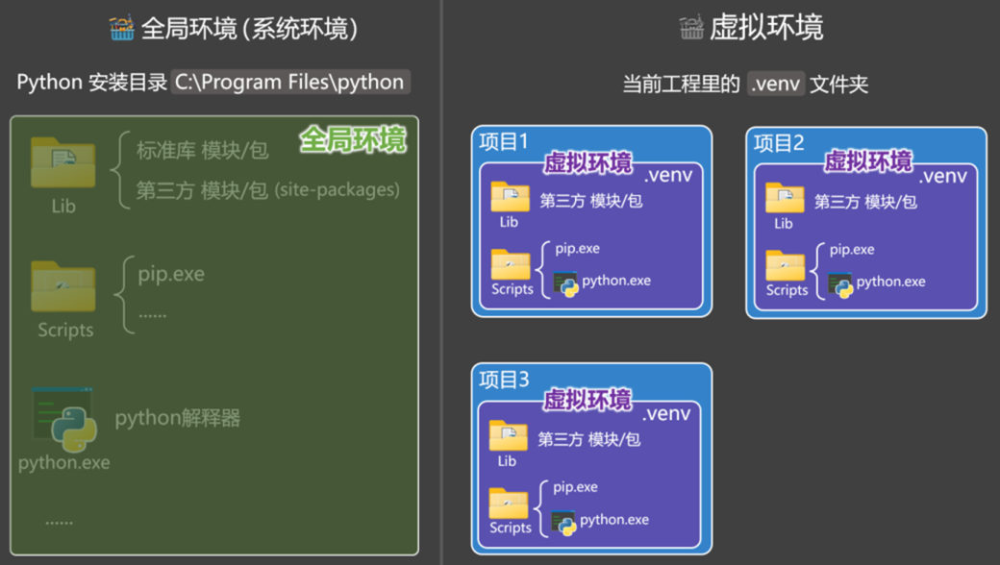
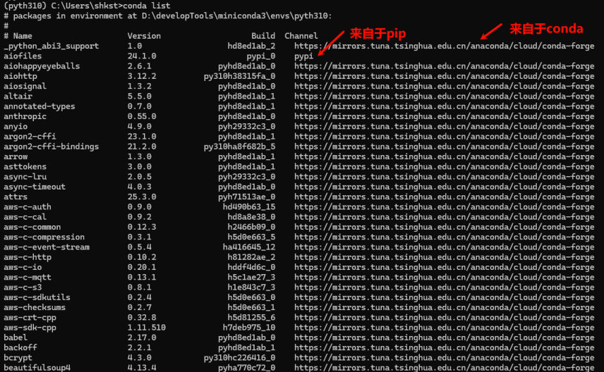
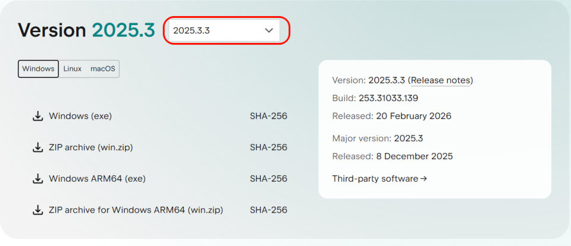
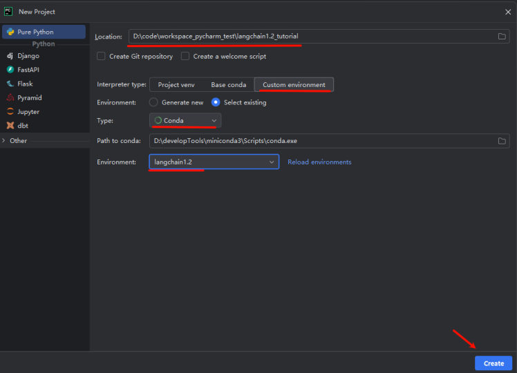

## 版本要求

LangChain 1.2 要求 **Python >= 3.10**，课程使用 **Python 3.13.12**。

> [!WARNING]
> 课程讲义里特别提醒：安装依赖包时**必须显式指明版本**，否则容易出现不兼容（LangChain 生态各包之间版本咬得很紧）。

## 为什么要用虚拟环境

相较于**全局环境（系统环境）**，每个**虚拟环境**都有自己独立的一套：Python 解释器、pip 命令、第三方依赖包，**不和其它项目产生干扰**。做 AI 项目尤其需要——不同项目的依赖版本冲突是家常便饭。


*图：全局环境与虚拟环境的对比——全局环境共用一套 Lib、Scripts（pip.exe/python.exe），而每个工程目录下的 .venv 都有自己独立的一套，互不干扰*

### 三种方案对比

| 维度 | conda | uv | venv |
| --- | --- | --- | --- |
| 管理 Python 解释器 | ✅ 可以 | ✅ 可以 | ❌ 不支持原生安装，只能基于已有解释器 |
| 管理 Python 包 | ✅ 可以 | ✅ 可以 | ✅ 可以 |
| 管理**非 Python 依赖**（CUDA、系统库、编译器） | ✅ 可以 | ❌ 不可以 | ❌ 不可以 |
| 适合场景 | AI、深度学习、科学计算、复杂底层依赖 | 纯 Python 项目、Web、Agent、RAG 应用层 | 简单项目、教学演示、轻量隔离 |

- **方案1 conda**：不只是 Python 包管理工具，还能管理解释器和 CUDA/编译器/系统库等非 Python 依赖；数据科学、深度学习、AI 工程首选。
- **方案2 uv**：现代 Python 包管理工具，只管 Python 生态依赖；FastAPI 项目、LangChain 项目、脚本工具、RAG 应用层代码都可以优先考虑。
- **方案3 venv**：Python 自带、简单轻量，`python -m venv .venv` 一条命令；但不负责安装解释器和非 Python 依赖。

> [!NOTE]
> 对于 LangChain 这样的纯 Python 环境，uv 和 conda 都能用；**本课程选择 conda**（配套《尚硅谷-conda使用指南.md》）。

> [!IMPORTANT]
> conda 环境里可以用 pip，但**建议先用 conda 装底层依赖，再用 pip 补充 Python 包**，不要随意反复交替使用。

### uv 的完整适用清单

课程给 uv 列出的适用项目一共六类：

1. FastAPI 项目
2. LangChain 项目
3. 脚本工具
4. **Web 后端**
5. **普通 AI Agent 应用**
6. RAG 应用层代码

> [!TIP]
> 判断标准其实只有一条：项目里**有没有需要 conda 才能装的东西**（CUDA、编译器、系统库、数据库驱动）。有就用 conda——更稳妥；没有就用 uv——更快、体验更好。上面对比表里 uv 那行的"适合场景"写的是"纯 Python 项目、Web、Agent、RAG 应用层"，和这 6 条正好对得上。

### conda 能管哪些非 Python 依赖

课程给 conda 划的范围是"**Python + 非 Python 依赖**"的复杂环境，具体能管的东西列得很细：

- 除了 Python 包，它还能管理 **Python 解释器**本身（uv 也可以，venv 不可以）；
- 以及很多**非 Python 依赖**：**CUDA、编译器、系统库、数据库驱动、科学计算底层库**等；
- 因此在**数据科学、深度学习、AI 工程、科学计算**等场景中，conda 更稳妥、优先推荐。

> [!NOTE]
> 这也划出了 uv 的边界：uv 是"现代 Python 包管理工具"，**主要管理 Python 生态依赖**，不能像 conda 那样管理 CUDA、系统级数据库驱动、编译器这类通用非 Python 依赖。所以本课程落在"纯 Python"这一侧，uv 和 conda 都能用，只是课程选了 conda。

## conda 常用命令

```bash
# 创建环境（指定 Python 版本）
conda create --name langchain1.2 python=3.13.12

# 查看已有的环境
conda env list

# 初始化虚拟环境（执行完要重启命令行窗口）
conda init

# 激活环境
conda activate langchain1.2

# 验证 Python 版本
python -V

# 退出当前环境
conda deactivate

# 删除环境
conda remove --name langchain1.2 --all
```

### 讲义里的一处笔误

课程讲义演示 `python -V` 的输出时写的是 `Python 3.12.13`，和它自己创建环境时指定的 `python=3.13.12` 对不上——这是**数字顺序写反的笔误**。

> [!WARNING]
> 以创建命令为准：`conda create --name langchain1.2 python=3.13.12` 装出来的是 **Python 3.13.12**，验证时也应该看到 `Python 3.13.12`。

## 安装 langchain：conda 还是 pip

### 方式一：conda（推荐）

```bash
conda install langchain==1.2.12              # 安装指定版本
conda install langchain                      # 安装最新版（默认仓库）
conda install -c conda-forge langchain==1.2.12   # 指定频道 conda-forge
conda update langchain                       # 更新
conda uninstall langchain                    # 卸载
conda list                                   # 查看已安装包
```

- `-c` 是 `--channel` 的缩写，用来指定包的安装来源
- 包通常来自 defaults 或 **conda-forge**（比官方默认渠道更新更快、包更全）

### 方式二：pip

```bash
pip install langchain==1.2.12                                          # 指定版本
pip install langchain==1.2.12 -i https://pypi.tuna.tsinghua.edu.cn/simple   # 国内镜像加速
pip install --upgrade langchain      # 升级（或 pip install -U langchain==1.2.12）
pip uninstall langchain              # 卸载
pip list                             # 查看已安装包
```

### 两者的区别

| | conda | pip |
| --- | --- | --- |
| 支持范围 | Python 包 + **非 Python 包** | 只支持 Python 包 |
| 依赖检查 | 严格 | 相对宽松 |
| 职责 | 管环境 + 依赖 + 稳定性 | 只管 Python 包 |

建议：**优先 conda install，conda 没有的再用 pip install。**
检查某个包是从哪来的：`conda list` 里 conda 装的显示频道名，pip 装的显示 `pypi`。


*图：用 conda list 看包来源——Channel 列写 pypi 的是 pip 装的，写上频道地址（如 conda-forge）的是 conda 装的*

## PyCharm 简介与下载

课程使用的 PyCharm 版本是 **2025.3**。PyCharm 作为**专业的 Python IDE，具有强大的代码编辑、调试和版本控制功能**。

下载地址（课程给的是"其它版本"入口）：https://www.jetbrains.com/pycharm/download/other/#releases-2025


*图：PyCharm 下载页——Version 选 2025.3，再按系统挑安装包（课程用的是 2025.3.3）*

> [!TIP]
> 版本不必和课程一模一样，但记住一点：**PyCharm 只是写代码的地方，真正干活的是 conda 环境**——下面新建工程时，解释器一定要指向刚建好的 `langchain1.2`。

## PyCharm 配置

创建新工程时把解释器设置为 **Anaconda 环境**（选刚创建的 `langchain1.2`）。验证是否装好：

```python
import langchain

print(langchain.__version__)
```

能打印出版本号（如 `1.2.12`）就说明环境没问题。


*图：PyCharm 新建工程时选择 Custom environment → Conda，并指定刚创建的 langchain1.2 环境*

## 相关

- [LangChain概述与生态](/posts/编程学习/langchain学习笔记/01-langchain概述与生态/)
- [模型的创建与调用](/posts/编程学习/langchain学习笔记/04-模型的创建与调用/)

## 练习题

### 一、回忆填空（写完再展开对答案）

1. LangChain 1.2 要求 Python 版本 ____ 以上；课程使用 ____
2. 用虚拟环境的意义：每个环境有自己独立的 ____、____ 和第三方依赖，不和其它项目干扰
3. 三种方案里，能管理 CUDA、编译器这类**非 Python 依赖**的只有 ____；venv 不能安装 ____
4. 创建 conda 环境：`conda ____ --name langchain1.2 python=3.13.12`
5. 查看所有环境：`conda ____ list`；激活：`conda ____ langchain1.2`；退出：`conda ____`
6. conda 指定频道用参数 `-c`（即 ____）；常用的更新更快的频道是 ____
7. pip 用国内镜像加速要加参数 `-i`，如 ____
8. conda 与 pip 的区别：conda 支持 Python 包 + ____ 包，依赖检查更 ____；建议优先用 ____，没有再考虑 ____

> [!TIP]- 填空答案（做完再点开）
> 1. 3.10 / 3.13.12　2. Python 解释器 / pip 命令　3. conda / 新的 Python 解释器（只能基于已有解释器）　4. create　5. env / activate / deactivate　6. `--channel` / conda-forge　7. `https://pypi.tuna.tsinghua.edu.cn/simple`　8. 非 Python / 严格 / conda install / pip install

### 二、动手题

- [ ] **2-1 创建并验证环境**
  创建名为 `langchain1.2` 的 conda 环境（Python 3.13.12），激活后确认 Python 版本。

  > [!TIP]- 提示（先自己想，实在想不出再点开）
  > **一级 · 思路**：创建 → 初始化（重启窗口）→ 激活 → 验证
  > **二级 · 方法**：`conda create` / `conda init` / `conda activate` / `python -V`
  > **三级 · 骨架**：激活后命令行提示符前面会出现 `(langchain1.2)`

- [ ] **2-2 安装 langchain 并验证**
  在环境里安装 `langchain==1.2.12`，然后写一个脚本打印版本号。

  > [!TIP]- 提示
  > **一级 · 思路**：装包 → 用 import 验证
  > **二级 · 方法**：`pip install langchain==1.2.12` 或 `conda install langchain==1.2.12`；`import langchain`
  > **三级 · 骨架**：`print(langchain.__version__)`

- [ ] **2-3 检查包的来源**
  用命令行查看已安装的包，判断 `langchain` 是从 conda 频道装的还是从 pypi 装的。

  > [!TIP]- 提示
  > **一级 · 思路**：列表里能看到来源渠道
  > **二级 · 方法**：`conda list`
  > **三级 · 骨架**：conda 装的显示频道名，pip 装的显示 `pypi`

> [!TIP]- 参考答案（做完再点开）
> ```bash
> # 2-1
> conda create --name langchain1.2 python=3.13.12
> conda init                    # 执行后重启命令行窗口
> conda activate langchain1.2
> python -V                     # 应输出 Python 3.13.12
>
> # 2-2
> pip install langchain==1.2.12
> # 或（推荐）：conda install langchain==1.2.12
> # 也可用国内镜像加速：pip install langchain==1.2.12 -i https://pypi.tuna.tsinghua.edu.cn/simple
>
> # 2-3
> conda list
> # 看 langchain 那一行的 Channel 列：pip 安装的显示 pypi
> ```
>
> ```python
> # 2-2 的验证脚本
> import langchain
>
> print(langchain.__version__)   # 应输出 1.2.12
> ```