## 大模型调用与 Model I/O

LangChain v0.3 里把模型的调用抽象成 **Model I/O** 三件套：**输入提示（Format）→ 调用模型（Predict）→ 输出解析（Parse）**，分别对应 Prompt Template、Model、Output Parser。

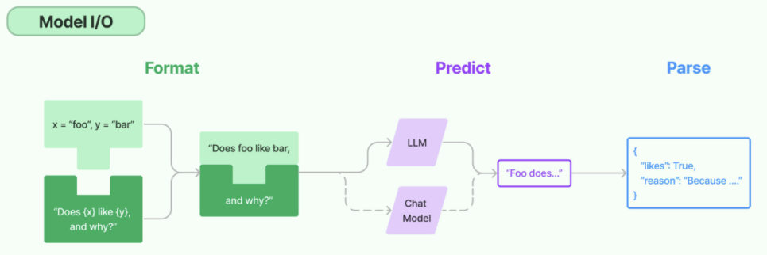
*图：Model I/O 三件套的调用链路——Format 生成提示词、Predict 交给 LLM 或 Chat Model、Parse 解析成结构化结果*

历史演化：GPT-3 时代是**补全模型**（只能"成语接龙"式补全文本，很不稳定），很多功能要靠 LangChain 的高层封装；GPT-3.5 之后**对话模型**成为主流，凭借更强的指令跟随能力，工具调用、结构化输出等成了模型自带能力。

> [!NOTE]
> 所以本章**只讲对话模型的创建**，不再有非对话模型（1.x 里也一样：模型默认就是"聊天模型"）。

## 创建模型的三个角度

一句话概括：**用谁家的 API、以什么方式创建、存放在哪个位置的大模型**。

| 角度 | 选项 | 建议 |
| --- | --- | --- |
| 1. 调用谁家的 API | ① 使用模型提供商的库（ChatDeepSeek、ChatZhipuAI…）② 使用 LangChain 统一方式 | **推荐统一方式** |
| 2. 重要参数（BASE_URL、API-KEY）写在哪 | ① 配置文件（`.env`）② 硬编码在代码里 | **推荐配置文件** |
| 3. 模型部署在哪 | ① 在线部署 ② 本地部署（Ollama） | 按需 |

> [!IMPORTANT]
> LangChain 本身**不提供任何 LLM**，它只是个"工具箱"，靠第三方集成各种大模型——所以第一件事永远是搞清"模型到底在哪、用什么协议调"。

## 线上大模型服务平台

常见平台（使用方式都一样：**注册 → 充值 → 创建 API Key**）：

| 平台 | 网址 | 备注 |
| --- | --- | --- |
| OpenRouter | https://openrouter.ai/ | 全球主流，含国外模型（支持国内直连，支付宝/微信充值，最低 \$5） |
| CloseAI | https://platform.closeai-asia.com/ | 亚洲最大，含国外模型 |
| 阿里云百炼 | https://bailian.console.aliyun.com/ | 企业端友好，新用户有大量免费额度 |
| 硅基流动 | https://www.siliconflow.cn/ | 性价比高，适合个人（号称 9B 以下模型永久免费） |
| 百度千帆 | https://console.bce.baidu.com/qianfan/overview | 主打百度生态 |
| 火山引擎 | https://console.volcengine.com/ark/ | 主打字节多模态生态 |

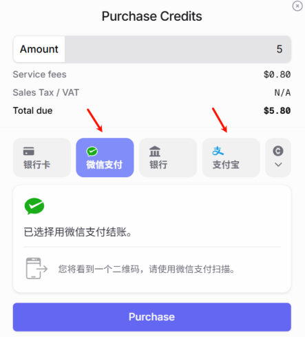
*图：平台使用前的充值页（以 CloseAI 为例，支持微信/支付宝，最低 5 美元）*

每个平台配置时都需要三个要素：**模型名**、**api-key**、**base-url**。

> [!TIP]
> 想用国外模型选前两个平台；只用国内模型选后四个。此外各厂商自己的平台（DeepSeek、智谱等）也可以直接用。

## 准备工作：依赖与 .env

课程所有依赖都固定在 `requirements.txt` 里（LangChain 版本变化快，**必须固定版本**避免兼容问题）：

```bash
pip install -r .\requirements.txt
```

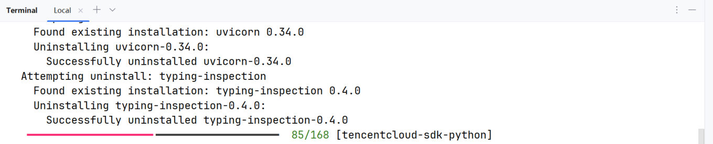
*图：按 requirements.txt 安装依赖时的终端输出（一次性把本章要用的库都装上）*

本章单独需要的：

```bash
pip install langchain-deepseek    # DeepSeek 专用（会自动带出 langchain-openai）
pip install langchain-openai      # ChatOpenAI（兼容调用用）
pip install python-dotenv         # 读 .env
```

项目根目录创建 `.env`：

```text
DEEPSEEK_API_KEY=<Your API Key>
DEEPSEEK_BASE_URL=https://api.deepseek.com
```

读取配置：

```python
import os
from dotenv import load_dotenv

load_dotenv(override=True)      # override=True：强行用 .env 里的值覆盖已有环境变量

DEEPSEEK_API_KEY = os.getenv("DEEPSEEK_API_KEY")
DEEPSEEK_BASE_URL = os.getenv("DEEPSEEK_BASE_URL")
```

> [!WARNING]
> `.env` 里**不要加引号**（`KEY="xxx"` 会把引号也读进去）；`.env` 必须加入 `.gitignore`，密钥不能提交到仓库。

### 硬编码方式（不推荐）

角度 2 的另一种写法，是把密钥和地址直接写死在代码里：

```python
from langchain_deepseek import ChatDeepSeek

# 创建DeepSeek LLM
deepseek_llm = ChatDeepSeek(
    api_key="sk-2nkIWkv6M...U1Ra4P0NGa",   # 明文暴露密钥
    api_base="https://api.deepseek.com",
    model="deepseek-v4-flash",
)
print(deepseek_llm.invoke("请介绍一下你自己"))
```

> [!WARNING]
> 直接把 API Key 写进代码**仅适用于临时测试**：代码一旦被分享、提交、截图，密钥就等于泄露，别人可以拿它跑光你的余额。生产环境一律用 `.env` + `load_dotenv()`，并把 `.env` 加进 `.gitignore` 避免泄露。

## 方式一：使用模型提供商的专用类

LangChain 为一些厂商提供了专门的 Model 类：`ChatOpenAI`、`ChatAnthropic`、`ChatDeepSeek`、`ChatOllama`、`ChatTongyi`、`ChatZhipuAI` 等。

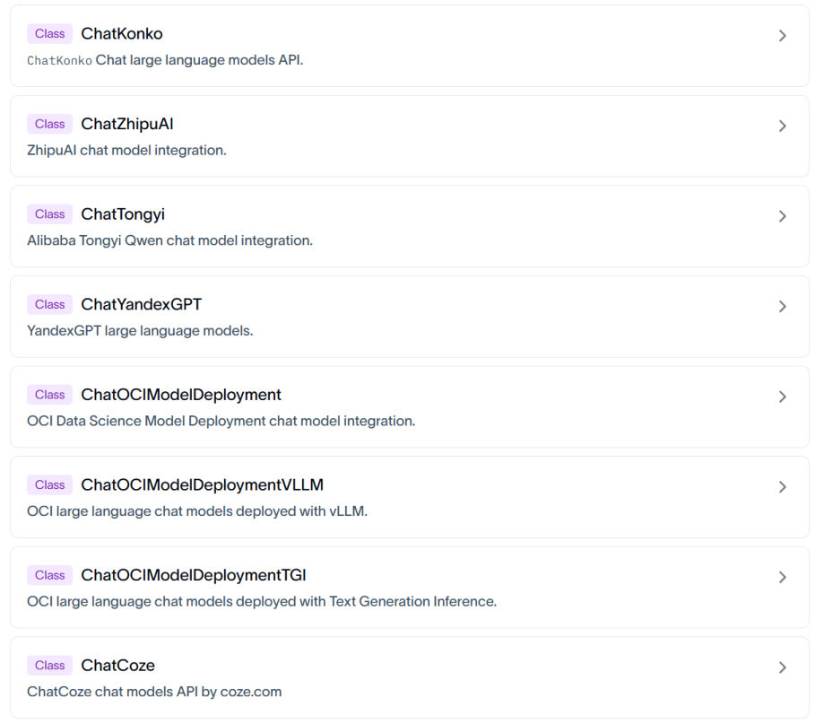
*图：官方 API 参考里列出的各种专用模型类（ChatZhipuAI、ChatTongyi、ChatCoze…）*

```python
from langchain_deepseek import ChatDeepSeek

from dotenv import load_dotenv

load_dotenv(override=True)

# 简化写法：ChatDeepSeek 会自动从环境变量 DEEPSEEK_API_KEY 读取密钥
deepseek_llm = ChatDeepSeek(model="deepseek-v4-flash")

print(deepseek_llm.invoke("请介绍一下你自己"))
```

> [!WARNING]
> **不同厂商的参数名不一样，要以源码/官方文档为准**。比如 `ChatDeepSeek` 里 API 地址参数叫 **`api_base`**（不是 `base_url`），模型名参数既接受 `model` 也接受 `model_name`：
> ```python
> deepseek_llm = ChatDeepSeek(api_key=DEEPSEEK_API_KEY, api_base=DEEPSEEK_BASE_URL, model="deepseek-v4-flash")
> ```

### 专用类举例：智谱大模型（ChatZhipuAI）

智谱的专用类不在 `langchain-deepseek` 这类厂商包里，而是在**社区包 `langchain-community`** 里（同一个包里还有 `ChatHunyuan`、`ChatTongyi`）。

官网：https://www.bigmodel.cn/

```bash
# 安装 Langchain 社区依赖包，包含ChatHunyuan、ChatTongyi、ChatZhipuAI
pip install langchain-community
# ChatZhipuAI / 智谱 AI 认证相关依赖
pip install pyjwt
```

在 `.env` 中补充：

```text
ZHIPUAI_API_KEY=<Your API Key>
ZHIPUAI_BASE_URL=https://open.bigmodel.cn/api/paas/v4/
```

```python
import os
from langchain_community.chat_models import ChatZhipuAI
from dotenv import load_dotenv

# override=True 确保.env文件优先
load_dotenv(override=True)

ZHIPUAI_API_KEY = os.getenv("ZHIPUAI_API_KEY")
ZHIPUAI_BASE_URL = os.getenv("ZHIPUAI_BASE_URL")

zhipu_llm = ChatZhipuAI(
    model="glm-5.1",
    api_base=ZHIPUAI_BASE_URL,   # 可选
    api_key=ZHIPUAI_API_KEY,     # 可选
)
print(zhipu_llm.invoke("请介绍一下你自己"))
```

> [!WARNING]
> 用之前**确保账号的余额或免费额度大于零**，否则调用会直接失败。

### 专用类举例：千问大模型（ChatTongyi）

通过阿里云百炼平台调用（https://bailian.console.aliyun.com/），专用类同样来自社区包：

```bash
# 切换python环境
conda activate langchain1.2
# ChatTongyi / 阿里通义千问依赖包
pip install dashscope
```

`.env` 里只需要密钥：

```text
DASHSCOPE_API_KEY=<Your API Key>
```

```python
import os
from langchain_community.chat_models import ChatTongyi
from dotenv import load_dotenv

# override=True 确保.env文件优先
load_dotenv(override=True)

DASHSCOPE_API_KEY = os.getenv("DASHSCOPE_API_KEY")

tongyi_llm = ChatTongyi(
    api_key=DASHSCOPE_API_KEY,
    model="qwen-plus",
)
print(tongyi_llm.invoke("请介绍一下你自己"))
```

> [!IMPORTANT]
> **一般不要添加 `DASHSCOPE_BASE_URL` 这样的环境变量**（值为 `https://dashscope.aliyuncs.com/compatible-mode/v1`）。百炼平台提供了专用 SDK 和 OpenAI 兼容接口两种访问方式，这个 URL 是给**后者**准备的；而 `ChatTongyi` 底层是基于**专用 SDK** 实现的，一旦指定了它就会运行报错：
>
> ```text
> Traceback...
> ConnectionError: ('Connection aborted.', ConnectionResetError(10054, '远程主机强迫关闭了一个现有的连接。', None, 10054, None))
> ```

## 方式二：兼容用法（ChatOpenAI）

**大多数 API 平台都支持 OpenAI API 接口规范**，所以基本都可以用 `ChatOpenAI` 集成。这在两种情况下特别有用：

- LangChain 没有为你选的平台提供专用接口
- 专用接口对接方式太繁琐（如腾讯混元要 `APP_ID + SecretId + SecretKey` 三件套）

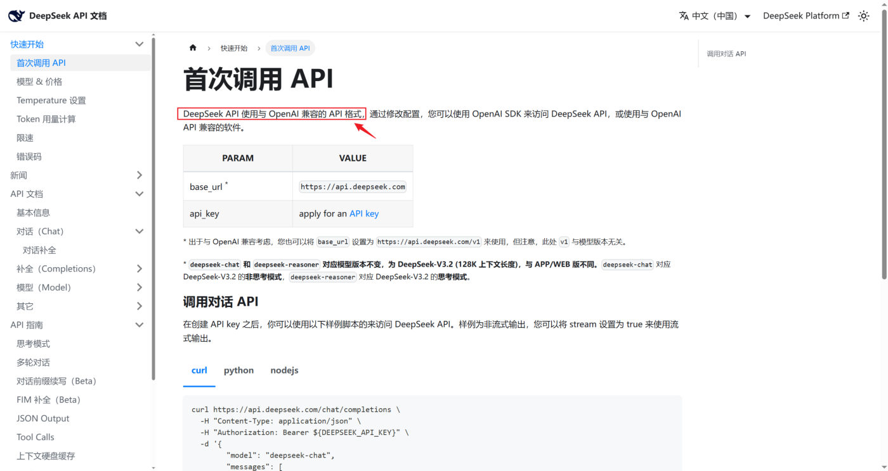
*图：DeepSeek 官方文档写明它使用与 OpenAI 兼容的 API 格式，只要 base_url + api_key 就能调用*

```python
from langchain_openai import ChatOpenAI

load_dotenv(override=True)

deepseek_llm2 = ChatOpenAI(
    api_key=os.getenv("DEEPSEEK_API_KEY"),
    base_url=os.getenv("DEEPSEEK_BASE_URL"),   # 换平台只改这两个 + model 名
    model="deepseek-v4-flash",
)

print(deepseek_llm2.invoke("1 + 1 = ？"))
```

> [!TIP]
> **"一个 ChatOpenAI 打通所有兼容平台"**——这就是兼容用法的价值：换平台只需要改 `base_url` 和 `model` 两个值，代码结构完全不用动。第 3 章那个 AI 智能伴侣项目用的也是这套写法。

### 中转平台之一：OpenRouter

受政策影响，国内无法直接调用国外顶尖的闭源模型，而某些复杂任务又必须用这些模型实现，此时可以**通过中转平台曲线救国**。

OpenRouter（https://openrouter.ai/）是一个**多模型 API 聚合平台**，提供统一的 OpenAI 兼容接口，用一个 API Key 就能调用 OpenAI、Claude、Gemini、DeepSeek、Qwen 等不同厂商的大模型，适合模型对比、模型路由、Agent 应用开发和课程实验，是目前知名度最高的中转平台。不过使用它需要"tizi"（魔法，大家都懂的）。

```bash
# OpenRouter 模型集成
pip install langchain-openrouter
```

`.env` 里：

```text
OPENROUTER_API_KEY=<YOUR_API_KEY>
OPENROUTER_API_BASE=https://openrouter.ai/api/v1
```

LangChain 当前版本为 OpenRouter 提供了专用集成 `ChatOpenRouter`：

```python
import os
from langchain_openrouter import ChatOpenRouter
from dotenv import load_dotenv

load_dotenv(override=True)

OPENROUTER_API_KEY = os.getenv("OPENROUTER_API_KEY")
# OPENROUTER_API_BASE = os.getenv("OPENROUTER_API_BASE")

model = ChatOpenRouter(
    model="deepseek/deepseek-v4-flash",   # 注意：模型名要带厂商前缀
    api_key=OPENROUTER_API_KEY,
    # base_url=OPENROUTER_API_BASE,       # 默认就是官方地址，可省略
)
print(model.invoke("一句话介绍下你自己"))
```

当然，也完全可以用 `ChatOpenAI` 兼容方式调用：

```python
import os
from langchain_openai import ChatOpenAI
from dotenv import load_dotenv

load_dotenv(override=True)

OPENROUTER_API_KEY = os.getenv("OPENROUTER_API_KEY")
OPENROUTER_API_BASE = os.getenv("OPENROUTER_API_BASE")

model = ChatOpenAI(
    model="deepseek/deepseek-v4-flash",
    api_key=OPENROUTER_API_KEY,
    base_url=OPENROUTER_API_BASE,
)
print(model.invoke("一句话介绍下你自己"))
```

> [!WARNING]
> OpenRouter 支持支付宝或微信充值（最低限额 \$5，税费 \$0.8），但**如果调用的模型禁止在国内使用（如 ChatGPT），则无法通过 OpenRouter 直接调用**，会提示 `This model is not available in your region`。是否充值调用请按个人情况决定。

### 中转平台之二：CloseAI

CloseAI（https://www.closeai-asia.com/）是一个面向国内用户的 AI API 中转平台，提供 OpenAI、Claude、Gemini 等模型接口的代理访问能力，适合解决国内网络访问、支付和接口统一管理等问题，常用于大模型应用开发、教学演示和测试环境。

**LangChain 没有为 CloseAI 提供专用集成**，只能通过 `ChatOpenAI` 兼容接口调用：

```text
CLOSEAI_API_KEY=<YOUR_API_KEY>
CLOSEAI_BASE_URL=https://api.openai-proxy.org/v1
```

```python
import os
from langchain_openai import ChatOpenAI
from dotenv import load_dotenv

load_dotenv(override=True)

CLOSEAI_API_KEY = os.getenv("CLOSEAI_API_KEY")
CLOSEAI_BASE_URL = os.getenv("CLOSEAI_BASE_URL")

model = ChatOpenAI(
    # model="gpt-5-mini",
    model="deepseek-v4-flash",
    api_key=CLOSEAI_API_KEY,
    base_url=CLOSEAI_BASE_URL,
)
print(model.invoke("欧盟都有哪些国家"))
```

## 方式三：init_chat_model（1.x 统一接口，推荐）

`init_chat_model` 是 LangChain 1.x 推出的**统一初始化接口**：只要是 LangChain 支持的模型都能处理，它会根据模型标识自动选择对应的模型类。

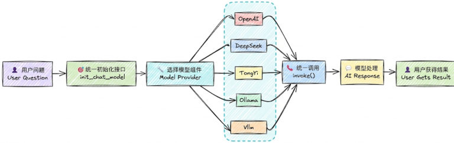
*图：init_chat_model 的调用链路——统一初始化接口 → 选择模型组件 → 各厂商模型 → invoke() 统一调用*

```python
from langchain.chat_models import init_chat_model

model = init_chat_model(
    "provider:model_name",     # 提供商:模型名称
    api_key="your-api-key",    # 可选，可从环境变量读取
    temperature=0.7,
    max_tokens=1000,
    **kwargs                   # 其他模型特定参数
)
```

**它和直接用 ChatDeepSeek / ChatOpenAI 有什么区别？**

| 优势 | 说明 |
| --- | --- |
| 统一接口 | 不用记住每个提供商不同的初始化方式 |
| 易于切换 | 换模型只改一个模型字符串 |
| 简洁明了 | 语法更短，减少样板代码 |
| 自动适配 | 内部根据模型标识自动选择驱动类（ChatOpenAI、ChatDeepSeek…） |

### ⭐ 自定义 base_url 的写法（以 OpenCode Go 为例）

用第三方兼容服务（自建网关、中转平台、OpenCode Go 等）时，**关键是把地址和密钥传给正确的参数名**：

```python
import os
from dotenv import load_dotenv
from langchain.chat_models import init_chat_model

load_dotenv(override=True)

llm = init_chat_model(
    model="deepseek-v4.1-flash",
    model_provider="openai",                       # 走 OpenAI 兼容协议
    base_url=os.getenv("OPENCODE_GO_BASE_URL"),     # ← 正确：base_url
    api_key=os.getenv("OPENCODE_GO_API_KEY"),       # ← 正确：api_key
)

print(llm.invoke("用一句话解释 SOLID 原则。").content)
```

> [!WARNING]
> **别把变量名当成参数名写**。写成 `OPENCODE_GO_BASE_URL=...`、`OPENCODE_GO_API_KEY=...` 时，LangChain 不会报"参数名错误"，而是把这两个多余参数塞进 `model_kwargs`（只给一条 `UserWarning`），最后抛 `OpenAIError: Missing credentials`——看起来像"密钥没读到"，实际上是**参数名写错了**。正确参数名永远是 `base_url` 和 `api_key`（`ChatOpenAI` 里也可以用别名 `openai_api_base`）。

### model_provider 支持哪些取值？不写会怎样？

**问题 1：`model_provider` 支持哪些取值？**

`model_provider` 表示模型的提供者。LangChain 1.2 内置注册的 provider（每个都对应一个集成包）有：

```text
anthropic, anthropic_bedrock, azure_ai, azure_openai, bedrock, bedrock_converse,
cohere, deepseek, fireworks, google_anthropic_vertex, google_genai, google_vertexai,
groq, huggingface, ibm, mistralai, nvidia, ollama, openai, openrouter, perplexity,
together, upstage, xai
```

几个常用的对应关系：

| provider | 背后的集成包 / 底层类 |
| --- | --- |
| `openai` | `langchain-openai` → `ChatOpenAI` |
| `deepseek` | `langchain-deepseek` → `ChatDeepSeek` |
| `anthropic` | `langchain-anthropic` → `ChatAnthropic` |
| `ollama` | `langchain-ollama` → `ChatOllama`（本地模型，见后文） |
| `openrouter` | `langchain-openrouter` → `ChatOpenRouter` |

也就是说：写 `model_provider="deepseek"`，LangChain 会自动加载 `langchain-deepseek` 并用 `ChatDeepSeek` 初始化实例，效果和自己 `new` 一个 `ChatDeepSeek` 完全一致。

> [!NOTE]
> 像阿里的 `dashscope` **尚未被 LangChain 官方纳入统一注册体系**，没有这个 provider。此时就把 `model_provider` 设为 `openai`，底层按 OpenAI 规范处理请求——前提是你要调用的模型服务是 **OpenAI Compatible** 的。

**问题 2：如果 `model` 参数里没指明提供者，就必须用 `model_provider` 指定吗？**

不是。可以在 `model` 参数里用**前缀 + 冒号**的方式指定供应商，和 `model_provider` 参数等价：

```python
# 下面两种写法等价
init_chat_model(model="deepseek:deepseek-v4-flash")
init_chat_model(model="deepseek-v4-flash", model_provider="deepseek")
```

如果两个位置都没有指明供应商，LangChain 底层会按**内置规则自动推断**：

| 模型名前缀 | 推断出的 provider |
| --- | --- |
| `gpt-...` / `o1...` / `o3...` | `openai` |
| `claude...` | `anthropic` |
| `deepseek...` | `deepseek` |
| `gemini...` | `google_vertexai` |
| `amazon...` | `bedrock` |
| `command...` | `cohere` |
| `mistral...` | `mistralai` |
| `grok...` | `xai` |
| `sonar...` | `perplexity` |
| `solar...` | `upstage` |
| `accounts/fireworks...` | `fireworks` |

> [!WARNING]
> **并非所有模型都能自动推断出来**。实测把 `qwen-plus` 直接丢给 `init_chat_model` 会报错：
>
> ```text
> ValueError: Unable to infer model provider for model='qwen-plus'. Please specify 'model_provider' directly.
> ```
>
> 这时候必须显式写 `model_provider="openai"`，再配上 `base_url`（百炼的 OpenAI 兼容地址）。

## 模型初始化的常用参数

Model Class 和 `init_chat_model` 共用这套参数：

| 参数 | 类型 | 说明 | 默认值 |
| --- | --- | --- | --- |
| `model` | str | 模型名称（必需），如 `openai:gpt-4o` | 无 |
| `model_provider` | str | 模型提供商名称 | 无 |
| `api_key` | str | API 密钥；不提供时从环境变量读取（如 `DEEPSEEK_API_KEY`） | None |
| `base_url` | str | 大模型供应商 API 请求地址 | None |
| `temperature` | float | 输出随机性，0.0–2.0，越高越随机 | 0.7 |
| `max_tokens` | int | 限制输出最大 token 数 | None |
| `timeout` | float | 超时时间（秒），超时请求被取消 | None |
| `max_retries` | int | 请求失败（网络问题、速率限制）时的最大重试次数 | 6 |

### temperature 怎么选

| 区间 | 适合 |
| --- | --- |
| 0.0–0.3 | 需要一致性、准确性：数学计算、数据提取、分类、代码生成 |
| 0.5–0.7 | 平衡创造性和一致性：聊天、问答 |
| 0.8–1.5 | 创造性任务：写作、头脑风暴 |
| 1.5–2.0 | 高度创造性：诗歌、故事创作 |

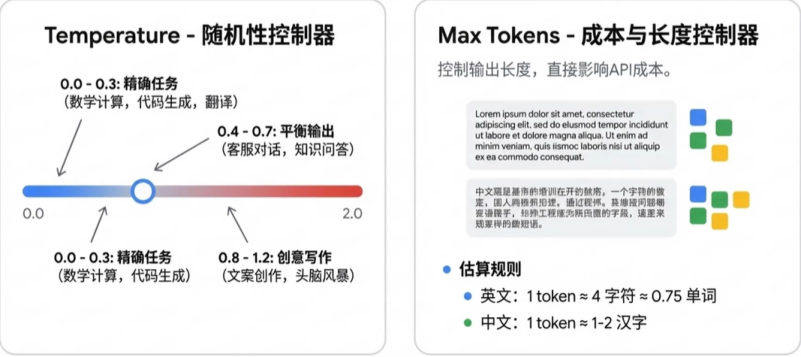
*图：temperature 是"随机性控制器"、max_tokens 是"成本与长度控制器"（token 估算：英文 1 token ≈ 4 字符，中文 1 token ≈ 1–2 汉字）*

## 模型初始化参数（完整版）

### 查看完整参数列表

官方文档和源码注释都没有给出完整的参数列表：以 `ChatDeepSeek` 为例，它的参数**一部分由自己定义、一部分从父类 `BaseChatModel` 继承**，只翻源码很难拼出完整清单。正确的姿势是看类属性 **`model_fields`**：

```python
from langchain_deepseek import ChatDeepSeek

print(ChatDeepSeek.model_fields.keys())
```

实测输出（LangChain 1.2.12，共 56 个）：

```text
dict_keys(['name', 'cache', 'verbose', 'callbacks', 'tags', 'metadata', 'custom_get_token_ids', 'rate_limiter', 'disable_streaming', 'output_version', 'profile', 'client', 'async_client', 'root_client', 'root_async_client', 'model_name', 'temperature', 'model_kwargs', 'openai_api_key', 'openai_api_base', 'openai_organization', 'openai_proxy', 'request_timeout', 'stream_usage', 'max_retries', 'presence_penalty', 'frequency_penalty', 'seed', 'logprobs', 'top_logprobs', 'logit_bias', 'streaming', 'n', 'top_p', 'max_tokens', 'reasoning_effort', 'reasoning', 'verbosity', 'tiktoken_model_name', 'default_headers', 'default_query', 'http_client', 'http_async_client', 'stop', 'extra_body', 'include_response_headers', 'disabled_params', 'context_management', 'include', 'service_tier', 'store', 'truncation', 'use_previous_response_id', 'use_responses_api', 'api_key', 'api_base'])
```

`ChatOpenAI` 同理（54 个，比 `ChatDeepSeek` 少了 `api_key`、`api_base` 这类 DeepSeek 专有项）：

```python
from langchain_openai import ChatOpenAI
print(ChatOpenAI.model_fields.keys())
```

用 `init_chat_model` 拿到的实例也一样能查——它本身就是某个具体的 `ChatXxx` 对象：

```python
from langchain.chat_models import init_chat_model
from dotenv import load_dotenv

load_dotenv(override=True)

# 实例化一个你感兴趣的模型对象（即使不传具体 key，通常也能初始化成功）
temp_model = init_chat_model(model="deepseek-v4-flash", model_provider="deepseek")

# 现在它已经是一个具体的 ChatDeepSeek 对象了
print(temp_model.model_fields.keys())      # 输出与 ChatDeepSeek 完全一致
```

想知道每个参数的**类型、默认值、别名**，遍历 `model_fields` 看字段属性即可：

```python
from langchain_deepseek import ChatDeepSeek

for name, field in ChatDeepSeek.model_fields.items():
    print(name)
    print("  annotation:", field.annotation)                     # 类型
    print("  default:", field.default)                           # 默认值
    print("  description:", getattr(field, "description", None))
    print("  alias:", field.alias)
    print()
```

输出片段（以首尾两个参数为例，中间省略）：

```text
name
  annotation: str | None
  default: None
  ...
# ...参数太多，这里省略了...
api_base
  annotation: <class 'str'>
  default: PydanticUndefined
  ...
```

### 参数的四大分类

以 `ChatDeepSeek` 为例，这几十个参数可以分成四类，**理解分类比死记参数名有用得多**。

**① 客户端与连接参数（Networking）**：决定代码"怎么连到服务端"，而不是"让模型怎么生成"。

| 参数名 | 说明 |
| --- | --- |
| `api_key` / `openai_api_key` | 鉴权密钥（DeepSeek 兼容 OpenAI 接口格式，所以有 OpenAI 系别名） |
| `api_base` / `openai_api_base` | 接口地址（如 https://api.deepseek.com ） |
| `request_timeout` | 网络请求超时时间 |
| `max_retries` | 请求失败时的重试次数 |
| `http_client` / `http_async_client` | 手动传入 `httpx.Client` 实例（用于更复杂的网络配置） |
| `openai_proxy` | 代理服务器配置 |
| `default_headers` / `default_query` | 每次请求默认携带的 HTTP Header 或 Query 参数 |

**② 模型推理参数（Model Inference）**：直接传给模型 API，决定生成内容的质量和风格。

| 参数名 | 说明 |
| --- | --- |
| `model_name` | 指定具体的模型（如 `deepseek-chat`、`deepseek-reasoner`） |
| `temperature` | 采样温度，越高越随机 |
| `top_p` | 核采样参数 |
| `max_tokens` | 最大输出 token 数 |
| `stop` | 停止符列表 |
| `streaming` | 是否开启流式传输 |
| `n` | 生成几个候选回复 |
| `reasoning` / `reasoning_effort` | 是否启用推理模式；(DeepSeek R1 特色) 控制思考链（COT）的深度 |
| `presence_penalty` / `frequency_penalty` | 存在惩罚 / 频率惩罚，用于减少内容重复 |
| `store` | 是否存储对话 |
| `logit_bias` | 调整特定词汇出现的概率 |

**③ LangChain 框架通用参数**：由 `BaseChatModel` 定义，所有 `ChatXxx` 子类都具备，用于管理 LangChain 内部逻辑（日志、回调、元数据），**仅在内部生效**。

| 参数名 | 说明 |
| --- | --- |
| `name` | 给模型实例起个名字，用于在 Trace（如 LangSmith）中区分 |
| `verbose` | 是否打印详细日志 |
| `callbacks` | 回调处理器，用于集成 LangSmith 或自定义监控 |
| `tags` / `metadata` | 标记该实例的标签和元数据 |
| `cache` | 是否缓存该模型的请求结果 |
| `rate_limiter` | LangChain 内部的频率限制器 |

**④ 高级与特定扩展参数**：通常用于特定场景，或为了保持与 OpenAI 协议的兼容而存在。

- **底层客户端访问**：`client`、`async_client`、`root_client`（内部生成的 SDK 实例，**不建议初始化时手动传参**）
- **透传参数**：`model_kwargs`、`extra_body`（想传厂商 API 支持、但 LangChain 还没定义的参数时写在这里）
- **功能开关**：`disable_streaming`、`include_response_headers`（决定是否在输出中包含 Header）
- **兼容性参数**：`openai_organization`、`service_tier`、`store`（多为 OpenAI 遗留参数，DeepSeek 实际使用较少）

### 透传参数：model_kwargs

`model_kwargs` 用于存放那些 **OpenAI Compatible API 支持、但 LangChain 没有直接列出的字段**，比如用于支持 Function Call 的 `tools` 字段。

查阅 OpenAI Chat Completions 文档可以看到官方支持的所有请求字段，其中就有 `tools`：

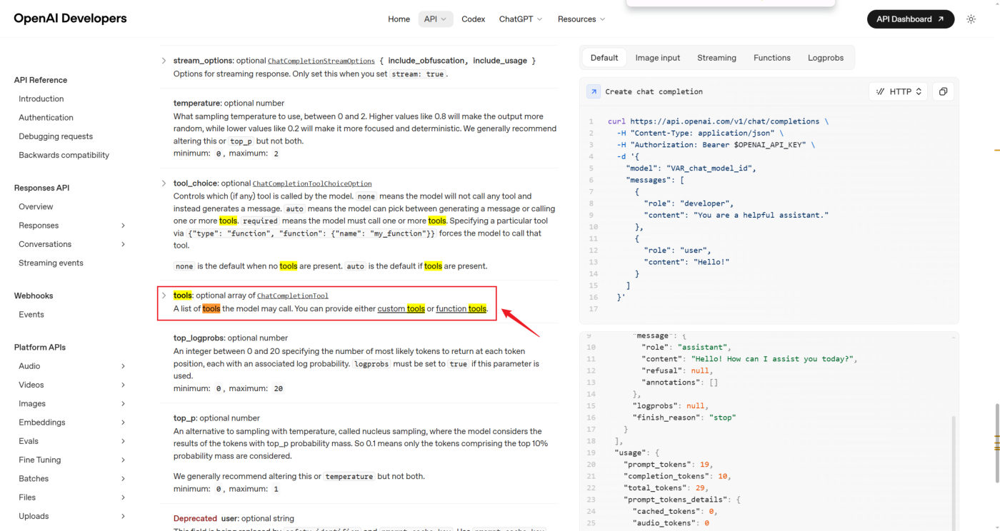
*图：OpenAI API 参考里的 tools 字段（ChatCompletionTool 数组）——它不在刚才打印的 model_fields 列表里，只能靠 model_kwargs 传*

```python
from langchain.chat_models import init_chat_model
from dotenv import load_dotenv
from rich import print as rprint

load_dotenv(override=True)

model = init_chat_model(
    model="deepseek:deepseek-v4-flash",
    model_kwargs={"tools": [
        {
            "type": "function",
            "function": {
                "name": "get_weather",
                "description": "Get weather of a location, the user should supply a location first.",
                "parameters": {
                    "type": "object",
                    "properties": {
                        "location": {
                            "type": "string",
                            "description": "The city and state, e.g. San Francisco, CA",
                        }
                    },
                    "required": ["location"]
                },
            }
        },
    ]}
)

# 向模型发送单条数据
response = model.invoke("你好，今天北京的天气如何")
rprint(response)
```

输出里出现了 `tool_calls` 字段，说明工具被模型正确识别了：

```text
AIMessage(
    content='你好！让我帮你查一下北京今天的天气情况。',
    additional_kwargs={'refusal': None, 'reasoning_content': '用户想知道北京今天的天气情况。我需要使用get_weather工具…'},
    response_metadata={..., 'finish_reason': 'tool_calls', ...},
    tool_calls=[{'name': 'get_weather', 'args': {'location': '北京'}, 'id': 'call_00_BT3PTJVDQlb9C2uhhJkc4856', 'type': 'tool_call'}],
    invalid_tool_calls=[],
    usage_metadata={'input_tokens': 303, 'output_tokens': 78, 'total_tokens': 381, ...}
)
```

> [!NOTE]
> 这里只是为了演示 `model_kwargs` 的作用才直接传 `tools`。**实际开发中要使用专门的工具调用接口，不采用这种原始方式**（后面的 Tools 章节会讲）。

### 透传参数：extra_body

`extra_body` 用于存放**模型厂商基于 OpenAI API 协议扩展的字段**。查阅 OpenAI Chat Completions 文档和 DeepSeek 对话补全 API 文档可知，`thinking` 是 DeepSeek 扩展的字段，用于控制是否启用思考模式：

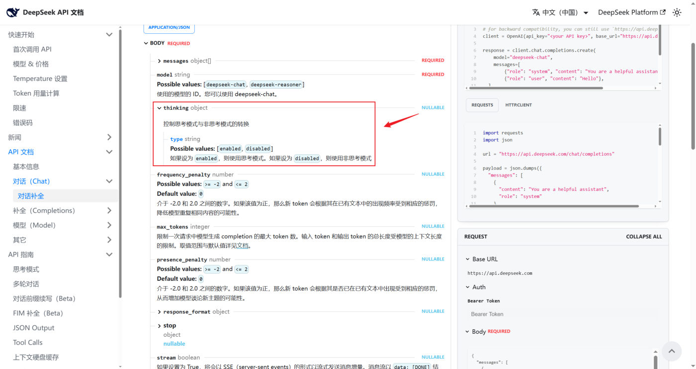
*图：DeepSeek「对话补全」API 文档里的 thinking 字段（type 可选 enabled / disabled）——这是 DeepSeek 在 OpenAI 协议之外自己扩展的*

```python
model = init_chat_model(
    model="deepseek:deepseek-v4-flash",
    extra_body={"thinking": {"type": "enabled"}},      # 换成 "disabled" 即可对比
)

response = model.invoke("你好，一句话回答")
rprint(response)
```

输出里包含了 `reasoning_content`（思考过程），`usage_metadata` 里的 reasoning token 也变成非 0，说明启用了思考模式：

```text
AIMessage(
    content='你好，请问有什么可以帮你的？',
    additional_kwargs={'refusal': None, 'reasoning_content': '好的，用户的问题很简单，就是要求"一句话回答"…'},
    ...
    usage_metadata={'input_tokens': 8, 'output_tokens': 87, 'total_tokens': 95, ..., 'output_token_details': {'reasoning': 78}}
)
```

把 `extra_body` 换成 `{"thinking": {"type": "disabled"}}` 再跑一次，输出里**不包含** `reasoning_content`，说明没有启用思考模式。

### 需要记住哪些参数？

记住常见参数及用法即可。如果需要精细控制模型输出，就查阅 OpenAI 和特定模型供应商的官方文档，通过 **`model_kwargs`（OpenAI 兼容字段）或 `extra_body`（厂商扩展字段）**把它们透传进去——这是应对"参数长尾"的标准解法，不用等 LangChain 逐个适配。

## Token 是什么？

**基本单位**：大模型通过**分词器（Tokenizer）**把文本拆开，拆分后得到的**最小语义单元就是 token**（大致相当于自然语言里的"词"或"字"）。不同的模型采用不同的分词算法（如 **BPE**、**WordPiece**），所以**同一段文本在不同模型里的 token 数量可能不同**。

**收费依据**：大语言模型通常也是以 token 的数量作为计量（收费）依据，换算关系大致是：

| 语言 | 换算 |
| --- | --- |
| 中文 | 1 个 token ≈ 1–1.8 个汉字 |
| 英文 | 1 个 token ≈ 3–4 个字符 |

> [!TIP]
> 想知道一段文字到底被切成了哪些 token，可以用官方在线工具：
> - OpenAI 提供：https://platform.openai.com/tokenizer
> - 百度智能云提供：https://console.bce.baidu.com/support/#/tokenizer

> [!NOTE]
> 前面 `max_tokens` 限制的是"输出多少 token"，调用返回值里的 `usage_metadata` / `response_metadata.token_usage` 统计的也是 token——**它既是长度单位，也是账单单位**（返回值里的 token 字段详见「模型的调用」笔记）。

## 本地模型：Ollama 的部署与调用

前面讲的都是"在线部署"的大模型（角度 3 的第一种）。LangChain 也支持使用 **Ollama、vLLM** 等框架启动的**本地大模型**，这里以 Ollama 为例演示。

### Ollama 是什么

Ollama 是 GitHub 上的一个开源项目，项目定位是：**一个本地运行大模型的集成框架**，可以实现 Qwen、DeepSeek 等主流大模型的**下载、启动和本地运行的自动化部署及推理流程**。

Ollama 官方地址：https://ollama.com

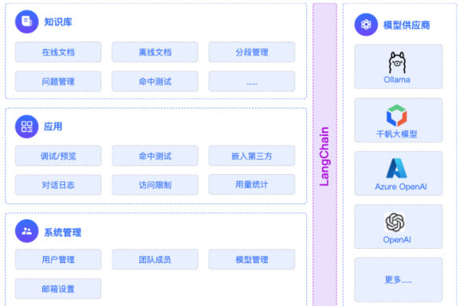
*图：LangChain 的模型供应商里既有 OpenAI、Azure OpenAI、千帆这样的云端平台，也有 Ollama 这样的本地框架——对上层代码而言它们用的是同一套接口*

> [!TIP]
> 本地部署的取舍：**数据不出本机、不花 API 费用、可离线使用**；代价是受本机显存/内存限制，1.5B 这类小模型更适合演示和轻量任务，复杂推理还是得靠在线大模型。

### 下载与安装

Ollama 支持跨平台部署，目前已兼容 Mac、Linux 和 Windows，安装过程都设计得非常简单：访问 https://ollama.com/download 下载对应系统的安装文件。

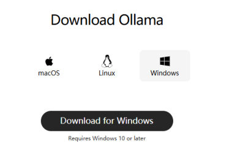
*图：Ollama 官网下载页——macOS / Linux / Windows 三个平台任选（Windows 要求 Win10 及以上）*

**Linux** 系统执行以下命令安装：

```bash
curl -fsSL https://ollama.com/install.sh | sh
```

这行命令的目的是从 https://ollama.com/ 网站读取 `install.sh` 脚本，并立即通过 `sh` 执行该脚本。安装过程中会包含以下几个主要操作：

1. 检查当前服务器的基础环境，如系统版本等；
2. 下载 Ollama 的二进制文件；
3. 配置系统服务，包括创建用户和用户组，添加 Ollama 的配置信息；
4. 启动 Ollama 服务。

**Windows** 系统想自定义安装目录，可以这样做：

1. 手动创建 ollama 安装目录：先在你想安装的路径下创建好一个新文件夹，并把 ollama 的安装包放在里面（比如 `F:\common_tools\Ollama`）；
2. 在文件路径上输入 `cmd` 回车，自动打开命令行窗口；
3. 在 cmd 窗口输入下面这条命令，Ollama 就会进入安装，点击 install 后可以看到安装路径就变成了我们指定的目录。

```bash
语法：软件名称 /DIR=这里放你上面创建好的Ollama指定目录
OllamaSetup.exe /DIR=F:\common_tools\Ollama
```

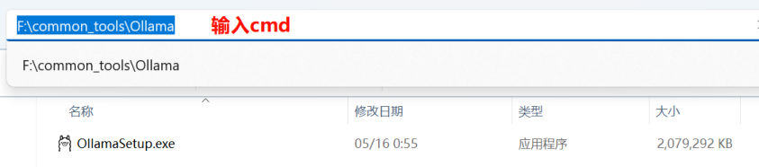
*图：在资源管理器地址栏里直接输入 cmd，打开的就是当前目录的命令行（省得手敲 cd）*

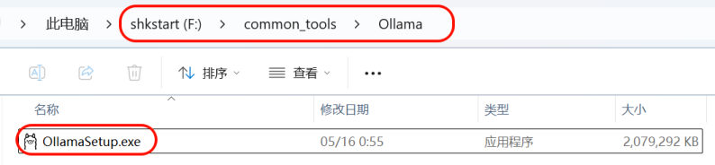
*图：先把 OllamaSetup.exe 放进刚建好的目标目录 F:\common_tools\Ollama*

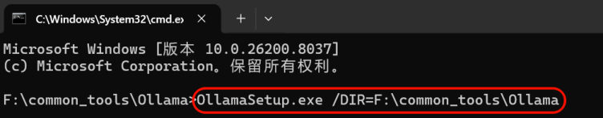
*图：执行 OllamaSetup.exe /DIR=F:\common_tools\Ollama，安装程序就会装到我们指定的目录*

### 模型的下载

**1、手动设置大模型存储目录**（模型动辄几个 GB，别都堆在系统盘）：

打开 Ollama 客户端 → Settings，在 **Model location** 里指明大模型要下载到的本地目录位置：

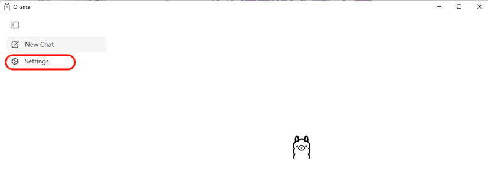
*图：Ollama 客户端左侧菜单里的 Settings 入口（New Chat 是对话，设置项在 Settings 里）*

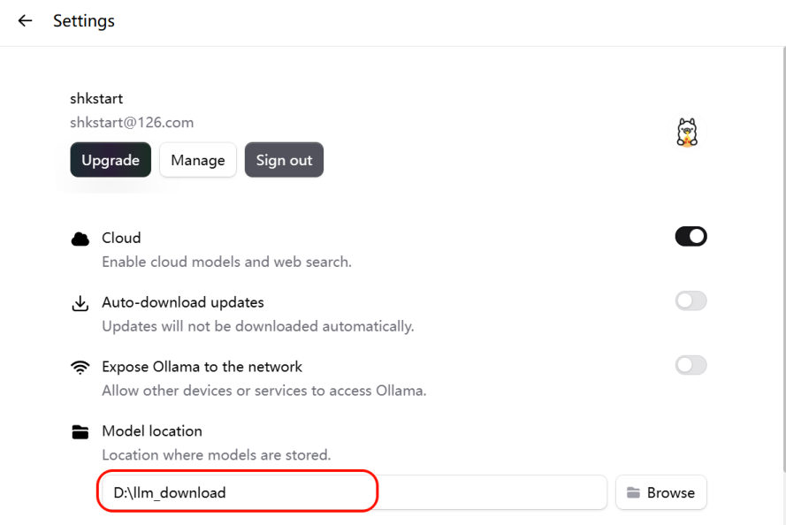
*图：Settings 里的 Model location 就是模型存放目录；上面还有 Cloud（云模型与联网搜索）、Auto-download updates、Expose Ollama to the network（把服务开放给局域网其他设备）*

**2、模型的下载**

方式 1：**直接在图形化界面里下载**。在输入框旁的模型下拉列表里搜模型即可——注意区分两种图标：

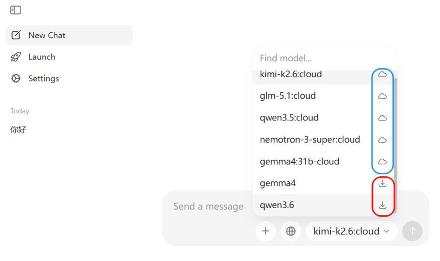
*图：带云朵图标的是在线模型（kimi-k2.6:cloud、glm-5.1:cloud…），需要在 Ollama 平台付费使用；带下载箭头的是可拉到本地的模型（gemma4、qwen3.6）*

方式 2：**命令行下载并运行**。访问 https://ollama.com/search 可以查看 Ollama 支持的模型，例如运行 `deepseek-r1:1.5b` 模型：

```bash
ollama run deepseek-r1:1.5b
```

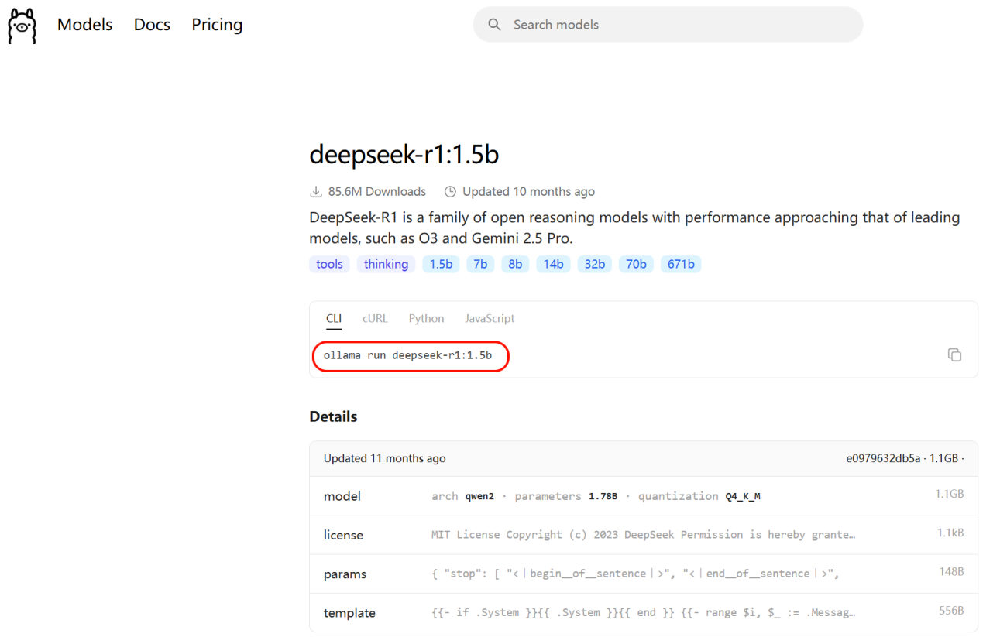
*图：模型库页面（以 deepseek-r1:1.5b 为例）——名字里的 1.5b 是参数量，CLI 标签下给出的就是 ollama run 命令*

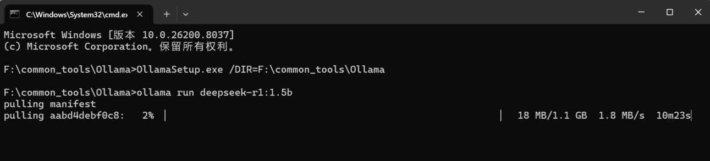
*图：回到命令行输入指令开始下载（pulling manifest，进度条右侧还有速度和剩余时间）*

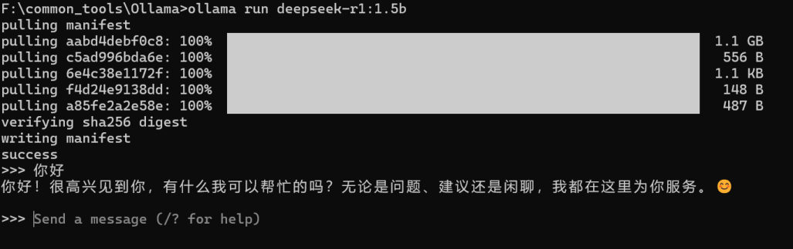
*图：下载完成后自动进入交互对话，出现 >>> 提示符就能提问了*

**3、Ollama 常用命令**

| 命令 | 一句话说明 |
| --- | --- |
| `ollama pull llama3` | 下载指定模型（例：llama3） |
| `ollama run llama3` | 启动并进入该模型交互对话 |
| `ollama list` | 列出本机已下载的所有模型 |
| `ollama rm llama3` | 删除不再需要的模型以节省磁盘 |
| `ollama cp llama3 my-llama3` | 本地复制/重命名模型 |
| `ollama show llama3` | 查看模型详细信息（参数、大小等） |
| `ollama create my-model -f Modelfile` | 用自定义 Modelfile 构建新模型 |
| `ollama serve` | 启动后台服务，供 API 调用 |
| `ollama ps` | 查看当前正在运行的模型进程 |
| `ollama stop llama3` | 停止正在运行的模型 |
| `ollama --version` | 查看安装的 ollama 版本 |

### LangChain 调用本地模型

先装依赖：

```bash
# pip install langchain-ollama
pip install -qU langchain-ollama
pip install -U ollama
```

**方式 1：`ChatOllama`**

```python
from langchain_ollama import ChatOllama

ollama_llm = ChatOllama(
    model="deepseek-r1:1.5b",
    # 如果Ollama在本地默认端口运行，则可省略；或使用 http://localhost:11434
    base_url="http://192.168.1.106:11434",
)
question = "你好，请你介绍一下你自己。"
result = ollama_llm.invoke(question)
print(result)
```

**方式 2：`init_chat_model`（统一接口）**

```python
from langchain.chat_models import init_chat_model

ollama_llm = init_chat_model(
    model="deepseek-r1:1.5b",
    model_provider="ollama",
    # base_url="http://192.168.1.106:11434",
)
question = "你好，请你介绍一下你自己。"
result = ollama_llm.invoke(question)
print(result)
```

返回值同样是 `AIMessage`，只是元数据换成了 Ollama 的格式（`done_reason`、`total_duration`、`eval_count` 等）：

```text
content='您好！我是由中国的深度求索（DeepSeek）公司开发的智能助手DeepSeek-R1。…'
additional_kwargs={}
response_metadata={'model': 'deepseek-r1:1.5b', 'created_at': '2026-05-17T13:45:51.8148967Z',
                   'done': True, 'done_reason': 'stop', 'total_duration': 658034000,
                   'load_duration': 53012900, 'prompt_eval_count': 9, 'prompt_eval_duration': 236815100,
                   'eval_count': 47, 'eval_duration': 338788200, 'logprobs': None,
                   'model_name': 'deepseek-r1:1.5b', 'model_provider': 'ollama'}
id='lc_run--019e362f-9f34-7cc2-b34d-8fa380131978-0'
tool_calls=[] invalid_tool_calls=[]
usage_metadata={'input_tokens': 9, 'output_tokens': 47, 'total_tokens': 56}
```

> [!NOTE]
> `model_provider="ollama"` 正是前面那份 provider 列表里的一员（对应 `langchain-ollama`），所以**本地模型和在线模型可以用同一套代码切换**——这也是统一接口的价值。

## 三种创建方式小结

| 方式 | 写法 | 什么时候用 |
| --- | --- | --- |
| 专用模型类 | `ChatDeepSeek(...)` | 用了该厂商，想用它的专有参数 |
| 兼容用法 | `ChatOpenAI(base_url=..., model=...)` | 平台没有专用类，或想"一套代码换平台" |
| 统一接口 | `init_chat_model("provider:model")` | **1.x 推荐**：官方统一入口，切换模型最省事 |

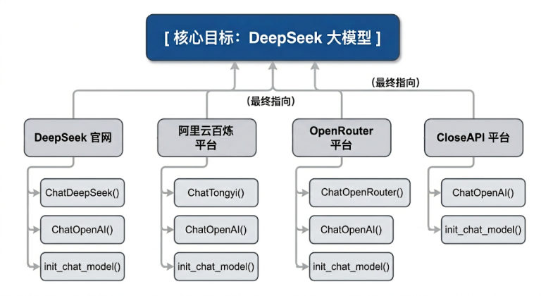
*图：同一个 DeepSeek 模型在各平台可用的创建类——官网 ChatDeepSeek、百炼 ChatTongyi、OpenRouter ChatOpenRouter，CloseAI 这类中转平台只有 ChatOpenAI 和 init_chat_model 两条路*

## 相关

- [开发环境搭建（conda）](/posts/编程学习/langchain学习笔记/03-开发环境搭建-conda/)
- [模型的调用](/posts/编程学习/langchain学习笔记/05-模型的调用/)

## 练习题

### 一、回忆填空（写完再展开对答案）

1. Model I/O 三件套：输入提示（____）、调用模型（____）、输出解析（____）
2. 创建模型的三个角度：调用谁家的 ____、重要参数写在 ____、模型 ____ 在哪
3. 每个平台配置都需要三个要素：____、____、____
4. 读取 .env 用 `load_dotenv(override=____)`；override=True 表示用 .env 的值 ____ 已有环境变量
5. `ChatDeepSeek` 里 API 地址参数叫 ____（不是 base_url）；不传 api_key 时会自动从环境变量 ____ 读取
6. 大多数平台都支持 ____ API 接口规范，所以基本都能用 `____` 集成
7. `init_chat_model` 的模型标识写法是 `"____:____"`
8. 自定义兼容服务时，正确参数名是 `____` 和 `____`；把变量名当参数名写会抛 ____ 错误
9. temperature 默认值是 ____；写代码/数据提取这类任务建议用 ____ 区间

> [!TIP]- 填空答案（做完再点开）
> 1. Format / Predict / Parse　2. API / 哪（配置文件还是硬编码）/ 部署　3. 模型名 / api-key / base-url　4. True / 覆盖　5. `api_base` / `DEEPSEEK_API_KEY`　6. OpenAI / `ChatOpenAI`　7. provider / model_name　8. `base_url` / `api_key` / `OpenAIError: Missing credentials`　9. 0.7 / 0.0–0.3

### 二、裸写题

- [ ] **2-1 用专用类创建 DeepSeek 模型**
  从 .env 读取密钥，用 `ChatDeepSeek` 创建模型（模型名 `deepseek-v4-flash`），并打印一句话自我介绍。

  > [!TIP]- 提示（先自己想，实在想不出再点开）
  > **一级 · 思路**：先 load_dotenv，再创建客户端，最后 invoke
  > **二级 · 方法**：`ChatDeepSeek(api_key=..., api_base=..., model=...)`
  > **三级 · 骨架**：不传 api_key 也行（会自动读环境变量 `DEEPSEEK_API_KEY`）

- [ ] **2-2 用兼容方式创建**
  改用 `ChatOpenAI` 连 DeepSeek（这和第 3 章 AI 智能伴侣的写法一致）。

  > [!TIP]- 提示
  > **一级 · 思路**：兼容写法只需要 base_url + api_key + model
  > **二级 · 方法**：`ChatOpenAI(api_key=..., base_url=..., model=...)`
  > **三级 · 骨架**：注意 `ChatOpenAI` 用的是 `base_url`（不是 `api_base`）

- [ ] **2-3 用统一接口创建并切换**
  用 `init_chat_model` 创建同一个模型；再写一个"只改模型字符串就能换模型"的函数。

  > [!TIP]- 提示
  > **一级 · 思路**：统一接口的意义就是"换模型不改代码结构"
  > **二级 · 方法**：`init_chat_model(model=..., model_provider="openai", base_url=..., api_key=...)`
  > **三级 · 骨架**：把模型名做成函数参数

- [ ] **2-4 感受 temperature**
  同一个问题（如"给这款咖啡写一句广告语"）分别用 `temperature=0.0` 和 `temperature=1.8` 各问 3 次，对比输出的稳定性。

  > [!TIP]- 提示
  > **一级 · 思路**：温度控制随机性，要对比"同一提示词多次调用的差异"
  > **二级 · 方法**：创建两个模型对象，各自循环调用 3 次
  > **三级 · 骨架**：`init_chat_model(..., temperature=0.0)`

> [!TIP]- 参考答案（做完再点开）
> ```python
> import os
> from dotenv import load_dotenv
> from langchain.chat_models import init_chat_model
>
> load_dotenv(override=True)
>
> # 2-1 专用类
> from langchain_deepseek import ChatDeepSeek
>
> deepseek_llm = ChatDeepSeek(
>     api_key=os.getenv("DEEPSEEK_API_KEY"),
>     api_base=os.getenv("DEEPSEEK_BASE_URL"),   # 注意：ChatDeepSeek 用 api_base
>     model="deepseek-v4-flash",
> )
> print(deepseek_llm.invoke("请介绍一下你自己").content)
>
> # 2-2 兼容方式
> from langchain_openai import ChatOpenAI
>
> compat_llm = ChatOpenAI(
>     api_key=os.getenv("DEEPSEEK_API_KEY"),
>     base_url=os.getenv("DEEPSEEK_BASE_URL"),   # ChatOpenAI 用 base_url
>     model="deepseek-v4-flash",
> )
> print(compat_llm.invoke("1 + 1 = ？").content)
>
> # 2-3 统一接口 + 切换模型
> def build_llm(model_name: str):
>     return init_chat_model(
>         model=model_name,
>         model_provider="openai",
>         base_url=os.getenv("DEEPSEEK_BASE_URL"),
>         api_key=os.getenv("DEEPSEEK_API_KEY"),
>     )
>
> llm_a = build_llm("deepseek-v4-flash")
> print(llm_a.invoke("你好，用一句话回答").content)
>
> # 2-4 temperature 对比
> for temp in [0.0, 1.8]:
>     llm = init_chat_model(
>         model="deepseek-v4-flash",
>         model_provider="openai",
>         base_url=os.getenv("DEEPSEEK_BASE_URL"),
>         api_key=os.getenv("DEEPSEEK_API_KEY"),
>         temperature=temp,
>     )
>     print(f"\n--- temperature={temp} ---")
>     for i in range(3):
>         print(i + 1, llm.invoke("给这款咖啡写一句广告语").content)
> # 观察：temperature=0.0 时三次输出几乎一样；1.8 时每次差别很大
> ```