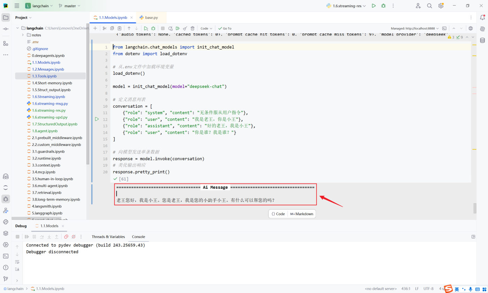

## 六种调用方式总览

模型调用（Invocation）是指通过特定方法触发大语言模型生成输出的过程。

| 方法 | 特点 | 适用场景 |
| --- | --- | --- |
| `invoke()` | 阻塞式，一次性返回完整结果 | 问答、批处理任务、无需实时反馈 |
| `stream()` | 流式输出，实时返回每个 token | 聊天机器人、长文本生成、需要提升体验 |
| `batch()` | 批量处理多个输入 | 高并发、需要同时处理大量请求 |
| `ainvoke()` | 非阻塞式（异步） | 高并发 Web 应用、IO 密集型任务 |
| `astream()` | 非阻塞式流式 | 同上 |
| `abatch()` | 非阻塞式批量 | 同上 |

> [!TIP]
> 记法：**前缀 a = async（异步）**，同步版与异步版一一对应。

## invoke()：最核心的方法

阻塞式：程序会等模型**完全生成**整个响应后，再一次性返回。

```python
response = model.invoke(input, config=None)
```

它做的事：① 接收你的输入（问题、指令、对话历史）② 发送给 LLM ③ 返回响应（**文本 + 元数据**）。

### 参数详解

| 参数 | 类型 | 说明 | 必需 | 默认值 |
| --- | --- | --- | --- | --- |
| `input` | `str` \| `list[dict]` \| `list[Message]` 等 | 你要发送给模型的内容 | 必需 | 无 |
| `config` | `dict` | 高级配置（回调函数、元数据、标签等） | 可选 | None |

`invoke` 的源码签名（除了 `config`，还有一个直接传的 `stop` 停止符参数）：

```python
def invoke(
    self,
    input: LanguageModelInput,
    config: RunnableConfig | None = None,
    *,
    stop: list[str] | None = None,
    **kwargs: Any,
) -> AIMessage:
```

> [!NOTE]
> `config` 属于进阶用法（`run_name`、`tags`、`metadata`、`callbacks`、`configurable` 等），本笔记最后一节专门讲。

### 三种输入形式

**① 文本输入（最简单）**

```python
response = model.invoke("帮我写一首描述春天的七言绝句诗")
print(response.content)
```

文本会自动转成一条 `user` 消息。✅ 适合快速测试；❌ 无法设置系统提示、无法传递对话历史。

**② 字典列表（推荐，最灵活）**

```python
messages = [
    {"role": "system", "content": "你是一个专业的 Python 导师"},
    {"role": "user", "content": "什么是装饰器？"},
    {"role": "assistant", "content": "装饰器是一种设计模式..."},   # 可选，用于对话历史
    {"role": "user", "content": "继续提问"},
]
response = model.invoke(messages)
```

✅ 可以设置系统提示、表达多轮对话历史、JSON 兼容、易于序列化与网络传输（**生产环境推荐**）；❌ 代码稍多一点。

角色说明：

| role | 英文 | 作用 |
| --- | --- | --- |
| `system` | System | 设定 AI 的行为、角色、规则（如"你是一个专业的 Python 导师"） |
| `user` | Human / User | 用户的输入/问题 |
| `assistant` | AI / Assistant | AI 的历史回复，用于对话上下文 |

**③ 消息对象列表**

用 `SystemMessage`、`HumanMessage`、`AIMessage` 这些专门的类来构造：

```python
from langchain_core.messages import HumanMessage

response = model.invoke([HumanMessage("2 + 3 * 2 = ？")])
```

> [!NOTE]
> `"user"` 和 `"human"` 在某些实现里可互换，但**跟着你用的大模型提供商的惯例走最稳**（如 OpenAI 用 `user`）。

### 对话历史：带历史 vs 不带历史

字典列表的价值在"多轮"上体现得最明显。**举例 2：多轮对话（带历史）**——把上一轮的问答按 `assistant` / `user` 追加进列表，模型就能"记得"：

```python
# 使用字典格式构建消息
messages = [
    {"role": "system", "content": "你是一个专业的数学老师。"},
    {"role": "user", "content": "2 + 3 * 2 = ？"},
    {"role": "assistant", "content": "8"},
    {"role": "user", "content": "我刚才问了什么问题？"}
]
response = model.invoke(messages)
print(f"AI的回复：{response.content}")
```

```text
AI的回复：你刚才问的是：**"2 + 3 * 2 = ？"**
```

**举例 3：如果不传递历史，AI 会"失忆"**——两次调用互相独立，第二次问"我叫什么名字"它答不上来：

```python
messages1 = [
    {"role": "system", "content": "你是一个非常友好的AI助手"},
    {"role": "user", "content": "你好，我叫小明"},
]
# 第一次对话
response1 = model.invoke(messages1)
print(f"AI的回复1：{response1.content}")

# 第二次对话：只发了新问题，没有带上上一轮的消息
messages2 = [
    {"role": "user", "content": "我叫什么名字？"}
]
response2 = model.invoke(messages2)
print(f"AI的回复2：{response2.content}")
```

```text
AI的回复1：你好，小明！很高兴认识你 😊
我是你的AI助手，有什么我可以帮你的吗？
AI的回复2：我不知道你的名字，除非你告诉我。
如果你愿意，可以直接告诉我，我之后就可以这样称呼你。
```

**作为对比：传递记忆**——把上一轮的回复 `append` 进同一个列表再调用，它就记得住了：

```python
conversation = [
    {"role": "system", "content": "你是一个非常友好的AI助手"},
    {"role": "user", "content": "你好，我叫小明"}
]
# 第一次对话
response1 = model.invoke(conversation)
print(f"AI的回复1：{response1.content}")

# 添加记忆
conversation.append({"role": "assistant", "content": response1.content})
conversation.append({"role": "user", "content": "我叫什么名字？"})

# 第二次对话
response2 = model.invoke(conversation)
print(f"AI的回复2：{response2.content}")
```

```text
AI的回复1：你好，小明！很高兴认识你 😊
我是你的AI助手，有什么我可以帮你的吗？
AI的回复2：你叫小明。
```

> [!IMPORTANT]
> 结论：**模型的"记忆"完全来自你传进 `invoke` 的消息列表**，它自己不保存任何上下文。要实现多轮对话，就必须在每次调用时把完整历史一起传过去（消息类型的系统讲解见「Message与对话历史」笔记）。

### 返回值：AIMessage

`invoke` 返回的是 **AIMessage 对象**（不是纯字符串）：

```python
print(type(response))      # <class 'langchain_core.messages.ai.AIMessage'>
print(response.content)    # 模型回复的文本
```

用 `rich` 打印能看清它的结构（`from rich import print as rprint`）：

```text
AIMessage(
    content='2 + 3 * 2 = **8**',
    additional_kwargs={'refusal': None},
    response_metadata={
        'token_usage': {
            'completion_tokens': 15,
            'prompt_tokens': 16,
            'total_tokens': 31,
            ...
        }, ...
    }, ...
)
```

| 字段 | 说明 |
| --- | --- |
| `content` | 回复的文本（最常用） |
| `response_metadata` | 元数据：`token_usage`（输入/输出/总 token）、模型名、结束原因等 |
| `additional_kwargs` | 附加参数（不同厂商不同，如 `refusal`） |
| `tool_calls` | 模型要求调用的工具（第 5 章 Tools 会用到） |


*图：美化打印 AIMessage 的实际效果——content 就是模型回复的文本*

### 返回值字段全解析

`AIMessage` 里的字段可以分成五组来看，**回复内容、账单、体检报告、追踪 ID 全在里面**。

**① 核心内容与基本信息**

| 字段 | 说明 |
| --- | --- |
| `content` | 模型生成的文本回答，你最关心的核心输出 |
| `id` | 本次运行在 **LangChain 内部**生成的唯一标识符（Run ID），形如 `lc_run--019e3659-5ee2-7b62-bc8a-741e27374b43-0` |
| `additional_kwargs` | 包含特定供应商的额外参数 |
| `refusal` | 模型拒绝回答（涉及敏感政策）时给出拒绝原因，正常回答时为 `None` |

**② 消耗统计（Token Usage）**——决定你这一行输入操作花了多少钱

| 字段 | 说明 |
| --- | --- |
| `prompt_tokens` / `input_tokens` | 输入 Token 数：你发送给模型的问题长度 |
| `completion_tokens` / `output_tokens` | 输出 Token 数：模型回答生成的长度 |
| `total_tokens` | 总消耗，两者之和 |
| `reasoning_tokens` | 推理 Token 数：o1/o3 这类推理模型"思考"时消耗的 Token |
| `cached_tokens` | 缓存命中的 Token 数：重复提问命中模型商缓存时，这部分费用通常更低 |

**③ 响应元数据（Response Metadata）**——API 返回的原始详细信息

| 字段 | 说明 |
| --- | --- |
| `model_name` | 实际调用的模型具体版本，如 `gpt-5.4-mini-2026-03-17` |
| `model_provider` | 模型供应商，如 `openai`、`deepseek` |
| `finish_reason` | 生成停止的原因：`stop` = 正常回答结束；`length` = 达到最大 Token 限制被截断（调用工具时还会出现 `tool_calls`） |
| `system_fingerprint` | 系统指纹，用于追踪模型后端的配置变更 |
| `id` | **API 层面**的响应 ID（如 `chatcmpl-DgWobsxhDOqzjqVFwbZYKRnovpEiV`），和上面那个 LangChain Run ID 不是一回事 |
| `service_tier` | 服务层级（如按量付费或订阅） |
| `logprobs` | 对数概率，通常用于分析词汇选择的可能性 |

**④ 性能与延迟（Latency Checkpoint）**——针对 API 响应速度的深度拆解，单位毫秒（ms）

| 字段 | 说明 |
| --- | --- |
| `total_duration_ms` | 总耗时：从请求发出到完全收到的总时间 |
| `user_visible_ttft_ms` | 首字到达时间：用户看到第一个字跳出来等待的时间，**这是体感快慢的关键** |
| `engine_ttft_ms` | 引擎层面的首字到达时间（TTFT = Time To First Token） |
| `engine_ttlt_ms` | 引擎生成最后一个字的时间（TTLT = Time To Last Token） |
| `pre_inference_ms` | 推理前处理耗时：包括安全审核、Token 化等预处理 |
| `service_tbt_ms` | 服务端 token 与 token 之间生成的间隔时间（TBT = Time Between Tokens），**决定了打字机效果是否丝滑** |

> [!NOTE]
> `latency_checkpoint` 不是所有供应商都会返回（它来自 OpenAI 兼容的高阶接口）；实测 DeepSeek 官方接口的返回里就没有这一项。

**⑤ 工具调用信息**

| 字段 | 说明 |
| --- | --- |
| `tool_calls` | 结构化工具调用列表：模型决定调用某个函数或搜索工具时，参数都在这里 |
| `invalid_tool_calls` | 触发失败或格式错误的工具调用尝试 |

**一次访问所有信息**

```python
response = model.invoke("用一句话解释什么是 AI")

# 1. 获取回复内容
print("AI 回复:", response.content)

# 2. 获取响应元数据
metadata = response.response_metadata
print(f"使用的模型: {metadata['model_name']}")
print(f"结束原因: {metadata['finish_reason']}")
print(f"模型提供商：{metadata['model_provider']}\n")

# 3. 获取 Token 使用情况
usage = metadata.get('token_usage', {})
print(f"输入 tokens: {usage.get('prompt_tokens')}")
print(f"输出 tokens: {usage.get('completion_tokens')}")
print(f"总计 tokens: {usage.get('total_tokens')}")

# 4. 获取消息 ID
print(f"消息 ID: {response.id}")
```

```text
AI 回复: AI（人工智能）就是让机器模拟人类的学习、推理、识别和决策能力。
使用的模型: gpt-5.4-mini-2026-03-17
结束原因: stop
模型提供商：openai
输入 tokens: 13
输出 tokens: 28
总计 tokens: 41
消息 ID: lc_run--019e3665-8dfa-7c53-a9a5-4995348a0258-0
```

## stream()：流式调用

| | invoke() | stream() |
| --- | --- | --- |
| 返回时机 | 全部生成完才返回 | **实时返回响应片段** |
| 返回值 | AIMessage | **迭代器（iterator）** |
| 适合 | 短回答、后台任务 | 长文本、聊天机器人（用户体验好） |

```python
for chunk in model.stream("请用中文详细介绍什么是AI"):
    print(chunk.content, end="", flush=True)
```

> [!WARNING]
> 流式输出**依赖模型供应商对流式的支持**——不是所有模型/平台都支持。

## batch()：批量调用

`batch()` 允许一次性发送**一组独立请求**，模型在后台**并行处理**，然后返回所有结果的列表（**按原始输入顺序**）。

```python
responses = model.batch([
    "请为一款机械键盘写一句广告语",
    "请为无线耳机写一句广告语",
    "请为显示器写一句广告语",
])
for r in responses:
    print(r.content)
```

适用于高并发场景——比写 for 循环逐个 invoke 快得多（并行）。

### batch_as_completed()：谁先完成谁先返回

输入列表很大、或者单个请求耗时差异明显时，`batch()`"等全部完成才算完"就显得慢了。`batch_as_completed()` 会**在每个请求完成后立即 yield 结果**，所以**结果可能乱序**；每个响应被放在一个元组里，**元组的第一个元素是原始输入的索引**，可以据此重新排序：

```python
messages = [
    "你好，你是谁？",
    "2 + 3 * 5 = ?",
    "中国首都在哪里？"
]
responses = model.batch_as_completed(messages)
for response in responses:
    print(response)
```

```text
(2, AIMessage(content='中国的首都是**北京**。', ...))
(0, AIMessage(content='你好！我是一个 AI 助手，可以帮你回答问题、写作、翻译…', ...))
(1, AIMessage(content='2 + 3 * 5 = **17**', ...))
```

索引 2 最先返回、索引 1 最后返回——**谁先算完谁先到**，适合"先到先处理"的场景。

### batch() 与循环 invoke() 的性能对比

同一个任务（4 条翻译），分别用 `batch()` 和 for 循环调用 `invoke()`：

```python
import time

inputs = [
    "翻译成英文：春天来了",
    "翻译成英文：夏天很热",
    "翻译成英文：秋天落叶",
    "翻译成英文：冬天下雪"
]

# ✅ 批量调用（高效）
start = time.time()
responses = model.batch(inputs)
batch_time = time.time() - start
print(f"批量调用耗时: {batch_time:.2f}秒\n")

# ❌ 循环调用（低效，仅用于对比）
start = time.time()
loop_responses = []
for inp in inputs:
    response = model.invoke(inp)
    loop_responses.append(response)
loop_time = time.time() - start
print(f"循环调用耗时: {loop_time:.2f}秒")
print(f"批量调用节省: {((loop_time - batch_time) / loop_time * 100):.1f}%")
```

课程环境实测：批量调用 **1.91 秒**，循环调用 **3.87 秒**，批量调用**节省约 50.7%**。

> [!TIP]
> `batch()` 快在**并行发送**与**更少的网络往返开销**上；输入条数越多、单条应答越慢，差距越明显。

## 异步调用：ainvoke / astream / abatch

异步方法与同步版相比：**调用时不会阻塞程序**，可以继续执行本地逻辑，等模型返回后再取结果。用 `asyncio` 组织：


*图：同步 vs 异步的直观类比——同步要等对方准备好才能一起走，异步则各自准备、最后会合*

```python
import asyncio

async def main():
    task = asyncio.create_task(model.ainvoke("用一句话解释人工智能。"))
    # 模型在后台请求的同时，本地逻辑继续跑
    for i in range(1, 4):
        await asyncio.sleep(1)
        print(f">>> 正在执行第{i}个任务...")
    result = await task
    print(">>> 模型返回:", result.content)

asyncio.run(main())
```

运行结果能直观看到：模型请求**已经在后台发送**，本地循环照样每秒打印一次，最后才取回模型结果。

| 同步 | 异步 | 说明 |
| --- | --- | --- |
| `invoke()` | `ainvoke()` | 一次性返回 |
| `stream()` | `astream()` | 流式 |
| `batch()` | `abatch()` | 批量 |

### 异步调用的两个注意事项

> [!WARNING]
> 1. 异步示例请**在 `.py` 文件中执行，而不是 Jupyter Notebook 里**——Jupyter 自带事件循环，和 `asyncio.run()` 会打架。
> 2. 等待时要用 **`await asyncio.sleep()`，不要用 `time.sleep()`**：`time.sleep()` 会把整个线程阻塞住，后台的网络请求也一起被卡住，异步就白写了。

### astream() 与 abatch() 长什么样

`astream()` 返回的是**异步生成器**，用 `async for` 消费；请求发出后可以不急着读，先干别的：

```python
async def demo_async_stream():
    print(">>> 发起异步流式调用 (astream)...")
    stream_resp = model.astream("请用一句话解释机器学习的基本概念。")

    # 流式请求已发送，程序无需等待，继续执行其他异步任务
    for i in range(3):
        await asyncio.sleep(1)      # 用 asyncio.sleep 而非 time.sleep，事件循环才能去处理上面的网络 IO
        print(f">>> 正在执行第{i + 1}个任务...")

    # 现在开始读取缓冲区中的流式结果
    print(">>> 流式输出: ", end="", flush=True)
    async for chunk in stream_resp:
        print(chunk.content, end="", flush=True)
    print()

asyncio.run(demo_async_stream())
```

`abatch()` 和 `ainvoke()` 一样，用 `create_task` 丢到后台再 `await` 取结果：

```python
async def demo_async_batch():
    questions = ["用一句话说明深度学习与传统机器学习的区别", "中国首都在哪里？"]

    print(">>> 发起异步批量调用 (abatch)...")
    batch_task = asyncio.create_task(model.abatch(questions))   # 关键：立刻在后台执行

    print(">>> 批量任务已在后台运行，主程序继续执行...")
    for i in range(3):
        await asyncio.sleep(1)                                  # 用 asyncio.sleep 让后台任务拿到 CPU 时间片做网络请求
        print(f">>> 正在执行第{i + 1}个任务...")

    responses = await batch_task                                # 取回批量结果
    for response in responses:
        print(f">>> 响应内容: {response.content}")

asyncio.run(demo_async_batch())
```

两次运行的总耗时都稳定在 **3.0 秒左右**（= 本地循环的 3 秒），说明模型请求确实是和本地任务**并行**跑的，几乎没有额外等待。

## 处理 API 调用失败

线上调用随时可能失败（密钥写错、余额不足、网络抖动、被限流），标准做法是**用 `try/except` 按异常类型分别处理**：

```python
try:
    response = model.invoke("Hello")
    print(response.content)
except ValueError as e:
    print(f"配置错误: {e}")
except ConnectionError as e:
    print(f"网络错误: {e}")
except Exception as e:
    print(f"未知错误: {e}")
```

| 异常类型 | 典型触发场景 | 处理建议 |
| --- | --- | --- |
| `ValueError` | **配置错误**：参数名写错、`model_provider` 推断失败、密钥缺失或格式不对 | 检查 `.env` 与初始化参数，改完再重试 |
| `ConnectionError` | **网络错误**：连不上服务端、代理/魔法失效、`base_url` 写错 | 检查网络与 `base_url`，配合 `max_retries` 自动重试 |
| `Exception` | **未知错误**：兜底捕获（限流、余额不足、模型侧 5xx 等） | 打日志、告警，必要时降级到备用模型 |

> [!TIP]
> **`except` 的顺序很重要**：它是从上往下匹配的，所以具体异常（`ValueError`、`ConnectionError`）必须写在 `Exception` 前面，否则全被兜底那个吃掉，排查问题时就看不到真正原因了。

## 美化输出：pretty_print()

直接 `print(response)` 打出来的内容比较杂乱，`AIMessage` 自带 `pretty_print()` 方法可以美化输出：

```python
# 定义消息列表
conversation = [
    {"role": "system", "content": "无条件服从用户指令"},
    {"role": "user", "content": "我是老王，你是小王"},
    {"role": "assistant", "content": "好的老王，我是小王"},
    {"role": "user", "content": "你是谁？我是谁？"}
]

response = model.invoke(conversation)
# 美化输出响应
response.pretty_print()
```

```text
================================== Ai Message ==================================

我是小王，你是老王。
```

> [!NOTE]
> 另一种美化方式是 `rich` 库的 `rprint(response)`（前面的返回值一节已经用过）：它会把 `content`、`response_metadata`、`usage_metadata` 全部彩色展开，适合在终端里做深度调试；`pretty_print()` 只呈现"谁说了什么"，更干净。

## 模型能力画像：profile

LangChain 1.1 及更高版本可以通过 **`profile` 属性**查看模型的配置信息。这是 LangChain 针对模型做的**能力画像**，但**它是否存在，取决于 LangChain 在集成模型厂商的服务时是否声明了能力画像**。

**例 1：DeepSeek 官方模型**——输出为空 `{}`（本机实测结果一致）：

```python
from langchain_deepseek import ChatDeepSeek
from dotenv import load_dotenv

# 从.env文件中加载环境变量
load_dotenv(override=True)

model = ChatDeepSeek(
    model="deepseek-v4-flash",
    temperature=0.7,
    max_tokens=1000,
    max_retries=6,
)
print(model.profile)      # {} —— LangChain没有声明DeepSeek官方模型的能力画像
```

**例 2：CloseAI 平台的 gpt 模型**——同样输出为空 `{}`。

**例 3：OpenRouter 平台的模型**——LangChain 已声明了画像，能看到完整的能力清单：

```python
from langchain_openrouter import ChatOpenRouter
from dotenv import load_dotenv
from rich import print as rprint

# 从.env文件中加载环境变量
load_dotenv(override=True)

model = ChatOpenRouter(
    model="openai/gpt-4o-mini",
    # model="deepseek/deepseek-v3.2",
    temperature=0.7,
    timeout=30,
    max_tokens=1000,
    max_retries=6,
)
rprint(model.profile)
```

```text
{
 'max_input_tokens': 128000,
 'max_output_tokens': 16384,
 'text_inputs': True,
 'image_inputs': True,
 'audio_inputs': False,
 'video_inputs': False,
 'text_outputs': True,
 'image_outputs': False,
 'audio_outputs': False,
 'video_outputs': False,
 'reasoning_output': False,
 'tool_calling': True,
 'structured_output': True
}
```

**更换模型 ID，profile 会跟着替换**——把模型换成 `deepseek/deepseek-v3.2` 后（本机实测一致）：

```text
{'max_input_tokens': 163840, 'max_output_tokens': 65536, 'text_inputs': True,
 'image_inputs': False, 'audio_inputs': False, 'video_inputs': False,
 'text_outputs': True, 'image_outputs': False, 'audio_outputs': False,
 'video_outputs': False, 'reasoning_output': True, 'tool_calling': True,
 'structured_output': True}
```

> [!TIP]
> 这段代码只需要 OpenRouter 的 API Key（用于实例化），**不会真正发送请求，所以不必充值**就能看到画像。
>
> 画像的实用价值：写代码前先确认该模型**支不支持工具调用（`tool_calling`）、结构化输出（`structured_output`）、图片输入（`image_inputs`）**，能省掉一大堆"跑起来才发现不支持"的坑。

## 调用时传入 config

调用模型时（`invoke()`、`ainvoke()`、`stream()`、`batch()` 等方法）都可以额外传入 `config` 参数。它允许**在调用时动态配置和控制模型行为**，而不必在初始化时就固定所有参数，为应用带来更大的灵活性和可维护性。

```python
deepseek_llm.invoke(
    "你好",
    config={
        "run_name": "...",                 # 在LangSmith中这次运行会显示为指定名称
        "tags": ["test", "development"],   # 打上标签便于分类查找
        "metadata": {"user_id": "123"},    # 记录用户ID
        "callbacks": [custom_handler],     # 启用自定义回调函数
        "configurable": {
            "model": "deepseek-reasoner",  # 配置模型参数
            "temperature": 0.7,            # 配置温度参数
            "max_tokens": 100              # 配置最大令牌数
        }
    }
)
```

config 中支持的配置项：

| 配置项 | 类型 | 描述 |
| --- | --- | --- |
| `run_name` | `str` | 为当前运行设置一个可读的名称，便于在 LangSmith 追踪系统中快速定位和识别不同的运行任务 |
| `tags` | `List[str]` | 为运行设置标签，用于分类和过滤，同样服务于 LangSmith 的检索 |
| `callbacks` | `List[BaseCallbackHandler]` | 设置回调处理器，在运行的不同阶段（开始、流式输出、结束等）触发，用于与监控平台（如 LangSmith）集成做深度追踪和调试 |
| `metadata` | `Dict[str, Any]` | 附加任意键值对元数据，记录本次调用的业务上下文，如 `{"user_id": "123", "session_id": "abc"}` |
| `max_concurrency` | `int` | 限制当前可运行对象的最大并发运行数，防止对 API 接口或本地资源造成过大压力，实现简单的速率限制 |
| `recursion_limit` | `int` | 限制运行时递归调用的最大深度，主要在复杂工作流（如 Agent 执行多步工具调用）中防止无限递归循环 |
| `configurable` | `Dict[str, Any]` | 一个万能字典，用于传递其他可配置参数，实现更高级的动态行为（如配置可替代的模型或组件） |

说明：

- `run_name`、`tags`、`callbacks` 主要用在 **LangSmith** 中，用于追踪、筛选和调试；
- `metadata` 可以放业务信息；在工作流开发中，当整个流程被包装为 Runnable 链时，这些参数还能传递给后续的链节点使用；
- `configurable` 里可配置的参数与 `init_chat_model` 的初始化参数一样，区别在于**生效范围与优先级**：

| | 生效范围 | 优先级 |
| --- | --- | --- |
| `init_chat_model` 初始化参数 | 该模型实例的默认设置，适用于大部分场景 | 低 |
| 运行时 `config` | 单次调用的特定设置 | **更高**（针对本次调用做特殊调整） |

**举例 1：用 `configurable` 覆盖初始化参数**

```python
# 1. 初始化模型
model = init_chat_model(
    model="deepseek-v4-flash",
    model_provider="deepseek",
    api_key=DEEPSEEK_API_KEY,
    base_url=DEEPSEEK_BASE_URL,
    temperature=0.2,
    max_tokens=500,
    # 指定可调整参数
    configurable_fields=("model", "model_provider", "temperature", "max_tokens"),
)

# 2. 准备 config 字典
config = {
    "run_name": "joke_generation",     # 在LangSmith中这次运行会显示为 joke_generation
    "tags": ["tag1", "tag2"],          # 打上标签便于分类查找
    "metadata": {"user_id": "123"},    # 记录用户ID
    "configurable": {
        "model": "deepseek-v4-pro",    # 配置模型参数
        "model_provider": "openai",    # 配置模型提供商参数
        "temperature": 0.7,            # 配置温度参数
        "max_tokens": 1000             # 配置最大令牌数
    }
}

# 3. 调用模型并传入config
response = model.invoke("1 + 2 = ？", config=config)
rprint(response)
```

返回的元数据里能看到**实际生效的是 config 里指定的模型**：

```text
AIMessage(
    content='1 + 2 = 3',
    ...
    response_metadata={..., 'model_provider': 'openai', 'model_name': 'deepseek-v4-pro', ...},
    usage_metadata={'input_tokens': 11, 'output_tokens': 65, 'total_tokens': 76, ..., 'output_token_details': {'reasoning': 57}}
)
```

> [!IMPORTANT]
> 想用 `config["configurable"]` 覆盖默认参数，**必须在 `init_chat_model` 时用 `configurable_fields` 声明"哪些参数允许在运行时替换"**，否则配置不会生效。

**举例 2：用 `max_concurrency` 限流**

处理大量输入时，为了避免把模型服务打爆或触发速率限制：

```python
large_list_of_inputs = [...., ...., ....]
model.batch(
    large_list_of_inputs,
    config={
        'max_concurrency': 5      # 限制最大并发数为5
    }
)
```

## 相关

- [模型的创建](/posts/编程学习/langchain学习笔记/04-模型的创建/)
- [Message与提示词模板](/posts/编程学习/langchain学习笔记/07-message与提示词模板/)

## 练习题

### 一、回忆填空（写完再展开对答案）

1. 六种调用方式：____ / ____ / ____，以及它们的异步版本 ____ / ____ / ____；异步前缀 `a` 表示 ____
2. `invoke` 是 ____ 式，等模型完全生成才一次性返回；源码签名里除了 `input`，还有配置用的 ____ 和直接传的 ____；它的三种输入形式是 ____、____（推荐）、____
3. 字典列表的三个常用 role：____ 用来设定行为/规则、____ 是用户输入、____ 是 AI 的历史回复；它们对应的消息对象类分别是 ____ / ____ / ____
4. 模型的"记忆"完全来自传进 invoke 的 ____，它自己不保存上下文；多轮对话要按顺序 append：先加 ____，再加 ____
5. `invoke` 返回的是 ____ 对象，取文本用 `response.____`；`response.id` 是 ____ 内部的运行 ID，`response.response_metadata["id"]` 是 ____ 层面的响应 ID；结束原因字段叫 ____，取值 ____ = 正常结束、____ = 达到最大 token 被截断、____ = 调用工具；模型拒绝回答的原因放在 ____ 字段
6. token 统计字段：输入 ____、输出 ____、总计 ____、推理 token ____、缓存命中 ____；延迟字段（单位 ____）里有总耗时 ____、用户可见首字耗时 ____、引擎首字 ____、引擎尾字 ____、服务端 token 间隔 ____（决定打字机效果是否丝滑）——这些延迟字段 ____（所有 / 部分）供应商才会返回
7. `stream` 返回的是 ____，靠 for 循环逐个取 chunk，它依赖 ____ 对流式的支持；`batch` 会在后台 ____ 处理、结果按 ____ 顺序返回；`batch_as_completed` 谁先完成谁先返回、结果可能 ____，每个元素是 ____，第一个元素是原始输入的 ____
8. 异步调用用 ____ 把请求丢到后台、再用 `await` 取结果；等待时必须用 ____（而不是 `time.sleep()`），否则整个线程被卡住；异步示例要在 ____ 文件里跑，别在 Jupyter 里跑
9. 处理调用失败的标准做法是 ____ 按异常类型分别处理：____ 抓配置错误（参数名写错、provider 推断失败、密钥缺失）、____ 抓网络错误、____ 兜底；顺序上必须把 ____ 写在 ____ 前面；美化输出用 `response.____()`（只呈现"谁说了什么"），或用 rich 的 ____（彩色展开 content / response_metadata / usage_metadata）
10. `profile` 是模型的能力 ____：DeepSeek 官方和 CloseAI 返回 ____，OpenRouter 返回完整清单（可提前确认是否支持 ____、____、____），只需 ____ 就能查看、不会真正发请求；调用时传的 `config` 支持 ____（运行名）、____（标签）、____（业务元数据）、____（回调）、____（最大并发）、____（递归深度）、____（可覆盖初始化参数的万能字典）——想让它生效，初始化时必须先用 ____ 声明

> [!TIP]- 填空答案（做完再点开）
> 1. invoke / stream / batch；ainvoke / astream / abatch；异步（async）　2. 阻塞 / `config` / `stop`；文本 / 字典列表 / 消息对象列表　3. system / user / assistant；`SystemMessage` / `HumanMessage` / `AIMessage`　4. 消息列表；`{"role": "assistant", ...}` / `{"role": "user", ...}`　5. AIMessage / content；LangChain / 供应商 API / finish_reason / stop / length / tool_calls / refusal　6. prompt_tokens(input_tokens) / completion_tokens(output_tokens) / total_tokens / reasoning_tokens / cached_tokens；毫秒（ms）/ total_duration_ms / user_visible_ttft_ms / engine_ttft_ms / engine_ttlt_ms / service_tbt_ms；部分（如 DeepSeek 官方就没有 latency_checkpoint）　7. 迭代器（iterator）/ 模型供应商 / 并行 / 原始输入 / 乱序 / 元组（index, AIMessage）/ 下标　8. `asyncio.create_task()` / `await asyncio.sleep()` / `.py`　9. try/except / ValueError / ConnectionError / Exception / 具体异常 / Exception / pretty_print / rprint　10. 画像 / 空字典 `{}` / tool_calling / structured_output / image_inputs / API Key（不必充值）/ run_name / tags / metadata / callbacks / max_concurrency / recursion_limit / configurable / configurable_fields

### 二、裸写题

- [ ] **2-1 三种输入形式各写一遍**
  用文本、字典列表、消息对象列表三种方式问模型同一句话（如"用一句话介绍 Python"），打印每次返回对象的「类型名」和「回复文本」，最后确认三种写法的返回类型是否一致。

  > [!TIP]- 提示（先自己想，实在想不出再点开）
  > **一级 · 思路**：三种输入形式只是"喂进去的东西"不同，返回值都是同一种消息对象
  > **二级 · 方法**：文本直接传字符串；字典用 `{"role": ..., "content": ...}`；消息对象用 `HumanMessage(...)`
  > **三级 · 骨架**：`from langchain_core.messages import HumanMessage`；`model.invoke([HumanMessage("...")])`

- [ ] **2-2 带历史 vs 不带历史（多轮对话）**
  先用 system + user 介绍"我叫小明"问一次；然后**不带历史**问"我叫什么名字"（观察失忆）；再新建一个对话列表，把 AI 上一轮的回复追加进去后再问同样的问题（观察记住了）。把两次结果并排打印出来。

  > [!TIP]- 提示
  > **一级 · 思路**：模型的记忆不在它那边，而在你每次传进去的消息列表里
  > **二级 · 方法**：`conversation.append({"role": "assistant", "content": response.content})`，再 append 新的 user 消息
  > **三级 · 骨架**：顺序不能错：assistant 的回复 → user 的新问题；两次调用都用同一个列表

- [ ] **2-3 流式输出 + 返回值字段体检**
  ① 用流式方式让同一句话"逐字"打印出来；② 再用普通方式问一句，把返回对象的这些信息都打印一遍：对象类型、回复文本、LangChain 运行 ID、供应商侧的响应 ID、模型名、提供商、结束原因、token 用量、工具调用列表；③ 顺便看看有没有延迟相关的字段，没有的话说明原因；④ 用自带的美化方法把回复整洁打印一次。

  > [!TIP]- 提示
  > **一级 · 思路**：流式返回的是可迭代对象；返回值体检全部在 `response.response_metadata` / `response.usage_metadata` 里翻
  > **二级 · 方法**：`for chunk in model.stream(...)`；`response.pretty_print()`；`response.response_metadata.get("latency_checkpoint")`
  > **三级 · 骨架**：`print(chunk.content, end="", flush=True)`；延迟字段用 `.get()` 取值并给默认值，因为不是所有供应商都返回

- [ ] **2-4 批量调用与"谁先完成谁先返回"**
  ① 一次提交 4 条翻译请求，打印全部回复（确认顺序与输入一致）；② 用 for 循环逐个调用同样 4 条，计时对比两者快多少；③ 换成"谁先完成谁先返回"的那个方法，观察结果顺序，并把结果按原始输入顺序重排；④ 最后给批量调用限制并发数（比如 2），确认仍然返回 4 条结果。

  > [!TIP]- 提示
  > **一级 · 思路**：批量是并行发送；"谁先完成"版返回的是元组，第一个元素是原始下标
  > **二级 · 方法**：`model.batch([...])`；`model.batch_as_completed([...])`；`config={"max_concurrency": 2}`
  > **三级 · 骨架**：`for index, resp in model.batch_as_completed(inputs):`，用 `sorted(..., key=lambda x: x[0])` 还原顺序

### 三、综合题

- [ ] **3-1 给一次调用装上"仪表盘"**
  写一个函数，实现"一次带仪表盘的调用"：
  1. 创建模型（从 .env 读配置）；
  2. 调用时带上运行名、标签、业务元数据（用户 ID / 会话 ID）；
  3. 用 try/except 包住调用：分别处理"配置错误""网络错误"，最后留一个兜底分支；
  4. 调用成功后打印：运行名 / 标签、模型名、提供商、结束原因、输入与输出 token、首字耗时（该平台不返回就说明原因）、运行 ID；
  5. 用整洁的方式打印回复正文；
  6. 最后把地址换成一个连不上的端口再跑一次，验证异常分支（想想为什么"网络错误"那一支没被命中）。

  > [!TIP]- 提示（先自己想，实在想不出再点开）
  > **一级 · 思路**：把"配置 → 调用 → 读数 → 打印"拆成四块，异常分支按"具体 → 兜底"排
  > **二级 · 方法**：`model.invoke(question, config={"run_name": ..., "tags": [...], "metadata": {...}})`；`except ValueError` / `except ConnectionError` / `except Exception`；`response.pretty_print()`
  > **三级 · 骨架**：读数全从 `response.response_metadata` 取（`token_usage`、`finish_reason`、`latency_checkpoint`），延迟字段用 `.get(key, "该平台未返回")` 兜底

> [!TIP]- 参考答案（做完再点开）
> ```python
> import os
> import time
> from dotenv import load_dotenv
> from langchain.chat_models import init_chat_model
> from langchain_core.messages import HumanMessage
>
> load_dotenv(override=True)
>
> model = init_chat_model(
>     model="deepseek-v4-flash",
>     model_provider="openai",
>     base_url=os.getenv("DEEPSEEK_BASE_URL"),
>     api_key=os.getenv("DEEPSEEK_API_KEY"),
> )
>
> # ========== 2-1 三种输入形式 ==========
> r1 = model.invoke("用一句话介绍 Python")                                   # ① 文本
> r2 = model.invoke([{"role": "user", "content": "用一句话介绍 Python"}])    # ② 字典列表
> r3 = model.invoke([HumanMessage("用一句话介绍 Python")])                    # ③ 消息对象列表
> for i, r in enumerate((r1, r2, r3), 1):
>     print(i, type(r).__name__, "→", r.content)
> print("三种写法返回的对象类型一致：", type(r1) is type(r2) is type(r3))
>
>
> # ========== 2-2 带历史 vs 不带历史 ==========
> messages1 = [
>     {"role": "system", "content": "你是一个非常友好的AI助手"},
>     {"role": "user", "content": "你好，我叫小明"},
> ]
> r1 = model.invoke(messages1)
> print("第一次回复：", r1.content)
>
> # 不带历史：只发新问题，AI「失忆」
> r2 = model.invoke([{"role": "user", "content": "我叫什么名字？"}])
> print("第二次回复（没带历史）：", r2.content)
>
> # 带历史：把上一轮的回复追加进同一个列表，它就记得住
> conversation = [
>     {"role": "system", "content": "你是一个非常友好的AI助手"},
>     {"role": "user", "content": "你好，我叫小明"},
> ]
> r3 = model.invoke(conversation)
> print("\n第一次回复：", r3.content)
> conversation.append({"role": "assistant", "content": r3.content})   # 记忆全靠这两行
> conversation.append({"role": "user", "content": "我叫什么名字？"})
> r4 = model.invoke(conversation)
> print("第二次回复（带上历史）：", r4.content)
>
>
> # ========== 2-3 流式 + 返回值字段体检 ==========
> print("[流式输出] ", end="")
> for chunk in model.stream("请用中文详细介绍什么是AI"):
>     print(chunk.content, end="", flush=True)
> print()
>
> response = model.invoke("用一句话解释什么是 AI")
> print("\n返回对象类型:", type(response).__name__)
> print("content（回复文本）:", response.content)
> print("run ID（LangChain 内部）:", response.id)
> print("API 响应 ID（供应商层面）:", response.response_metadata.get("id"))
>
> rm = response.response_metadata
> print("模型:", rm.get("model_name"), "｜提供商:", rm.get("model_provider"))
> print("结束原因 finish_reason:", rm.get("finish_reason"))      # stop / length / tool_calls
> print("拒绝原因 refusal:", response.additional_kwargs.get("refusal"))
> print("工具调用 tool_calls:", response.tool_calls,
>       "｜失败的工具调用 invalid_tool_calls:", response.invalid_tool_calls)
>
> usage = rm.get("token_usage", {})
> print("\ntoken：输入 {} / 输出 {} / 总计 {}".format(
>     usage.get("prompt_tokens"), usage.get("completion_tokens"), usage.get("total_tokens")))
> print("usage_metadata:", response.usage_metadata)
>
> # 延迟字段：不是所有供应商都会返回这一项
> latency = rm.get("latency_checkpoint") or {}
> if latency:
>     for key in ("total_duration_ms", "user_visible_ttft_ms", "engine_ttft_ms",
>                 "engine_ttlt_ms", "pre_inference_ms", "service_tbt_ms"):
>         print(f"{key}: {latency.get(key)} ms")
> else:
>     print("latency_checkpoint：该平台/该档接口没有返回这一项（如 DeepSeek 官方接口就没有）")
>
> response.pretty_print()      # 美化输出：只呈现「谁说了什么」
>
>
> # ========== 2-4 批量调用 ==========
> inputs = [
>     "翻译成英文：春天来了",
>     "翻译成英文：夏天很热",
>     "翻译成英文：秋天落叶",
>     "翻译成英文：冬天下雪",
> ]
>
> start = time.time()
> responses = model.batch(inputs)          # 并行发送，结果顺序与输入一致
> batch_time = time.time() - start
> for i, r in enumerate(responses, 1):
>     print(i, r.content)
> print(f"batch 耗时 {batch_time:.2f} 秒，顺序与输入一致")
>
> start = time.time()
> loop_responses = [model.invoke(text) for text in inputs]     # 对照：逐个调用
> loop_time = time.time() - start
> print(f"循环 invoke 耗时 {loop_time:.2f} 秒，批量节省 {(loop_time - batch_time) / loop_time * 100:.1f}%")
>
> print("\n[谁先完成谁先到]")
> completed = list(model.batch_as_completed(inputs))
> for index, resp in completed:
>     print(index, resp.content)
> print("按原始顺序重排：", [r.content for i, r in sorted(completed, key=lambda x: x[0])])
>
> limited = model.batch(inputs, config={"max_concurrency": 2})    # 大批量时限制并发
> print("\n限制 2 并发后仍返回", len(limited), "条")
>
>
> # ========== 3-1 综合：给一次调用装上「仪表盘」 ==========
> def build_model(base_url: str = os.getenv("DEEPSEEK_BASE_URL")):
>     return init_chat_model(
>         model="deepseek-v4-flash",
>         model_provider="openai",
>         base_url=base_url,
>         api_key=os.getenv("DEEPSEEK_API_KEY"),
>     )
>
>
> def ask_with_dashboard(question: str, user_id: str, session_id: str):
>     """一次带仪表的调用：给运行起名 / 打标签 / 带业务元数据，并把可观测信息读出来"""
>     llm = build_model()
>     config = {
>         "run_name": "ask_with_dashboard",                             # LangSmith 里显示的名字
>         "tags": ["practice", "note05"],                               # 便于分类筛选
>         "metadata": {"user_id": user_id, "session_id": session_id},   # 业务上下文
>     }
>     try:
>         resp = llm.invoke(question, config=config)
>     except ValueError as e:              # 配置错误：参数名写错、provider 推断失败、密钥缺失
>         print("配置错误:", e)
>         return None
>     except ConnectionError as e:          # 网络层直接抛的连接错误
>         print("网络错误:", e)
>         return None
>     except Exception as e:                # 兜底：SDK 自己的异常（APIConnectionError 等）都落这里
>         print(f"其他错误 {type(e).__name__}: {e}")
>         return None
>
>     rm = resp.response_metadata
>     usage = rm.get("token_usage", {})
>     latency = rm.get("latency_checkpoint") or {}
>     print(f"[run_name] {config['run_name']}  [tags] {config['tags']}")
>     print(f"[metadata] {config['metadata']}")
>     print("模型:", rm.get("model_name"), "｜提供商:", rm.get("model_provider"))
>     print("结束原因:", rm.get("finish_reason"))
>     print("token：输入 {} / 输出 {} / 总计 {}".format(
>         usage.get("prompt_tokens"), usage.get("completion_tokens"), usage.get("total_tokens")))
>     print("首字耗时 user_visible_ttft_ms:", latency.get("user_visible_ttft_ms", "该平台未返回"))
>     print("运行 ID:", resp.id)
>     print("回复 ↓")
>     resp.pretty_print()
>     return resp
>
>
> ask_with_dashboard("用一句话解释什么是 LangChain", user_id="u_1001", session_id="sess_001")
>
> # 失败分支：把地址换成一个没人监听的端口
> print("\n--- 故意连一个不存在的服务端 ---")
> bad_model = build_model(base_url="http://127.0.0.1:9")
> try:
>     bad_model.invoke("你好")
> except ValueError as e:
>     print("配置错误:", e)
> except ConnectionError as e:
>     print("网络错误:", e)
> except Exception as e:
>     # 注意：openai SDK 的 APIConnectionError 不是 Python 的 ConnectionError，
>     # 它会落到这个兜底分支；所以具体异常一定要写在 Exception 前面
>     print(f"其他错误 {type(e).__name__}: {str(e)[:60]}…")
> ```