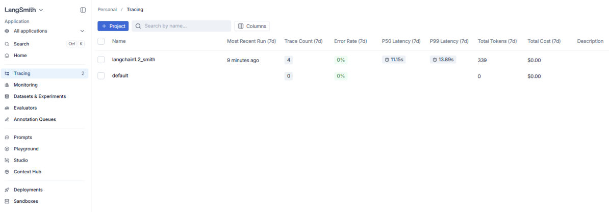
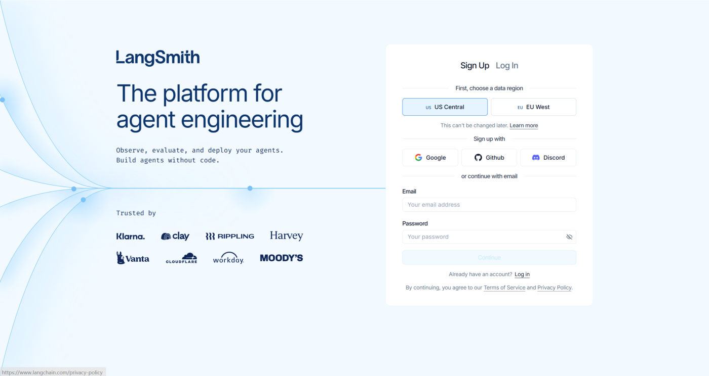
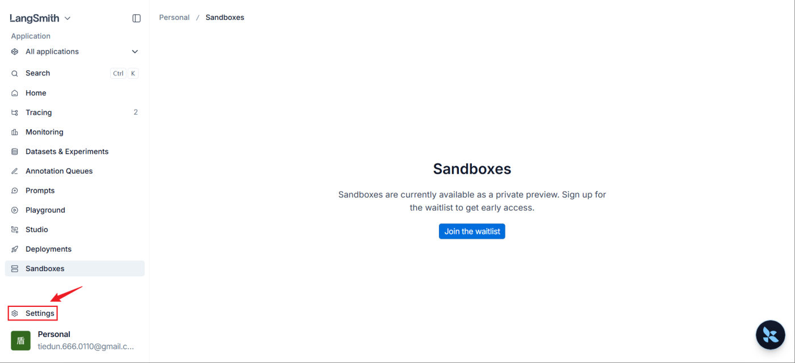
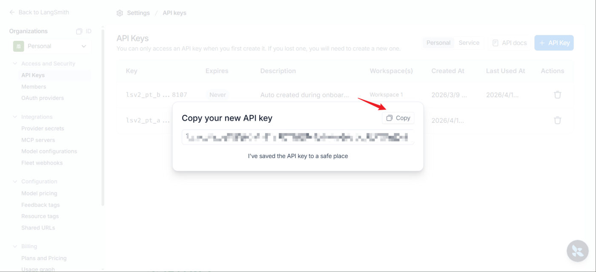
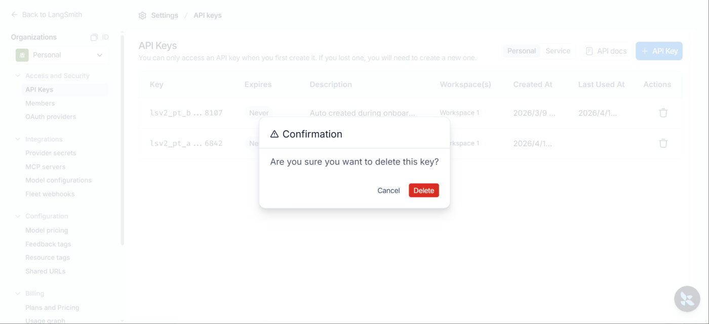
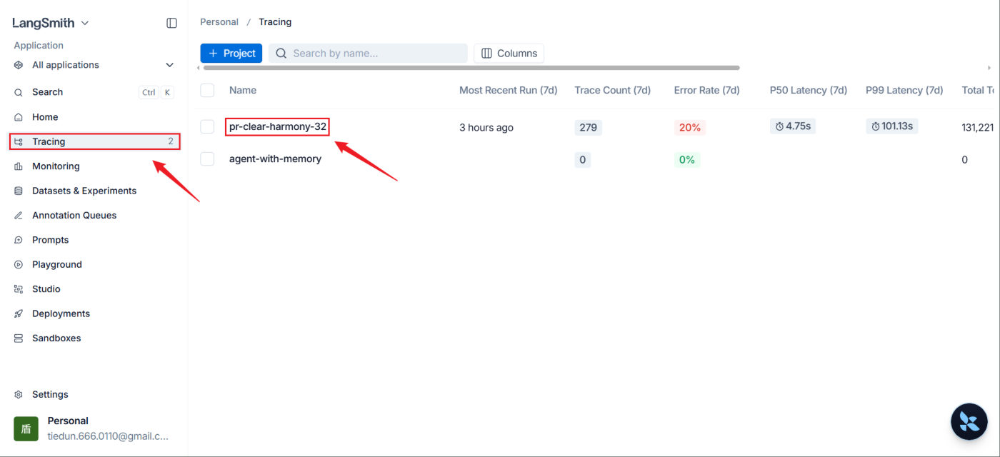
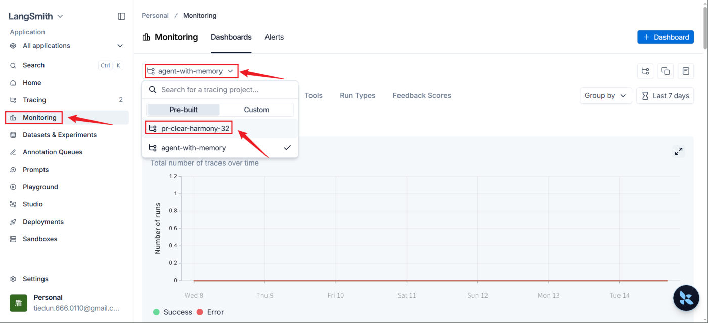

## LangSmith 是什么

当智能体系统逐渐复杂时，单靠 `print` 调试已经不够用了。**LangSmith 是 LangChain 官方推出的可视化监控与测试平台**，用于跟踪、记录和分析智能体运行过程中的**完整调用链路**，让内部运行过程变得透明、可评估。


*图：LangSmith 主界面——左侧菜单列全了 Tracing、Monitoring、Datasets、Playground、Studio 等功能*

核心目标：

| 目标 | 说明 |
| --- | --- |
| 全链路追踪 | 可视化追踪模型调用、提示词输入、结果输出、工具使用等行为 |
| 调试与优化 | 发现异常行为与性能瓶颈 |
| 评测与质量控制 | 支持人工与自动化评测 |
| 团队协作 | 多人共享测试集与调用记录 |

## 功能板块

按用途分三组：

### 一、开发与调试

| 功能 | 作用 |
| --- | --- |
| **Tracing（追踪）** | **最核心**。完整记录每一次调用的链路（Trace）：每一步的 Prompt 是什么、模型返回了什么、消耗多少 Token、每个节点耗时多久 |
| **Monitoring（监控）** | 生产环境看板：Token 消耗趋势、QPS、错误率、平均延迟、成本预估 |
| **Datasets & Experiments** | 管理测试数据集并运行对比实验 |
| **Evaluators（评估器）** | 自动评估输出质量 |
| **Annotation Queues（标注队列）** | 人工标注与复核 |

### 二、提示词工程

**Prompts**（提示词管理）、**Playground**（演练场，在线调提示词）、**Studio**（工作室，可视化调试）、**Context Hub**（上下文中心）。

### 三、部署运维

**Deployments**（部署）、**Sandboxes**（沙盒：轻量级在线运行与测试环境，不污染生产）。

> [!TIP]
> 新手的学习顺序建议：**现阶段重点看 Tracing（观察调用细节）和 Playground（快速调优提示词）**；等应用结构复杂了（复杂的 RAG 检索、多 Agent 协同），再引入 Datasets 做量化评估、用 Studio 做可视化调试。

## 功能板块细节

每个板块再展开说一遍，照着官方文档的功能说明对照着看：

**Tracing（追踪）**：LangSmith 最核心的功能，会完整记录大模型应用的**每一次调用链路（Trace）**。当 Agent 或 RAG 系统运行变慢或报错时，点进对应的项目（如 `langchain1.2_smith`），就能看到每一步的 **Prompt 是什么、模型返回了什么、消耗了多少 Token，以及每一个链条节点的耗时**，非常方便排查 Bug 和优化性能。

**Monitoring（监控）**：生产环境的高级数据可视化看板，从宏观角度监控应用在一段时间内的运行状况——**Token 消耗趋势、QPS（每秒请求数）、错误率、平均延迟（Latency）、成本预估**，适合应用上线后观察系统的稳定性与开销。

**Datasets & Experiments（数据集与实验）**：管理测试数据集并运行对比实验。可以把用户的真实输入、特定的边界情况（Edge Cases）存成数据集；当你改了 Prompt 或换了底层大模型，就在这里跑自动化对比测试，直观看到新旧版本在同一批测试集上的表现差异。

**Evaluators（评估器）**：配置和自动化评估任务。大模型的输出往往难以用传统的断言（Assert）来测试，这里允许你配置**基于规则**（如关键词匹配）或**基于模型**（**LLM-as-a-judge**，用一个模型当裁判）的评估指标——比如**答案相关性**、**是否包含幻觉**——对追踪到的数据或实验结果自动打分。

**Annotation Queues（标注队列）**：人工反馈与数据清洗工具。在应用开发或初上线阶段，可以把一部分痕迹（Traces）发送到标注队列，让团队中的核心成员、业务专家或人工客服**手动打分、纠正回答或贴标签**；这些高质量的人工标注数据后续**可以直接用于微调模型或充当测试集**。

**Prompts（提示词管理）**：类似"提示词版的 GitHub"。把 Prompt 从代码中解耦出来、统一在云端管理，支持**版本控制（如 v1、v2）**，可以直接在代码中**通过 API 动态拉取最新的提示词**，还支持团队协作与 Prompt 分享。

**Playground（演练场）**：一个网页端的模型交互界面。无需写任何代码，直接在这里选择不同的模型（如 OpenAI、Anthropic 或本地模型），快速微调并测试你的 Prompt 效果，还能**一键把调整好的 Prompt 保存到上方的 Prompts 仓库**中。

**Studio（工作室）**：通常与 **LangGraph 深度集成**，提供可视化的图形交互界面。如果应用是基于图结构（Graph-based）的复杂 Agent 架构，可以用它可视化地看到**状态机（State）在各个节点之间的流转**，甚至支持在某个节点**"暂停"**、手动修改数据后再继续向下执行，是调试复杂智能体交互的利器。

**Context Hub（上下文中心）**：管理全局上下文或通用组件配置，用于存放可在多个项目或 Prompt 中**复用的公共上下文模板、全局变量或系统预设提示**。

**Deployments（部署）**：一键把 LangChain 应用或 LangGraph Agent 部署为线上可用的 API 服务（通常依托 **LangGraph Cloud**），提供开箱即用的生产端点，帮你处理高并发、队列管理和状态持久化，让你专注写业务逻辑。

**Sandboxes（沙盒）**：提供轻量级的在线运行和测试环境，在**不污染生产环境**的前提下，供开发人员安全地试运行、测试新部署的 Agent 或执行自动化脚本。

## 准备账号与 API Key

1. 访问官网 https://smith.langchain.com/ 注册或登录


*图：注册 / 登录页面（注册时先选数据区域，之后不能改）*

2. 进入设置 → 创建 API Key


*图：左侧菜单最下方的 Settings 入口，进去就是 API Keys 页面*

3. **点 copy 保存好**：


*图：创建成功后的复制弹窗——API Key 只在这里显示一次*

> [!WARNING]
> API Key **只在创建弹窗里出现一次**，关掉弹窗后官网就再也看不到内容了（只能删除重建）。务必先复制保存。


*图：需要作废密钥时，点列表右侧的图标删除（删除前会二次确认）*

## 配置四个环境变量

在项目 `.env` 里加上：

```text
# 是否启用 LangSmith 监控功能
LANGSMITH_TRACING=true

# LangSmith 监控 WebUI 地址
LANGSMITH_ENDPOINT=https://api.smith.langchain.com

# 创建的 API_KEY
LANGSMITH_API_KEY=<YOUR_API_KEY>

# 自定义项目名称（在 WebUI 里按这个名字查看运行记录）
LANGSMITH_PROJECT="pr-clear-harmony-32"
```

| 变量 | 作用 |
| --- | --- |
| `LANGSMITH_TRACING` | 总开关，`true` 才会自动上报 |
| `LANGSMITH_ENDPOINT` | 上报地址（官方云端；自建部署时改成自己的地址） |
| `LANGSMITH_API_KEY` | 身份凭证 |
| `LANGSMITH_PROJECT` | **项目名**，相当于"文件夹"，用来区分不同项目的运行记录 |

> [!IMPORTANT]
> 这四个变量只放在 `.env` 里即可，**代码一行都不用改**——LangChain 会自动读取它们并上报。这就是它的好用之处：**给现有程序装上"行车记录仪"，代码零侵入**。

## 查看监控指标

只要 `.env` 配好，跑**任意** LangChain 程序就会自动记录：

```python
import os
from dotenv import load_dotenv
from langchain.chat_models import init_chat_model

load_dotenv(override=True)      # 把 .env 里的变量加载为环境变量（override=True 表示 .env 优先）

model = init_chat_model(
    model="deepseek-v4-flash",
    model_provider="openai",
    base_url=os.getenv("DEEPSEEK_BASE_URL"),
    api_key=os.getenv("DEEPSEEK_API_KEY"),
)

print(model.invoke("你好"))
```

运行后到 LangSmith 官网，进入 `LANGSMITH_PROJECT` 指定的项目，就能看到这次调用的完整链路（输入提示词、模型返回、Token 消耗、耗时）。


*图：Tracing 界面里按 LANGSMITH_PROJECT 命名的项目，Trace Count / 延迟 / Token / 成本一目了然*

> [!TIP]
> 有了它，"模型为什么答错了"这类问题就不用靠猜了：点开那条 trace，能直接看到**实际发出去的完整提示词**——八成问题都出在你以为发了什么、实际发了什么不一样。


*图：Monitoring 界面的运行报表——可切换项目，按标签查看一段时间内的调用趋势*

### 继续往下看：详情页与运行报表

- **步骤 3：查看运行指标**——在 Tracing 界面**点击条目的任意位置**即可进入详情页，这里列出了详细的运行指标；再点某一次运行记录，还能查看更详细的信息（自己探索即可）。
- **步骤 4：查看运行报表**——Monitoring 页面（上图）提供了大量指标的报表，**点击标签或向下滑动页面**即可切换指标。

## 上报姿势与 config 用法

课程演示了三种调用姿势，都能被 LangSmith 自动记录——**代码里没有任何 LangSmith 相关调用，全靠 `.env` 里的四个变量**。

**姿势 1：直接用专用类 `ChatDeepSeek`**

```python
import os
from dotenv import load_dotenv
from langchain_deepseek import ChatDeepSeek

# 将env文件中的变量加载为环境变量
# override=True：表示.env优先
load_dotenv(override=True)

DEEPSEEK_API_KEY = os.getenv("DEEPSEEK_API_KEY")
DEEPSEEK_BASE_URL = os.getenv("DEEPSEEK_BASE_URL")

model = ChatDeepSeek(
    api_key=DEEPSEEK_API_KEY,
    api_base=DEEPSEEK_BASE_URL,
    model_name="deepseek-v4-flash"
)
print(model.invoke("你好"))
```

**姿势 2：`init_chat_model` + CloseAI 中转平台**

```python
from langchain.chat_models import init_chat_model
from dotenv import load_dotenv
import os

load_dotenv(override=True)
CLOSEAI_API_KEY = os.getenv("CLOSEAI_API_KEY")
CLOSEAI_BASE_URL = os.getenv("CLOSEAI_BASE_URL")

model = init_chat_model(model="deepseek-v4-flash",
                        model_provider="openai",
                        api_key=CLOSEAI_API_KEY,
                        base_url=CLOSEAI_BASE_URL)
print(model.invoke("你好，用一句话回答"))
```

**姿势 3：带 config 的完整姿势（推荐）**

给这次运行起个名字、打上标签、带上业务元数据，在 LangSmith 里就好找多了：

```python
from langchain.chat_models import init_chat_model
from dotenv import load_dotenv
import os
from rich import print as rprint

# 从.env文件中加载环境变量
load_dotenv(override=True)
DEEPSEEK_API_KEY = os.getenv("DEEPSEEK_API_KEY")
DEEPSEEK_BASE_URL = os.getenv("DEEPSEEK_BASE_URL")

# 1. 初始化模型
model = init_chat_model(
    model="deepseek-v4-flash",
    model_provider="deepseek",
    api_key=DEEPSEEK_API_KEY,
    api_base=DEEPSEEK_BASE_URL,          # ← provider="deepseek" 时用 api_base，不是 base_url！
    temperature=0.2,
    max_tokens=500,
    # 指定可调整参数
    configurable_fields=("model", "model_provider", "temperature", "max_tokens"),
)

# 2. 准备 config 字典
config = {
    "run_name": "joke_generation",     # 在LangSmith中这次运行会显示为 joke_generation
    "tags": ["my_tag1", "my_tag2"],    # 打上标签便于分类查找
    "metadata": {
        "user_id": "shkstart",         # 记录用户ID
        "session_id": "sess_123"       # 记录会话ID
    },
    "configurable": {
        "model": "deepseek-v4-pro",    # 配置模型参数
        "model_provider": "openai",    # 配置模型提供商参数
        "temperature": 0.7,            # 配置温度参数
        "max_tokens": 1000             # 配置最大令牌数
    }
}

# 3. 调用模型并传入config
response = model.invoke("1 + 2 = ？", config=config)
rprint(response)
```

> [!TIP]
> `run_name`、`tags`、`metadata` 这三个都是**给 LangSmith 看的**：`run_name` 让运行列表可读（默认显示的是方法名，看不出业务含义），`tags` 方便按标签过滤，`metadata` 里的 `user_id` / `session_id` 能把一次调用对应到具体用户和会话——线上排查"某个用户投诉的那次回答"时特别有用。
>
> 记得：`config["configurable"]` 里能覆盖哪些参数，取决于初始化时的 **`configurable_fields`**。config 各配置项的完整说明见「模型的调用」笔记。

> [!WARNING]
> **`model_provider="deepseek"` 时不要用 `base_url`**。课程讲义这一处写的是 `base_url=...`，**本机实测这个参数会被静默忽略**——`init_chat_model(model_provider="deepseek", base_url="...")` 拿到的 `ChatDeepSeek` 里 `api_base` 仍是官方地址 `https://api.deepseek.com/v1`，请求会打到 DeepSeek 官方接口（而不是你的中转/本地服务）。正确参数名是 **`api_base`**（和「模型的创建」笔记里"别把变量名当参数名写"是同一类坑）。
> 用 `model_provider="openai"` 走 OpenAI 兼容协议时，才用 `base_url`。

## 相关

- [模型的创建](/posts/编程学习/langchain学习笔记/04-模型的创建/)
- [Message与提示词模板](/posts/编程学习/langchain学习笔记/07-message与提示词模板/)

## 练习题

### 一、回忆填空（写完再展开对答案）

1. LangSmith 是 LangChain 官方的可视化 ____ 与 ____ 平台；它的核心目标是：全链路 ____、____ 与优化、评测与 ____、团队 ____
2. 最核心的板块是 ____：完整记录每一次调用的链路，能看到每一步的 ____ 是什么、模型返回了什么、消耗多少 ____、每个节点 ____
3. Monitoring 是生产环境看板，能看 ____ 消耗趋势、____（每秒请求数）、____、平均 ____、____ 预估
4. Datasets & Experiments 用来管 ____ 并跑对比实验；Evaluators 支持 ____（如关键词匹配）和 ____（用一个模型当裁判）两种评估；Annotation Queues 是 ____ 工具，人工标注的数据还能拿去 ____ 或当测试集
5. 提示词工程四件套：____（"提示词版的 GitHub"，支持 ____ 控制，可被代码动态拉取）、____（网页端调提示词，能一键存回仓库）、____（与 LangGraph 深度集成，能看状态机流转、还能中途 ____）、____（存放可复用的公共上下文/全局变量）
6. 部署运维两块：____ 一键把应用部署成线上 API 服务（依托 ____）；____ 提供不污染生产的轻量测试环境
7. 新手学习顺序：现阶段重点看 ____ 和 ____；等应用结构复杂了（RAG、多 Agent），再引入 Datasets 做量化评估、用 Studio 做可视化调试
8. 注册时要选数据 ____（之后不能改）；API Key 只在创建弹窗里显示 ____ 次，必须当场复制
9. 四个环境变量：____（总开关，`true` 才上报）、____（上报地址）、____（身份凭证）、____（项目名，相当于"文件夹"）；它们只写在 ____ 里，代码 ____（需要 / 不需要）改动
10. 三种上报姿势：直接用 ____、用 ____（中转/换平台场景）、以及带上 ____ 的完整姿势；给 Trace 打标的三件套是 ____（运行名，默认只显示方法名、看不出业务含义）、____（便于按标签过滤）、____（业务上下文，如用户 ID / 会话 ID）；想让 config 里的覆盖生效，初始化时必须用 ____ 声明

> [!TIP]- 填空答案（做完再点开）
> 1. 监控 / 测试；追踪 / 调试 / 质量控制 / 协作　2. Tracing（追踪）/ Prompt（提示词）/ Token / 耗时　3. Token / QPS / 错误率 / 延迟（Latency）/ 成本　4. 测试数据集 / 基于规则 / 基于模型（LLM-as-a-judge）/ 人工标注与复核 / 微调模型　5. Prompts / 版本（v1、v2）/ Playground / Studio / 暂停（改完数据再继续）/ Context Hub　6. Deployments / LangGraph Cloud / Sandboxes　7. Tracing / Playground　8. 区域 / 一　9. `LANGSMITH_TRACING` / `LANGSMITH_ENDPOINT` / `LANGSMITH_API_KEY` / `LANGSMITH_PROJECT` / `.env` / 不需要　10. 专用类 / `init_chat_model` / `config`；`run_name` / `tags` / `metadata` / `configurable_fields`

### 二、裸写题

- [ ] **2-1 接通 LangSmith（配置自检 + 一次最小调用）**
  在项目 `.env` 里补齐 LangSmith 需要的四个环境变量（开关、上报地址、密钥、项目名）；然后写一段代码：① 检查这四个变量是否都齐全，缺哪个就打印哪个；② 创建一个模型并调用一句"你好"，打印回复和 token 用量；③ 代码里不允许出现任何 LangSmith 相关的调用；④ 跑完到官网对应项目里找到这次 Trace。

  > [!TIP]- 提示（先自己想，实在想不出再点开）
  > **一级 · 思路**：四样东西——总开关、上报地址、钥匙、项目名；代码侧只负责「加载 .env + 正常调用」
  > **二级 · 方法**：`LANGSMITH_TRACING` / `LANGSMITH_ENDPOINT` / `LANGSMITH_API_KEY` / `LANGSMITH_PROJECT`；`load_dotenv(override=True)`
  > **三级 · 骨架**：`missing = [k for k in REQUIRED if not os.getenv(k)]`；官网按 `LANGSMITH_PROJECT` 的名字找项目

- [ ] **2-2 给 Trace 打标（让记录"能找得到"）**
  在同一次调用上做三件事：① 给这次运行起一个可读的名字；② 打上两个便于分类的标签；③ 带上业务元数据（用户 ID + 会话 ID）。运行后说明：在官网里分别怎么按名称找、按标签筛、在哪里看元数据。

  > [!TIP]- 提示
  > **一级 · 思路**：这三样都是"给 LangSmith 看的"，通过调用时的运行时配置传进去
  > **二级 · 方法**：`model.invoke("...", config={"run_name": ..., "tags": [...], "metadata": {...}})`
  > **三级 · 骨架**：`config = {"run_name": "joke_generation", "tags": ["my_tag1"], "metadata": {"user_id": "..."}}`

- [ ] **2-3 开关实验（理解"零侵入"）**
  写一段代码：先判断并打印"这次运行会不会被上报"，再照常调用一次模型。然后把 `.env` 里的总开关分别设为开和关各跑一次，对比官网的记录数量，说明代码本身有没有变化。

  > [!TIP]- 提示
  > **一级 · 思路**：总开关就是一个环境变量，它只影响"是否上报"，不影响本地功能
  > **二级 · 方法**：读 `os.getenv("LANGSMITH_TRACING")`，用 `in ("true", "1", "yes")` 判断
  > **三级 · 骨架**：`tracing_on = (os.getenv("LANGSMITH_TRACING") or "").lower() in ("true", "1", "yes")`，其余代码一个字都不用改

- [ ] **2-4 运行时覆盖模型参数**
  初始化模型时用低温度、小 token 上限创建，并声明"哪些参数允许在运行时替换"；调用时用运行时配置把模型换掉、温度调高、token 上限调大；最后从返回值的元数据里确认"实际生效的是哪个模型"，并说明如果初始化时没做那步声明会怎样。

  > [!TIP]- 提示
  > **一级 · 思路**：初始化参数是"默认值"，运行时配置优先级更高，但覆盖范围要先声明
  > **二级 · 方法**：`init_chat_model(..., configurable_fields=("model", "model_provider", "temperature", "max_tokens"))` + `config={"configurable": {...}}`
  > **三级 · 骨架**：调用后看 `response.response_metadata["model_name"]` 验证；没声明 `configurable_fields` 时覆盖不会生效

> [!TIP]- 参考答案（做完再点开）
> ```python
> # ========== 2-1 接通 LangSmith（配置自检 + 一次最小调用） ==========
> import os
> from dotenv import load_dotenv
> from langchain.chat_models import init_chat_model
>
> load_dotenv(override=True)
>
> # ① 配置自检：LangSmith 只看这四个环境变量，缺哪个就报哪个
> REQUIRED = ["LANGSMITH_TRACING", "LANGSMITH_ENDPOINT", "LANGSMITH_API_KEY", "LANGSMITH_PROJECT"]
> missing = [name for name in REQUIRED if not os.getenv(name)]
> if missing:
>     print("还缺这些变量，先去 .env 里补齐：", missing)
> else:
>     print("四个变量都齐了：TRACING=%s，PROJECT=%s，ENDPOINT=%s" % (
>         os.getenv("LANGSMITH_TRACING"), os.getenv("LANGSMITH_PROJECT"),
>         os.getenv("LANGSMITH_ENDPOINT")))
>
> # ② 最小调用：代码里一行 LangSmith 相关调用都不写
> model = init_chat_model(
>     model="deepseek-v4-flash",
>     model_provider="openai",
>     base_url=os.getenv("DEEPSEEK_BASE_URL"),
>     api_key=os.getenv("DEEPSEEK_API_KEY"),
> )
> response = model.invoke("你好")
> print("回复:", response.content)
> print("token 用量:", response.usage_metadata)
> # ③ 到 https://smith.langchain.com/ 进入 LANGSMITH_PROJECT 指定的项目，就能看到这次调用
>
>
> # ========== 2-2 给 Trace 打标 ==========
> config = {
>     "run_name": "joke_generation",          # 运行列表里显示的名字（默认只显示方法名）
>     "tags": ["my_tag1", "my_tag2"],         # 便于按标签过滤
>     "metadata": {                           # 业务上下文：能定位到具体用户/会话
>         "user_id": "shkstart",
>         "session_id": "sess_123",
>     },
> }
> response = model.invoke("1 + 2 = ？", config=config)
> print("回复:", response.content)
> # 官网怎么看：Tracing 列表里按名称找 joke_generation；用 tag = my_tag1 筛；
> # 点进条目详情，Metadata 里能看到 user_id / session_id
>
>
> # ========== 2-3 开关实验 ==========
> tracing_on = (os.getenv("LANGSMITH_TRACING") or "").strip().lower() in ("true", "1", "yes")
> print("LANGSMITH_TRACING =", os.getenv("LANGSMITH_TRACING"))
> print("→ 这次运行", "会" if tracing_on else "不会", "被上报到 LangSmith")
>
> response = model.invoke("你好，用一句话回答")
> print("回复:", response.content)
> # 实验：开关设 true 跑一次（官网新增一条 Trace）→ 改成 false 再跑一次（官网不新增，
> # 但本地功能一切正常）→ 记得改回 true。两次运行，代码一个字都没改。
>
>
> # ========== 2-4 运行时覆盖模型参数 ==========
> model = init_chat_model(
>     model="deepseek-v4-flash",
>     model_provider="openai",
>     base_url=os.getenv("DEEPSEEK_BASE_URL"),
>     api_key=os.getenv("DEEPSEEK_API_KEY"),
>     temperature=0.2,
>     max_tokens=500,
>     # 声明哪些参数允许在运行时替换（不声明的话，config 里的覆盖不会生效）
>     configurable_fields=("model", "model_provider", "temperature", "max_tokens"),
> )
>
> config = {
>     "run_name": "joke_generation",
>     "tags": ["my_tag1", "my_tag2"],
>     "metadata": {"user_id": "shkstart", "session_id": "sess_123"},
>     "configurable": {
>         "model": "deepseek-v4-pro",     # 覆盖初始化时的模型
>         "temperature": 0.7,             # 覆盖初始化时的温度
>         "max_tokens": 1000,
>     },
> }
>
> response = model.invoke("1 + 2 = ？", config=config)
> rm = response.response_metadata
> print("实际生效的模型:", rm.get("model_name"), "｜提供商:", rm.get("model_provider"))
> # 结论：初始化参数只是默认值，config 里的覆盖会赢（前提是 configurable_fields 声明过）
> ```