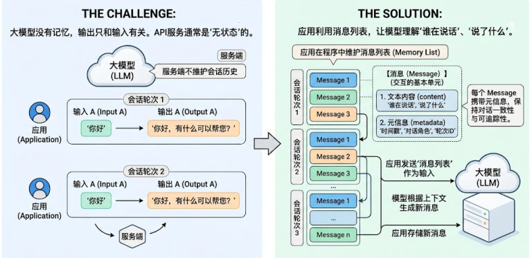
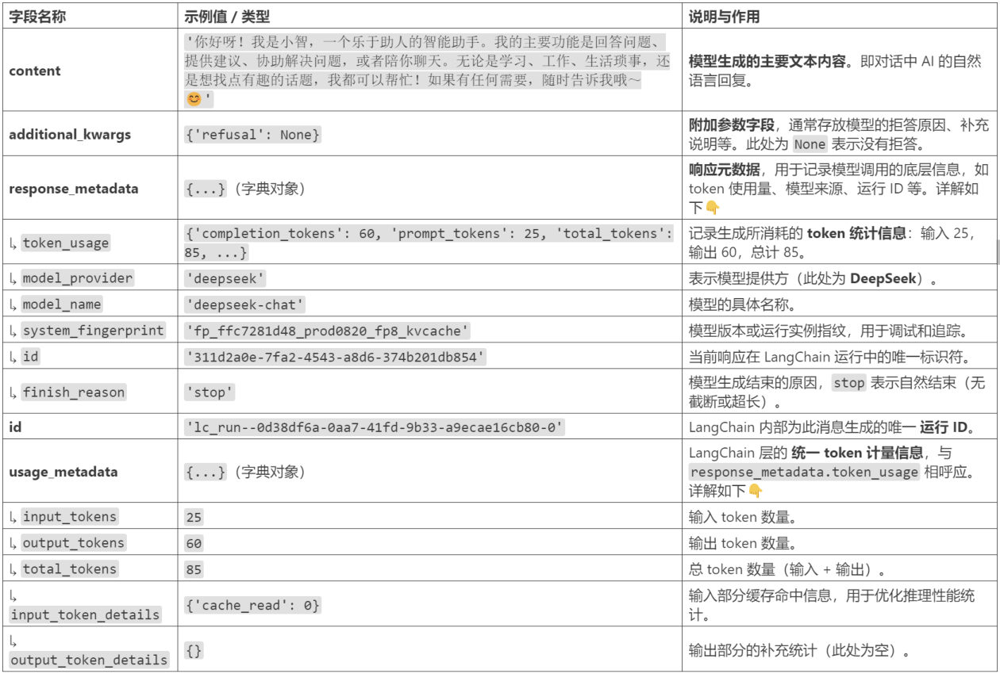
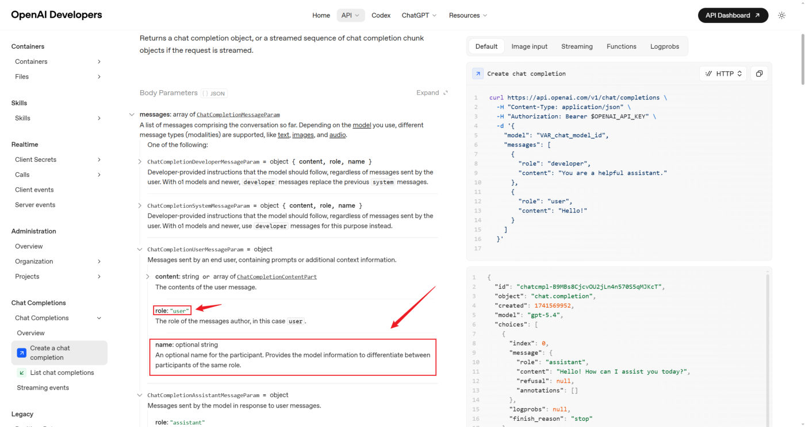
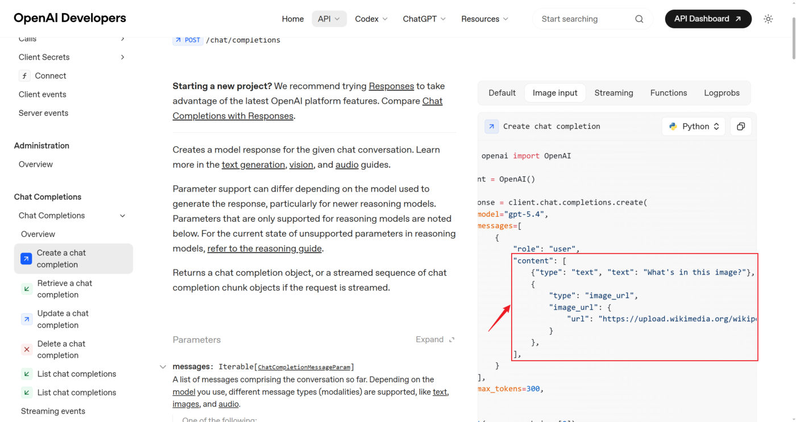
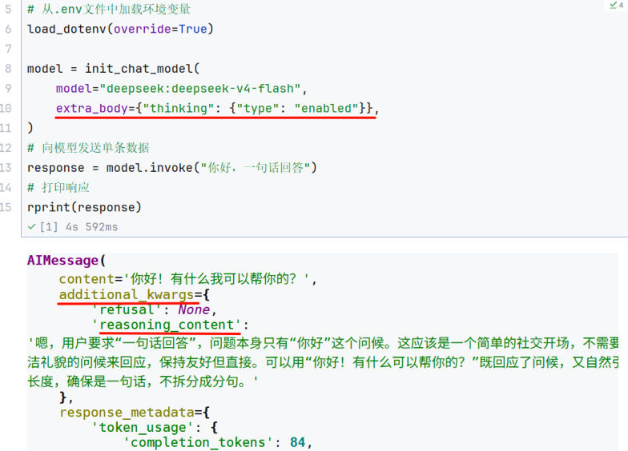

## 为什么需要 Message

大模型**没有记忆**，它的输出只和"输入的上下文"有关；很多大模型 API 服务也**不在服务端维护会话历史**（就是第 3 章学过的：无状态）。**如果应用需要"记住"对话，就得在程序里自己维护消息列表。**

在 LangChain 中，**Message（消息）是模型交互的最基本单元**：它既代表模型的**输入**，也代表模型生成的**输出**。每条消息不仅包含文字内容，还携带描述上下文状态的**元信息（metadata）**——这样模型才能理解"谁在说话""说了什么""属于哪一轮"。

LangChain 1.0 提供了**跨模型统一的 Message 标准**（OpenAI / Anthropic / Gemini / 本地模型行为一致），好处：

| 好处 | 说明 |
| --- | --- |
| 兼容性强 | 不同模型的消息格式自动对齐 |
| 可扩展性高 | 方便添加多模态内容或自定义字段 |
| 可追踪性好 | 为 LangSmith 等调试工具提供一致的上下文结构 |


*图：左边是"挑战"（大模型没有记忆、服务端不维护历史），右边是"方案"（应用维护消息列表）*

## 消息的内部结构

| 字段 | 说明 |
| --- | --- |
| **Role** | 消息所属的角色或类型：`system`、`user`、`assistant`（还有 `tool`） |
| **Content** | 消息内容 |
| **Metadata** | （可选）元数据：消息 ID、响应时间、token 消耗量、消息标签等 |


*图：模型返回的 AIMessage 字段解析（content、additional_kwargs、response_metadata、usage_metadata）*

## 四种消息类型

| 类型 | 角色 | 作用 | JSON 写法 |
| --- | --- | --- | --- |
| 系统消息 | `system` | 系统提示词：设定角色、行为准则、上下文背景（像给 AI 的"工作说明书"） | `{"role": "system", "content": "你是个精通编程的软件架构师"}` |
| 用户消息 | `user` | 用户的一次输入，可含多模态内容（图片、音频、文档等） | `{"role": "user", "content": "你好啊~"}` |
| 助手消息 | `assistant` | 模型的回复：文本、**工具调用**、元数据 | `{"role": "assistant", "content": "我也很高兴认识你"}` |
| 工具调用消息 | `tool` | 工具执行结果，回传给模型让它接着生成（第 5 章详解） | `{"role": "tool", "content": "今天天气很好", "tool_call_id": "call_00_..."}` |

助手消息里如果模型要调工具，长这样：

```json
{
  "role": "assistant",
  "content": "",
  "tool_calls": [
    {
      "name": "get_weather",
      "args": {"location": "北京"},
      "id": "call_00_nUD2NC9QRN5Cg1GaoIkBJQ4s"
    }
  ]
}
```

> [!NOTE]
> `ToolMessage` 里的 `tool_call_id` **必须和 AI 消息里那次调用的 `id` 匹配**，否则模型不知道"这个结果对应哪个请求"。

**为什么要区分消息类型？** ① 明确角色 ② 通过 system 精确控制 AI 行为 ③ 构建完整的多轮上下文 ④ 更容易追踪和调试。

### 两种格式：JSON 与对象

| 消息 | JSON 格式 | 对象格式 |
| --- | --- | --- |
| 系统 | `{"role": "system", "content": "..."}` | `SystemMessage(content="...")` |
| 用户 | `{"role": "user", "content": "..."}` | `HumanMessage(content="...")` |
| 助手 | `{"role": "assistant", "content": "..."}` | `AIMessage("...")` |
| 工具 | `{"role": "tool", "content": "...", "tool_call_id": "..."}` | `ToolMessage(content="...", tool_call_id="...")` |

> [!TIP]
> **JSON 字典格式**更通用（易序列化、易存文件、易走网络）；**对象格式**能携带更丰富的类型信息（如 `tool_calls`、`content_blocks`）。日常用字典就够了，需要精细控制时用对象。

### 各消息类型的参数列表

四种消息类型都构造完了，再把每一类**常用字段**过一遍——**此处仅说明常用字段，完整字段列表查阅官方手册或阅读源码**。

| 消息类型 | 常用字段 | 说明 |
| --- | --- | --- |
| `SystemMessage` | `content` | 消息内容，字段名可以省略 |
| `HumanMessage` | `content` / `metadata`（含 `name`、`id`） | 内容同上；`name`、`id` 用来区分发言者 |
| `AIMessage` | `content` / `response_metadata` / `tool_calls` / `usage_metadata` | 后三个是 `AIMessage` 特有属性 |
| `ToolMessage` | `content` / `name` / `tool_call_id` | 必须紧邻匹配的那条 `AIMessage` |

**SystemMessage**：只有 `content`，且字段名可以省略。

```python
SystemMessage("你是个善解人意的助手")
# 等价于
SystemMessage(content="你是个善解人意的助手")
```

**HumanMessage**：除了 `content`，还有 `metadata` 元数据字段——可以有很多、**完全自定义**。最常用的是 `name` 和 `id`：

```python
HumanMessage(
    content="Hello!",
    name="alice",      # 可选，用户名
    id="msg_123",      # 可选，message 的 ID
)
```

`name` 和 `id` 都属于**元数据字段**，作用是**当消息类型相同**时把不同消息区分开。但**不是所有模型都支持这一功能**，是否支持取决于模型供应商，需要查官方手册——比如 OpenAI 的 API 手册就明确写了 `name` 是 `ChatCompletionUserMessageParam` 的字段：


*图：OpenAI 官方 API 手册中的 name 参数——"为同一 role 的参与者提供区分信息"*

课程用 CloseAI 平台的 `gpt-5.4-mini` 演示了 `name` 的作用——**多人对话的发言者抽取**：

```python
from langchain_core.messages import SystemMessage, HumanMessage, AIMessage
from langchain.chat_models import init_chat_model
from dotenv import load_dotenv
import os

load_dotenv(override=True)

model = init_chat_model(
    model="gpt-5.4-mini",
    model_provider="openai",
    api_key=os.getenv("CLOSEAI_API_KEY"),
    base_url=os.getenv("CLOSEAI_BASE_URL"),
)

messages = [
    SystemMessage(
        "你是一个信息抽取器。你会收到多条来自不同发言者的 user 消息。每条消息可能带有 name 字段。"
        "你的任务是：严格根据每条消息的 name 提取发言者及其观点，并输出 JSON。"
        "禁止使用“第一个人/第二个人”这种相对称呼。若某条消息没有 name，则输出 unknown。"
        '输出格式：{"speakers":[{"name":"...","claim":"..."}]}'
    ),
    HumanMessage(content="我认为 1+1=2", name="Bob"),
    HumanMessage(content="我认为 1+1>2", name="Tom"),
    HumanMessage(content="请列出谁说了什么，不要判断对错。", name="audience"),
]

response = model.invoke(messages)
print(response.content)
```

输出——模型读到并利用了 `name` 传递的信息：

```json
{"speakers":[{"name":"Bob","claim":"我认为 1+1=2"},
             {"name":"Tom","claim":"我认为 1+1>2"},
             {"name":"audience","claim":"请列出谁说了什么，不要判断对错。"}]}
```

> [!WARNING]
> **`name` 能不能生效，取决于"客户端有没有传"和"服务端认不认"两件事。**
> - 课程拓展：用 `ChatOpenRouter` 调用时，**name 没有正确传给模型服务**——同样的代码，输出里全是 `unknown`。
> - **本机实测（`ChatDeepSeek` + 假服务端抓请求体）**：`name` **确实被发出去了**（`{"content": "Hello!", "name": "alice", "role": "user"}`），但同一个消息里的 **`id` 没有出现在请求体中**——`id` 只是**本地标识**，用于自己追踪消息，模型看不到。
>
> 所以"模型不认识 `name`"时，先分清是哪一环的问题：**LangChain 客户端有没有传 → 平台有没有转发 → 模型认不认**。课程实测的 DeepSeek 属于第三环（官方文档声明支持，实测无法识别）。

**AIMessage**：`content` 是模型输出的原始内容（字段名可省）；另外三个是它**特有**的属性——`response_metadata`（响应附加元数据，不同模型内容不同，可能含 token 用量）、`tool_calls`（工具调用信息，没调用时为空）、`usage_metadata`（用量信息）。

`tool_calls` 是一个 **ToolCall 列表**，每个 ToolCall 是字典，四个字段：

```python
tool_calls = [
    {
        "name": "get_weather",                            # 应调用的工具名
        "args": {"city": "杭州"},                          # 调用工具的参数
        "id": "call_00_gIXYOD1Q1OkEXmdDBqXR1578",          # 工具调用的唯一标识 ID
        "type": "tool_call",
    },
    {
        "name": "get_news",
        "args": {},
        "id": "call_01_jD3phD5PEaIZf0mVLhKt0861",
        "type": "tool_call",
    },
]
```

两个典型场景对照着看：

```python
# 举例1：给出最终答案
AIMessage(content="北京今天晴天，温度 15°C")

# 举例2：调用工具（content 通常是空的）
AIMessage(
    content="",
    tool_calls=[{
        "name": "get_weather",
        "args": {"city": "北京"},
        "id": "call_xxx",
    }],
)

# 举例3：手工构造工具调用后，交给模型接着算
response = model.invoke([
    HumanMessage(content="北京天气如何"),
    AIMessage(content="", tool_calls=[{
        "name": "get_weather", "args": {"city": "北京"}, "id": "call_00_..."}]),
    ToolMessage(content="今天北京天气晴朗，万里无云~", tool_call_id="call_00_..."),
])
print(response.content)     # 今天北京天气晴朗，万里无云。
```

**ToolMessage**：三个字段——`content`（工具输出内容）、`name`（工具名称）、`tool_call_id`（工具调用唯一 ID）。

```python
ToolMessage(
    content="<工具输出>",
    name="get_weather",
    tool_call_id="call_00_nUD2NC9QRN5Cg1GaoIkBJQ4s",   # 一定要和 AI 消息中的调用 ID 匹配
)
```

> [!WARNING]
> **`ToolMessage` 必须紧邻匹配的那条 `AIMessage`**：顺序是 `[AIMessage(tool_calls), ToolMessage]`，中间的 `tool_call_id` 要和前者 `tool_calls` 里的 `id` 一致。
> **实测补充**：客户端**不做本地校验**——把 `ToolMessage` 放到 `AIMessage` 前面、或写成不匹配的 `tool_call_id`，LangChain 都会**原样发给服务端**（用假服务端抓请求体可以看到 `role: "tool"` 照样发出去），报错要等服务端返回。所以顺序错了不会在本地被拦住，只会得到一个"莫名其妙的远程报错"。

## content 与 content_blocks

### content：弱类型

`content` 支持**字符串**和**列表**（列表元素通常是字典）：

```python
from langchain.messages import HumanMessage

msg1 = HumanMessage(content="你好啊")
msg2 = HumanMessage("你好啊")        # 只有纯字符串时，可以省略参数名

# 多模态（图片/音频）就用字典列表，具体格式遵循模型供应商的 API 规范
```


*图：OpenAI 官方文档里 content 的字典列表写法（text + image_url 两种 block）*


*图：多模态示例中发给模型的测试图片（课程里保存为 image_test.png）*

### 多模态实战：字典列表到底怎么写

**关键规则：字典里写什么内容、用什么键，遵循的是"模型供应商的 API 规范"**（OpenAI 的写法当然是 OpenAI 说了算）。以 `gpt-4.1` 为例，把下面这张图放到代码所在目录（比如 `chapter04_message_prompt/image_test.png`），然后：

```python
import base64
from langchain.chat_models import init_chat_model
from langchain.messages import HumanMessage
from dotenv import load_dotenv
import os

load_dotenv(override=True)

model = init_chat_model(
    model="gpt-5.4-mini",
    model_provider="openai",
    api_key=os.getenv("CLOSEAI_API_KEY"),
    base_url=os.getenv("CLOSEAI_BASE_URL"),
)

def encode_image(img_path, img_type="jpeg"):
    """将一张本地图片转换成 Base64 编码的 Data URI 字符串，方便在文本中嵌入图片数据"""
    with open(img_path, "rb") as img_file:
        return f"data:image/{img_type};base64,{base64.b64encode(img_file.read()).decode('utf-8')}"

img_path = "image_test.png"
base64_image = encode_image(img_path)          # 得到 "data:image/jpeg;base64,...."

response = model.invoke(
    [
        HumanMessage(
            content=[
                {"type": "text", "text": "这张图里有什么？"},
                {
                    "type": "image_url",
                    "image_url": base64_image,      # Data URI 字符串直接放进来
                },
            ]
        )
    ]
)
print(response.content)
```

> [!NOTE]
> `encode_image()` 做了两件事：**读文件 → Base64 编码 → 拼成 Data URI**。`image_url` 的值就是这个 `data:image/xxx;base64,...` 字符串——**它和"URL 链接"是同一条通路**，服务端要么去下载 URL，要么直接解码 Data URI。
> 参数 `img_type` 默认写死 `"jpeg"`，而示例图片是 PNG——所以严格来说应该传 `encode_image(img_path, "png")`，前缀要和真实格式对上。

### content_blocks：1.x 的重大升级

在 LangChain 1.x 中，`content_blocks` 是消息对象的一项**重大升级**：提供跨模型供应商、**标准化的多模态数据结构**。

过去处理图片、音频甚至模型的"思维链（Reasoning）"时，各厂商格式各异，要写大量适配代码；`content_blocks` 终结了这种混乱。


*图：DeepSeek 思考模式的输出——思考内容藏在 additional_kwargs 的 reasoning_content 字段里*

- 数据结构：`list[TypedDict]`
- 统一格式：**每个 block 都有 `type` 字段**区分内容类型
- 支持类型：`text`、`image`、`audio`、`video`、`tool_call`、`reasoning`

> [!IMPORTANT]
> 1.2 里 `content` 依然存在（向前兼容），但新增了 `content_blocks`，把 `content` 解析为**标准、类型安全**的表示。**带图片或工具结果的复杂对话，建议用 `content_blocks` 构建**——一套标准代码无缝切换不同厂商的模型。
>
> 支持的字段类型详见官方文档：<https://docs.langchain.com/oss/python/langchain/messages#openai>

### 用法①：输入格式化（一套代码跨厂商）

对复杂的对话（带图片或工具结果），**建议直接用 `content_blocks` 列表形式**构建 `HumanMessage` / `AIMessage`——从此不用再记各家的键名。同一段代码，换个模型就行：

**OpenAI 模型（`gpt-5.4-mini`）**

```python
import base64
from langchain.messages import HumanMessage
from langchain.chat_models import init_chat_model
from dotenv import load_dotenv
import os

load_dotenv(override=True)

model = init_chat_model(
    model="gpt-5.4-mini",
    model_provider="openai",
    api_key=os.getenv("CLOSEAI_API_KEY"),
    base_url=os.getenv("CLOSEAI_BASE_URL"),
)

def encode_image(img_path):
    """将一张本地图片转换成 Base64 字符串（这里不带 Data URI 前缀）"""
    with open(img_path, "rb") as img_file:
        return base64.b64encode(img_file.read()).decode("utf-8")

base64_image = encode_image("image_test.png")

response = model.invoke(
    [
        # 老写法（按供应商规范拼字典，能用但要记格式）
        # HumanMessage(content=[
        #     {"type": "text", "text": "这张图里有什么？"},
        #     {"type": "image_url", "image_url": base64_image},
        # ]),
        # 推荐的统一写法
        HumanMessage(
            content_blocks=[
                {"type": "text", "text": "这张图里有什么？"},
                {
                    "type": "image",
                    "base64": base64_image,
                    "mime_type": "image/png",
                },
            ]
        )
    ]
)
print(response.content)
```

**Anthropic 模型（`claude-haiku-4-5`）**——**代码结构完全一样，只换了模型名**：

```python
model = init_chat_model(
    model="claude-haiku-4-5",
    model_provider="openai",
    api_key=os.getenv("CLOSEAI_API_KEY"),
    base_url=os.getenv("CLOSEAI_BASE_URL"),
)

response = model.invoke(
    [
        HumanMessage(
            content_blocks=[
                {"type": "text", "text": "这张图里有什么？"},
                {
                    "type": "image",
                    "base64": base64_image,
                    "mime_type": "image/png",
                },
            ]
        )
    ]
)
```

两者对同一张图的回答（一个说"香水、金色瓶盖、暖色背景"，另一个说"化妆品或香水、玻璃瓶、光影效果"）——**格式统一，语义各自发挥**。

> [!WARNING]
> 两种写法的 `base64_image` **不是一回事**：`content=[{"type":"image_url", ...}]` 需要的是**带 `data:image/png;base64,` 前缀的 Data URI**；而 `content_blocks` 的 `{"type":"image","base64":...}` 需要的是**纯 Base64 字符串**（格式由 `mime_type` 单独声明）。混着用会直接报错。

### 用法②：输出格式化与「懒加载」

`content_blocks` 不只是输入方便——它还能把**不同厂商五花八门的输出**统一成标准格式。

以 DeepSeek 官方的 `deepseek-v4-flash` 为例，它的思考内容藏在 `additional_kwargs` 的 `reasoning_content` 字段下；换个模型，思考内容可能又是别的字段——**只为了提取思考内容就要改代码，非常不方便**：

```python
from langchain.chat_models import init_chat_model
from dotenv import load_dotenv

load_dotenv(override=True)

model = init_chat_model(
    model="deepseek:deepseek-v4-flash",
    extra_body={"thinking": {"type": "enabled"}},      # 打开思考模式
)

response = model.invoke("你好，一句话回答")
print("response        ->", response)
print("response.content->", response.content)
print("content_blocks  ->", response.content_blocks)
```

`response.content_blocks` 的输出——**思考和正文被拆成两个标准块**：

```python
[
    {"type": "reasoning", "reasoning": "好的，用户说“一句话回答”，那说明他希望我回答得简洁直接。…"},
    {"type": "text", "text": "你好，请说出您的问题，我会用一句话回答。"},
]
```

对比一下同一份响应里的原始字段：思考内容在 `additional_kwargs={'reasoning_content': '好的，用户说…'}` 里，token 明细在 `usage_metadata={'input_tokens': 8, 'output_tokens': 76, 'total_tokens': 84, 'output_token_details': {'reasoning': 63}}` 里（63 个 token 花在思考上）。

> [!TIP]
> **优先检查 `response.content_blocks`，而不是 `response.content`**——特别是当你需要获取"思维链（reasoning）"或者"引用（Citations）"信息时，`content` 里根本没有这些内容。

> [!WARNING]
> **`content_blocks` 是懒加载的：调用（访问）时才解析。** 所以它不会拖慢消息的构造与传递；但反过来说，**别指望构造完那一刻它就已经算好了**——真要用就在拿到响应后立刻访问它，避免消息被后续流程改动后再解析出意料之外的结果。

**实测（本机 langchain-core 1.2.18）**：手工构造一条 OpenAI 风格的 `content=[{"type":"image_url","image_url":{...}}]`，访问 `content_blocks` 会被**自动规整**成标准块——键名从 `image_url.url` 变成 `base64`，并补上 `mime_type`：

```python
h = HumanMessage(content=[
    {"type": "text", "text": "这是什么"},
    {"type": "image_url", "image_url": {"url": "data:image/png;base64,AAAA", "detail": "high"}},
])
print(h.content_blocks)
# [{'type': 'text', 'text': '这是什么'},
#  {'type': 'image', 'id': 'lc_00f4...', 'base64': 'AAAA', 'mime_type': 'image/png',
#   'extras': {'detail': 'high'}}]
```

也就是说：**旧格式能用，且在读取时会被翻译成新标准**——这正是"向前兼容 + 统一表示"的落地方式。

## 对话历史管理（关键规则）

> **每次调用必须传递完整的对话历史！**

```text
第 1 轮：[system, user] → AI 回复 → 保存回复
第 2 轮：[system, user, assistant, user] → AI 回复 → 保存回复
第 3 轮：[system, user, assistant, user, assistant, user] → AI 回复
```

注意：每轮都要在**原有的消息列表上追加**，**不可重新创建新列表**。

三种常见错误：

| 错误 | 写法 | 后果 |
| --- | --- | --- |
| ❌ 没传历史 | 每轮都 `model.invoke("新问题")` | AI 完全不记得之前说过什么 |
| ❌ 重新创建列表 | 每轮 `conversation = [{"role": "user", ...}]` | 历史被清空 |
| ❌ 忘记保存 AI 回复 | 只 append 用户消息 | AI 不知道自己的回答，前后逻辑断裂 |

正确做法：

```python
conversation = []

# 第一次
conversation.append({"role": "user", "content": "我叫张三"})
response1 = model.invoke(conversation)

# 关键：保存 AI 回复
conversation.append({"role": "assistant", "content": response1.content})

# 第二次（传递完整历史）
conversation.append({"role": "user", "content": "我叫什么？"})
response2 = model.invoke(conversation)      # AI 记得！
```

## 对话历史优化：只保留最近 N 轮

问题：历史越来越长，**消耗大量 token 和成本**。

解决方案：**总是保留 system 消息；只保留最近 N 轮对话，丢弃更早的历史**。思路是先分离 system 与对话，再对对话列表做切片：

```python
def keep_recent_messages(messages, max_pairs=3):
    """保留最近的 N 轮对话（每轮 = user + assistant）"""
    system_msgs = [m for m in messages if m["role"] == "system"]
    dialog_msgs = [m for m in messages if m["role"] != "system"]

    # 每轮 2 条消息，保留最近 max_pairs 轮
    recent_msgs = dialog_msgs[-max_pairs * 2:]

    return system_msgs + recent_msgs
```

> [!TIP]
> 这就是最简单的"上下文工程"：**system 不能丢**（丢了 AI 就换了个人），历史可以截断。第 8 章的 SummarizationMiddleware 是更聪明的做法——不是直接丢弃，而是把旧对话**压缩成摘要**。

## 多轮对话聊天机器人（实战）

把前面学的拼起来：初始化模型 → 维护消息列表 → 循环输入 → 流式输出 → 追加历史（并裁剪）。

```python
from langchain.chat_models import init_chat_model
import os
from dotenv import load_dotenv

load_dotenv(override=True)

MODEL_NAME = "deepseek-v4-flash"
MAX_PAIRS_HISTORY = 10       # 最多保留 10 轮对话
EXIT_WORD = "quit"

model = init_chat_model(
    model=MODEL_NAME,
    model_provider="openai",
    api_key=os.getenv("DEEPSEEK_API_KEY"),
    base_url=os.getenv("DEEPSEEK_BASE_URL"),
)

messages = [
    {"role": "system", "content": "你是小谷姐姐，一名耐心、友好的智能助手。"},
]

while True:
    user_input = input("\n你：")
    if user_input.strip().lower() == EXIT_WORD:
        print("再见！")
        break

    messages.append({"role": "user", "content": user_input})

    # 调用前裁剪历史（system 必须保留）
    messages = keep_recent_messages(messages, MAX_PAIRS_HISTORY)

    print("AI：", end="")
    full = ""
    for chunk in model.stream(messages):
        print(chunk.content, end="", flush=True)
        full += chunk.content
    print()

    messages.append({"role": "assistant", "content": full})
```

## 相关

- [模型的调用](/posts/编程学习/langchain学习笔记/05-模型的调用/)
- [提示词模板](/posts/编程学习/langchain学习笔记/08-提示词模板/)

## 练习题

### 一、回忆填空（写完再展开对答案）

1. 大模型没有 ____，很多模型 API 服务也不在服务端维护会话历史（就是"____"的）；所以应用要"记住"对话，就得在程序里自己维护 ____
2. Message 的三个字段：____（角色，取值 system / user / assistant / tool）、____（内容）、____（可选元信息：消息 ID、响应时间、token 消耗、消息标签等）
3. 四种消息类型各管什么：____ 设定角色与行为准则、____ 用户输入、____ 模型回复（文本 + 工具调用 + 元数据）、____ 工具执行结果
4. 两种格式各有所长：JSON ____ 更通用（易序列化、易存文件、易走网络）；____ 格式能携带更丰富的类型信息（如 tool_calls、content_blocks）
5. 各类型的常用字段：系统消息只有 ____ 且字段名可以省略；用户消息的元数据里最常用的是 ____ 和 ____（用来在同一角色下区分发言者）——它能不能生效取决于"客户端有没有传"与"____ 认不认"，而 ____ 只是本地标识、模型看不到；助手消息的三个特有属性是 ____、tool_calls、____
6. 助手消息要调工具时，content 通常是空字符串；tool_calls 是个列表，里面每个字典有四个字段：____、args、____、type
7. 工具消息的三个字段是 content、____、____；它必须与 ____ 位置的紧邻消息配对，且 ID 要匹配；客户端**不做本地校验**——顺序放反或 ID 不匹配都会原样发出去，报错要等服务端
8. 多模态的两种写法：老写法用 ____ 键，它的值必须是 ____ 形式的字符串；标准块写法里图片块用纯 ____ 字符串 + ____ 单独声明格式（两种写法混用会直接报错）
9. content_blocks 是 ____[TypedDict] 结构，每个块靠 ____ 字段区分类型，支持 text / image / audio / video / ____ / ____；它是 ____ 加载的（访问时才解析），旧的字典列表在读取时还会被"翻译"成这个标准结构；要拿思维链（reasoning）或引用信息时，应该优先检查 ____ 而不是 content
10. 对话历史的关键规则：每次调用都要传 ____；每轮必须在原列表上 ____（不可重新创建列表）；三种典型错误是"不传历史""重建列表""忘记保存 ____"；历史太长时的优化方案是"保留 ____ + 最近 N 轮"

> [!TIP]- 填空答案（做完再点开）
> 1. 记忆 / 无状态 / 消息列表　2. Role / Content / Metadata　3. 系统消息 / 用户消息 / 助手消息 / 工具调用消息　4. 字典（dict）/ 对象　5. content / name / id / 服务端 / id / response_metadata / usage_metadata　6. name / id　7. name / tool_call_id / AIMessage　8. image_url / Data URI（`data:image/png;base64,...`）/ base64 / mime_type　9. list / type / tool_call / reasoning / 懒 / content_blocks　10. 完整的对话历史 / 追加 / AI 回复 / system 消息

### 二、裸写题

- [ ] **2-1 四种消息都构造一遍并观察字段**
  手工构造四条消息并逐条打印：① 系统消息（用省略字段名的写法）；② 用户消息（带上自定义的发言者信息）；③ 助手消息（内容留空、只带一次工具调用请求）；④ 工具消息（内容与 ID 对上前一条）。最后打印助手消息里的调用列表、工具消息里的调用 ID，并判断两者是否一致。
  再真正调用一次模型（随便问一句话），打印返回消息上"助手消息特有的"那几个属性，看看没调工具时它们分别是什么。

  > [!TIP]- 提示（先自己想，实在想不出再点开）
  > **一级 · 思路**：四条消息各对应一个类，前两条是喂给模型的输入，后两条是"要调工具"和"工具结果"
  > **二级 · 方法**：`SystemMessage("...")` / `HumanMessage(content=..., name=..., id=...)` / `AIMessage(content="", tool_calls=[{...}])` / `ToolMessage(content=..., name=..., tool_call_id=...)`
  > **三级 · 骨架**：`ai_msg.tool_calls[0]["id"] == tool_msg.tool_call_id`；调用后看 `resp.tool_calls`、`resp.response_metadata`、`resp.usage_metadata`

- [ ] **2-2 同一张图，两种多模态写法**
  写两个小函数：一个把本地图片读成"带 `data:image/...;base64,` 前缀的完整字符串"，另一个只做 Base64 编码。用同一张 PNG 分别构造两条带图提问的用户消息：① 走供应商规范的字典列表（图片块的值用带前缀的完整字符串）；② 走统一的标准块（值是纯 Base64，格式由另一个字段声明）。打印两条消息的内容结构做对比，并说明为什么这两种值不能混着用。

  > [!TIP]- 提示（先自己想，实在想不出再点开）
  > **一级 · 思路**：老写法是"整个完整字符串塞进图片地址键"，新写法是"纯 Base64 + 单独的格式字段"
  > **二级 · 方法**：`HumanMessage(content=[{"type": "image_url", "image_url": data_uri}])` 对比 `HumanMessage(content_blocks=[{"type": "image", "base64": b64, "mime_type": "image/png"}])`
  > **三级 · 骨架**：`base64.b64encode(f.read()).decode()`；前缀写成 `f"data:image/{img_type};base64,{...}"`（图片是 PNG 就别用默认的 jpeg）

- [ ] **2-3 手动维护对话历史（并对比"不传历史"）**
  ① 用一个列表贯穿全程：先告诉模型"我叫张三"，调用后**把 AI 回复也追加进列表**，第二轮再问"我叫什么？"，确认它答得出来；② 另起一次调用，只发"我叫什么？"这一句、不带任何历史，对比两次输出并解释原因。

  > [!TIP]- 提示（先自己想，实在想不出再点开）
  > **一级 · 思路**：列表要在多次调用之间一直沿用，不能每轮重新创建一个
  > **二级 · 方法**：`conversation.append({"role": "assistant", "content": resp.content})`
  > **三级 · 骨架**：第二次调用传的是**整个列表**；结论要落到"模型是无状态的，记忆靠客户端维护"

- [ ] **2-4 给历史做裁剪**
  写一个函数（签名建议 `keep_recent_messages(messages, max_pairs=2)`）：先分离系统消息与对话消息，再只保留最近 N 轮（每轮 = 用户 + 助手两条）。造一个 3 轮以上的消息列表，打印裁剪前后的条数，并确认系统消息还在、最早那几轮已经丢掉。

  > [!TIP]- 提示（先自己想，实在想不出再点开）
  > **一级 · 思路**：先分离 system 消息，再对"对话部分"做切片
  > **二级 · 方法**：列表推导 + `dialog_msgs[-max_pairs * 2:]`
  > **三级 · 骨架**：`return system_msgs + recent_msgs`

> [!TIP]- 参考答案（做完再点开）
> ```python
> import base64
> import os
> from dotenv import load_dotenv
> from langchain.chat_models import init_chat_model
> from langchain.messages import SystemMessage, HumanMessage, AIMessage, ToolMessage
>
> load_dotenv(override=True)
>
> model = init_chat_model(
>     model="deepseek-v4-flash",
>     model_provider="openai",
>     base_url=os.getenv("DEEPSEEK_BASE_URL"),
>     api_key=os.getenv("DEEPSEEK_API_KEY"),
> )
>
> # ========== 2-1 四种消息都构造一遍 ==========
> system_msg = SystemMessage("你是一个简洁的助手")            # 字段名可以省略
> human_msg = HumanMessage(content="1+1=?", name="alice", id="msg_001")
> ai_msg = AIMessage(content="", tool_calls=[{
>     "name": "get_weather",
>     "args": {"city": "北京"},
>     "id": "call_00_demo",
>     "type": "tool_call",
> }])
> tool_msg = ToolMessage(content="北京天气晴朗", name="get_weather", tool_call_id="call_00_demo")
>
> for m in (system_msg, human_msg, ai_msg, tool_msg):
>     print(f"{type(m).__name__:<14} content={m.content!r}")
> print("发言者信息：", human_msg.name, "/", human_msg.id)          # alice / msg_001
> print("tool_calls：", ai_msg.tool_calls)
> print("工具消息三字段：", tool_msg.content, "/", tool_msg.name, "/", tool_msg.tool_call_id)
> print("ID 是否匹配：", ai_msg.tool_calls[0]["id"] == tool_msg.tool_call_id)
>
> # 真调用一次，观察助手消息特有的属性
> real = model.invoke([HumanMessage("用一句话介绍你自己")])
> print("response_metadata：", real.response_metadata)
> print("usage_metadata：", real.usage_metadata)
> print("tool_calls（没调工具时）：", real.tool_calls)
>
> # ========== 2-2 同一张图的两种多模态写法 ==========
> def encode_image_uri(img_path, img_type="png"):
>     """读文件 -> Base64 -> 拼成 Data URI（供应商规范写法用）"""
>     with open(img_path, "rb") as f:
>         return f"data:image/{img_type};base64,{base64.b64encode(f.read()).decode()}"
>
> def encode_image_b64(img_path):
>     """只做 Base64 编码，不带前缀（统一的标准块写法用）"""
>     with open(img_path, "rb") as f:
>         return base64.b64encode(f.read()).decode()
>
> # 演示用：先写一张 1x1 的 PNG 出来（真实项目里换成你自己的图片即可）
> with open("image_test.png", "wb") as f:
>     f.write(base64.b64decode(
>         "iVBORw0KGgoAAAANSUhEUgAAAAEAAAABCAYAAAAfFcSJAAAADUlEQVR42mP8z8AAAwAB/AGt4iRJAAAAAElFTkSuQmCC"))
>
> data_uri = encode_image_uri("image_test.png", "png")   # data:image/png;base64,xxxx
> pure_b64 = encode_image_b64("image_test.png")          # xxxx
>
> msg_old = HumanMessage(content=[
>     {"type": "text", "text": "这张图里有什么？"},
>     {"type": "image_url", "image_url": data_uri},                      # 值 = 带前缀的 Data URI
> ])
> msg_new = HumanMessage(content_blocks=[
>     {"type": "text", "text": "这张图里有什么？"},
>     {"type": "image", "base64": pure_b64, "mime_type": "image/png"},   # 值 = 纯 Base64 + 格式字段
> ])
> print("老写法 content 里图片块的值：", msg_old.content[1]["image_url"][:40], "...")
> print("新写法 content_blocks 的类型：", [b["type"] for b in msg_new.content_blocks])
> print("新写法图片块的键名：", sorted(msg_new.content_blocks[1].keys()))
> # 两者不能混用：带前缀的字符串会再被套一层前缀、纯 Base64 又缺了格式声明，服务端直接报错
>
> # ========== 2-3 手动维护对话历史 ==========
> conversation = [{"role": "system", "content": "你是简洁的助手，回答不超过一句话"}]
> conversation.append({"role": "user", "content": "我叫张三"})
> r1 = model.invoke(conversation)
> conversation.append({"role": "assistant", "content": r1.content})   # 关键：保存 AI 回复
> conversation.append({"role": "user", "content": "我叫什么？"})
> r2 = model.invoke(conversation)                                     # 传完整历史
> print("[记得历史]", r2.content)
>
> r3 = model.invoke("我叫什么？")                                      # 不传历史
> print("[没传历史]", r3.content)     # 它不知道你是谁——模型是无状态的，记忆全靠客户端维护
>
> # ========== 2-4 给历史做裁剪 ==========
> def keep_recent_messages(messages, max_pairs=2):
>     """保留 system 消息 + 最近 max_pairs 轮对话（每轮 2 条）"""
>     system_msgs = [m for m in messages if m["role"] == "system"]
>     dialog_msgs = [m for m in messages if m["role"] != "system"]
>     return system_msgs + dialog_msgs[-max_pairs * 2:]
>
> demo = [{"role": "system", "content": "你是助手"}]
> for i in range(1, 4):                       # 造 3 轮对话
>     demo.append({"role": "user", "content": f"第{i}轮问题"})
>     demo.append({"role": "assistant", "content": f"第{i}轮回答"})
> trimmed = keep_recent_messages(demo, 2)
> print(f"裁剪前 {len(demo)} 条 -> 裁剪后 {len(trimmed)} 条")     # 7 -> 5
> print("system 还在吗：", any(m["role"] == "system" for m in trimmed))
> print("留下的对话：", [m["content"] for m in trimmed[1:]])
> ```

### 三、综合题

- [ ] **3-1 多轮对话聊天机器人**
  把前面的东西拼起来，写一个命令行聊天机器人：
  1. 初始化一个 OpenAI 兼容的模型（密钥与地址从 .env 读）；
  2. 消息列表第一条固定是系统消息，给助手一个人设；
  3. 循环读输入，输入 quit（大小写不敏感）就打印告别语退出；
  4. 每轮把用户消息追加进列表后，**调用模型前先裁剪**（保留系统消息 + 最近 10 轮），并打印裁剪前后的条数；
  5. 用流式输出逐字打印回复，同时把完整回复攒起来、追加成助手消息，供下一轮使用。

  > [!TIP]- 提示（先自己想，实在想不出再点开）
  > **一级 · 思路**：初始化模型 → 维护消息列表 → 循环输入 → 裁剪 → 流式输出 → 追加历史
  > **二级 · 方法**：`while True` + `input()` + `model.stream(messages)` + 2-4 写好的裁剪函数
  > **三级 · 骨架**：`for chunk in model.stream(messages): print(chunk.content, end="", flush=True)`，用 `full += chunk.content` 攒完整回复后再 append

> [!TIP]- 参考答案（做完再点开）
> ```python
> messages = [{"role": "system", "content": "你是小谷姐姐，一名耐心、友好的智能助手。"}]
>
> while True:
>     user_input = input("\n你：")
>     if user_input.strip().lower() == "quit":
>         print("再见！")
>         break
>
>     messages.append({"role": "user", "content": user_input})
>
>     before = len(messages)                                # 裁剪要放在"调用模型之前"
>     messages = keep_recent_messages(messages, 10)         # 见 2-4
>     print(f"（历史 {before} 条 -> 裁剪后 {len(messages)} 条）")
>
>     print("AI：", end="")
>     full = ""
>     for chunk in model.stream(messages):
>         print(chunk.content, end="", flush=True)
>         full += chunk.content
>     print()
>
>     messages.append({"role": "assistant", "content": full})
> ```
