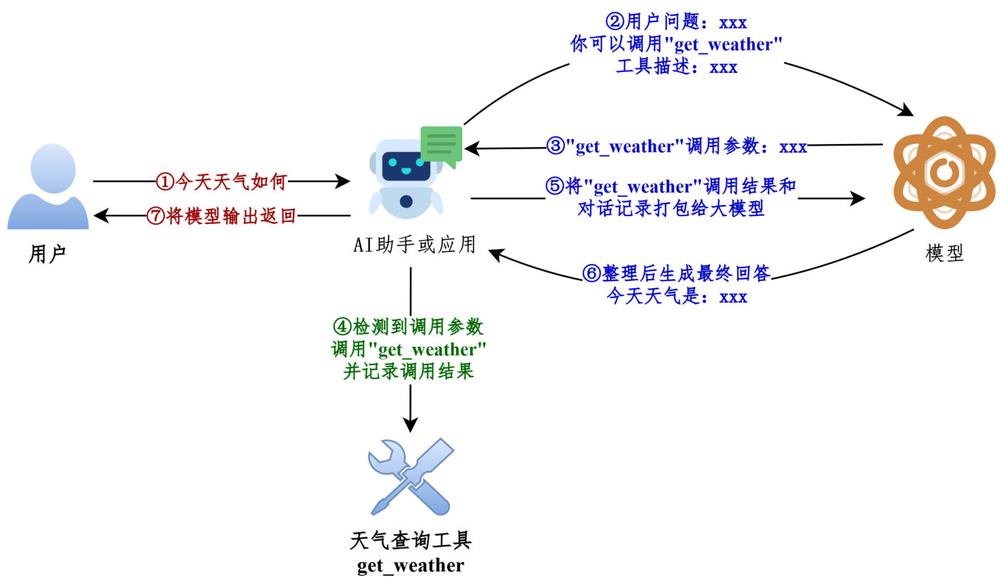
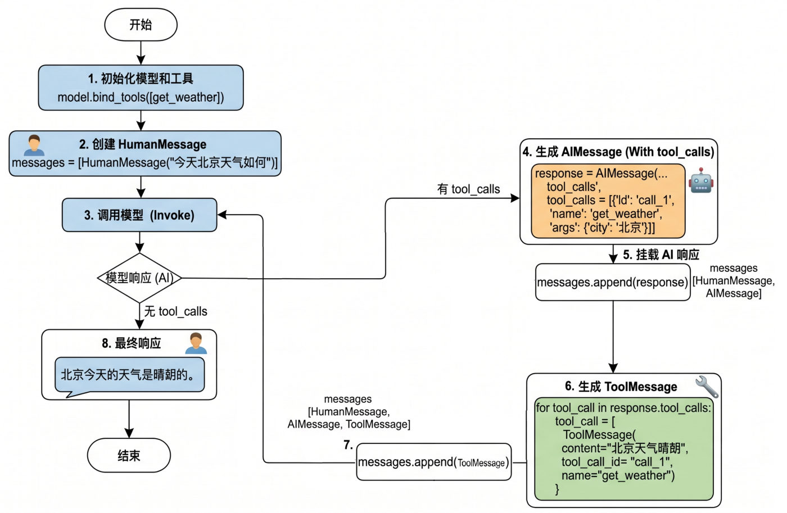

## 为什么需要工具

只有"生成文本"这种**纸上谈兵**的能力，是构建不了强大 AI 应用的。**工具是赋予大语言模型与外部世界交互能力的关键组件**——借助它，模型才能执行搜索、计算、数据库查询、发邮件、调第三方 API 等。

> 有了工具，大模型才能从"**认识世界**"走向"**改变世界**"。

工具是构建智能体的**核心要素之一**（还记得那个公式吗：`Agent = LLM + Planning + **Tools** + Memory + Action）。


*图：LangChain 框架里工具的典型应用场景——搜索、计算器、数据库/文件、邮件/沟通*

## 工具调用 = 函数调用

在 LangChain 中，**工具（Tools）实际上是指明确定义了输入和输出的可调用函数**。因此"工具调用（Tool Calling）"也被称为"**函数调用（Function Calling）**"。

两种调用方式：

| 方式 | 用法 | 适合 |
| --- | --- | --- |
| 直接调用 | `get_weather.invoke({"city": "北京"})` | 测试、单元验证 |
| 模型绑定调用 | `model.bind_tools([...])` 后由**模型决定**何时调、传什么参数 | 真正的智能体 |

## 工具调用的整体流程

```text
用户提问
   ↓
模型结合上下文判断：要不要调工具？调哪个？参数是什么？
   ↓
应用执行工具（真正去查天气、查数据库、发邮件…）
   ↓
把工具结果回传给模型
   ↓
模型基于结果生成最终回复
```

**大模型能根据对话上下文决定何时调用工具以及传递哪些参数**——这也是它比"硬编码 if-else"强的地方。我们写的 LangChain 应用，对应的就是图里的"AI 助手/应用"那一环。


*图：工具调用的经典流程——用户提问、模型要工具、应用执行、结果回传、模型生成最终回复*

### 从 Message 流转看

```python
# 1. 绑定工具（模型 + 工具列表 → 带工具能力的模型）
model_with_tools = model.bind_tools([get_weather])

messages = [HumanMessage("今天北京天气如何")]

# 2. 第一次调用：模型不直接回答，而是"要求调用工具"
response = model_with_tools.invoke(messages)
print(response.tool_calls)
# [{'name': 'get_weather', 'args': {'city': '北京'}, 'id': 'call_xxx'}]

# 3. 把这条 AI 消息追加进历史
messages.append(response)

# 4. 应用执行工具，把结果包成 ToolMessage（tool_call_id 必须对应）
tool_result = get_weather.invoke(response.tool_calls[0]["args"])
messages.append(ToolMessage(content=tool_result, tool_call_id=response.tool_calls[0]["id"]))

# 5. 再调一次模型：这次它拿着工具结果生成最终回复
final = model_with_tools.invoke(messages)
print(final.content)
```

> [!IMPORTANT]
> 关键点：**模型自己不执行工具**。它只是"提出调用请求（tool_calls）"，真正执行的是你的代码，执行完再以 `ToolMessage` 回传——**这个"请求→执行→回传"的循环，就是智能体的最小骨架**。


*图：完整的四步调用流程图——有 tool_calls 就挂载 AI 响应、生成 ToolMessage、回传后再调模型*

## 定义方式一：不用 @tool

直接把普通函数放进 `bind_tools()`，LangChain 会在内部把它转成工具描述（`convert_to_openai_tool`）：

```python
def get_weather(city: str):
    """获取天气的工具"""
    return f"{city}天气晴朗"

model_with_tools = model.bind_tools([get_weather])
```

`convert_to_openai_tool(get_weather)` 的输出包含 `type` 和 `function` 两部分——这就是最终发给模型的"工具说明书"。

### 输出结构详解

执行 `model.bind_tools([get_weather])` 时，**底层最终会调用 `convert_to_openai_tool` 生成工具描述**，所以我们可以直接调它，看看"工具说明书"到底长什么样：

```python
from langchain_core.utils.function_calling import convert_to_openai_tool
from rich import print as rprint

def get_weather(city: str):
    return f"{city}天气晴朗"

rprint(convert_to_openai_tool(get_weather))
```

输出（这个函数**没写 docstring**，所以 `description` 是空字符串）：

```python
{
    "type": "function",
    "function": {
        "name": "get_weather",
        "description": "",
        "parameters": {
            "properties": {
                "city": {
                    "type": "string"
                }
            },
            "required": ["city"],
            "type": "object"
        }
    }
}
```

三个关键字段的含义：

| 字段 | 含义 |
| --- | --- |
| `type` | 定义**当前数据节点必须是什么数据类型**。常见类型：`string`、`number`、`integer`、`boolean`、`object`、`array`、`null`（`object` 就是 JSON 对象） |
| `properties` | 定义 **JSON 对象（Object）里可以包含哪些属性（键）**，以及每个属性对应的值类型和说明 |
| `required` | **当 `type` 为 `"object"` 时使用**，是个数组，列出对象中**必须存在**的属性名 |

> [!NOTE]
> **为什么没加 `@tool` 的函数也能当工具用？** 看 `convert_to_openai_tool` 底层源码：
> ```python
> elif isinstance(function, langchain_core.tools.base.BaseTool):
>     oai_function = cast("dict", _format_tool_to_openai_function(function))
> elif callable(function):
>     oai_function = cast("dict", _convert_python_function_to_openai_function(function))
> ```
> **加了 `@tool` 的函数走上面那条分支**（本身就是 `BaseTool`，直接格式化）；**没加的走下面那条**——后者会**基于函数定义和 docstring 生成 Pydantic 模式的描述**，再转成规范的 `tool_schema`。这就是"普通函数也能当工具"的机制。
>
> **实测（本机 langchain-core 1.2.18）**：`convert_to_openai_tool` 现在会再委派一层给 `convert_to_openai_function`，但**分支结构完全一致**（先判 `BaseTool`，再判 `callable`），课程讲的原理没有过时。

### Google 风格 docstring 规范

`convert_to_openai_tool` 会从 docstring 加载**参数说明**，而这里的 docstring **必须遵循 Google 风格**：

| 参考 | 链接 |
| --- | --- |
| Google 风格 docstring 说明 | <https://google.github.io/styleguide/pyguide.html> |
| Google 风格 docstring 示例 | <https://www.sphinx-doc.org/en/master/usage/extensions/example_google.html> |
| Python docstring 通用约定（PEP 257） | <https://peps.python.org/pep-0257/> |

基础用法**不必完整阅读规范**，按示例仿写即可——用 `Args:`、`Returns:`、`Raises:` 等关键字：

```python
from langchain_core.utils.function_calling import convert_to_openai_tool
from rich import print as rprint

def get_weather(city: str):
    """
    天气查询工具

    Args:
        city: 城市名称
    """
    return f"{city}天气晴朗"

rprint(convert_to_openai_tool(get_weather))
```

输出——**`city` 的 `description` 被自动填上了**：

```python
{
    "type": "function",
    "function": {
        "name": "get_weather",
        "description": "天气查询工具",
        "parameters": {
            "properties": {
                "city": {
                    "description": "城市名称",
                    "type": "string"
                }
            },
            "required": ["city"],
            "type": "object"
        }
    }
}
```

**Agent 通过工具的这些注释来理解工具的用途和调用时机**，因此清晰、准确的文档字符串是工具能被正确调用的前提。写好写坏差别很大：

```python
# ❌ 不好：太模糊
@tool
def tool1(x: str) -> str:
    """做一些事情"""
    ...

# ✅ 好：清晰明确
@tool
def search_products(query: str) -> str:
    """
    在产品数据库中搜索产品

    Args:
        query: 搜索关键词，如"笔记本电脑"、"手机"

    Returns:
        产品列表的 JSON 字符串
    """
    ...
```

### 参数类型从哪里来

**参数类型来源于函数的类型注解**。把注解删掉，`parameters` 里就只剩一个**空对象**：

```python
def get_weather(city):        # ← 注解没了
    """
    天气查询工具
    """
    return f"{city}天气晴朗"

convert_to_openai_tool(get_weather)
```

```python
{
    "type": "function",
    "function": {
        "name": "get_weather",
        "description": "天气查询工具",
        "parameters": {
            "properties": {
                "city": {}          # ← 没有 type、没有 description，模型只能猜
            },
            "required": ["city"],
            "type": "object"
        }
    }
}
```

> [!WARNING]
> **删了注解只是"参数类型丢失"，但下面这个会直接报错**：docstring 里写了参数说明、函数签名却没有对应参数时——
> ```python
> def get_weather(city):
>     """
>     天气查询工具
>
>     Args:
>         city: 城市名称
>     """
>     ...
> ```
> ```text
> ValueError: Arg city in docstring not found in function signature.
> ```
> **规矩很简单：docstring 的 `Args:` 里写了哪个参数，签名里就必须有这个名字（而且要带类型注解）。** 两者必须一一对应。

### 参数默认值会变成 default 字段

**有默认值的参数**：描述信息里会包含 `default` 字段，并且**不会出现在 `required` 列表**中；没默认值的参数照旧进 `required`。

```python
def get_weather(city: str = "北京"):      # ← 有默认值
    """
    天气查询工具

    Args:
        city: 城市名称
    """
    return f"{city}天气晴朗"
```

```python
{
    "type": "function",
    "function": {
        "name": "get_weather",
        "description": "天气查询工具",
        "parameters": {
            "properties": {
                "city": {
                    "default": "北京",       # ← 多出 default
                    "description": "城市名称",
                    "type": "string"
                }
            },
            "type": "object"                 # ← required 整段消失了
        }
    }
}
```

**只有一个参数且它有默认值时，`required` 字段被整个移除**。部分参数有默认值时，`required` 里只留没默认值的那个：

```python
def get_weather(dt: str, city: str = "北京"):
    """
    天气查询工具

    Args:
        dt: 日期
        city: 城市名称
    """
    return f"{city}天气晴朗"
```

```python
"required": ["dt"]        # ← 只有没默认值的 dt 留在这里
```

> [!TIP]
> 想少让模型填参数，**就在签名里给默认值**——模型看不到 `required`，就不会硬编一个值出来。这也是"参数可选"最省事的表达方式（比在 description 里写"这个参数可以不填"可靠得多）。

## 定义方式二：@tool 装饰器（推荐）

用 `@tool` 装饰器修饰，可以**自动把普通 Python 函数转化为智能体可调用的工具**。这是最直接、代码量最少的方式。

```python
from langchain.tools import tool

@tool
def get_weather(city: str) -> str:
    """获取指定城市的天气信息

    参数:
        city: 城市名称，如"北京"、"上海"

    返回:
        天气信息字符串
    """
    return f"{city}天气晴朗"
```

`@tool` 会从 **docstring** 生成工具描述，所以**必须遵循 Google docstring 规范**。没有 docstring 会直接报错：

```text
ValueError: Function must have a docstring if description not provided.
```

### docstring 为什么这么重要

**模型只能通过 description 判断"这个工具是干什么的、什么时候该用"**。写得含糊，模型就选错工具或该调不调。所以：

| 要素 | 说明 |
| --- | --- |
| 一句话功能说明 | 说清"做什么"，最好说清"什么时候用" |
| 参数说明 | 每个参数的含义、格式、取值范围 |
| 返回值说明 | 返回什么，方便模型解读结果 |

### 工具对象的属性（核对过真实行为）

```python
print(get_weather.name)         # get_weather（默认取函数名）
print(get_weather.description)  # 从 docstring 提取
print(get_weather.args)         # {'city': {'title': 'City', 'type': 'string'}}
print(get_weather.invoke({"city": "北京"}))   # 北京天气晴朗
```

- 改名字：`@tool("查天气")` 或 `@tool(name_or_callable="查天气")`
- 参数类型注解（`city: str`）、默认值都会被转成 JSON Schema 的一部分，告诉模型"该传什么"

### 自定义工具描述：description

`@tool` 生成描述时有三种情况，正好对应"不写 / 写整段 / 拆开解析"：

**情况1：只给 docstring**——`bind_tools()` 调用时，先把函数封装成 `BaseTool` 对象，再交给 `convert_to_openai_tool` 生成描述；`@tool` 会从 docstring 生成描述，同样**必须遵循 Google docstring 规范**。没有 docstring 就直接报错：

```text
ValueError: Function must have a docstring if description not provided.
```

**情况2：`@tool(description="...")` 覆盖 docstring**——**description 的优先级高于 docstring 的函数说明**：

```python
@tool(description="根据城市名称查询当日天气的工具")
def get_weather(city: str):
    """
    天气查询工具
    """
    return f"{city}天气晴朗"

convert_to_openai_tool(get_weather)
```

```python
"description": "根据城市名称查询当日天气的工具"      # ← 用的是 description，不是 docstring
```

> [!TIP]
> 什么时候用 `description` 而不是 docstring？**当描述需要带动态信息时**（比如从配置读出来的"当前环境：生产"），docstring 是静态字符串，`description=` 可以拼变量。

**情况3：`parse_docstring=True` 解析 docstring**——默认情况下 `@tool` 会把 **docstring 整体当作 description**（连 `Args:` 那几行一起，整段塞进去）：

```python
@tool
def get_weather(city: str, units: str = "celsius", include_forecast: bool = False) -> str:
    """
    获取当日天气，可选择是否同时查询未来五日天气预报

    Args:
        city: 城市
        units: 气温单位，可选：celsius-摄氏度，fahrenheit-华氏度
        include_forecast: 是否包含未来五日的天气预报
    """
    ...
```

description 变成一整坨（`'获取当日天气，可选择是否同时查询未来五日天气预报\n\nArgs:\n city: 城市\n units: ...'`），**而 `city` 的 `description` 是空的**。

**加上 `parse_docstring=True`，docstring 才会被解析、填充到各个字段的 description 里**：

```python
@tool(parse_docstring=True)
def get_weather(city: str, units: str = "celsius", include_forecast: bool = False) -> str:
    """
    获取当日天气，可选择是否同时查询未来五日天气预报

    Args:
        city: 城市
        units: 气温单位，可选：celsius-摄氏度，fahrenheit-华氏度
        include_forecast: 是否包含未来五日的天气预报
    """
    ...
```

```python
{
    "name": "get_weather",
    "description": "获取当日天气，可选择是否同时查询未来五日天气预报",
    "parameters": {
        "properties": {
            "city": {"description": "城市", "type": "string"},
            "units": {"default": "celsius", "description": "气温单位，可选：celsius-摄氏度，fahrenheit-华氏度", "type": "string"},
            "include_forecast": {"default": false, "description": "是否包含未来五日的天气预报", "type": "boolean"}
        },
        "required": ["city"],
        "type": "object"
    }
}
```

description 只剩一句话，**参数说明各就各位**——这才是我们要的形态。

> [!WARNING]
> **`parse_docstring=True` 是把 docstring 当"格式约定"来解释的，格式不对会直接抛异常**：
> ```text
> ValueError: Found invalid Google-Style docstring.
> ```
> 对比一下：**不用 `@tool` 时，不合法的 docstring 会被当成普通文本当作 description（不报错）；用了 `@tool` + `parse_docstring=True`，就会抛异常**。（反例：`Args:` 和参数说明写在同一行、或 `Args:` 后面直接跟冒号换行——都不是合法 Google 风格。）
> **实测（本机 langchain-core 1.2.18）**：默认不带 `parse_docstring` 时 description 是整段 docstring、参数无 description；加 `parse_docstring=True` 后参数描述正确填充——与课程一致。另外课程输出里 `include_forecast` 的 default 显示成字符串 `'False'`，**本机实际是布尔 `false`**（以实际为准）。

### 保留字提醒

**不要用 `config` 或 `runtime` 作为参数名**，这些是 LangChain 内部保留的。

> [!WARNING]
> **课程只是提醒，这里给个实测证据**（本机 langchain-core 1.2.18）——用 `config` 当参数名，**工具的 `args` / schema 生成都正常，但在调用时必崩**：
> ```python
> @tool
> def bad_tool(config: str) -> str:
>     """测试保留字"""
>     return config
>
> print(bad_tool.args)                       # {'config': {'title': 'Config', 'type': 'string'}}  ← 看起来没问题
> bad_tool.invoke({"config": "x"})
> # TypeError: bad_tool() missing 1 required positional argument: 'config'
> ```
> 原因是 `config` 会被 LangChain 的调用机制**截走当运行时配置**，根本传不到函数体里。`invoke({"name": ..., "args": {"config": ...}})` 这种 tool_call 形式同样报错；换成 `runtime` 在本版能跑通，但**按课程建议一律避开这两个名字**。

此外，**开发中习惯使用函数名作为工具名称，不推荐自定义工具名称**（工具名要和函数名保持一致，便于排查）。

## 用 Pydantic 定义参数结构：args_schema

参数多、需要校验时，用 Pydantic 模型定义 `args_schema`：

```python
from pydantic import BaseModel, Field
from langchain.tools import tool

class WeatherArgs(BaseModel):
    city: str = Field(description="城市名称，如北京")
    unit: str = Field(default="celsius", description="温度单位：celsius 或 fahrenheit")

@tool(args_schema=WeatherArgs)
def get_weather(city: str, unit: str = "celsius") -> str:
    """获取指定城市的天气信息"""
    return f"{city} 的天气：25 ({unit})"
```

> [!TIP]
> 用 Pydantic 的好处：**类型安全 + 参数校验**。模型传参前，Pydantic 会先验证类型与有效性，参数写错能立刻发现，而不是让模型拿到一个莫名的报错。

### Pydantic 的三件套：BaseModel / Field / Literal

当工具参数需要**枚举值**、**范围限制**或**更复杂的业务逻辑验证**时，Pydantic 是理想选择——它能精确控制参数的格式和验证规则，让大模型更准确地理解怎么调工具。

**① `BaseModel` 基类**：继承它来声明字段结构、类型约束、默认值和校验规则。

```python
from pydantic import BaseModel

class WeatherInput(BaseModel):
    city: str

print(WeatherInput(city="北京"))      # city='北京'
```

> [!WARNING]
> **`BaseModel` 子类初始化时不接收位置参数**，字段值必须用关键字参数传：
> ```python
> WeatherInput("北京")
> # TypeError: BaseModel.__init__() takes 1 positional argument but 2 were given
> ```
> 原因看它的签名就明白了——`def __init__(self, /, **data: Any) -> None`：**所有关键字参数被收集进字典 `data`**，再按类型注解校验，失败就抛异常。所以"必须写字段名"不是风格问题，是签名决定的。

**② `Field()`**：用来**定制字段**——设置默认值、描述等。

```python
from pydantic import BaseModel, Field

class WeatherInput(BaseModel):
    city: str = Field(default="北京")            # 举例1：设置默认值
    include_forecast: bool = Field(
        default=False,
        description="是否包含未来五日天气预报",   # 举例2：设置描述
    )

print(WeatherInput())      # city='北京' include_forecast=False
```

> [!IMPORTANT]
> **每个字段的 `description` 参数至关重要——它直接影响大模型理解参数含义的能力。** 这是"给模型看的文档"，别省。

**③ `Literal`**：限定参数只能是**几个固定字面量之一**。

```python
from pydantic import BaseModel
from typing import Literal

class WeatherInput(BaseModel):
    city: str
    unit: Literal["celsius", "fahrenheit"]

print(WeatherInput(city="北京", unit="celsius"))    # city='北京' unit='celsius'
```

传了不在列表里的值，**在本地就被 Pydantic 拦下**：

```python
WeatherInput(city="北京", unit="kelvin")
```

```text
ValidationError
1 validation error for WeatherInput
unit
  Input should be 'celsius' or 'fahrenheit' [type=literal_error, input_value='kelvin', input_type=str]
```

配 `Field` 一起用（既限定取值、又有默认值和描述）：

```python
class WeatherInput(BaseModel):
    city: str = Field(default="北京", description="城市")
    unit: Literal["celsius", "fahrenheit"] = Field(default="celsius", description="气温单位")
    include_forecast: bool = Field(default=False, description="是否包含未来五日天气预报")
```

**把它接到工具上**——`@tool(args_schema=PydanticModelCls)` 把 Pydantic 模型与工具函数关联，**模型要调工具前，Pydantic 会自动验证参数的类型和有效性**：

```python
from pydantic import BaseModel, Field
from typing import Literal
from langchain.tools import tool
from langchain_core.utils.function_calling import convert_to_openai_tool

class WeatherInput(BaseModel):
    city: str = Field(default="北京", description="城市")
    unit: Literal["celsius", "fahrenheit"] = Field(default="celsius", description="气温单位")
    include_forecast: bool = Field(default=False, description="是否包含未来五日天气预报")

@tool(args_schema=WeatherInput)
def get_weather(city: str, unit: str = "celsius", include_forecast: bool = False) -> str:
    """获取当日天气，可选未来五日天气预报"""
    temp = 22 if unit == "celsius" else 72
    result = f'{city}当天气温: {temp} {"摄氏度" if unit == "celsius" else "华氏度"}'
    if include_forecast:
        result += "\n未来五天都是晴天"
    return result

convert_to_openai_tool(get_weather)
```

生成的 schema 里，**`unit` 多出了 `enum` 数组**（这就是 Literal 的价值——把"只能填这几个值"直接告诉模型）：

```python
{
    "name": "get_weather",
    "description": "获取当日天气，可选未来五日天气预报",
    "parameters": {
        "properties": {
            "city": {"default": "北京", "description": "城市", "type": "string"},
            "unit": {
                "default": "celsius",
                "description": "气温单位",
                "enum": ["celsius", "fahrenheit"],
                "type": "string"
            },
            "include_forecast": {"default": false, "description": "是否包含未来五日天气预报", "type": "boolean"}
        },
        "type": "object"        # ← 三个参数都有默认值 → 没有 required
    }
}
```

> [!NOTE]
> 注意这个分工：**`args_schema` 决定了发给模型的 schema**（参数名、描述、enum、default 都来自 Pydantic 模型），**而函数签名决定实际执行时收什么**。所以两边要**对得上**（上面的 `city` / `unit` / `include_forecast` 一一对应）。

### 用 JSON Schema 字典定义 args_schema

除了 Pydantic，LangChain 还支持**直接用 JSON Schema 字典**定义参数模式。**极大灵活性**是本方式的核心卖点：**参数模式可以基于数据库配置或用户输入在运行时动态生成**——结构随时可变的场景，这种方式最合适。

完整的工具描述长这样（`type` + `function` 两层）：

```python
{
    "type": "function",
    "function": {
        "name": "get_weather",
        "description": "获取当日天气，可选未来五日天气预报",
        "parameters": {
            "type": "object",
            "properties": {
                "location": {"type": "string"},
                "units": {"type": "string"},
                "include_forecast": {"type": "boolean"}
            },
            "required": ["location", "units", "include_forecast"]
        }
    }
}
```

**但传给 `args_schema` 的只有 `parameters` 那一段**：

```python
{
    "type": "object",
    "properties": {
        "location": {"type": "string"},
        "units": {"type": "string"},
        "include_forecast": {"type": "boolean"}
    },
    "required": ["location", "units", "include_forecast"]
}
```

```python
from langchain.tools import tool
from langchain_core.utils.function_calling import convert_to_openai_tool

weather_schema = {
    "type": "object",
    "properties": {
        "location": {"type": "string"},
        "units": {"type": "string"},
        "include_forecast": {"type": "boolean"}
    },
    "required": ["location", "units", "include_forecast"]
}

@tool(args_schema=weather_schema)
def get_weather(city: str, unit: str = "celsius", include_forecast: bool = False) -> str:
    """获取当日天气，可选未来五日天气预报"""
    return "x"

print(convert_to_openai_tool(get_weather))
```

输出的 `parameters` **原样就是你给的那份字典**（连字段顺序都保持），`description` 仍取自 docstring。

> [!WARNING]
> **这个方式有个"看着能用，一调就崩"的坑——实测（本机 langchain-core 1.2.18）**：
> 裸 JSON Schema **不会被翻译、也不做交叉校验**，它**原样发给模型**；但工具**执行时用的是函数签名**。上面这段代码里 schema 写的是 `location` / `units`，函数签名写的却是 `city` / `unit`——模型老老实实按 schema 传 `{"location": ..., "units": ...}`，结果：
> ```text
> TypeError: get_weather() got an unexpected keyword argument 'location'
> ```
> 另外**多传 schema 里没有的键，也会被 Python 签名拦下**（`TypeError: ... unexpected keyword argument 'extra'`）。
> **结论：用 JSON Schema 当 `args_schema` 时，字典里的键必须和函数参数名严格一致**——把函数签名改成 `def get_weather(location: str, units: str = "celsius")` 就正常了。课程示例里两者不一致，属于"能生成 schema 但不能真正调用"，抄的时候记得改。

## 相关

- [Message与对话历史](/posts/编程学习/langchain学习笔记/07-message与对话历史/)
- [Tools进阶与实战](/posts/编程学习/langchain学习笔记/10-tools进阶与实战/)

## 练习题

### 一、回忆填空（写完再展开对答案）

1. 工具是赋予大模型与 ____ 交互能力的关键组件，让模型从"认识世界"走向"____"
2. 工具实际上是指明确定义了 ____ 和 ____ 的可调用函数，所以工具调用也叫 ____
3. 工具的两种调用方式：____（测试用）与 ____（由模型决定何时调）
4. 用 `@tool` 时工具描述来自 ____，因此必须遵循 ____ docstring 规范；没有 docstring 会报 ____
5. 工具对象的三个属性：`name`（名字）、`description`（描述）、`____`（参数结构）
6. 定义方式一不用 @tool，直接把函数传给 `model.____()`；内部会用 `____` 生成工具描述
7. 模型决定调用工具时，返回的 AI 消息里带着 ____（含 name/args/id）
8. 应用执行完工具后要用 ____ 消息把结果回传，其中的 ____ 必须和请求里的 id 对应
9. 参数复杂时用 Pydantic 定义 `____`，好处是类型安全与参数 ____

> [!TIP]- 填空答案（做完再点开）
> 1. 外部世界 / 改变世界　2. 输入 / 输出 / 函数调用（Function Calling）　3. 直接调用 / 模型绑定调用　4. docstring / Google / ValueError　5. `args`　6. `bind_tools` / `convert_to_openai_tool`　7. `tool_calls`　8. `ToolMessage` / `tool_call_id`　9. `args_schema` / 校验

### 二、裸写题

- [ ] **2-1 写一个工具并直接调用**
  用 `@tool` 定义一个 `add(a: int, b: int)` 工具（带规范 docstring），打印它的 name/description/args，并直接 invoke 一次。

  > [!TIP]- 提示（先自己想，实在想不出再点开）
  > **一级 · 思路**：先定义再观察它的三个属性，最后手动调用
  > **二级 · 方法**：`@tool` / `add.name` / `add.invoke({"a": 1, "b": 2})`
  > **三级 · 骨架**：docstring 里写清功能、参数、返回

- [ ] **2-2 绑定工具让模型自己决定**
  定义一个查天气工具，用 `model.bind_tools([...])` 绑定，问"今天北京天气如何"，打印返回消息里的 `tool_calls`。

  > [!TIP]- 提示
  > **一级 · 思路**：模型不会直接回答，而是"申请调用工具"
  > **二级 · 方法**：`model_with_tools = model.bind_tools([get_weather])`
  > **三级 · 骨架**：`print(response.tool_calls)` 看 name/args/id

- [ ] **2-3 走完"请求→执行→回传"的完整循环**
  在第 2-2 基础上：执行工具 → 构造 `ToolMessage`（tool_call_id 对应）→ 再调一次模型，拿到最终回复。

  > [!TIP]- 提示
  > **一级 · 思路**：这是智能体的最小骨架
  > **二级 · 方法**：`messages.append(response)` → 执行 → `ToolMessage(content=..., tool_call_id=...)` → `model_with_tools.invoke(messages)`
  > **三级 · 骨架**：注意顺序：先追加 AI 消息，再追加工具结果

- [ ] **2-4 用 Pydantic 定义参数**
  用 `args_schema`（Pydantic 模型 + Field 描述）重新定义查天气工具，给 `unit` 参数一个默认值。

  > [!TIP]- 提示
  > **一级 · 思路**：把参数结构写成一个类
  > **二级 · 方法**：`class WeatherArgs(BaseModel)` + `@tool(args_schema=WeatherArgs)`
  > **三级 · 骨架**：`Field(default="celsius", description="温度单位")`

> [!TIP]- 参考答案（做完再点开）
> ```python
> import os
> from dotenv import load_dotenv
> from langchain.chat_models import init_chat_model
> from langchain.tools import tool
> from langchain_core.messages import HumanMessage, ToolMessage
> from pydantic import BaseModel, Field
>
> load_dotenv(override=True)
>
> model = init_chat_model(
>     model="deepseek-v4-flash",
>     model_provider="openai",
>     base_url=os.getenv("DEEPSEEK_BASE_URL"),
>     api_key=os.getenv("DEEPSEEK_API_KEY"),
> )
>
> # 2-1 定义并直接调用
> @tool
> def add(a: int, b: int) -> int:
>     """把两个整数相加
>
>     参数:
>         a: 第一个整数
>         b: 第二个整数
>
>     返回:
>         两数之和
>     """
>     return a + b
>
> print(add.name, "|", add.description.split("\n")[0], "|", add.args)
> print("直接调用:", add.invoke({"a": 1, "b": 2}))
>
> # 2-2 / 2-3 绑定工具 + 完整循环
> @tool
> def get_weather(city: str) -> str:
>     """获取指定城市的天气信息
>
>     参数:
>         city: 城市名称，如"北京"
>     """
>     return f"{city}天气晴朗，25℃"
>
> model_with_tools = model.bind_tools([get_weather])
>
> messages = [HumanMessage("今天北京天气如何")]
> response = model_with_tools.invoke(messages)
> print("模型要求调用的工具:", response.tool_calls)
>
> if response.tool_calls:
>     messages.append(response)                                  # 追加 AI 消息
>     call = response.tool_calls[0]
>     result = get_weather.invoke(call["args"])                  # 执行工具
>     messages.append(ToolMessage(content=result, tool_call_id=call["id"]))  # 回传结果
>     final = model_with_tools.invoke(messages)
>     print("最终回复:", final.content)
>
> # 2-4 用 Pydantic 定义参数
> class WeatherArgs(BaseModel):
>     city: str = Field(description="城市名称，如北京")
>     unit: str = Field(default="celsius", description="温度单位：celsius 或 fahrenheit")
>
> @tool(args_schema=WeatherArgs)
> def get_weather_v2(city: str, unit: str = "celsius") -> str:
>     """获取指定城市的天气信息"""
>     return f"{city} 的天气：25 ({unit})"
>
> print(get_weather_v2.args)
> ```