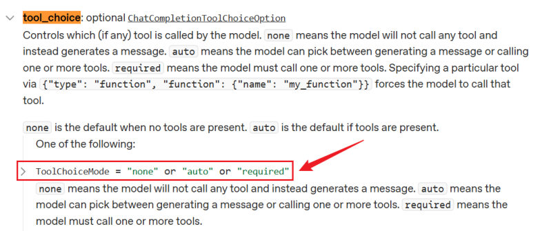
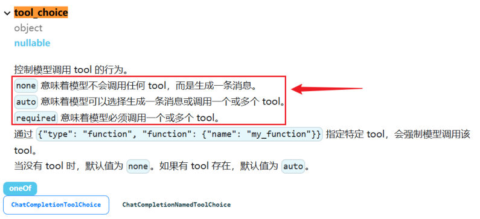

## 多工具调用

绑定多个工具后，**模型会自己挑**——根据用户问题判断该用哪个（甚至一次调用多个）：

```python
@tool
def get_weather(city: str) -> str:
    """获取指定城市的天气信息

    参数:
        city: 城市名称，如"北京"
    """
    return f"{city}天气晴朗，25℃"

@tool
def get_time(city: str) -> str:
    """获取指定城市的当前时间

    参数:
        city: 城市名称
    """
    return f"{city}当前时间 14:30"

model_with_tools = model.bind_tools([get_weather, get_time])

# 问天气 → 只调 get_weather；问"北京天气和现在几点" → 可能同时调两个
response = model_with_tools.invoke("北京今天天气怎么样？")
print(response.tool_calls)
```

**多工具场景下的注意点**：

| 注意点 | 说明 |
| --- | --- |
| 工具名要能区分 | `get_weather` / `get_time` 一目了然；叫 `func1`、`tool_a` 模型会选错 |
| description 要写清"什么时候用" | 模型只凭描述选择，两个工具描述雷同就会乱选 |
| 可能要循环多次 | 模型可能连续需要多个工具结果——**用循环直到它不再要求调用工具** |

```python
messages = [HumanMessage("北京今天天气怎么样，现在几点？")]

while True:
    response = model_with_tools.invoke(messages)
    messages.append(response)

    if not response.tool_calls:      # 不再要求调工具 → 已给出最终答案
        print("最终回复:", response.content)
        break

    for call in response.tool_calls:          # 一次可能多个工具调用
        tool_map = {"get_weather": get_weather, "get_time": get_time}
        result = tool_map[call["name"]].invoke(call["args"])
        messages.append(ToolMessage(content=result, tool_call_id=call["id"]))
```

## 四个应用案例

四个案例对应"参数模式、描述写法、多工具循环、错误处理"四条主线，**从简单到完整**，串起来就是一个能跑的工具型 Agent 骨架。

### 案例1：用 args_schema 给出明确的参数信息

**要点**：参数结构写进 Pydantic 模型，模型就知道该传什么名字、什么类型、什么默认值。

```python
from pydantic import BaseModel, Field

from langchain.tools import tool
from langchain.messages import HumanMessage
from langchain_core.utils.function_calling import convert_to_openai_tool

class WeatherSchema(BaseModel):
    city: str = Field(default="北京", description="城市名称")
    if_forecast: bool = Field(default=False, description="是否包含明日天气预报")

# 工具名、description、args_schema 三样一起给
@tool("get_weather_and_forecast", description="查询当日天气，可以包含明日天气预报", args_schema=WeatherSchema)
def get_weather(city: str, if_forecast: bool):
    res = f"{city} 今天天气不错"
    if if_forecast:
        res += "\n明天也不错"
    return res

print(convert_to_openai_tool(get_weather))

model_with_tools = model.bind_tools([get_weather])

messages = [HumanMessage("今天杭州天气如何？明天呢？")]
response = model_with_tools.invoke(messages)
messages.append(response)

for tool_call in response.tool_calls:
    if tool_call["name"] == "get_weather_and_forecast":
        tool_msg = get_weather.invoke(tool_call)     # 注意：tool_call 能直接进 invoke
        messages.append(tool_msg)

final_response = model_with_tools.invoke(messages)
messages.append(final_response)

for msg in messages:
    msg.pretty_print()
```

工具描述（`description` 走 `@tool` 参数、参数描述走 Pydantic）：

```python
{'type': 'function', 'function': {'name': 'get_weather_and_forecast',
 'description': '查询当日天气，可以包含明日天气预报',
 'parameters': {'properties': {
   'city': {'default': '北京', 'description': '城市名称', 'type': 'string'},
   'if_forecast': {'default': False, 'description': '是否包含明日天气预报', 'type': 'boolean'}},
  'type': 'object'}}}
```

运行输出——**`pretty_print()` 会把整条消息链按角色铺开，一眼看清"模型要调什么、工具返回了什么、模型最后说了什么"**：

```text
================================ Human Message =================================

今天杭州天气如何？明天呢？
================================== Ai Message ==================================
Tool Calls:
  get_weather_and_forecast (call_c82UrCpAdVAqiHfl4OkZocbg)
 Call ID: call_c82UrCpAdVAqiHfl4OkZocbg
  Args:
    city: 杭州
    if_forecast: True
================================= Tool Message =================================
Name: get_weather_and_forecast

杭州 今天天气不错
明天也不错
================================== Ai Message ==================================

杭州今天：天气不错。
杭州明天：也不错。
```

> [!TIP]
> `get_weather.invoke(tool_call)` 里可以直接丢**整个 `tool_call` 字典**（而不是只丢 `args`）——LangChain 会自己取 `args`，并且**生成带 `tool_call_id` 的 `ToolMessage`**。比手工 `ToolMessage(content=..., tool_call_id=...)` 省事，也不容易写错 ID。

### 案例2：用 parse_docstring 把描述写在 docstring 里

**要点**：参数描述写在 docstring，**参数默认值和类型则必须通过函数签名传递**。

```python
from langchain.tools import tool
from langchain.messages import HumanMessage
from langchain_core.utils.function_calling import convert_to_openai_tool

@tool("get_weather_and_forecast", parse_docstring=True)
def get_weather(city: str = "北京", if_forecast: bool = False):
    """
    查询当日天气，可以包含明日天气预报

    Args:
        city: 城市名称
        if_forecast: 是否包含明日天气预报
    """
    res = f"{city} 今天天气不错"
    if if_forecast:
        res += "\n明天要下雨"
    return res

print(convert_to_openai_tool(get_weather))

model_with_tools = model.bind_tools([get_weather])

messages = [HumanMessage("今天杭州天气如何？明天呢？")]
response = model_with_tools.invoke(messages)
messages.append(response)

# 将工具调用的结果添加到消息列表中
for tool_call in response.tool_calls:
    if tool_call["name"] == "get_weather_and_forecast":
        # 返回值 tool_msg 类型是 ToolMessage
        tool_msg = get_weather.invoke(tool_call)
        messages.append(tool_msg)

final_response = model_with_tools.invoke(messages)
messages.append(final_response)

for msg in messages:
    msg.pretty_print()
```

描述信息与案例1**完全等价**（`city`/`if_forecast` 的 description 都填上了）：

```python
{'type': 'function', 'function': {'name': 'get_weather_and_forecast',
 'description': '查询当日天气，可以包含明日天气预报',
 'parameters': {'properties': {
   'city': {'default': '北京', 'description': '城市名称', 'type': 'string'},
   'if_forecast': {'default': False, 'description': '是否包含明日天气预报', 'type': 'boolean'}},
  'type': 'object'}}}
```

> [!IMPORTANT]
> **要正确解析 docstring，必须在 `@tool` 里把 `parse_docstring` 设置为 `True`。** 忘了加，`Args:` 那几行就会被整段塞进 description，参数反而没有描述（见第 9 篇"自定义工具描述"）。

### 案例3：多工具调用（股票 + 新闻）

**先说清一个机制**：**大模型调用工具是单次推理**——每次运行只决定"现在要调哪些工具"。所以**当需要多次调用时，要用户自己管理调用循环**。

```python
from langchain_core.tools import tool
from langchain_core.messages import HumanMessage, AIMessage, ToolMessage

# 1. 定义股票查询工具
@tool(parse_docstring=True)
def get_stock_price(company: str, timeframe: str = "today") -> str:
    """获取指定公司的股票价格信息

    Args:
        company: 公司名称（如：苹果公司, 微软公司, 谷歌公司）
        timeframe: 时间范围（today-今日, week-本周, month-本月）
    """
    # 模拟股票数据
    mock_data = {
        "苹果公司": {"today": 185.20, "week": 183.50, "month": 180.75},
        "微软公司": {"today": 415.86, "week": 412.30, "month": 405.42},
        "谷歌公司": {"today": 15.42, "week": 15.20, "month": 14.85},
    }
    if company in mock_data:
        price = mock_data[company].get(timeframe, "未知时间范围")
        return f"{company} {timeframe}价格: {price}美元"
    else:
        return f"未找到股票代码 {company} 的数据"

# 定义新闻搜索工具
@tool(parse_docstring=True)
def search_news(company: str) -> str:
    """搜索指定公司的财经新闻

    Args:
        company: 公司名称

    Returns:
        公司的财经新闻，每个新闻占一行
    """
    mock_news = {
        "苹果公司": [
            "苹果发布新款iPhone，股价上涨3%",
            "苹果与欧盟达成反垄断和解协议",
            "苹果将在印度扩大生产规模",
        ],
        "微软公司": [
            "微软Azure云业务季度增长超预期",
            "微软完成对Nuance的收购",
            "微软推出新一代AI助手Copilot",
        ],
    }
    news_list = mock_news.get(company, [f"未找到{company}的相关新闻"])
    return "\n".join(news_list)

# 2. 初始化模型并绑定工具
tools = [get_stock_price, search_news]
model_with_tools = model.bind_tools(tools)

message_list = []
human_message = HumanMessage(content="苹果公司今天的股价是多少？最近有什么新闻？")
# human_message = HumanMessage(content="比较一下微软和苹果的股价")
# human_message = HumanMessage(content="腾讯最近有什么重大新闻？")
# human_message = HumanMessage(content="海水为什么是咸的？")
message_list.append(human_message)

# 3. 工具调用循环
while True:
    response = model_with_tools.invoke(message_list)
    message_list.append(response)

    # 如果模型不需要调用工具，直接退出循环
    if not response.tool_calls:
        print("没有工具调用，直接返回答案")
        break

    # 4. 开发者根据模型的响应，调用工具并获取结果
    for tool_call in response.tool_calls:
        if tool_call["name"] == "get_stock_price":
            stock_result = get_stock_price.invoke(tool_call)
            print("stock_result", stock_result)
            message_list.append(stock_result)
        if tool_call["name"] == "search_news":
            news_result = search_news.invoke(tool_call)
            print("news_result", news_result)
            message_list.append(news_result)

for msg in message_list:
    msg.pretty_print()
```

**一次问句触发两个工具**（模型在一次响应里同时要股票和新闻），工具返回的是带工具名的 `ToolMessage`：

```text
stock_result content='苹果公司 today价格: 185.2美元' name='get_stock_price' tool_call_id='call_cpGOhWce8rlIFSZ2G9w7ouON'
news_result content='苹果发布新款iPhone，股价上涨3%\n苹果与欧盟达成反垄断和解协议\n苹果将在印度扩大生产规模' name='search_news' tool_call_id='call_W9zjkAO8TNCmUbed2ld9tsxl'
没有工具调用，直接返回答案
```

`pretty_print()` 的完整输出：

```text
================================ Human Message =================================

苹果公司今天的股价是多少？最近有什么新闻？
================================== Ai Message ==================================
Tool Calls:
  get_stock_price (call_cpGOhWce8rlIFSZ2G9w7ouON)
 Call ID: call_cpGOhWce8rlIFSZ2G9w7ouON
  Args:
    company: 苹果公司
    timeframe: today
  search_news (call_W9zjkAO8TNCmUbed2ld9tsxl)
 Call ID: call_W9zjkAO8TNCmUbed2ld9tsxl
  Args:
    company: 苹果公司
================================= Tool Message =================================
Name: get_stock_price

苹果公司 today价格: 185.2美元
================================= Tool Message =================================
Name: search_news

苹果发布新款iPhone，股价上涨3%
苹果与欧盟达成反垄断和解协议
苹果将在印度扩大生产规模
================================== Ai Message ==================================

苹果公司今天股价是 **185.2 美元**。

最近新闻包括：
- 苹果发布了**新款 iPhone**，带动股价上涨约 **3%**
- 苹果与欧盟达成了**反垄断和解协议**
- 苹果计划在**印度扩大生产规模**
```

> [!NOTE]
> 案例里特意留了另外几句测试问法（注释掉的 `human_message`）：问"比较微软和苹果的股价"会触发**两轮**工具调用（先查两家、模型可能再补一次），问"海水为什么是咸的"则**一次工具都不调**——**同一个循环能同时应付这两种情况**，因为退出条件只看 `tool_calls` 是否为空。

### 案例4：多工具调用 + 工具名兜底

**要点**：`elif` 分支加一个 `else: raise`——**工具名对不上就立刻暴露，而不是默默什么都不干**。

```python
from langchain.tools import tool
from langchain.messages import HumanMessage

@tool(parse_docstring=True)
def get_weather(city: str) -> str:
    """
    获取当日天气

    Args:
        city: 城市名称
    """
    return f'{city}当天晴朗'

@tool(parse_docstring=True)
def get_news() -> str:
    """
    获取当日新闻
    """
    return "近期，受全球芯片短缺等多重因素影响，多地回收商称废旧手机回收市场迎来“火热潮”，回收价格普遍上涨，旧手机成“香饽饽”。"

model_with_tools = model.bind_tools([get_weather, get_news])

messages = [
    HumanMessage("今天杭州天气如何？今天新闻是什么？别瞎编")
]

response = model_with_tools.invoke(messages)
response.pretty_print()
```

模型很听话，一次响应里就要了两个工具：

```text
================================== Ai Message ==================================

我来帮您查询杭州的天气和今日新闻。
Tool Calls:
  get_weather (call_00_uspkbqR7N7wIewhr8hHZAXoM)
 Call ID: call_00_uspkbqR7N7wIewhr8hHZAXoM
  Args:
    city: 杭州
  get_news (call_01_ksyZoO2kXFBXXp1dH4dnxZAN)
 Call ID: call_01_ksyZoO2kXFBXXp1dH4dnxZAN
  Args:
```

**遍历 `tool_calls` 挨个调用工具，用一个 `else` 兜住"不认识的工具名"**：

```python
messages.append(response)

for tool_call in response.tool_calls:
    if tool_call["name"] == "get_weather":
        tool_msg = get_weather.invoke(tool_call)
        print(tool_msg)
        messages.append(tool_msg)
    elif tool_call["name"] == "get_news":
        tool_msg = get_news.invoke(tool_call)
        print(tool_msg)
        messages.append(tool_msg)
    else:
        raise Exception("不存在的工具")

final_response = model.invoke(messages)
messages.append(final_response)

for msg in messages:
    msg.pretty_print()
```

```text
content='杭州当天晴朗' name='get_weather' tool_call_id='call_00_PhpRzVvHYLkqOgQMj4keeAso'
content='近期，受全球芯片短缺等多重因素影响，...' name='get_news' tool_call_id='call_01_ALWxzasKCDJzm7fgwiXVBorg'
```

最后模型把两个结果合并成回答：

```text
================================== Ai Message ==================================

根据查询结果：

**杭州天气**：今天杭州天气晴朗。

**今日新闻**：近期，受全球芯片短缺等多重因素影响，多地回收商称废旧手机回收市场迎来“火热潮”，回收价格普遍上涨，旧手机成“香饽饽”。

以上信息基于实时查询，供您参考。
```

> [!TIP]
> **实测（本机 langchain-core 1.2.18 + 假服务端复现）**：`for msg in messages: msg.pretty_print()` 的输出格式与课程一致——`Human Message` / `Ai Message`（含 `Tool Calls` / `Call ID` / `Args` 缩进）/ `Tool Message`（含 `Name`）逐条铺开。
> 两个细节值得注意：① **`ToolMessage` 自带 `tool_call_id`**（不是自己填的）；② 用 `tool.invoke(tool_call)` 时**不用手动 `json.dumps` 参数**，传 `args` 字典或整个 `tool_call` 都行。
> 另外，`else: raise` 这层防护**只在"模型编出一个不存在的工具名"时才触发**；真实模型极少编错名字，但多工具（尤其是名字相近的）场景下，它能把"静默失败"变成"立刻报警"。

## tool_choice：控制是否使用工具

`bind_tools` 可以传 `tool_choice` 参数，控制模型**是否强制使用工具**（最终作为请求体的 `tool_choice` 字段传给模型）：

| 取值 | 含义 |
| --- | --- |
| `"none"` | 模型**不会**调用任何工具 |
| `"auto"` | **默认值**：模型自主决定不调、或调任意数量 |
| `"required"` | 模型**必须**调用工具，数量不限 |
| `"any"` | 等价于 `required` |


*图：OpenAI 官方文档中 tool_choice 的取值说明（none / auto / required）*


*图：DeepSeek 官方文档同样规定了这三个取值，并说明"没有工具时默认 none、有工具时默认 auto"*

```python
# 强制必须调用工具
model_with_tools = model.bind_tools([get_weather, get_time], tool_choice="required")

# 明确禁止调用工具（只让它直接回答）
model_with_tools = model.bind_tools([get_weather], tool_choice="none")
```

> [!TIP]
> `tool_choice="required"` 在"必须先查数据再回答"的场景很有用——比如客服系统里**必须**先查订单再给结论，不允许模型凭记忆瞎答。

### 强制调用特定的工具

`required` 只是"必须调工具"，但**调哪个还是模型说了算**。某些场景下我们希望**调用特定的工具**——`tool_choice` 也支持直接传**工具名**。

下面两个工具**同名同描述**（只有函数名差个数字），模型自己选必然随机；指定 `tool_choice="get_weather2"` 就锁死了：

```python
from langchain.tools import tool
from langchain.messages import HumanMessage

@tool(parse_docstring=True)
def get_weather1(city: str) -> str:
    """
    获取当日天气

    Args:
        city: 城市名称
    """
    return f'{city}当天晴朗'

@tool(parse_docstring=True)
def get_weather2(city: str) -> str:
    """
    获取当日天气

    Args:
        city: 城市名称
    """
    return f'{city}当天晴朗'

# 直接传工具名
model_with_tools = model.bind_tools([get_weather1, get_weather2], tool_choice="get_weather2")

messages = [HumanMessage("杭州今天天气如何？")]
response = model_with_tools.invoke(messages)
response.pretty_print()
```

输出——**调用的就是 `get_weather2`**：

```text
================================== Ai Message ==================================
Tool Calls:
  get_weather2 (call_00_mO5sCOWWnE3bWfNXtNhOjPNq)
 Call ID: call_00_mO5sCOWWnE3bWfNXtNhOjPNq
  Args:
    city: 杭州
```

反过来指定 `tool_choice="get_weather1"`，输出的 `Tool Calls` 就变成 `get_weather1 (...)`。

> [!NOTE]
> **实测（本机 langchain-core 1.2.18 + ChatDeepSeek）**：传工具名时，LangChain 会把它**翻译成带函数名的 `tool_choice` 对象**再发给服务端，而不是原样传字符串：
> ```python
> model.bind_tools(tools, tool_choice="get_weather2").kwargs["tool_choice"]
> # {'type': 'function', 'function': {'name': 'get_weather2'}}
> ```
> 而 `"none"` / `"auto"` / `"required"` 三个值是**原样透传**的字符串。知道这一点，抓包看请求体时才不会以为"传错了"。
> 场景上，这招适合**多版本 A/B 对比**（`get_weather1` 和 `get_weather2` 是两套实现，想固定跑其中一套）或**灰度切流**——不用改提示词，改一个参数就换了工具。

## 实践经验总结

前面是"怎么用"，这里是"怎么不出事"。六条经验，每条都有正反例——**照着反例自查，比记规则有用**。

### ① 描述要清晰

**模型只看 description（和参数描述）决定用不用、怎么用**，写得含糊就乱选：

```python
# ✅ 好
@tool(parse_docstring=True)
def search_flights(origin: str, destination: str, date: str) -> str:
    """
    搜索航班信息

    Args:
        origin: 出发城市，如"北京"
        destination: 目的地城市，如"上海"
        date: 出发日期，格式 YYYY-MM-DD

    Returns:
        可用航班的 JSON 列表
    """
```

对照第 9 篇那个反例（`def tool1(x: str) -> str: """做一些事情"""`）——**"什么时候用、参数什么格式、返回什么"三件事都得写出来**。

### ② 功能要单一

**一个工具做太多事，模型就不知道该在何时选它**——而且参数会退化成 `action` + `data` 这种"万能口袋"：

```python
# ❌ 不好：一个工具做太多事
@tool
def do_everything(action: str, data: str) -> str:
    """做各种事情"""
    if action == "weather": ...
    elif action == "calculate": ...
    elif action == "search": ...

# ✅ 好：每个工具做一件事
@tool
def get_weather(city: str) -> str:
    """获取天气"""
    ...

@tool
def calculator(operation: str, a: float, b: float) -> str:
    """计算"""
    ...
```

**拆开之后，每个工具的参数都是"有意义的"**（`city`、`a`/`b`），模型的选择也变得确定。

### ③ 工具失败怎么办：三层防护

工具会失败（网络断了、参数不合法、数据源没了）。三层防线，从内到外依次兜底。

**第1层：工具内部处理**——自己把异常接住，**返回一句人话（也就是给模型看的话）**：

```python
@tool
def divide(a: float, b: float) -> str:
    """
    除法计算

    Args:
        a: 被除数
        b: 除数
    """
    try:
        if b == 0:
            return "错误：除数不能为零"
        result = a / b
        return f"{a} / {b} = {result}"
    except Exception as e:
        return f"计算错误：{e}"
```

**关键点在于"返回"而不是"抛出"**：错误信息会作为 `ToolMessage` 回到模型手里，**模型就有机会换个思路再试**（比如换个参数、换个工具）。抛出异常则直接中断整个流程。

**第2层：Agent 级重试（用 prompt）**——在系统提示词里明确给出"失败了怎么办"：

```python
agent = create_agent(
    model=model,
    tools=[...],
    prompt="如果工具失败，尝试使用其他方法解决问题。",
)
```

**第3层：调用级重试（`tenacity` 的 `@retry`）**——网络请求和外部工具调用是最容易掉链子的地方，`@retry` 就像一个**容错保险**：

```python
from tenacity import retry, stop_after_attempt

# 1. 配置重试规则：如果失败，最多尝试 3 次（即第 1 次正常调用 + 2 次重试）
@retry(stop=stop_after_attempt(3))
def call_agent(question):
    # 2. 核心业务逻辑：调用 LangChain 的 Agent
    return agent.invoke({"messages": [{"role": "user", "content": question}]})
```

它的工作流程：

1. 你调用 `call_agent("你好")`
2. 程序进入函数，执行 `agent.invoke(...)`
3. **如果执行成功**：正常返回结果，`@retry` 什么都不做
4. **如果执行失败（报错）**：`@retry` 会拦截这个错误，不让程序直接崩溃，**默默地再触发一次** `agent.invoke(...)`
5. **如果连续 3 次都报错**：它才放弃，把第 3 次的报错真正抛出来，程序此时才会报错中止

> [!TIP]
> 三层是**互补**的：第 1 层让模型"知道失败并自救"，第 2 层给模型一个"换方法"的行为准则，第 3 层兜住**连模型都没机会参与**的崩溃（网络抖动、超时）。只做第 3 层的话，模型永远不知道刚才失败过。

### ④ 工具应该返回字符串

```python
import json

# ✅ 好：返回字符串
@tool
def get_user_info(user_id: str) -> str:
    """获取用户信息"""
    user = {"id": user_id, "name": "张三"}
    return json.dumps(user, ensure_ascii=False)     # 转成 JSON 字符串

# ❌ 不好：返回字典（某些情况可能有问题）
@tool
def get_user_info(user_id: str) -> dict:
    """获取用户信息"""
    return {"id": user_id, "name": "张三"}
```

写传统 Python 时返回 `dict` 显然更方便后续处理，但在 LangChain 的工具生态里**强烈建议返回字符串（`str`）**，原因有两条：

1. **大模型（LLM）的本质只吃"文本"**——`dict` 最终还是要被转成文本，不如自己控制怎么转；
2. **避免大模型"胡思乱想"（乱码与格式问题）**——如果返回含中文的字典 `{"name": "张三"}`，LangChain 强制转字符串时**可能**采用 Unicode 编码，变成 `{"name": "\u5f20\u4e09"}`。大模型虽然能理解 Unicode，但**极易受到干扰**：直接看到中文 `张三` 的模型，和看到 `\u5f20\u4e09` 的模型，输出的稳定性和准确率是有差距的。

`json.dumps(..., ensure_ascii=False)` 就是为了**喂给大模型最干净、最直观的纯文本**：

- `json.dumps()`：Python 标准库 `json` 模块的函数，把 Python 对象（字典、列表）序列化成 JSON 字符串
- `ensure_ascii=False`：该参数**默认值为 `True`**，表示所有非 ASCII 字符（如中文）都会被转成 `\uXXXX` 形式的转义序列；设为 `False` 后，中文、表情符号等字符就能在 JSON 字符串里正常显示

> [!WARNING]
> **本机实测要打个补丁**（langchain-core 1.2.18）：现在**返回 `dict` 也不会变成 `\u5f20\u4e09`**了——LangChain 内部统一用
> ```python
> json.dumps(content, ensure_ascii=False)
> ```
> 做序列化（源码在 `langchain_core/tools/base.py` 的 `_stringify`）。实测两种写法拿到的 `ToolMessage.content` **一模一样**：
> ```text
> 返回 dict 的 ToolMessage: content = '{"id": "1", "name": "张三"}'
> 返回 str  的 ToolMessage: content = '{"id": "1", "name": "张三"}'
> ```
> 所以课程的"乱码警告"在本机这一版**已经不复现**。**但仍然建议显式返回 `json.dumps(..., ensure_ascii=False)`**：一是旧版本和其他调用路径未必做了这层归一化，二是**显式序列化能把"返回什么格式"攥在自己手里**（该给模型 JSON 就给 JSON，该给一句自然语言就给一句自然语言）。

### ⑤ 同步 vs 异步

| 工具类型 | 适用场景 |
| --- | --- |
| **同步工具** | 简单场景、**CPU 密集型**任务 |
| **异步工具** | **IO 密集型**（API 调用、数据库、文件操作） |

```python
# 同步
@tool
def sync_tool(x: str) -> str:
    return process(x)

# 异步
@tool
async def async_tool(x: str) -> str:
    return await async_process(x)
```

**判据很直接**：这个工具大部分时间在**等外部返回**（网络、磁盘、数据库）→ 用 `async def` + `await`；大部分时间在**算**（计算、循环、解析）→ 同步就好（异步反而会增加调度开销）。

> [!NOTE]
> 实测（本机 langchain-core 1.2.18）：`@tool async def` 定义后，`await async_tool.ainvoke({"x": "hi"})` 正常返回——**异步工具的调用入口是 `ainvoke`**，别用 `invoke` 去调异步函数。

## 常见坑：DeepSeek 思考模式 + 工具调用报 400

这是用 DeepSeek **官方 API** 时容易踩的坑，值得单独记一下。

### 现象

报错信息：

```text
BadRequestError: Error code: 400 - {'error': {'message': 'The `reasoning_content` in the
thinking mode must be passed back to the API.', 'type': 'invalid_request_error', ...}}
```

意思很直白：**思考模式下，必须把 `reasoning_content`（思考过程）传回 API**。

### 触发条件（关键）

**只有"思考模式 + 工具调用"同时出现时才会触发**：

| 场景 | 是否报错 |
| --- | --- |
| 非思考模式 + 工具调用 | ✅ 正常 |
| 思考模式 + 不用工具（普通问答） | ✅ 正常（此时官方不要求回传思维链） |
| **思考模式 + 工具调用** | ❌ 报 400 |

### 根因

1. DeepSeek 思考模式返回的思考内容，被 LangChain 保存在 `AIMessage.additional_kwargs` 的 `reasoning_content` 字段里
2. 但 LangChain 的标准序列化组件在发下一次请求时，**不会自动把这个思考内容提取并回传**
3. 于是模型收不到自己上一轮的思考过程 → 服务端直接 400

### 两种规避方案

**方案一（推荐）：工具调用时禁用思考模式**

```python
from langchain_deepseek import ChatDeepSeek

model = ChatDeepSeek(
    model="deepseek-v4-flash",
    extra_body={
        "thinking": {
            "type": "disabled"      # 把 enabled 改成 disabled
        }
    },
)
```

**方案二：换用 `deepseek-reasoner` 模型 ID**

按官方文档，`deepseek-reasoner` 等价于 `deepseek-v4-flash` 的思考模式；实测用它调用工具**不会报错**（调试发现它发出的请求体里不含 `reasoning_content`）。

> [!WARNING]
> 这个坑只针对 **DeepSeek 官方 API + 思考模式**。用第三方中转/兼容服务（如 OpenCode Go、CloseAI 等）时，是否触发取决于服务端如何实现思考内容的回传，遇到同类报错可以先用"关掉思考模式"验证。

> [!TIP]
> 排查这类"模型返回 400"的问题时，LangSmith（第 6 章）是利器：直接看**实际发出去的请求体**——你就知道是不是少了某个字段。

## 相关

- [Tools工具定义与调用](/posts/编程学习/langchain学习笔记/09-tools工具定义与调用/)
- [结构化输出](/posts/编程学习/langchain学习笔记/11-结构化输出/)

## 练习题

### 一、回忆填空（写完再展开对答案）

1. 绑定多个工具后，模型会自己挑——判断依据是工具的 ____ 与 ____；工具名要能彼此 ____，描述里要写清"____"；一次响应里可能同时要____个工具；反过来"一个工具做太多事"也不行——参数会退化成 action + ____ 这种"万能口袋"，所以**功能要 ____**
2. 多工具循环三步走：调用模型 → 有工具请求就 ____ 并回传结果 → 直到 ____ 为空时打印最终回复，退出条件写作 `if not response.____:`；大模型调用工具是"____ 推理"（每次运行只决定"现在要调哪些工具"），所以需要多次调用时要自己管理 ____；问一个用不到工具的问题（如"海水为什么是咸的"）时，循环会直接 ____、一次工具都不调
3. DeepSeek 的"思考模式 + 工具调用"会报 ____ 错误，提示必须把 ____ 传回 API；触发条件是 ____ 与 ____ 同时出现（非思考模式、或思考模式下普通问答都正常）；根因是框架的序列化组件不会自动回传 ____ 里的思考内容；两种规避方案：给模型传 `extra_body={"thinking": {"type": "____"}}` 或换用 ____ 模型 ID；排查时用 LangSmith 看"实际发出去的 ____"
4. 工具名、____（写在装饰器参数里）、参数模式三样可以一起给；跑完一轮后可以用 ____() 把整条消息链按角色铺开查看
5. 把整个工具调用字典（而不是只传参数）交给工具的调用入口，框架会自己取 ____，并返回一条带 ____ 的工具消息——不用手工拼消息、也不用序列化参数，更不容易写错 ID
6. docstring 里的参数说明只有在装饰器里加上 ____ 时才会被解析（否则整段塞进 description，参数反而没有描述）；而参数的默认值和类型必须通过 ____ 传递
7. 工具名兜底：遍历工具请求时，给不认识的工具名加一个 ____ 分支；它只在模型编出不存在的工具名时才触发，作用是把"____"变成"立刻报警"
8. 是否使用工具由绑定时的 ____ 控制：____ 表示不调用、____ 是默认的"模型自主决定"、____ 表示必须调用（any 与它等价）；它还能直接传 ____ 来锁定某个工具（框架会翻译成带函数名的对象再发出去，而三个字符串值是原样透传）
9. 工具失败的三层防护：① 工具内部 ____ 住异常并 ____ 一句人话——关键在于"返回"而不是"____"，这样模型才有机会换个思路；② Agent 级：在 ____ 里写清失败了怎么办；③ 调用级：用 ____ 库的重试装饰器兜住网络抖动这类崩溃（最多尝试 3 次）
10. 工具应返回 ____ 类型（用 `json.dumps(..., ensure_ascii=____)` 显式序列化，把"返回什么格式"攥在自己手里）；同步工具适合 ____ 密集型任务，IO 密集型（网络 / 数据库 / 文件）该用 ____ 定义、用 ____() 调用

> [!TIP]- 填空答案（做完再点开）
> 1. name / description / 区分 / 什么时候用 / 多；data / 单一　2. 执行 / 工具请求（tool_calls）/ tool_calls；单次 / 调用循环 / 退出（直接给答案）　3. 400 / `reasoning_content` / 思考模式 / 工具调用 / `additional_kwargs` / "disabled" / `deepseek-reasoner` / 请求体　4. description / pretty_print　5. args / tool_call_id　6. parse_docstring=True / 函数签名　7. else（`raise`）/ 静默失败　8. tool_choice / "none" / "auto" / "required" / 工具名　9. try/except（捕获）/ 返回 / 抛出 / 系统提示词 / tenacity　10. 字符串（str）/ False / CPU / 异步（async def）/ ainvoke

### 二、裸写题

- [ ] **2-1 两个工具让模型自己选**
  定义"查天气"和"查时间"两个工具（描述写清用途和参数），一起绑定到模型上。分别问"北京今天天气怎么样？"和"北京现在几点了？"，打印每次响应里模型要求调用的工具名与参数，并说明模型凭什么做出这个选择。
  再把两个工具的描述故意写成一样的，看看会发生什么——体会"描述是模型唯一的判断依据"。

  > [!TIP]- 提示（先自己想，实在想不出再点开）
  > **一级 · 思路**：模型选工具只看两样东西——工具名和描述
  > **二级 · 方法**：`model.bind_tools([get_weather, get_time])`；`response.tool_calls` 里每项有 name / args / id
  > **三级 · 骨架**：分别打印两次响应，比较 `[c["name"] for c in r.tool_calls]`

- [ ] **2-2 用循环处理多个工具调用**
  写一个循环：调用模型 → 如果它要求调用工具，就按工具名分发执行、把结果回传 → 直到它不再要求调用工具时打印最终回复。
  用一句"既问天气又问时间"的问题测试（一次可能要两个工具），再问一个完全不相关的问题（如"海水为什么是咸的"）看循环怎么走完。顺便把整条消息链按角色铺开看一眼。

  > [!TIP]- 提示（先自己想，实在想不出再点开）
  > **一级 · 思路**：循环的退出条件只看"还有没有工具请求"，不关心模型一次要了几个工具
  > **二级 · 方法**：`while True` + `if not response.tool_calls: break`；用 `{"工具名": 工具对象}` 的字典做分发
  > **三级 · 骨架**：执行工具时可以只传参数、也可以把整个工具请求字典丢进去（框架自己会取参数）；`pretty_print()` 看完整链

- [ ] **2-3 三种"是否使用工具"的控制方式**
  ① 默认方式问一个不需要工具的问题，观察会不会调工具；
  ② 强制必须使用工具，再问同一个问题，观察是否被强制调用；
  ③ 明确禁止使用工具，问一个**需要**工具的问题，观察模型怎么直接回答；
  ④ 再准备两个同名同描述、只有名字差个数字的工具，把要用的那一个锁死，连续问两次，确认每次调用的都是它。

  > [!TIP]- 提示（先自己想，实在想不出再点开）
  > **一级 · 思路**：三种控制分别是"随它""必须调""不许调"，第四问是"必须调、而且只能调指定的那个"
  > **二级 · 方法**：`tool_choice="required"` / `"none"` / `"auto"`，以及直接传工具名
  > **三级 · 骨架**：传工具名时框架会把它翻译成 `{'type': 'function', 'function': {'name': '...'}}` 再发出去——打印绑定结果的 `kwargs["tool_choice"]` 就能验证

- [ ] **2-4 让工具"失败得体面"**
  ① 写一个除法工具：除数为 0 时**不要让程序崩**，而是返回一句给模型看的错误说明；分别调用"正常"和"失败"两种情况，并说明为什么"返回"比"抛出"好；
  ② 写一句系统提示词，明确告诉模型"工具失败时该怎么办"；
  ③ 给一个调用加一层重试：最多尝试 3 次，成功就不重试、连续失败才把错误抛出来（打印实际尝试了几次）；
  ④ 写一个返回字典的工具，改成显式序列化成 JSON 字符串，说明为什么要这么做；
  ⑤ 再写一个异步版本的搜索工具，并验证它该用哪个入口调用。

  > [!TIP]- 提示（先自己想，实在想不出再点开）
  > **一级 · 思路**：三层防护从内到外——工具内部兜住 → 系统提示词给行为准则 → 调用级重试
  > **二级 · 方法**：`try/except` 里 `return`；`from tenacity import retry, stop_after_attempt`；`json.dumps(..., ensure_ascii=False)`；`async def` + `await`
  > **三级 · 骨架**：`@retry(stop=stop_after_attempt(3))` 包住函数；异步工具用 `ainvoke`（脚本里用 `asyncio.run(...)` 跑）

> [!TIP]- 参考答案（做完再点开）
> ```python
> import os
> import json
> import asyncio
>
> from dotenv import load_dotenv
> from langchain.chat_models import init_chat_model
> from langchain.tools import tool
> from langchain_core.messages import HumanMessage
> from tenacity import retry, stop_after_attempt
>
> load_dotenv(override=True)
>
> model = init_chat_model(
>     model="deepseek-v4-flash",
>     model_provider="openai",
>     base_url=os.getenv("DEEPSEEK_BASE_URL"),
>     api_key=os.getenv("DEEPSEEK_API_KEY"),
> )
>
> # ========== 2-1 两个工具让模型自己选 ==========
> @tool(parse_docstring=True)
> def get_weather(city: str) -> str:
>     """获取指定城市的天气信息
>
>     Args:
>         city: 城市名称，如"北京"
>     """
>     return f"{city}天气晴朗，25℃"
>
> @tool(parse_docstring=True)
> def get_time(city: str) -> str:
>     """获取指定城市的当前时间
>
>     Args:
>         city: 城市名称
>     """
>     return f"{city}当前时间 14:30"
>
> tools = [get_weather, get_time]
> tool_map = {t.name: t for t in tools}
> model_with_tools = model.bind_tools(tools)
>
> for q in ["北京今天天气怎么样？", "北京现在几点了？"]:
>     r = model_with_tools.invoke(q)
>     print(q, "->", [(c["name"], c["args"]) for c in r.tool_calls])
>
> # ========== 2-2 用循环处理多个工具调用 ==========
> def run_agent(question, bound_model):
>     """调用模型 -> 有工具请求就执行并回传 -> 直到不再要求调用工具"""
>     messages = [HumanMessage(question)]
>     while True:
>         response = bound_model.invoke(messages)
>         messages.append(response)
>
>         if not response.tool_calls:                 # 退出条件：不再要求调用工具
>             return response.content, messages
>
>         for call in response.tool_calls:
>             if call["name"] not in tool_map:
>                 raise Exception("不存在的工具")
>             messages.append(tool_map[call["name"]].invoke(call))   # 整个 tool_call 直接丢进去
>
> for q in ["北京今天天气怎么样，现在几点？", "海水为什么是咸的？"]:
>     content, msgs = run_agent(q, model_with_tools)
>     calls = sum(len(m.tool_calls) for m in msgs if getattr(m, "tool_calls", None))
>     print(f"{q} -> {content} | 调用工具 {calls} 次 | 消息 {len(msgs)} 条")
>
> for msg in msgs:
>     msg.pretty_print()          # 按角色铺开：Human / Ai(Tool Calls) / Tool / Ai
>
> # ========== 2-3 三种"是否使用工具"的控制方式 ==========
> auto_model = model.bind_tools(tools)                       # 默认就是 auto
> r = auto_model.invoke("海水为什么是咸的？")
> print("auto     ->", r.content, "| tool_calls:", r.tool_calls)
>
> forced = model.bind_tools(tools, tool_choice="required")
> r = forced.invoke("你好呀")                                 # 明明不需要工具，也会被强制调用
> print("required ->", [(c["name"], c["args"]) for c in r.tool_calls])
>
> no_tool = model.bind_tools(tools, tool_choice="none")
> r = no_tool.invoke("北京今天天气怎么样？")
> print("none     ->", r.content, "| tool_calls:", r.tool_calls)
>
> # 直接传工具名：只调指定的那个
> locked = model.bind_tools(tools, tool_choice="get_time")
> print("传工具名翻译成 ->", locked.kwargs["tool_choice"])
> print("锁定后提问 ->", run_agent("北京今天天气怎么样？", locked)[0])
>
> # ========== 2-4 让工具"失败得体面" ==========
> # 第1层：工具内部兜住异常，返回"人话"
> @tool(parse_docstring=True)
> def divide(a: float, b: float) -> str:
>     """
>     除法计算
>
>     Args:
>         a: 被除数
>         b: 除数
>     """
>     try:
>         if b == 0:
>             return "错误：除数不能为零"          # 返回而不是抛出
>         return f"{a} / {b} = {a / b}"
>     except Exception as e:
>         return f"计算错误：{e}"
>
> print("失败时：", divide.invoke({"a": 10, "b": 0}))
> print("正常时：", divide.invoke({"a": 10, "b": 2}))
> # 返回的内容会作为 ToolMessage 回到模型手里，它就有机会换个思路再试；抛出异常则直接中断流程
>
> # 第2层：系统提示词里写好"失败了怎么办"
> AGENT_PROMPT = "如果工具失败，尝试使用其他方法解决问题。"
>
> # 第3层：调用级重试
> attempts = {"n": 0}
>
> @retry(stop=stop_after_attempt(3))
> def flaky_call():
>     attempts["n"] += 1
>     raise RuntimeError(f"第 {attempts['n']} 次失败")
>
> try:
>     flaky_call()
> except Exception as e:
>     print("连续失败才抛出来：", type(e).__name__, "| 实际尝试次数:", attempts["n"])
>
> # ④ 工具应该返回字符串
> @tool
> def get_user_info(user_id: str) -> str:
>     """获取用户信息
>
>     Args:
>         user_id: 用户 ID
>     """
>     return json.dumps({"id": user_id, "name": "张三"}, ensure_ascii=False)
>
> print("显式序列化：", get_user_info.invoke({"user_id": "1"}))
>
> # ⑤ 同步 vs 异步
> @tool
> async def async_search(query: str) -> str:
>     """异步搜索（IO 密集型场景）
>
>     Args:
>         query: 搜索关键词
>     """
>     await asyncio.sleep(0.01)
>     return f"{query}: 搜索结果"
>
> print("异步工具用 ainvoke 调：", asyncio.run(async_search.ainvoke({"query": "LangChain"})))
> ```

### 三、综合题

- [ ] **3-1 多工具 + 失败兜底 + 强制指定工具**
  分步搭一个能跑的工具型小助手：
  1. 定义三个工具：① 一个可能失败的计算类工具（除数为 0 时返回一句给模型看的错误说明，**不要抛异常**）；② 一个查天气；③ 一个查新闻；
  2. 三个工具一起绑定到模型（名称、描述、参数都要说清楚）；
  3. 写一个循环把多轮工具调用跑完：按工具名分发执行并回传结果，**遇到不认识的工具名立刻报错**；
  4. 先把工具选择锁死到"查天气"问一句"杭州天气怎么样？"（确认它不选别的）；再换回默认方式问"杭州天气如何？今天有什么新闻？"，观察一次响应里同时要了几个工具；
  5. 最后故意让计算工具失败一次（问"帮我计算 10 除以 0"），看模型拿到那句错误说明之后怎么处理。

  > [!TIP]- 提示（先自己想，实在想不出再点开）
  > **一级 · 思路**：先用"分发字典 + 循环"把骨架搭好，再分别验证"指定工具""多工具同时调""失败兜底"三件事
  > **二级 · 方法**：`tool_choice="get_weather"` 锁工具；`tool_map[call["name"]].invoke(call)`；兜底分支写 `else`（或先判存在再 `raise`）
  > **三级 · 骨架**：退出条件仍是 `if not response.tool_calls`；失败兜底的关键是工具**返回**错误文本（它会作为 ToolMessage 回到模型手里）

> [!TIP]- 参考答案（做完再点开）
> ```python
> # ========== 3-1 多工具 + 失败兜底 + 强制指定工具 ==========
> @tool(parse_docstring=True)
> def get_weather_forecast(city: str) -> str:
>     """
>     获取当日天气
>
>     Args:
>         city: 城市名称
>     """
>     return f"{city}当天晴朗"
>
> @tool(parse_docstring=True)
> def search_news(company: str) -> str:
>     """
>     搜索公司新闻
>
>     Args:
>         company: 公司名称
>     """
>     return f"{company}今天发布了新产品"
>
> tools = [divide, get_weather_forecast, search_news]        # divide 见 2-4
> tool_map = {t.name: t for t in tools}
> default_model = model.bind_tools(tools)
>
> # 1) 锁死到查天气工具
> locked_weather = model.bind_tools(tools, tool_choice="get_weather_forecast")
> print("锁死工具 ->", run_agent("杭州天气怎么样？", locked_weather)[0])     # run_agent 见 2-2
>
> # 2) 默认方式：一句话问两件事
> print("默认方式 ->", run_agent("杭州天气如何？今天有什么新闻？", default_model)[0])
>
> # 3) 让计算工具失败一次，看错误信息怎么回到模型手里
> content, msgs = run_agent("帮我计算 10 除以 0", default_model)
> print("计算失败后 ->", content)
> for m in msgs:
>     if getattr(m, "tool_calls", None):
>         print("   模型要求调用:", [(c["name"], c["args"]) for c in m.tool_calls])
>     if m.__class__.__name__ == "ToolMessage":
>         print("   工具返回给模型的内容:", m.content)
> ```
