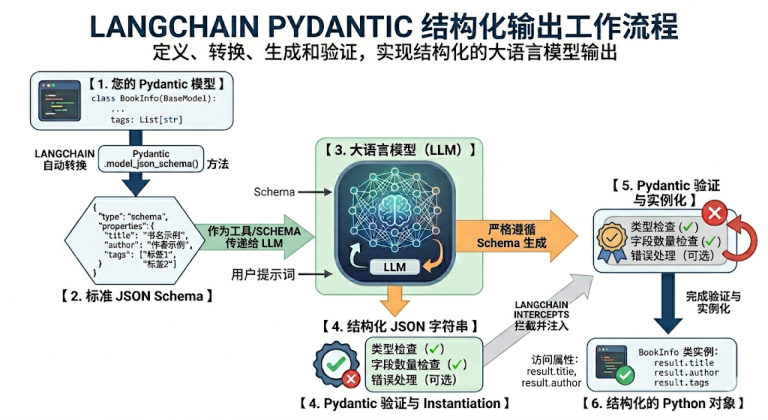

## 什么是结构化输出

**结构化输出（Structured Output）**：要求模型最终返回一个**符合预定义结构的数据对象**（固定字段的 JSON、Pydantic 模型、TypedDict……），而不再是无格式的自然语言文本。

它的核心目标只有一句话：**把「自然语言回答」变成「程序可以稳定消费的数据」**。

同样问一部电影，两种结果对比：

| 输出方式 | 模型返回的内容 |
| --- | --- |
| 自然语言 | `盗梦空间在2010年上映，导演是克里斯托弗·诺兰，评分9.3。` |
| 结构化 | `{"title": "盗梦空间", "year": 2010, "director": "克里斯托弗·诺兰", "rating": 9.3}` |

结构化的三点价值：

- **更容易被代码处理**：下游系统直接读字段，不用再从自然语言里做解析
- **结果更稳定**：减少"模型说法变了但意思差不多"导致的解析失败
- **更适合工程化**：表单抽取、分类、路由、工具参数生成、工作流状态传递

## 传统方式 vs 结构化输出

**传统做法**要四步，每一步都得自己写：

```python
# 1. 提示词要求 JSON
prompt = "以JSON格式返回：{name, age, occupation}"
response = model.invoke(prompt)

# 2. 手动解析
import json
data = json.loads(response.content)

# 3. 手动验证类型
if not isinstance(data['age'], int):
    raise ValueError("age must be int")

# 4. 手动创建对象
person = Person(**data)
```

**结构化输出**一步到位：

```python
structured_llm = model.with_structured_output(Person)
person = structured_llm.invoke("张三是一名 30 岁的软件工程师")
# ✅ 自动解析、验证、创建对象
```

为什么它这么受欢迎？因为传统方式下你得在提示词里"苦口婆心"地求模型"请返回 JSON，不要带任何解释"，然后自己写一堆 `json.loads()` 和 `try...except`。用上 `with_structured_output()` 之后：

| 变化 | 说明 |
| --- | --- |
| **Prompt 变干净了** | 字段的 `description` 直接充当了 Prompt 的一部分 |
| **类型安全** | 编辑器能自动补全，代码运行前就能做类型检查 |
| **极其稳定** | 依托大模型厂商底层的 JSON 模式，输出错误率降到极低 |

## 四种 Schema 模式

LangChain 1.x 支持四种定义方式：

| 模式 | 定义方式 | 特点 |
| --- | --- | --- |
| **Pydantic** | `class Movie(BaseModel)` | 字段校验、描述、嵌套结构，功能最丰富 |
| **TypedDict** | `class Movie(TypedDict)` | 轻量类型约束 |
| **JSON Schema** | 手写字典 | 与前后端/跨语言接口最通用，但繁琐 |
| **@dataclass** | `@dataclass class Movie` | Python 标准库，写法最简 |

> [!IMPORTANT]
> 四种模式的**关键差异**只有两条：
> 1. **只有 Pydantic 返回的是 Schema 类的实例**，其余三种返回的都是字典（`dict`）
> 2. **也只有 Pydantic 在类型不匹配时会抛异常**，其余三种不校验
>
> 本章第 11 篇（Pydantic）和第 12 篇（另外三种模式 + 类型校验实测）会分别展开。

**模型支持情况**：大部分现代模型都通过**函数调用（Tool Calling）**支持结构化输出 ✅ OpenAI、Anthropic、Groq；❌ 某些旧模型不支持——**不支持时 LangChain 会回退到"提示词 + JSON 解析"**。

## 模式1：Pydantic（生产场景首选）

Pydantic 通过在**运行时强制执行类型提示**，确保数据的正确性和一致性，是生产场景的首选。

### 基本使用

```python
import os
from dotenv import load_dotenv
from langchain.chat_models import init_chat_model
from pydantic import BaseModel, Field

load_dotenv(override=True)

model = init_chat_model(
    model="deepseek-v4-flash",
    model_provider="openai",
    base_url=os.getenv("DEEPSEEK_BASE_URL"),
    api_key=os.getenv("DEEPSEEK_API_KEY"),
)

# 1. 定义一个继承 BaseModel 的类，字段用类型提示声明
class Movie(BaseModel):
    """电影信息"""                                    # ← 类的 docstring 会成为 Schema 的 description

    title: str = Field(description="电影标题")         # ← 每个字段都要写清楚描述
    year: int = Field(description="上映年份")
    director: str = Field(description="导演")
    rating: float = Field(description="评分（10分制）")

# 2. 用 with_structured_output 绑定 Schema
structured_llm = model.with_structured_output(Movie)

# 3. 调用
result = structured_llm.invoke("给我介绍下电影《盗梦空间》")

print(result)             # title='盗梦空间' year=2010 director='克里斯托弗·诺兰' rating=9.3
print(type(result))       # <class '__main__.Movie'>  ← Pydantic 对象，不是字典！
print(result.title)       # 直接点属性
```

**三个要点**：

1. 字段类型必须写（`title: str`）——Pydantic 靠它做校验
2. `Field(description=...)` 一定要写——**它会作为说明发给模型**，直接决定抽取准确率
3. 返回的是 `Movie` 实例，可以 `result.title` 这样点出来

## 高级特性：让 Schema 更"听话"

Pydantic 的能力远不止"定义字段"，下面六种情况覆盖了实际开发中的绝大多数需求。

### 情况1：可选字段（Optional）

**问题**：模型没填某些字段怎么办？——用 `Optional` 声明字段可为空。

```python
from typing import Optional

class Person(BaseModel):
    """人物信息"""

    name: str = Field(description="姓名")
    age: Optional[int] = Field(description="年龄")      # ← 允许 null
    occupation: str = Field(description="职业")
```

> [!WARNING]
> **实测发现一个容易误解的点**：只写 `Optional[int]` 而不给默认值时，这个字段在生成的 JSON Schema 里**仍然属于必填**（`required` 列表里依然有它），只是**允许值为 `null`**。
> 查看方式：`Person.model_json_schema()["required"]` → `['name', 'age', 'occupation']`。
> 想让它真正"可以不给"，得配合默认值一起用（见下一条）。

### 情况2：默认值（Field default）

**问题**：模型没提供的信息，用什么兜底？——给字段设默认值。

```python
class ServiceConfig(BaseModel):
    """服务配置"""

    name: str = Field(description="服务名称")
    timeout: Optional[int] = Field(30, description="超时时间(单位秒)")   # ← 位置参数写法
    retry: bool = Field(False, description="是否支持重试")
    max_attempts: int = Field(default=6, description="最大重试次数")     # ← 关键字写法
```

两种写法等价：`Field(30, description=...)`（默认值放在第一个位置）和 `Field(default=100, description=...)`。

> [!NOTE]
> **实测**：带默认值的字段（如 `stock`）不会出现在 JSON Schema 的 `required` 列表里——模型不给就用默认值补齐。
> 另外课程提醒：**不同模型提供商对 `default` 字段的支持程度不一样**，别把关键逻辑押在默认值上。

### 情况3：枚举类型（限制可选值）

**问题**：如何限制字段只能从几个固定值里选？——用枚举。

```python
from enum import Enum

class Priority(str, Enum):          # ← 继承 str，值就是字符串
    LOW = "low"
    MEDIUM = "medium"
    HIGH = "high"

class Ticket(BaseModel):
    """工单信息"""

    name: str = Field(description="客户姓名")
    urgency: Priority = Field(description="紧急程度")
```

**嫌单独定义枚举类太麻烦？** 可以用 `typing` 里的 `Literal`，直接在字段上把允许的值写死：

```python
from typing import Literal

class Ticket(BaseModel):
    """工单信息"""

    name: str = Field(description="客户姓名")
    channel: Literal["电话", "邮件", "在线"] = Field(description="来源渠道")
```

实测两者转成 JSON Schema 后都能正确约束：

```text
# Enum 方式
"urgency": {"$ref": "#/$defs/Priority"}   # 枚举定义放在 $defs 里
# Literal 方式
"channel": {"description": "来源渠道", "enum": ["电话", "邮件", "在线"], "type": "string"}
```

### 情况4：列表提取

一个 Schema 里装**多个对象**时，用 `List[对象模型]`：

```python
from typing import List

class Person(BaseModel):
    """人物信息"""

    name: str
    age: int

class PersonList(BaseModel):
    """人物列表信息"""

    people: List[Person]          # ← 多个 Person 对象

structured_llm = model.with_structured_output(PersonList)
result = structured_llm.invoke("张三 30岁，李四 25岁")
print(result.people[0].name)      # 张三
```

纯字符串列表同理：`pros: List[str] = Field(description="优点列表")`。

### 情况5：嵌套结构

字段的类型可以是**另一个 Pydantic 模型**，层层套起来就是嵌套：

```python
class Actor(BaseModel):
    """演员信息"""

    name: str = Field(description="演员姓名")
    role: str = Field(description="饰演角色")

class Movie(BaseModel):
    """电影信息"""

    title: str = Field(description="电影名")
    cast: List[Actor] = Field(description="演员列表")    # ← 列表 + 嵌套
    rating: float = Field(description="评分")

result = structured_llm.invoke("介绍《盗梦空间》")
for actor in result.cast:
    print(actor.name, actor.role)     # 嵌套数据用 . 一层层访问
```

> [!WARNING]
> **嵌套不要写太深**：LLM 能力有限，复杂嵌套结构容易出错。建议：
> - 嵌套层级 **≤ 3 层**
> - 每层都写清晰的 `description`
> - 实在复杂就**拆成多次调用**（先抽取电影基本信息，再抽取演员表）
>
> ```python
> class Bad(BaseModel):
>     user: User
>     company: Company
>     address: Address
>     country: Country        # 4 层嵌套，容易出错
> ```

### 情况6：限制条件（数值/长度约束）

`Field` 还能加**取值范围约束**——注意这类校验是**本地 Python 侧的兜底**，模型不遵守就直接报错：

```python
from pydantic import BaseModel, Field, ValidationError

class User(BaseModel):
    name: str = Field(min_length=2, max_length=20)
    age: int = Field(ge=0, le=150)        # ge=大于等于, le=小于等于
    email: str

try:
    user = User(name="李四", age=200, email="li@example.com")
except ValidationError as e:
    print(e.errors()[0]["msg"])    # Input should be less than or equal to 150
```

常用的约束参数：

| 参数 | 含义 |
| --- | --- |
| `min_length` / `max_length` | 字符串最小/最大长度 |
| `ge` / `le` | 大于等于 / 小于等于（数值） |
| `gt` / `lt` | 大于 / 小于（数值） |

### 现成可抄的三个示例模型

把前面几种情况拼起来，就是三个真实业务里最常用的"抽取模型"，可以直接抄去改。

**① 情感分析（`SentimentAnalysis`）**——最轻量的分类，顺手抽关键词：

```python
from pydantic import BaseModel, Field

# 定义输出结构
class SentimentAnalysis(BaseModel):
    """情感分析结果"""

    sentiment: str = Field(description="情感倾向：positive/negative/neutral")
    confidence: float = Field(description="置信度，0-1之间")
    keywords: list[str] = Field(description="关键词列表")

# ✅ v1.x：使用 with_structured_output
structured_model = model.with_structured_output(SentimentAnalysis)

# 调用
text = "这个课程内容很实用，学到了很多知识，强烈推荐！"
result = structured_model.invoke(f"分析以下文本的情感：\n{text}")

print(f"类型: {type(result)}")        # <class 'SentimentAnalysis'>
print(f"情感: {result.sentiment}")
print(f"置信度: {result.confidence}")
print(f"关键词: {result.keywords}")
```

输出——**返回的是真正的对象（`type` 显示 `SentimentAnalysis`），不是字典**：

```text
类型: <class '__main__.SentimentAnalysis'>
情感: positive
置信度: 0.99
关键词: ['实用', '学到了很多知识', '强烈推荐']
```

注意 `keywords` 用的是 `list[str]` 写法（小写 `list` + 内置泛型），和 `List[str]` 等价——**两个都能用**。

**② 产品评论分析（`Review`）**——优点/缺点各占一个列表，一次抽一批：

```python
from typing import List
from pydantic import BaseModel, Field

class Review(BaseModel):
    """产品评论"""

    product: str
    rating: int = Field(description="评分 1-5")
    pros: List[str] = Field(description="优点列表")
    cons: List[str] = Field(description="缺点列表")

structured_llm = model.with_structured_output(Review)

review = structured_llm.invoke("""
iPhone 17 很棒！摄像头强大，手感好。但是价格贵，没有充电器。4分。
""")
print(review)
# product='iPhone 17' rating=4 pros=['摄像头强大', '手感好'] cons=['价格贵', '没有充电器']
```

它的**应用场景**：批量处理用户评论、自动生成分析报告、**发现产品改进点**。

**③ 发票信息提取（`Invoice`）**——表格类文本的结构化：

```python
from typing import List
from pydantic import BaseModel, Field

class Invoice(BaseModel):
    """发票信息"""

    invoice_number: str = Field(description="发票号")
    date: str = Field(description="日期")
    total_amount: float = Field(description="总金额")
    items: List[str] = Field(description="商品")

structured_llm = model.with_structured_output(Invoice)

invoice_text = """
发票号: INV-2024-001
日期: 2024-01-15
总金额: 1299.00
商品: MacBook Pro, AppleCare+
"""

invoice = structured_llm.invoke(f"提取发票信息：{invoice_text}")
print(invoice)
# invoice_number='INV-2024-001' date='2024-01-15' total_amount=1299.0 items=['MacBook Pro', 'AppleCare+']
```

它的**应用场景**：自动化财务处理、**OCR 后结构化**、数据录入。

课程给出的一整份**应用场景清单**（值得对着找自己业务的落点）：

| 场景 | 用结构化输出做什么 |
| --- | --- |
| **自动填充 CRM 系统** | 从聊天/邮件里抽出客户姓名、电话、邮箱、诉求 |
| **工单自动分类** | 判定紧急程度、问题类型，自动派单 |
| **客服辅助** | 把对话实时转成客户信息卡片，提示坐席 |
| **批量处理用户评论** | 一次性抽出一批评论的情感、优缺点 |
| **自动生成分析报告** | 把抽取结果直接喂给报表/BI，省掉人工汇总 |
| **发现产品改进点** | 汇总所有 `cons`，按出现频次排序 |
| **OCR 后结构化** | 把 OCR 出来的乱文本整理成字段 |
| **数据录入** | 票据、表单、简历的自动录入 |

## 跨平台实测：同一个 Schema，不同平台差别很大

**同一个 Pydantic 类、同一句提问，换个平台结果就可能不一样。** 课程用两个平台对照做实验：CloseAI 平台的 `gpt-5.4-mini`（`init_chat_model`）和 OpenRouter 平台的 `openai/gpt-5.4-mini`（`ChatOpenRouter`），结论是——**关键字段（默认值、约束）的行为差异，不能忽略**。

### 差异一：`default` 字段

**注意这里的分歧点**：`age` **有默认值**时，两个平台给出了**不同的结果**——

| 平台 | Schema | 结果 | 说明 |
| --- | --- | --- | --- |
| **CloseAI** | `age: int = Field(1, description="年龄")` | `Person(name='张三', age=0, occupation='医生')` | **没按默认值给，直接填了 0** |
| **OpenRouter** | `age: int = Field(1, description="年龄")` | `Person(name='张三', age=1, occupation='医生')` | **使用了 Schema 里的默认值 1** |

**补充一组对照（都在 CloseAI 上，`age` 没有默认值）**——说明"类型本身也会决定缺省值长什么样"：

| Schema | 结果 |
| --- | --- |
| `age: int`（必填） | `Person(name='张三', age=0, occupation='医生')` |
| `age: Optional[int]`（允许为空） | `Person(name='张三', age=None, occupation='医生')` |

再看多字段的 `Config` 例子（`timeout` 默认 30、`retry` 默认 False、`max_attempts` 默认 6，问"配置要求：支持重试，最多重试5次"）：

| 平台 | 结果 |
| --- | --- |
| **CloseAI** | `Config(timeout=None, retry=True, max_attempts=5)` |
| **OpenRouter** | `Config(timeout=None, retry=True, max_attempts=5)` |

**两边都把 `timeout` 填成了 `None` 而不是默认值 30**——说明"默认值"在很多平台上**只是"建议"，不是保证**。

> [!WARNING]
> **别把关键业务逻辑押在 Schema 的默认值上。** 课程明确提醒"不同模型提供商对 default 字段的支持是不同的"。把上面几组实验放在一起看，规律更清楚：
> - **有默认值时，可能被遵守（OpenRouter 给了 1），也可能被无视（CloseAI 给了 0）**；
> - **没有默认值时，`int` 会被填 `0`、`Optional[int]` 会被填 `None`**——都不是你能控制的"业务默认值"；
> - 连"给了 30 的默认值"都照样能拿到 `None`。
>
> 真正需要"缺省就必须是某个值"时，**在拿到结果后用代码兜底**（`result.timeout or 30`），别指望模型和平台。

### 差异二：约束条件（谁在纠正模型？）

给 `Product` 加上严格约束——`price: float = Field(gt=0)`、`stock: int = Field(ge=0)`，然后**故意问一个违法的问题**："华为mate 80 promax 价格是**-7999**，当前库存**-100**"：

| 平台 | 结果 | 表现 |
| --- | --- | --- |
| **CloseAI** | `name='华为mate 80 promax' price=7999.0 stock=100` | **自动纠正了**：负号被去掉，变成合法值 |
| **OpenRouter** | `name='华为mate 80 promax' price=1.0 stock=0` | **给的是脏数据**：`price=1.0`、`stock=0`，虽然"不小于 0"但和事实完全不符 |

也就是说：**CloseAI 平台上的模型压根不会输出违反约束的值**（服务端在解码时就按 Schema 的语法采样，`gt=0` 的数字生成不出来），而 **OpenRouter 上的模型会输出非法值，然后由平台/模型自己"改"成一个合法但无意义的数**。

> [!WARNING]
> **约束条件写在 Schema 里，靠的是"模型遵守 + 平台强约束"，不是本地自动纠正。本机实测（假服务端 + langchain-core 1.2.18）验证了这一点**：让假服务端硬返回 `price=-7999, stock=-100`，本地拿到的是一个 **`ValidationError`，不是被纠正后的对象**：
> ```text
> ValidationError
>   ('price',) greater_than | Input should be greater than 0
>   ('stock',) greater_than_equal | Input should be greater than or equal to 0
> ```
> 所以链条是这样的：**约束是"发出去的说明"**，模型/平台守规矩 → 你拿到干净数据；不守规矩 → **本地 Pydantic 直接报错**（注意：**不会自动重试**，异常直接抛给你的代码）。
> 实际开发中的对策：**约束要写**（它是给模型和平台的强提示），但**拿到结果后必须自己校验一次关键字段**——尤其是"负数、0、超出范围"这类在 OpenRouter 上被观察到过的脏值。

## 内部流程：Schema 是怎么"约束"模型的

调用 `with_structured_output()` 后，LangChain 在背后做了四步：


*图：LangChain Pydantic 结构化输出的完整工作流程（定义 → 转换 → 生成 → 验证）*

**第 1 步：定义结构**（你写代码）

```python
class BookInfo(BaseModel):
    title: str = Field(description="书名")
    author: str = Field(description="作者名字")
    tags: list[str] = Field(description="书籍的标签或分类")
```

**第 2 步：协议转换**（LangChain 自动）

调用 Pydantic 的底层方法（如 `model_json_schema()`）把你的 Python 类转成**标准 JSON Schema**——一段严格的 JSON 文本，描述有哪些字段、类型是什么（`string`、`array`…）、字段的描述：

```python
print(BookInfo.model_json_schema())
# {'properties': {'title': {'description': '书名', 'title': 'Title', 'type': 'string'},
#                 'author': {...}, 'tags': {'items': {'type': 'string'}, 'type': 'array'}},
#  'required': ['title', 'author', 'tags'], 'title': 'BookInfo', 'type': 'object'}
```

**第 3 步：模型交互与强约束**

LangChain 把这个 JSON Schema 包装进 API 请求——**以 Tools（工具/函数调用）的形式**传给大模型。像 OpenAI 的 `strict=True` 还会启动**语法采样约束（Grammar-based sampling）**：模型解码 token 时不是瞎猜，而是严格按 JSON Schema 的语法树选择，从**模型底层**保证输出格式不走样。

**第 4 步：自动解析与验证**

模型返回符合规范的 JSON 字符串后，由解析器接管：

1. **解析（Parsing）**：字符串 → Python 字典
2. **验证（Validation）**：字典 → 喂给 Pydantic 模型，自动检查类型（漏了必填字段或类型错误 → 直接抛验证错误）
3. **返回（Return）**：通过后拿到的是可直接 `result.title` 点属性的 Pydantic 对象，而不是冷冰冰的字符串

## 相关

- [Tools进阶与实战](/posts/编程学习/langchain学习笔记/10-tools进阶与实战/)
- [另外三种模式与类型校验](/posts/编程学习/langchain学习笔记/12-另外三种模式与类型校验/)
- [模型的调用](/posts/编程学习/langchain学习笔记/05-模型的调用/)

## 练习题

### 一、回忆填空（写完再展开对答案）

1. 结构化输出要求模型返回一个符合____的**数据对象**，核心目标只有一句话：把「自然语言回答」变成「程序可以____的数据」；它的三点价值是更容易被代码处理、结果更____、更适合____
2. 传统做法要四步：提示词要求 JSON → 手动____ → 手动验证类型 → 手动创建对象；结构化输出只要绑定一次就同时完成"解析、验证、创建对象"；带来的三个变化是 Prompt 变干净了（字段的____直接充当 Prompt）、类型____、极其____
3. 四种模式里，只有____返回 Schema 类的实例、也只有它在类型不匹配时会____，其余三种返回的都是____；模型不支持函数调用时，LangChain 会回退到"____ + JSON 解析"
4. Pydantic 的三个要点：字段的____必须写、`____(description=...)` 一定要写（它会作为说明发给模型）、返回的是可以直接点属性的____；类的 docstring 会成为 Schema 的____
5. 只写 `Optional[int]` 而不给默认值时，字段仍然属于____（`model_json_schema()["____"]` 里能看到它），只是允许值为 ____；`Field(default=100, ...)` 与 `Field(100, ...)` 等价，而带默认值的字段**不会**出现在 ____ 列表里——但不同提供商对默认值的支持程度不同
6. 限制字段只能取固定几个值：可以定义 `class Priority(str, ____)`（枚举定义会放在 JSON Schema 的 `$defs` 里），也可以直接用 `typing.____["电话", "邮件", "在线"]` 把允许值写在字段上
7. 课程给的三个现成示例模型：情感分析 `SentimentAnalysis`、产品评论 ____、发票信息 ____；应用场景里，把评论的____ 列表汇总、按出现频次排序，就是"**发现产品改进点**"
8. 一次抽多个对象用 `List[Person]`；字段的类型本身是另一个模型就是____结构（比如电影里的演员列表），嵌套层级建议不超过 ____ 层，太复杂就**拆成多次____**
9. 约束参数：`ge` / ____ 是大于等于 / 小于等于，`gt` / `lt` 是大于 / 小于，字符串长度用 `min_length` / ____；这类校验是____侧的兜底，模型不遵守就直接抛 `ValidationError`（**不会自动重试**）
10. 内部四步：定义结构 → ____转换 → 包装成____发给模型做语法采样强约束 → 自动解析与____；跨平台实测的两条结论是——Schema 默认值可能被遵守也可能被____（拿到结果后要自己用代码____），约束被违反时平台可能自动____、也可能给一串____

> [!TIP]- 填空答案（做完再点开）
> 1. 预定义结构 / 稳定消费 / 稳定 / 工程化　2. 解析 / `description` / 安全 / 稳定　3. Pydantic / 抛异常 / 字典（dict） / 提示词　4. 类型（类型提示） / `Field` / Pydantic 对象（实例） / description　5. 必填（required） / required / null / `required`　6. `Enum` / `Literal`　7. `Review` / `Invoice` / `cons`（缺点列表）　8. 嵌套 / 3 / 调用　9. `le` / `max_length` / 本地 Python　10. 协议（JSON Schema） / Tools（工具） / 验证 / 无视 / 兜底 / 纠正 / 脏数据

### 二、裸写题

- [ ] **2-1 最简结构化输出**
  定义一个电影信息结构（片名、上映年份、导演、评分四个字段，每个字段都要写中文说明），让模型**只返回这个结构**而不是一段话；打印抽到的对象、它的类型，以及片名字段。

  > [!TIP]- 提示（先自己想，实在想不出再点开）
  > **一级 · 思路**：三件事——定义类、把类绑给模型、调用后看返回的类型
  > **二级 · 方法**：`class Movie(BaseModel)` + `model.with_structured_output(Movie)`
  > **三级 · 骨架**：`year: int`、`rating: float` 的类型要写对；类里每个字段用 `Field(description="...")` 写清说明

- [ ] **2-2 高级字段一次练全**
  定义一个工单结构：客户姓名（必填）、年龄（可为空）、相关产品库存（默认 100）、紧急程度（只能取 low / medium / high）、来源渠道（只能"电话 / 邮件 / 在线"三选一）。让模型从一段客服对话里抽取，打印这份结构的**必填字段清单**、抽取结果，以及紧急程度的原始字符串值。

  > [!TIP]- 提示（先自己想，实在想不出再点开）
  > **一级 · 思路**：重点在"字段声明"，不在模型调用；打印必填清单是为了看清"可选 ≠ 可以不给"
  > **二级 · 方法**：`Optional[int]`、`Field(default=100, description=...)`、`class Priority(str, Enum)`、`Literal["电话","邮件","在线"]`
  > **三级 · 骨架**：打印 `Ticket.model_json_schema()["required"]` 时观察——`age` 和 `stock` 的表现一样吗？枚举值要用 `.value` 取原始字符串

- [ ] **2-3 嵌套 + 列表抽取**
  定义一个演员结构（姓名、饰演角色）和一个电影结构（片名、演员列表、评分，其中演员列表的类型是"演员结构的列表"），让模型介绍一部电影，然后遍历结果里的演员列表打印每个人的姓名和角色。

  > [!TIP]- 提示（先自己想，实在想不出再点开）
  > **一级 · 思路**：列表字段 = 一次抽一批；嵌套模型 = 字段本身是对象
  > **二级 · 方法**：`cast: List[Actor] = Field(description="演员列表")`
  > **三级 · 骨架**：`for actor in result.cast: print(actor.name, actor.role)`——嵌套数据用点号一层层访问

- [ ] **2-4 严格约束 + 兜底校验**
  给商品结构加上严格约束：价格必须大于 0、库存不能为负。然后故意问一个"违法"的问题（比如"华为mate 80 promax 价格是 -7999，当前库存 -100"），做三件事：① 用 `try/except` 接住校验失败的异常并打印错误信息；② 在成功分支里用代码把不合理的关键字段兜底成 7999 / 0；③ 记下这次校验失败**只发了一次请求**（说明框架不会自动重试）。

  > [!TIP]- 提示（先自己想，实在想不出再点开）
  > **一级 · 思路**：约束是"发给模型的说明"，不是本地自动纠正——所以"约束要写"和"拿到结果自己校验"两件事都要做
  > **二级 · 方法**：`Field(gt=0, description=...)`、`Field(ge=0, description=...)`、`except ValidationError as e` + `e.errors()`
  > **三级 · 骨架**：`price = p.price if p.price > 0 else 7999.0`、`stock = max(p.stock, 0)`；想亲眼看异常，可以照第 12 篇的假服务端让它硬返回负数

> [!TIP]- 参考答案（做完再点开）
> ```python
> import os
> from enum import Enum
> from typing import List, Literal, Optional
>
> from dotenv import load_dotenv
> from langchain.chat_models import init_chat_model
> from pydantic import BaseModel, Field, ValidationError
>
> load_dotenv(override=True)
>
> model = init_chat_model(
>     model="deepseek-v4-flash",
>     model_provider="openai",
>     base_url=os.getenv("DEEPSEEK_BASE_URL"),
>     api_key=os.getenv("DEEPSEEK_API_KEY"),
> )
>
> # ---------- 2-1 最简结构化输出 ----------
> class Movie(BaseModel):
>     """电影信息"""
>
>     title: str = Field(description="电影标题")
>     year: int = Field(description="上映年份")
>     director: str = Field(description="导演")
>     rating: float = Field(description="评分（10分制）")
>
> structured_llm = model.with_structured_output(Movie)
> result = structured_llm.invoke("给我介绍下电影《盗梦空间》")
> print(result)
> print(type(result))          # <class '__main__.Movie'>：是对象，不是字典
> print(result.title)
>
> # ---------- 2-2 高级字段一次练全 ----------
> class Priority(str, Enum):
>     LOW = "low"
>     MEDIUM = "medium"
>     HIGH = "high"
>
> class Ticket(BaseModel):
>     """客服工单信息"""
>
>     name: str = Field(description="客户姓名")
>     age: Optional[int] = Field(description="客户年龄")
>     stock: int = Field(default=100, description="相关产品库存")
>     urgency: Priority = Field(description="紧急程度")
>     channel: Literal["电话", "邮件", "在线"] = Field(description="来源渠道")
>
> print(Ticket.model_json_schema()["required"])
> # ['name', 'age', 'urgency', 'channel'] ← age 虽可选，但没默认值，仍算必填
>
> ticket_llm = model.with_structured_output(Ticket)
> t = ticket_llm.invoke("客户王先生打来电话，说他买的键盘坏了，很着急要退货")
> print(t)
> print(t.urgency.value)       # 枚举取值用 .value
>
> # ---------- 2-3 嵌套 + 列表抽取 ----------
> class Actor(BaseModel):
>     """演员信息"""
>
>     name: str = Field(description="演员姓名")
>     role: str = Field(description="饰演角色")
>
> class MovieDetail(BaseModel):
>     """电影详情"""
>
>     title: str = Field(description="电影名")
>     cast: List[Actor] = Field(description="演员列表")
>     rating: float = Field(description="评分（10分制）")
>
> movie_llm = model.with_structured_output(MovieDetail)
> m = movie_llm.invoke("介绍《盗梦空间》的主演和评分")
> for actor in m.cast:
>     print(actor.name, "饰演", actor.role)
> print("评分:", m.rating)
>
> # ---------- 2-4 严格约束 + 兜底校验 ----------
> class Product(BaseModel):
>     """商品信息"""
>
>     name: str = Field(description="商品名称")
>     price: float = Field(gt=0, description="价格，必须大于 0")
>     stock: int = Field(ge=0, description="库存，不能为负")
>
> product_llm = model.with_structured_output(Product)
>
> try:
>     p = product_llm.invoke("华为mate 80 promax 价格是 7999，当前库存 100")
>     # 约束只是"发给模型的说明"：模型守规矩就拿到干净数据，不守规矩这里会直接抛 ValidationError
>     price = p.price if p.price > 0 else 7999.0     # ← 兜底：脏数据用代码补回来
>     stock = max(p.stock, 0)
>     print(p)
>     print("兜底后:", price, stock)
> except ValidationError as e:
>     # 平台/模型硬塞了违反约束的值时走这里（本地不会自动纠正，也不会自动重试）
>     print("数据违反约束，本地校验直接报错：")
>     for err in e.errors():
>         print(err["loc"], err["msg"])
>
> # 实测（假服务端硬返回 price=-7999, stock=-100）：
> # ('price',) Input should be greater than 0
> # ('stock',) Input should be greater than or equal to 0
> ```

### 三、综合题

- [ ] **3-1 批量评论分析小流水线**
  分三步做：
  1. 定义两个结构：**产品评论**（产品名、评分、优点列表、缺点列表）和**情感分析结果**（情感倾向、置信度、关键词列表）
  2. 准备 3 条中文评论，逐条抽成评论对象，打印产品名 / 评分 / 优缺点
  3. 把所有评论的**缺点**汇总起来，按出现次数从多到少排序打印（这就是"发现产品改进点"）；最后再对一句话做一次情感 + 关键词抽取

  > [!TIP]- 提示（先自己想，实在想不出再点开）
  > **一级 · 思路**：两个 Schema 是"一次抽一批"和"轻量分类"的典型代表，重点是抽完之后的**代码处理**
  > **二级 · 方法**：`List[str] = Field(description="缺点列表")`、`list[str]` 与 `List[str]` 等价、`collections.Counter(...).most_common(3)`
  > **三级 · 骨架**：先用 `structured_llm = model.with_structured_output(Review)`，循环里 `all_cons.extend(r.cons)`，最后 `Counter(all_cons).most_common(3)`

> [!TIP]- 参考答案（做完再点开）
> ```python
> from collections import Counter
> from typing import List
>
> from pydantic import BaseModel, Field
>
> # ---------- 第 1 步：两个结构 ----------
> class Review(BaseModel):
>     """产品评论"""
>
>     product: str = Field(description="产品名称")
>     rating: int = Field(description="评分 1-5")
>     pros: List[str] = Field(description="优点列表")
>     cons: List[str] = Field(description="缺点列表")
>
> class SentimentAnalysis(BaseModel):
>     """情感分析结果"""
>
>     sentiment: str = Field(description="情感倾向：positive/negative/neutral")
>     confidence: float = Field(description="置信度，0-1之间")
>     keywords: list[str] = Field(description="关键词列表")     # list[str] 与 List[str] 等价
>
> review_llm = model.with_structured_output(Review)
> sentiment_llm = model.with_structured_output(SentimentAnalysis)
>
> # ---------- 第 2 步：批量抽取 ----------
> review_texts = [
>     "iPhone 17 很棒！摄像头强大，手感好。但是价格贵，没有充电器。4分。",
>     "这款耳机音质不错，佩戴舒服。缺点是价格贵，续航也短。3分。",
>     "平板屏幕很清晰，性能强。就是价格贵。5分。",
> ]
>
> all_cons: List[str] = []
> for text in review_texts:
>     r = review_llm.invoke(f"分析这条产品评论：{text}")
>     print(f"[{r.product}] {r.rating} 分 | 优点 {r.pros} | 缺点 {r.cons}")
>     all_cons.extend(r.cons)
>
> # ---------- 第 3 步：汇总改进点 + 单条情感分析 ----------
> print("改进点排行：", Counter(all_cons).most_common(3))
> # 改进点排行： [('价格贵', 3), ('没有充电器', 1), ('续航也短', 1)]
>
> s = sentiment_llm.invoke("分析以下文本的情感：这个课程内容很实用，学到了很多知识，强烈推荐！")
> print("情感:", s.sentiment, "置信度:", s.confidence, "关键词:", s.keywords)
> # 情感: positive 置信度: 0.99 关键词: ['实用', '学到了很多知识', '强烈推荐']
> ```
