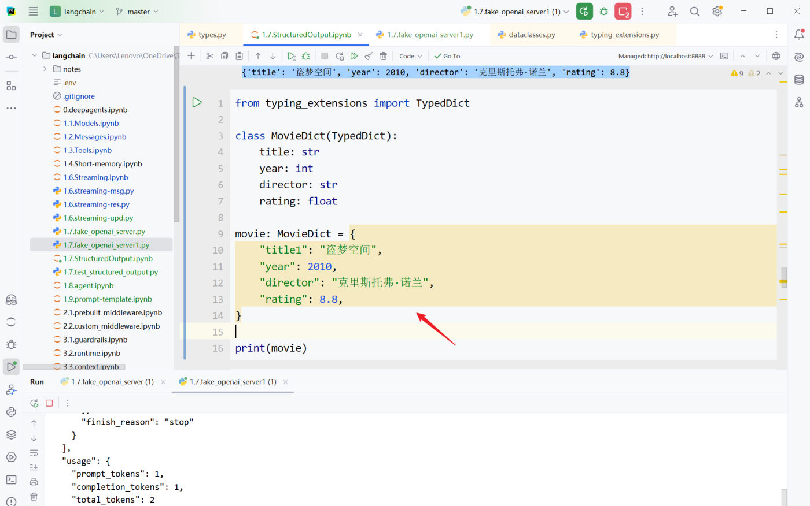

上一篇讲的是 Pydantic（功能最全、唯一会校验）。这一篇补齐另外三种 Schema 写法，并用一个**假服务端**实测它们遇到"字段不匹配"时到底会怎样。

## 模式2：TypedDict（轻量的字典结构）

`TypedDict` 是 Python 3.8+ 引入的**类型提示**工具——带有类型声明的字典结构，适合"快速定义字典结构、又不需要 Pydantic 那套重量级功能"的场景。

**普通 dict 没有类型信息**，看不出该有哪些字段：

```python
{
    "title": "盗梦空间",
    "year": 2010,
    "director": "克里斯托弗·诺兰",
    "rating": 9.3
}
```

**TypedDict 可以进一步说明**：这个字典应该有哪些字段、每个字段是什么类型：

```python
from typing_extensions import TypedDict

class MovieDict(TypedDict):
    title: str
    year: int
    director: str
    rating: float

movie: MovieDict = {
    "title1": "盗梦空间",     # ← 故意写错字段名
    "year": 2010,
    "director": "克里斯托弗·诺兰",
    "rating": 8.8,
}
print(movie)
# {'title1': '盗梦空间', 'year': 2010, 'director': '克里斯托弗·诺兰', 'rating': 8.8}
```


*图：字段名故意写成 title1 的 TypedDict 示例（课程实测截图）*

> [!WARNING]
> **TypedDict 主要是类型声明，不是运行时强校验器**。
> 上面字段名 `title` 写成了 `title1`，**只有 IDE 的静态类型检查会标记**，运行起来照样输出——不会抛异常。

### Annotated：给类型附加说明

`Annotated` 用来在"类型"之外再附加额外信息（即元数据），作用类似 Pydantic 的 `Field`：

```python
Annotated[类型, 附加信息1, 附加信息2, ...]
```

```python
from typing_extensions import TypedDict, Annotated

class MovieDict(TypedDict):
    """电影的详细信息"""

    title: Annotated[str, ..., "电影标题"]
    year: Annotated[int, ..., "电影上映年份"]
    director: Annotated[str, Ellipsis, "导演"]
    rating: Annotated[float, "电影评分，满分十分"]
```

`...` 是 Python 的字面量，等价于 `Ellipsis`，**可以理解为占位符**：下游框架（如 LangChain）能对它做定制化处理——在 LangChain 里 **`Annotated` 的 `...` 表示"该字段必须存在、不可省略"**，用来指示模型的输出。

课程用真实模型验证过一次"必填 vs 非必填"的区别：让模型抽取"盗梦空间上映于2010年，我们并不知道它的导演是谁"。

| 字段 | 标记 | 输出结果 |
| --- | --- | --- |
| `director` | `Annotated[str, ..., "导演"]`（必填） | 字典里**有**这个键，值为空字符串 `''` |
| `rating` | `Annotated[float, "电影评分，满分十分"]`（未标记必填） | 字典里**直接没有**这个键 |

### 嵌套结构：把列表塞进字典

`TypedDict` 也能定义**嵌套**——字段的值是"另一个 TypedDict 的列表"，写法是 `Annotated[List[Actor], "演员列表"]`：

```python
from typing import TypedDict, List, Annotated

# 使用 TypedDict 定义嵌套结构
class Actor(TypedDict):
    """演员情况"""

    name: Annotated[str, "演员姓名"]
    role: Annotated[str, "饰演的角色"]

class Movie(TypedDict):
    """电影情况"""

    title: Annotated[str, "电影标题"]
    year: Annotated[int, "上映年份"]
    director: Annotated[str, "导演"]
    cast: Annotated[List[Actor], "演员列表"]      # ← 嵌套列表定义
    rating: Annotated[float, "评分"]

structured_llm = model.with_structured_output(Movie)

resp = structured_llm.invoke("给我介绍下电影《盗梦空间》")

# 访问嵌套数据：字典就用 ['键'] 一层层取
print(f"电影名: {resp['title']}")
print(f"上映年份: {resp['year']}")
print(f"导演: {resp['director']}")
print(f"演员列表:{resp['cast']}")
print(f"评分: {resp['rating']}")
```

输出——**和 Pydantic 的 `.cast[0].name` 不同，TypedDict 全程是字典取值**：

```text
电影名: 盗梦空间
上映年份: 2010
导演: 克里斯托弗·诺兰
演员列表:[{'name': '莱昂纳多·迪卡普里奥', 'role': '多姆·柯布'}, {'name': '约瑟夫·高登-莱维特', 'role': '亚瑟'}, {'name': '艾伦·佩吉', 'role': '阿里阿德涅'}, {'name': '汤姆·哈迪', 'role': '伊姆斯'}, {'name': '渡边谦', 'role': '斋藤'}]
评分: 8.8
```

> [!IMPORTANT]
> **取值方式是最容易踩的差异**：
> - Pydantic：`result.cast[0].name`（**点属性**）
> - TypedDict / JSON Schema / dataclass：`resp["cast"][0]["name"]`（**方括号**）
>
> `resp['cast']` 本身就是一个**普通列表**，里面的元素是**普通字典**——没有任何对象包装。所以"用过 Pydantic 再换 TypedDict"，第一件事就是把点号全改回方括号。
>
> **实测（本机 + 假服务端）**：`resp = {'title': '盗梦空间', ..., 'cast': [{...}, {...}], 'rating': 8.8}`，`type(resp)` 是 `dict`，`resp['cast'][0]['name']` 取到 `'莱昂纳多·迪卡普里奥'`——与课程一致。

### `...` 的厂商差异

前面说"`...` 表示字段必须存在"，但**缺字段时到底填什么，和模型提供商有关系**。

同一个 `MovieDict`（四个字段全标 `...`），问"根据这段话抽取盗梦空间的信息，不包含的信息可以留空：盗梦空间在 2010 年上映，导演是克里斯托弗·诺兰"（**没提评分**）：

| 平台 | 输出 | 表现 |
| --- | --- | --- |
| **CloseAI**（`gpt-5.4-mini`） | `{'title': '盗梦空间', 'year': 2010, 'director': '克里斯托弗·诺兰'}` | **直接省略了**未标记必填的字段 |
| **OpenRouter**（`openai/gpt-5.4-mini`） | `{'title': '盗梦空间', 'year': 2010, 'director': '克里斯托弗·诺兰', 'rating': 0}` | **补了一个 `rating=0`** |

**一个"省略"，一个"补 0"**——都是"必填标记"被处理的方式，但结果完全不同。

再看"标记必填 vs 没标记"的对照实验（同一份 Schema，其中 `director` 标 `...`、`rating` 不标），问"盗梦空间上映于2010年，**我们并不知道它的导演是谁**"：

```text
{'title': '盗梦空间', 'year': 2010, 'director': ''}
```

**`director` 和 `rating` 的信息都缺失，但前者被标记为必填，因此输出的字典包含该字段、值为空字符串；而 `rating` 字段被直接省略了。**

> [!WARNING]
> **"必填"的语义只保证"键存在"，不保证"值有内容"**——必填字段拿不到信息时就给 `''`（或 `0`），照样能把你的下游逻辑骗过去。
> 加上厂商差异（**OpenRouter 会给未标记的字段也补 `rating=0`，CloseAI 会省略**），结论是：**判断"字段到底有没有抽到值"，不要只看键在不在**。
> ```python
> # 不推荐：键在就以为抽到了
> if "rating" in resp: ...
> # 推荐：连值一起判断（必填字段可能是 '' / 0）
> if resp.get("rating"): ...
> ```

## 模式3：JSON Schema（不推荐）

这种方式需要**按 JSON Schema 规范手写字典**，比较繁琐，并且**缺少校验机制**，课程明确不推荐：

```python
project_schema = {
    "title": "MovieInfo",
    "description": "包含电影标题、上映年份、导演、演员和评分的电影对象",
    "type": "object",
    "properties": {
        "title": {"type": "string", "description": "电影标题"},
        "year": {"type": "integer", "description": "上映年份"},
        "director": {"type": "string", "description": "导演"},
        "cast": {                                   # 嵌套数组要手写到底
            "type": "array",
            "description": "演员列表",
            "items": {
                "type": "object",
                "properties": {
                    "name": {"type": "string", "description": "演员姓名"},
                    "role": {"type": "string", "description": "演员角色"},
                },
                "required": ["name", "role"],
            },
        },
        "rating": {"type": "number", "description": "评分（10分制）"},
    },
    "required": ["title", "year", "director", "cast", "rating"],
}

structured_model = model.with_structured_output(project_schema)
response = structured_model.invoke("生成一个关于《星际穿越》的电影信息，包含导演、演员、评分")
print(response)      # 返回字典
```

**唯一的优势**：与前后端/跨语言接口最通用（JSON Schema 本身是通用标准，不绑定 Python）。**代价**：嵌套稍微深一点就写得又长又容易出错。

### 显式指定 `method="json_schema"`

上面那次 JSON Schema 的调用，其实是"透传"路线——**JSON Schema 也可以走它自己的专用模式**，用 `method` 参数显式指定：

```python
json_schema = {
    "title": "Movie",
    "description": "A movie with details",
    "type": "object",
    "properties": {
        "title": {"type": "string", "description": "The title of the movie"},
        "year": {"type": "integer", "description": "The year the movie was released"},
        "director": {"type": "string", "description": "The director of the movie"},
        "rating": {"type": "number", "description": "The movie's rating out of 10"},
    },
    "required": ["title", "year", "director", "rating"],
}

structured_model = model.with_structured_output(
    json_schema,
    method="json_schema",          # ← 显式指定走服务器的 json_schema 模式
)

response = structured_model.invoke("给出盗梦空间的信息")
print(response)      # 返回字典：{'title': '盗梦空间', 'year': 2010, 'director': '克里斯托弗·诺兰', 'rating': 8.8}
print(type(response))    # <class 'dict'>
```

两个必须知道的点：

1. **`method` 是否可用，依赖于模型供应商及 LangChain 适配器的具体实现**。课程明确说明：**DeepSeek 模型服务不支持 `json_schema` 模式**——所以这行代码在 DeepSeek 上跑不通，**要挑支持它的平台**。
2. **`json_schema` 字典里的关键字是固定写法**（遵循 JSON Schema 规范），课程给出了逐项解释：

| 关键字 | 含义 |
| --- | --- |
| `title` | 为整个 Schema 或特定属性提供一个**人类可读的标题**，**不能是中文**，用于提高可读性 |
| `description` | 更详细的文字描述，说明 Schema 或属性的用途，和 `title` 一样旨在帮助理解 |
| `type` | 定义当前数据节点必须是什么数据类型（`string`、`number`、`integer`、`boolean`、`object`、`array`、`null`） |
| `properties` | 定义 JSON 对象里**可以包含哪些属性（键）**，以及每个属性对应的值类型和说明 |
| `required` | 当 `type` 为 `"object"` 时使用，**数组**，列出对象中必须存在的属性名 |

> [!NOTE]
> **`title` 不能是中文**——而 `title` 同时还被当作**工具/函数的 name**（`convert_to_openai_function` 会 `pop("title")` 拿来做函数名），所以它得是个合法标识符。想写中文说明就放到 `description` 里。
> 另外注意：上面"**不传 `method`**"的写法，LangChain 会走**工具调用（Tool Calling）**路线把 Schema 递过去；**显式传 `method="json_schema"`** 才是用平台自己的 `response_format` 式的强约束能力。**两种路线在支持性上不是一回事**：Tool Calling 大多数模型都支持，`json_schema` 模式则要看平台脸色。

## 模式4：@dataclass

`@dataclass` 是 Python 标准库 `dataclasses` 提供的类装饰器，用于简化"以字段为核心"的数据类定义。加上它以后，Python 会根据字段声明**自动生成常用方法**：

- `__init__`
- `__repr__`
- `__eq__`

```python
from dataclasses import dataclass
from pydantic import Field

@dataclass
class Movie:
    """电影的详细信息"""

    title: str = Field(description="电影标题")
    year: int = Field(description="电影上映年份")
    director: str = Field(description="导演")
    rating: float = Field(description="电影评分，满分十分")

structured_model = model.with_structured_output(Movie)
response = structured_model.invoke("给出盗梦空间的信息")
print(response)          # {'title': '盗梦空间', 'year': 2010, ...}
print(type(response))    # <class 'dict'>   ← 未经校验的字典
```

> [!IMPORTANT]
> **`@dataclass` 修饰的类 ≠ 手写 `__init__` 的普通类**。虽然行为上很接近，但 `@dataclass` 修饰后会携带字段元信息，**所以它能作为 LangChain 的 Schema**。
>
> 课程说"手写 `__init__` 的普通类不能当 Schema"，**实测要打个补丁**：普通类不是"能用"，而是**看写法**——两种结果都不能用：
>
> | 写法 | 实测结果（langchain-core 1.2.18） |
> | --- | --- |
> | 只在 `__init__` 参数上写注解（`def __init__(self, title: str, ...)`） | ❌ 直接抛 `KeyError: 'title'` |
> | 在类级别写注解（`title: str`）+ 手写 `__init__` | ⚠️ 不报错，但生成的 Schema 里每个字段都是**空对象** |
>
> ```text
> # 类级注解写法的结果：字段既没有类型也没有描述
> "parameters": {"properties": {"title": {}, "year": {}}, "required": ["title", "year"], "type": "object"}
> # 对比 @dataclass 版本：{"title": {"description": "电影标题", "type": "string"}, ...}
> ```
>
> 所以结论是：**@dataclass 可以用；手写 `__init__` 的普通类要么报错、要么字段描述全丢**（模型等于在盲抽，抽取质量无从保证）。

## 类型校验：用一个假服务端看清楚

前面反复说"只有 Pydantic 会校验"，怎么**亲眼看到**这个差异？——自己造一个假的模型服务端。

**fake server 的作用**：客户端收到的响应是**人为构造**的，从而能观察不同模式下 LangChain 会从响应里的哪些字段抽取信息、以及会不会校验。

### 服务端：固定返回一份"字段不匹配"的响应

```python
import json
import time
from http.server import BaseHTTPRequestHandler, HTTPServer

# 故意把 title 写成 title1，并且不返回 year
FAKE_ARGS = {"title1": "盗梦空间", "director": "克里斯托弗·诺兰", "rating": 9.3}

class FakeDeepSeekHandler(BaseHTTPRequestHandler):
    def do_POST(self):
        content_length = int(self.headers.get("Content-Length", 0))
        raw_body = self.rfile.read(content_length).decode("utf-8")
        json_body = json.loads(raw_body)

        # 用客户端请求里的工具名回填，模拟"模型按 Schema 返回"
        response = {
            "id": "chatcmpl-test",
            "object": "chat.completion",
            "created": int(time.time()),
            "model": "any",
            "choices": [
                {
                    "index": 0,
                    "message": {
                        "role": "assistant",
                        "content": "",
                        "tool_calls": [
                            {
                                "id": "call_1",
                                "type": "function",
                                "function": {
                                    "name": json_body["tools"][0]["function"]["name"],
                                    "arguments": json.dumps(FAKE_ARGS, ensure_ascii=False),
                                },
                            }
                        ],
                    },
                    "finish_reason": "tool_calls",
                }
            ],
            "usage": {"prompt_tokens": 1, "completion_tokens": 1, "total_tokens": 2},
        }
        data = json.dumps(response, ensure_ascii=False).encode()
        self.send_response(200)
        self.send_header("Content-Type", "application/json")
        self.send_header("Content-Length", str(len(data)))
        self.end_headers()
        self.wfile.write(data)

    def log_message(self, *args):
        pass

if __name__ == "__main__":
    server = HTTPServer(("127.0.0.1", 8889), FakeDeepSeekHandler)
    print("fake server 已启动: http://127.0.0.1:8889")
    server.serve_forever()
```

服务端只是把客户端发来的请求**打印出来**，再用请求里的工具名回填一份固定响应——所以任何兼容 OpenAI 接口的客户端都能接上去。

### 客户端：把 `api_base` 指向假服务端

```python
from langchain_deepseek import ChatDeepSeek
from pydantic import SecretStr

model = ChatDeepSeek(
    model="deepseek-v4-flash",
    api_base="http://localhost:8889",      # ← 指向假服务端
    api_key=SecretStr("<KEY>"),
)
```

### 课程版响应里的两个细节

假服务端"造假"的方式，课程选得很有讲究——**每一处都对应一个要验证的问题**：

```python
"arguments": json.dumps(
    {'title1': '盗梦空间', 'year2': 2010, 'director': '克里斯托弗·诺兰', 'rating': 9.3},
    ensure_ascii=False
)
```

**细节一：固定响应故意错两个字段（`title1` 和 `year2`）**。Schema 里要的是 `title` 和 `year`：

```json
// 假服务端返回的
{"title1": "盗梦空间", "year2": 2010, "director": "克里斯托弗·诺兰", "rating": 9.3}
// LangChain 期望的
{"title": "xxx", "year": xxxx, "director": "xxx", "rating": xxx}
```

**前两个字段不匹配**——所以 Pydantic 会报 **2 个** `Field required` 错误，而不是 1 个。错两个字段比错一个更有说服力：既证明"键名对不上会被发现"，也证明"字段缺失会被发现"。

**细节二：`finish_reason` 用 `"stop"`**（而不是 `"tool_calls"`）。这看起来"不对"，但**正是这个实验想验证的**：客户端解析工具调用时**不看 `finish_reason`**——只要 `choices[0].message.tool_calls` 有内容就照单全收。故意把它写成 `"stop"`，观察结果是否仍然一致。

> [!NOTE]
> **本机实测（langchain-core 1.2.18 + 同款假服务端）**：把这两个细节都还原（`title1`/`year2`、`finish_reason: "stop"`）后：
> - **Pydantic**：抛 `ValidationError: 2 validation errors for MovieModel`，两条都是 `Field required`（正好是 `title` 和 `year`）；
> - **TypedDict**：原样返回 `{'title1': '盗梦空间', 'year2': 2010, 'director': '克里斯托弗·诺兰', 'rating': 9.3}`，**两个错误键名都保留**；
> - **`finish_reason: "stop"` 完全没有影响解析**——结论和课程一致：**`tool_calls` 是否存在，才是"模型要调工具"的唯一判据**。
>
> 顺带一个有用的发现：`with_structured_output` 发出去的请求里，**`tool_choice` 会被设成"必须调用这个特定函数"**：
> ```json
> "tool_choice": {"type": "function", "function": {"name": "MovieModel"}}
> ```
> 也就是说结构化输出本质上是"**强制调用一个名叫 `MovieModel` 的假工具，把它返回的参数当成结果**"——这正是它能绕开"模型爱写解释性文字"的原因（第 11 篇第 3 步"模型交互与强约束"的落地细节）。

### 实测结果：四种模式的差异

用同一份"字段不匹配"的响应，四种模式跑下来（本机用 `langchain_deepseek` + fake server 复现过）：

| 模式 | 结果 | 返回类型 |
| --- | --- | --- |
| **Pydantic** | ❌ 抛 `ValidationError`：`title` 和 `year` 两个字段 `Field required` | —— |
| **TypedDict** | ✅ 原样返回，**错误键名 `title1` 都保留**：`{'title1': '盗梦空间', 'director': '...', 'rating': 9.3}` | `dict` |
| **JSON Schema** | ✅ 原样返回（同上） | `dict` |
| **@dataclass** | ✅ 原样返回（同上） | `dict` |

> [!TIP]- 小结
> **用 Pydantic 定义 Schema，接收到响应后会进行校验，字段不匹配则抛出异常；其余三种方式不校验。**
>
> 顺带一个实测细节：Pydantic 校验失败时**不会自动重试**（假服务端只收到 1 次请求），异常直接抛给你的代码——要不要重试、怎么重试由你自己决定。

## 附一：include_raw=True 拿到原始响应

`with_structured_output` 可以传 `include_raw=True`，表示**同时返回解析前的原始 `AIMessage`**，从而访问令牌用量等元数据：

```python
model_with_structure = model.with_structured_output(Movie, include_raw=True)
resp = model_with_structure.invoke("给我介绍下电影《星际穿越》")

print(type(resp))                # <class 'dict'>
print(list(resp.keys()))         # ['raw', 'parsing_error', 'parsed']
print(resp["parsed"])            # 解析后的 Movie 对象
print(resp["raw"].usage_metadata)  # {'input_tokens': 373, 'output_tokens': 93, 'total_tokens': 466, ...}
```

返回的是**三个字段**：

| 键 | 含义 |
| --- | --- |
| `raw` | 原始 `AIMessage`（含 token 用量等元数据） |
| `parsed` | 解析后的输出（Pydantic 对象） |
| `parsing_error` | 解析/校验错误（正常时为 `None`） |

> [!NOTE]
> **实测补充**：加上 `include_raw=True` 后，**Pydantic 的校验失败不再抛异常**，而是变成"正常返回 + `parsed=None` + `parsing_error` 里带错误信息"。所以想"失败时降级处理"而不是让程序崩掉，可以走这条路。

## 附二：用输出解析器获取结构化结果（不推荐）

除了 `with_structured_output`，还有一种更传统的路线——**输出解析器（Output Parser）**。它的思路是：**提示词指导 → 模型生成文本 → 解析器转换**，即靠提示词明确要求模型输出特定格式的文本，再用解析器把文本转成对象。

```python
from langchain_core.output_parsers import JsonOutputParser
from langchain_core.prompts import ChatPromptTemplate
from pydantic import BaseModel, Field

# 1. 提示词模板（必须自己叮嘱模型输出 JSON）
prompt_template = ChatPromptTemplate.from_messages([
    ("system", "回答用户问题,必须始终输出一个包含title(电影标题)和year(上映年份)的JSON 对象"),
    ("human", "问题：{question}"),
])

# 2. 定义结构
class Movie(BaseModel):
    """电影信息"""

    title: str = Field(description="电影标题")
    year: int = Field(description="上映年份")

# 3. 创建输出解析器
parser = JsonOutputParser(pydantic_object=Movie)

# 4. 用管道符把三段串成链
chain = prompt_template | model | parser

# 5. 调用（返回字典）
result = chain.invoke({"question": "介绍下《盗梦空间》"})
print(result)
```

**不推荐的原因**：

| 对比项 | `with_structured_output` | 输出解析器 |
| --- | --- | --- |
| 是否需要"求"模型输出 JSON | 不需要，靠底层函数调用强约束 | 需要，写在提示词里 |
| 稳定性 | 高（模型底层保证格式） | 依赖模型自觉，容易带解释性文字导致解析失败 |
| 代码量 | 一行绑定 | 提示词 + 解析器 + 管道 |

## 相关

- [结构化输出](/posts/编程学习/langchain学习笔记/11-结构化输出/)
- [Tools工具定义与调用](/posts/编程学习/langchain学习笔记/09-tools工具定义与调用/)
- [模型的调用](/posts/编程学习/langchain学习笔记/05-模型的调用/)

## 练习题

### 一、回忆填空（写完再展开对答案）

1. TypedDict 是 Python 3.8+ 引入的____工具（带有类型声明的字典结构），它主要做类型声明、**不是运行时强____**；把字段名 `title` 写成 `title1`，只有____的静态检查会标记，运行时照样输出
2. `Annotated[类型, 附加信息]` 用来在类型之外再附加____（作用类似 Pydantic 的 ____）；其中字面量 `...` 等价于 `Ellipsis`，在 LangChain 里表示"该字段____"
3. 实测中必填字段拿不到信息时会填成____（空字符串），未标记必填的字段则被____；但厂商行为不同——**同一个缺字段的场景，一个平台省略、另一个平台补 ____**，所以判断"字段到底有没有抽到值"不能只看____在不在，要连____一起判断
4. TypedDict 也能嵌套：字段写成 `Annotated[List[Actor], "演员列表"]`；取值时 Pydantic 用____（`result.cast[0].name`），TypedDict 一律用____（`resp["cast"][0]["name"]`）
5. JSON Schema 模式要**手写字典**，代价是____且____，但它是跨语言/跨前后端的____标准；它的关键字里，`____` 不能是中文（因为它同时被当作工具/函数的 name），中文说明要放进 `____`
6. 不传 `method` 时，LangChain 走的是____路线；显式传 `method="____"` 才会用平台自己的强约束能力——**两种路线的支持性不是一回事**，课程明确说____模型服务不支持后者
7. `@dataclass` 会自动生成 `__init__`、`____`、`____` 三个方法，而且能当 Schema；手写 `__init__` 的普通类字段信息全丢——等于在____，所以别用
8. fake server 的作用是让客户端收到的响应____，从而看清不同模式会从响应里抽取什么、会不会____；课程版响应故意错两个字段（`title1` 和 `year2`），所以 Pydantic 会报 ____ 个 `Field required`；把 `finish_reason` 写成 `"stop"` 也不影响解析——判断"模型要调工具"的唯一依据是 `choices[0].message.____` 有没有内容
9. 四种模式跑同一份"字段不匹配"的响应：只有____抛异常，其余三种都____（返回 `dict`）；而且校验失败时**不会自动____**，异常直接抛给你的代码
10. `include_raw=True` 之后返回三个键：`raw`（原始 AIMessage）、____（解析后的对象）、____（正常时为 None）；加上它之后，**校验失败不再抛异常**，而是变成 `parsed=None` + 错误信息装进 `parsing_error`——想"失败时降级处理"就走这条路

> [!TIP]- 填空答案（做完再点开）
> 1. 类型提示 / 校验器 / IDE　2. 额外信息（元数据） / `Field` / 必须存在（不可省略）　3. `''` / 省略 / `0` / 键 / 值　4. 点属性（点号） / 方括号　5. 繁琐 / 缺少校验机制 / 通用 / `title` / `description`　6. 工具调用（Tool Calling） / `json_schema` / DeepSeek　7. `__repr__` / `__eq__` / 盲抽　8. 人为构造 / 校验 / 2 / `tool_calls`　9. Pydantic / 原样返回 / 重试　10. `parsed` / `parsing_error`

### 二、裸写题

- [ ] **2-1 用"轻量字典类型"定义结构**
  用 Python 自带的字典类型标注方式（不为运行时校验、只为说明结构）定义一个电影结构：片名、上映年份、导演标成**必填**，评分不标；每个字段都要带一句中文说明。另外定义一个演员结构（姓名、饰演角色），并把电影结构里的演员列表声明成"演员结构的列表"。让模型抽一次，打印结果和它的类型，再用方括号取出片名和第一个演员的姓名。

  > [!TIP]- 提示（先自己想，实在想不出再点开）
  > **一级 · 思路**：这条路走的是"普通字典"路线，所以取值全程用方括号；"必填"是在类型标注里加一个占位符实现的
  > **二级 · 方法**：`from typing_extensions import TypedDict, Annotated`；`Annotated[str, ..., "电影标题"]` 表示必填，`Annotated[float, "电影评分"]` 表示不标记
  > **三级 · 骨架**：`cast: Annotated[List[Actor], "演员列表"]`，访问时 `resp["cast"][0]["name"]`

- [ ] **2-2 同一份数据换成标准库写法**
  把 2-1 的结构改写成 **Python 标准库里的类装饰器**写法（能根据字段声明自动生成常用方法、并且能直接当 Schema），字段说明借 Pydantic 的字段描述函数。调用后对比：它和 2-1 的返回类型有什么共同点？和 Pydantic 有什么不同？
  挑战：把装饰器去掉、改成手写 `__init__` 的普通类，再试着用它当 Schema（或先转成工具定义），看看会出什么事——字段的类型和描述还在吗？

  > [!TIP]- 提示（先自己想，实在想不出再点开）
  > **一级 · 思路**：dataclass 是"最原生"的写法，但描述信息要靠 `Field` 借过来
  > **二级 · 方法**：`from dataclasses import dataclass` + `from pydantic import Field`
  > **三级 · 骨架**：字段写成 `title: str = Field(description="电影标题")`；验证转换结果可以看 `convert_to_openai_tool(类名)["function"]["parameters"]["properties"]`

- [ ] **2-3 既要结果、又要调用元数据**
  用一次结构化输出调用，同时把**解析前的原始消息**也拿回来。打印返回字典的三个键、解析后的对象、原始消息里的令牌用量，最后确认解析错误那一项是 `None`。
  挑战：故意让校验失败（结构里的字段和问题完全对不上），观察这三项分别变成什么。

  > [!TIP]- 提示（先自己想，实在想不出再点开）
  > **一级 · 思路**：这是"既想要干净的对象、又想知道这次调用花了多少 token"的官方做法
  > **二级 · 方法**：`model.with_structured_output(Movie, include_raw=True)`，令牌用量在 `resp["raw"].usage_metadata`
  > **三级 · 骨架**：`print(list(resp.keys()))` → `['raw', 'parsing_error', 'parsed']`

- [ ] **2-4 手写 JSON Schema，并显式指定强约束模式**
  不用 Pydantic 类，**手写一个字典**描述电影结构（片名 / 年份 / 导演 / 评分，并声明哪些必填），让模型按它返回，打印结果和类型。
  然后加上参数**显式指定走服务器自己的强约束模式**，再调一次，对比两次请求的差别（可以用假服务端抓请求，或看报错信息）。
  注意：这个字典里最外层那个"人类可读的标题"键**不能写中文**——它会被当成工具名。

  > [!TIP]- 提示（先自己想，实在想不出再点开）
  > **一级 · 思路**：手写字典这条路返回的还是字典；`method` 是"用哪种强约束路线"的开关
  > **二级 · 方法**：`model.with_structured_output(json_schema)` 与 `model.with_structured_output(json_schema, method="json_schema")`
  > **三级 · 骨架**：字典里必须有 `title` / `description` / `type` / `properties` / `required` 五个关键字；数组要手写到 `items` 一层

> [!TIP]- 参考答案（做完再点开）
> ```python
> import os
> from dataclasses import dataclass
> from typing import List
>
> from dotenv import load_dotenv
> from langchain.chat_models import init_chat_model
> from pydantic import BaseModel, Field
> from typing_extensions import Annotated, TypedDict
>
> load_dotenv(override=True)
>
> model = init_chat_model(
>     model="deepseek-v4-flash",
>     model_provider="openai",
>     base_url=os.getenv("DEEPSEEK_BASE_URL"),
>     api_key=os.getenv("DEEPSEEK_API_KEY"),
> )
>
> # ---------- 2-1 TypedDict 版 Schema ----------
> class Actor(TypedDict):
>     """演员情况"""
>
>     name: Annotated[str, "演员姓名"]
>     role: Annotated[str, "饰演的角色"]
>
> class MovieDict(TypedDict):
>     """电影情况"""
>
>     title: Annotated[str, ..., "电影标题"]
>     year: Annotated[int, ..., "上映年份"]
>     director: Annotated[str, ..., "导演"]
>     cast: Annotated[List[Actor], "演员列表"]
>     rating: Annotated[float, "电影评分，满分十分"]
>
> structured_llm = model.with_structured_output(MovieDict)
> resp = structured_llm.invoke("给我介绍下电影《盗梦空间》")
>
> print(type(resp))                 # <class 'dict'>：走的是字典路线
> print(resp["title"])              # 取值一律用方括号，不是点号
> print(resp["cast"][0]["name"])    # 嵌套的列表里也是普通字典
> for actor in resp["cast"]:
>     print(actor["name"], "饰演", actor["role"])
>
> # ---------- 2-2 dataclass 版 Schema ----------
> @dataclass
> class MovieDc:
>     """电影的详细信息"""
>
>     title: str = Field(description="电影标题")
>     year: int = Field(description="电影上映年份")
>     director: str = Field(description="导演")
>     rating: float = Field(description="电影评分，满分十分")
>
> resp2 = model.with_structured_output(MovieDc).invoke("给出盗梦空间的信息")
> print(type(resp2))                # <class 'dict'>：和 TypedDict 一样，都不返回对象
> print(resp2["title"])
>
> # 挑战：手写 __init__ 的普通类不能当 Schema
> from langchain_core.utils.function_calling import convert_to_openai_tool
>
> class PlainMovie:
>     """手写 __init__ 的普通类"""
>
>     def __init__(self, title: str, year: int):
>         self.title = title
>         self.year = year
>
> print(convert_to_openai_tool(MovieDc)["function"]["parameters"]["properties"])
> # {'title': {'description': '电影标题', 'type': 'string'}, ...}  ← 有类型、有描述
> try:
>     print(convert_to_openai_tool(PlainMovie)["function"]["parameters"]["properties"])
> except Exception as e:
>     # 本机（langchain-core 1.2.18）直接报错；有些版本是"不报错，但每个字段都变成空对象 {}"
>     # —— 两种结果都说明：普通类当 Schema 等于盲抽，要用 @dataclass
>     print("普通类转工具定义失败：", type(e).__name__)
>
> # ---------- 2-3 include_raw 看 token 用量 ----------
> class Movie(BaseModel):
>     """电影信息"""
>
>     title: str = Field(description="电影标题")
>     year: int = Field(description="上映年份")
>     director: str = Field(description="导演")
>     rating: float = Field(description="评分（10分制）")
>
> model_with_structure = model.with_structured_output(Movie, include_raw=True)
> resp3 = model_with_structure.invoke("给我介绍下电影《星际穿越》")
>
> print(type(resp3))                    # <class 'dict'>
> print(list(resp3.keys()))             # ['raw', 'parsing_error', 'parsed']
> print(resp3["parsed"])                # 解析后的 Movie 对象
> print(resp3["raw"].usage_metadata)    # {'input_tokens': ..., 'output_tokens': ..., 'total_tokens': ...}
> print(resp3["parsing_error"])         # 正常时是 None
>
> # ---------- 2-4 JSON Schema 手写 + 显式强约束模式 ----------
> json_schema = {
>     "title": "Movie",                     # 注意：title 会被当成工具名，不能是中文
>     "description": "A movie with details",
>     "type": "object",
>     "properties": {
>         "title": {"type": "string", "description": "The title of the movie"},
>         "year": {"type": "integer", "description": "The year the movie was released"},
>         "director": {"type": "string", "description": "The director of the movie"},
>         "rating": {"type": "number", "description": "The movie's rating out of 10"},
>     },
>     "required": ["title", "year", "director", "rating"],
> }
>
> structured_model = model.with_structured_output(
>     json_schema,
>     method="json_schema",      # ← 显式指定走服务器自己的 json_schema 强约束模式
> )
>
> response = structured_model.invoke("给出盗梦空间的信息")
> print(response)
> print(type(response))          # <class 'dict'>
> # 提醒：DeepSeek 的模型服务不支持 json_schema 模式，这行要挑支持它的平台跑
> ```

### 三、综合题

- [ ] **3-1 自己写一个假服务端，亲眼确认"只有 Pydantic 会校验"**
  分三步做：
  1. 写一个假服务端：监听 `127.0.0.1:8889` 处理 POST 请求，从请求体里取出**工具名**打印出来，然后固定返回一份**字段名故意写错**的响应——把 `title` 写成 `title1`、`year` 写成 `year2`（两个字段都错），并且 `finish_reason` 故意写 `"stop"` 而不是 `"tool_calls"`
  2. 客户端用 Pydantic 模式调用，观察抛出的异常（数一数有几个 `Field required`，注意错误信息里的 `input_value`）
  3. 把 Schema 换成"轻量字典"那一版再调一次，观察它是不是把错误键名原样返回了；最后回答：`finish_reason` 写错有没有影响解析？

  > [!TIP]- 提示（先自己想，实在想不出再点开）
  > **一级 · 思路**：假服务端只做三件事——读请求体、拿到工具名、拼一个 OpenAI 格式的响应
  > **二级 · 方法**：`http.server.BaseHTTPRequestHandler` + `ChatDeepSeek(api_base="http://localhost:8889")`；跑起来要开两个终端，或者用 `threading` 把服务端放后台线程
  > **三级 · 骨架**：响应结构必须包含 `choices[0].message.tool_calls[0].function.{name, arguments}`，其中 `arguments` 是**字符串形式的 JSON**（要 `json.dumps`）；工具名用请求里的回填，就不会写死 Schema 名

> [!TIP]- 参考答案（做完再点开）
> ```python
> # ---------- fake_server.py ----------
> import json
> import time
> from http.server import BaseHTTPRequestHandler, HTTPServer
>
> # 故意把 title 写成 title1、year 写成 year2（两个字段都错）
> FAKE_ARGS = {"title1": "盗梦空间", "year2": 2010, "director": "克里斯托弗·诺兰", "rating": 9.3}
>
> class FakeDeepSeekHandler(BaseHTTPRequestHandler):
>     def do_POST(self):
>         content_length = int(self.headers.get("Content-Length", 0))
>         raw_body = self.rfile.read(content_length).decode("utf-8")
>         json_body = json.loads(raw_body)
>         print("[收到请求] tools[0].name =", json_body["tools"][0]["function"]["name"])
>         print("[收到请求] tool_choice =", json_body.get("tool_choice"))
>
>         response = {
>             "id": "chatcmpl-test",
>             "object": "chat.completion",
>             "created": int(time.time()),
>             "model": "any",
>             "choices": [
>                 {
>                     "index": 0,
>                     "message": {
>                         "role": "assistant",
>                         "content": "",
>                         "tool_calls": [
>                             {
>                                 "id": "call_1",
>                                 "type": "function",
>                                 "function": {
>                                     "name": json_body["tools"][0]["function"]["name"],
>                                     "arguments": json.dumps(FAKE_ARGS, ensure_ascii=False),
>                                 },
>                             }
>                         ],
>                     },
>                     "finish_reason": "stop",      # ← 故意写成 stop，看解析会不会受影响
>                 }
>             ],
>             "usage": {"prompt_tokens": 1, "completion_tokens": 1, "total_tokens": 2},
>         }
>         data = json.dumps(response, ensure_ascii=False).encode()
>         self.send_response(200)
>         self.send_header("Content-Type", "application/json")
>         self.send_header("Content-Length", str(len(data)))
>         self.end_headers()
>         self.wfile.write(data)
>
>     def log_message(self, *args):
>         pass
>
> if __name__ == "__main__":
>     HTTPServer(("127.0.0.1", 8889), FakeDeepSeekHandler).serve_forever()
>
> # ---------- client.py（另开一个终端，先启动 fake_server 再运行它）----------
> from langchain_deepseek import ChatDeepSeek
> from pydantic import BaseModel, Field, SecretStr
> from typing_extensions import Annotated, TypedDict
>
> model = ChatDeepSeek(
>     model="deepseek-v4-flash",
>     api_base="http://localhost:8889",
>     api_key=SecretStr("<KEY>"),
> )
>
> # 第 2 步：Pydantic 模式 → 抛 ValidationError（2 个 Field required）
> class MovieModel(BaseModel):
>     """电影的详细信息"""
>
>     title: str = Field(description="电影标题")
>     year: int = Field(description="电影上映年份")
>     director: str = Field(description="导演")
>     rating: float = Field(description="电影评分，满分十分")
>
> try:
>     resp = model.with_structured_output(MovieModel).invoke("给出盗梦空间的信息")
>     print(resp, type(resp))
> except Exception as e:
>     print("Pydantic 抛异常:", type(e).__name__)
>     print(str(e)[:200])
>     # 2 validation errors for MovieModel
>     # title → Field required；year → Field required
>
> # 第 3 步：TypedDict 模式 → 原样返回错误键名
> class MovieDict(TypedDict):
>     """电影的详细信息"""
>
>     title: Annotated[str, ..., "电影标题"]
>     year: Annotated[int, ..., "电影上映年份"]
>     director: Annotated[str, ..., "导演"]
>     rating: Annotated[float, ..., "电影评分，满分十分"]
>
> resp = model.with_structured_output(MovieDict).invoke("给出盗梦空间的信息")
> print("TypedDict 返回:", resp, type(resp))
> # {'title1': '盗梦空间', 'year2': 2010, 'director': '克里斯托弗·诺兰', 'rating': 9.3} <class 'dict'>
> # 结论：finish_reason 写成 "stop" 完全不影响解析——只要 tool_calls 里有内容就照单全收
> ```
