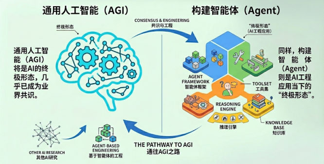
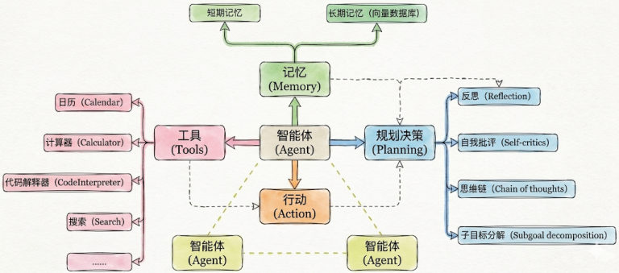
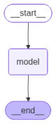

到这里为止，我们一直在"问一句、答一句"地用模型。**智能体（Agent）** 要解决的是另一个问题：让模型自己决定"要不要用工具、用哪个工具、用几次"，直到把任务做完。

## 什么是智能体

> 在大模型应用开发中，智能体通常指一种**以大语言模型为推理与决策核心**，结合**记忆**、**工具调用**与**环境交互**能力，能够进行**规划决策**并**执行复杂任务以达成目标**的软件系统。

它要具备的关键能力：

| 能力 | 说人话 |
| --- | --- |
| 理解用户问题 | 先搞清楚你到底要什么 |
| 如何拆解任务 | 把"帮我查天气再提醒我带伞"拆成两步 |
| 判断是否需要工具 | 闲聊不用工具，查天气就得调 |
| 需要调用哪些工具 | 从一堆工具里挑对的那一个 |
| 如何利用好工具结果 | 工具返回的数据要能读懂、用上 |
| 生成回答 & 推进任务 | 答完这一轮，还要知道下一步做什么 |

课程给了一句定位：**通用人工智能（AGI）是 AI 的终极形态，而构建智能体是 AI 工程应用当下的"终极形态"**——Agent 是大模型应用开发的核心。


*图：左边「通用人工智能（AGI）」是 AI 的终极形态，右边「构建智能体（Agent）」是 AI 工程应用当下的"终极形态"——通往 AGI 之路要靠基于智能体的工程*

### 核心组件

| 组件 | 是否必需 | 说明 |
| --- | --- | --- |
| **行动（Action）** | 必须 | 一切智能体都要能"做事" |
| **工具（Tool）** | 几乎总是存在 | 行动的具体手段 |
| **规划决策（Planning）** | 有条件存在 | 简单任务不需要显式规划 |
| **记忆（Memory）** | 最容易被省略 | 单轮任务不需要 |

> [!NOTE]
> 实际开发中这几个要素**并不需要同时出现**——先别被"智能体"这个词吓到，最小的 Agent 就是"模型 + 一个工具"。


*图：Agent 的完整架构——中间的智能体（Agent）连着工具（日历/计算器/代码解释器/搜索…）、记忆（短期记忆 + 长期记忆向量数据库）、行动与规划决策（反思/自我批评/思维链/子目标分解），外面还可以挂别的智能体*

## 从 v0.x 到 v1.x：为什么统一成 create_agent

**LangChain 0.x 时代是"碎片化"的**——针对不同场景设计不同的 Agent 构造函数：

```python
# ❌ v0.x 的复杂方式：要 5 步
from langchain_openai import ChatOpenAI
from langchain.agents import AgentExecutor, create_react_agent
from langchain_core.prompts import PromptTemplate

model = ChatOpenAI(model="gpt-4o-mini")
prompt = PromptTemplate.from_template("""
You are a helpful assistant.
Tools: {tools}
Tool Names: {tool_names}
{agent_scratchpad}
""")
agent = create_react_agent(llm=model, tools=tools, prompt=prompt)
executor = AgentExecutor(agent=agent, tools=tools, verbose=True)
result = executor.invoke({"input": "问题"})
```

要用思维链推理就找 `create_react_agent`，要结构化输出就找 `create_structured_chat_agent`，要工具调用就用 `create_tool_calling_agent`——灵活，但有三个明显问题：

1. **心智负担高**：每种 Agent 都要单独记忆 API 与参数
2. **可组合性差**：多个 Agent 之间无法统一调度
3. **生态碎片化**：不同模块难以复用或协同演化

**LangChain 1.0 之后彻底重构**，所有 Agent 的创建方式统一到一个入口——`create_agent()`：

```python
# ✅ v1.x 的简洁方式：3 步
from langchain.chat_models import init_chat_model
from langchain.agents import create_agent

# 1. 初始化模型
model = init_chat_model("gpt-4o-mini", model_provider="openai")

# 2. 创建 agent（一步完成）
agent = create_agent(
    model=model,
    tools=[tool1, tool2],
    system_prompt="Agent 的行为指令",     # 可选
)

# 3. 调用
result = agent.invoke({"messages": [{"role": "user", "content": "问题"}]})
```

它取代了旧的 `create_react_agent`、`create_json_agent`、`create_tool_calling_agent` 等一堆分支函数，底层通过**中间件机制（Middleware）** 和**标准模型接口（invoke / stream）** 实现全局统一——框架更轻、更稳，也更容易被集成到其他 Agent 平台。

## create_agent 的参数

| 参数 | 是否必需 | 说明 |
| --- | --- | --- |
| `model` | ✅ 必需 | 聊天模型，可以是字符串或模型对象 |
| `tools` | ✅ 必需 | 工具列表 |
| `system_prompt` | 可选 | 系统提示词（Agent 的行为指令） |
| `middleware` | 可选 | 中间件（第 8 章） |
| `response_format` | 可选 | 结构化输出（本篇后面 16 有专门一篇） |
| `interrupt_before` / `interrupt_after` | 可选 | 在某些工具前/后暂停（人机协作） |
| `debug` | 可选 | 调试模式 |
| `name` | 可选 | Agent 名称（第 15 篇） |

> [!NOTE]
> **实测补充**：实际签名里还有 `state_schema`、`context_schema`、`checkpointer`、`store`、`cache` 等参数（第 9 章讲记忆时要靠 `checkpointer`），课程列表只是介绍了最常用的几个。
> 完整参数见官方文档：https://reference.langchain.com/python/langchain/agents/factory/create_agent

## 模型的传入方式

模型是 Agent 的"大脑"，负责决策和推理。传入方式有两种：

### 方式一：传模型字符串

Agent 根据字符串**自己创建模型对象**：

```python
from langchain.agents import create_agent
from dotenv import load_dotenv

load_dotenv(override=True)

agent = create_agent("deepseek-v4-flash")
print(type(agent))     # <class 'langgraph.graph.state.CompiledStateGraph'>
```

### 方式二：传模型对象

先自己把模型建好（能精确控制 `api_key`、`base_url` 等参数），再交给 Agent：

```python
from langchain.chat_models import init_chat_model
from langchain.agents import create_agent
from langchain_deepseek import ChatDeepSeek
from dotenv import load_dotenv
import os

load_dotenv(override=True)

# 以 ChatDeepSeek 为例
# model = ChatDeepSeek(model="deepseek-v4-flash")

# 以 init_chat_model 为例
model = init_chat_model(
    model="deepseek-v4-flash",
    model_provider="openai",
    api_key=os.getenv("DEEPSEEK_API_KEY"),
    base_url=os.getenv("DEEPSEEK_BASE_URL"),
)

agent = create_agent(model)
print(type(agent))     # 同上，也是 CompiledStateGraph
```

> [!IMPORTANT]
> **两种方式得到的 agent 都是 `langgraph.graph.state.CompiledStateGraph` 实例**——也就是说，**Agent 底层是一张"图"**（LangGraph 的图结构）。
> 想亲眼看看这张图，可以画出来：
>
> ```python
> from IPython.display import Image, display
> display(Image(agent.get_graph().draw_mermaid_png()))
> ```
>
> **实测**图的节点是：`__start__ → model → tools → __end__`——这就是"模型想 → 用工具 → 再想 → 再答"的循环骨架（下一篇会展开）。


*图：`draw_mermaid_png()` 画出来的 agent 图结构——上面这张是没挂工具时的样子（`__start__ → model → __end__`），下一篇挂上工具就会多出 `tools` 节点*

日常开发推荐**方式二**：只有传对象才能显式指定 `base_url`、`api_key` 等参数（第 04 篇踩过的坑）。

## 调用 Agent：invoke

`agent.invoke()` 是 Agent 最基本的同步调用方法，它会**阻塞程序**直到返回最终结果。

| 方向 | 内容 |
| --- | --- |
| **输入** | 字典类型，通过 `messages` 字段传消息列表：`{"messages": [{"role": "...", "content": "..."}]}` |
| **输出** | 也是字典，`messages` 字段是**完整的消息列表**（可能包含多轮交互） |

**为什么输出是一个列表？** 因为 Agent 内部可能经历多轮"模型 → 工具 → 模型"，返回的是**全过程记录**，最终回答只是最后一条：

```text
[
  HumanMessage(...),      # 用户问题
  AIMessage(...),         # AI 的工具调用请求
  ToolMessage(...),       # 工具返回结果
  AIMessage(...)          # 最终回答 ← 通常取这个
]
```

```python
response = agent.invoke({"messages": ["你好"]})     # 字符串默认是 HumanMessage
print(type(response))            # <class 'dict'>
final_answer = response["messages"][-1].content      # 取最后一条的 content
```

`messages` 列表里也支持直接写**带角色**的消息字典（`role` 可以是 `user`、`assistant`、`system`、`tool`）：

```python
resp = agent.invoke({
    "messages": [
        {"role": "system", "content": "你是一个小学数学老师，耐心，幽默，讲解深入浅出"},
        {"role": "user", "content": "3 个苹果分给 2 个人怎么分？"},
    ]
})
```

> [!TIP]
> 每条 `AIMessage` 上都带着 `usage_metadata`（`input_tokens` / `output_tokens` / `total_tokens`），想看 Agent 这一轮到底烧了多少 token，直接取最后一条消息的 `usage_metadata` 就行。

### 一次 invoke 的完整输出长什么样

课程里用 `rich` 的 `rprint` 把返回的字典整个打印出来，结构一览无余（`print` 也行，但 `rprint` 会着色、换行更好看）：

```python
from rich import print as rprint

response = agent.invoke({"messages": ["你好"]})     # 默认是 HumanMessage
print(type(response))     # <class 'dict'>
rprint(response)
```

输出（只保留关键字段，省略号是省略掉的部分）：

```text
{
 'messages': [
   HumanMessage(
     content='你好',
     additional_kwargs={},
     response_metadata={},       # 用户消息没有这些元数据
     id='93ffcb22-179a-4cab-81a7-a3bd3a1795d4'
   ),
   AIMessage(
     content='你好！有什么我可以帮你的吗？',
     additional_kwargs={'refusal': None},
     response_metadata={
       'token_usage': {                    # ← 厂商返回的原始用量
         'completion_tokens': 13,
         'prompt_tokens': 7,
         'total_tokens': 20,
         'completion_tokens_details': {...},
         'prompt_tokens_details': {'audio_tokens': 0, 'cached_tokens': 0},
         'latency_checkpoint': {           # ← 延迟指标（下面单独讲）
           'engine_tbt_ms': 3,             # 引擎侧每 token 平均耗时
           'engine_ttft_ms': 48,           # 引擎侧首 token 时间
           'engine_ttlt_ms': 90,           # 引擎侧整段输出总耗时
           'pre_inference_ms': 95,         # 进入推理前的排队/预处理耗时
           'service_tbt_ms': 4,            # 服务侧每 token 平均耗时
           'service_ttft_ms': 673,         # 服务侧首 token 时间
           'service_ttlt_ms': 712,         # 服务侧总耗时
           'total_duration_ms': 626,
           'user_visible_ttft_ms': 578,    # 用户真正看到第一个字的延迟 ← 最该看这个
         }
       },
       'model_provider': 'openai',
       'model_name': 'gpt-5.4-mini-2026-03-17',   # 实际落到哪个模型版本
       'system_fingerprint': None,
       'id': 'chatcmpl-DlUJdEGrlJtKPHQ9wgdp1KsrEjIDc',
       'service_tier': 'default',
       'finish_reason': 'stop',          # 'stop' = 说完了；'tool_calls' = 要去调工具
       'logprobs': None
     },
     id='lc_run--019e7ccd-c08b-7f60-8b07-32324cccf2c2-0',
     tool_calls=[],                      # 没调工具，所以是空列表
     invalid_tool_calls=[],
     usage_metadata={                    # ← LangChain 统一命名后的用量
       'input_tokens': 7,
       'output_tokens': 13,
       'total_tokens': 20,
       'input_token_details': {'audio': 0, 'cache_read': 0},
       'output_token_details': {'audio': 0, 'reasoning': 0}
     }
   )
 ]
}
```

| 字段 | 说什么 |
| --- | --- |
| `content` | 消息正文；发起工具调用时是**空字符串**（第 14 篇） |
| `response_metadata['token_usage']` | 厂商返回的**原始用量**（OpenAI 风格命名：prompt / completion / total） |
| `response_metadata['latency_checkpoint']` | 各家网关的**延迟指标**（详见下表） |
| `response_metadata['model_name']` | 实际命中的**模型版本号**，排查"是不是被换了模型"看它 |
| `response_metadata['finish_reason']` | `'stop'` 正常说完；`'tool_calls'` 还要去调工具 |
| `tool_calls` / `invalid_tool_calls` | 这一轮的**工具调用计划**（没调就是空列表） |
| `usage_metadata` | **LangChain 归一化后**的用量（`input_tokens` / `output_tokens` / `total_tokens`），跨厂商命名一致，比 `token_usage` 更好用 |

延迟指标分三个"视角"（引擎 → 服务 → 用户），另外还有几个配套的耗时项：

| 指标 | 含义 |
| --- | --- |
| `engine_ttft_ms` | **引擎侧**首 token（TTFT = Time To First Token），模型自己算得有多快 |
| `service_ttft_ms` | **服务侧**首 token，含网关排队、鉴权、转发 |
| `user_visible_ttft_ms` | **用户可见**首 token 延迟——真正决定"手感"的就是它 |
| `engine_tbt_ms` / `service_tbt_ms` | 平均**每个 token** 的间隔（TBT = Time Between Tokens），决定吐字是否均匀 |
| `engine_ttlt_ms` / `service_ttlt_ms` | 整段输出的**总耗时**（TTLT = Time To Last Token） |
| `pre_inference_ms` | 进入推理前的预处理/排队耗时 |

> [!NOTE]
> **实测补充**：`response_metadata` 里的内容是**模型服务商返回什么、LangChain 就记什么**，所以字段随平台而变：
> - `latency_checkpoint` 这一组是课程用的 CloseAI 网关（OpenAI 兼容）返回的；**换平台不一定有**。
> - 本机用假服务端（自建 OpenAI 兼容响应）实测时，`response_metadata` 只有 `finish_reason` / `id` / `model_name` / `model_provider` / `token_usage` / `logprobs` / `system_fingerprint` 这几个基本字段，没有 `latency_checkpoint`。
> - 想写"跨平台都能跑"的代码，**优先读 `usage_metadata`**（LangChain 归一化过），别去解析 `token_usage` 或延迟指标。

## 相关

- [Tools工具定义与调用](/posts/编程学习/langchain学习笔记/09-tools工具定义与调用/)
- [给智能体绑定工具与运行机制](/posts/编程学习/langchain学习笔记/14-给智能体绑定工具与运行机制/)
- [模型的创建](/posts/编程学习/langchain学习笔记/04-模型的创建/)

## 练习题

### 一、回忆填空（写完再展开对答案）

1. 智能体 = 以____为推理与决策核心，结合____、工具调用与环境交互能力，能够进行____并执行复杂任务以达成目标的软件系统
2. 智能体的四个核心组件里，**必须**的是____，**几乎总是存在**的是____（行动的具体手段），**有条件存在**的是规划决策，**最容易被省略**的是____；最小的 Agent 就是"模型 + 一个____"
3. 课程给的定位：通用人工智能（AGI）是 AI 的终极形态，而____是 AI 工程应用当下的"终极形态"
4. v0.x 的三个问题是心智负担高、可组合性差、生态____；v1.x 把 Agent 的创建统一到一个入口 `____()`，底层靠____机制和标准模型接口实现全局统一
5. `create_agent` 的两个必需参数是____和____；系统提示词用 `system_prompt` 传，中间件用 `middleware`，Agent 名字用 `____`，调试图结构还有 `response_format`、`interrupt_before` / `interrupt_after`、`____` 等可选参数
6. 模型有两种传入方式：直接传模型名字符串，或传____；不管哪种方式，得到的 agent 都是 LangGraph 的____实例——说明 Agent 底层是一张____
7. 不挂工具时图结构的节点是 `__start__ → ____ → __end__`，挂上工具后会多出一个 ____ 节点；想亲眼看可以调用 `agent.____().draw_mermaid_png()`
8. `agent.invoke()` 的输入是字典、消息列表放在____字段里；直接写字符串会被当成____消息；返回的也是字典，它的 `messages` 是____（可能含多轮交互），最终回答通常取 `response["messages"][____]`
9. 发起工具调用时 `AIMessage.content` 是____；`tool_calls` 为空列表说明____；`finish_reason` 为 `'stop'` 表示说完了、为 `'____'` 表示还要去调工具；想知道"是不是被换了模型"看 `response_metadata` 里的 `____`
10. 用量有两个口径：`response_metadata['token_usage']` 是____返回的原始用量，`____` 是 LangChain 归一化后的用量（`input_tokens` / `output_tokens` / `total_tokens`）；想写"跨平台都能跑"的代码要优先读后者，因为延迟指标（如 `latency_checkpoint`）**换平台不一定有**

> [!TIP]- 填空答案（做完再点开）
> 1. 大语言模型（LLM） / 记忆 / 规划决策　2. 行动（Action） / 工具（Tool） / 记忆（Memory） / 工具　3. 构建智能体（Agent）　4. 碎片化 / `create_agent` / 中间件（Middleware）　5. `model` / `tools` / `name` / `debug`　6. 模型对象 / `CompiledStateGraph` / 图　7. `model` / `tools` / `get_graph`　8. `messages` / `HumanMessage` / 完整的消息列表 / `-1`　9. 空字符串（`''`） / 没有要调用的工具 / `tool_calls` / `model_name`　10. 厂商（模型服务商） / `usage_metadata`

### 二、裸写题

- [ ] **2-1 用模型名字符串创建第一个 Agent**
  只给一个模型名（如 `deepseek-v4-flash`）就创建出 Agent，打印它的类型；然后问一句"你好"，取出最后一条消息的正文打印出来。记得先把 `.env` 读进来，否则密钥读不到。

  > [!TIP]- 提示（先自己想，实在想不出再点开）
  > **一级 · 思路**：字符串方式最省事——框架根据名字自己去建模型对象，但也就没法精细控制接口地址
  > **二级 · 方法**：`agent = create_agent("deepseek-v4-flash")` + `agent.invoke({"messages": ["你好"]})`
  > **三级 · 骨架**：打印类型看是不是 `CompiledStateGraph`；取回答用 `response["messages"][-1].content`

- [ ] **2-2 传模型对象，并带上 system 消息**
  自己先把模型建好（要能显式指定密钥和接口地址），再交给 Agent；调用时在消息列表**开头**加一条 system 消息定人设（比如"你是一个小学数学老师，耐心，幽默，讲解深入浅出"），再问一个问题，观察回答风格的差别。

  > [!TIP]- 提示（先自己想，实在想不出再点开）
  > **一级 · 思路**：system 消息用来"定人设"，放在消息列表第一条；日常开发推荐传对象（能精确控制参数）
  > **二级 · 方法**：`init_chat_model(model=..., model_provider="openai", api_key=..., base_url=...)` + `create_agent(model=model)`
  > **三级 · 骨架**：`{"messages": [{"role": "system", "content": "..."}, {"role": "user", "content": "..."}]}`

- [ ] **2-3 把返回的消息流打印清楚**
  调用一次 Agent 后遍历返回的消息列表，打印**每条消息的类型**（HumanMessage / AIMessage / ToolMessage）和内容；再单独打印最后一条的正文和令牌用量。

  > [!TIP]- 提示（先自己想，实在想不出再点开）
  > **一级 · 思路**：Agent 的返回是"全过程记录"，先看清有几条、分别是什么类型
  > **二级 · 方法**：`for msg in resp["messages"]: print(type(msg).__name__, msg.content)`
  > **三级 · 骨架**：最后一条的令牌用量在 `msg.usage_metadata`；消息对象还有 `pretty_print()` 可以打印得更漂亮

- [ ] **2-4 读一次 invoke 的完整元数据**
  打印一次调用返回的最后一条消息上的：**结束原因**、**实际命中的模型版本**、**厂商的原始令牌用量**、**归一化后的令牌用量**、这一轮的**工具调用计划**；并说明"延迟指标"里最该关注哪一项、为什么它换平台可能没有。

  > [!TIP]- 提示（先自己想，实在想不出再点开）
  > **一级 · 思路**：这些元数据都在消息对象的 `response_metadata` 里；用量还有一个"更通用"的版本
  > **二级 · 方法**：`meta = last.response_metadata` → `meta["finish_reason"]` / `meta["model_name"]` / `meta["token_usage"]` / `meta["latency_checkpoint"]`；`last.usage_metadata`
  > **三级 · 骨架**：延迟指标看 `user_visible_ttft_ms`（用户真正看到第一个字的延迟）；跨平台代码优先读 `usage_metadata`

> [!TIP]- 参考答案（做完再点开）
> ```python
> import os
>
> from dotenv import load_dotenv
> from langchain.agents import create_agent
> from langchain.chat_models import init_chat_model
>
> load_dotenv(override=True)
>
> # ---------- 2-1 用模型名字符串创建 ----------
> agent = create_agent("deepseek-v4-flash")
> print(type(agent))       # <class 'langgraph.graph.state.CompiledStateGraph'>
>
> response = agent.invoke({"messages": ["你好"]})
> print(response["messages"][-1].content)
>
> # ---------- 2-2 传模型对象 + 内联 system 消息 ----------
> model = init_chat_model(
>     model="deepseek-v4-flash",
>     model_provider="openai",
>     api_key=os.getenv("DEEPSEEK_API_KEY"),
>     base_url=os.getenv("DEEPSEEK_BASE_URL"),
> )
>
> agent2 = create_agent(model=model)
> resp = agent2.invoke({
>     "messages": [
>         {"role": "system", "content": "你是一个小学数学老师，耐心，幽默，讲解深入浅出"},
>         {"role": "user", "content": "3 个苹果分给 2 个人怎么分？"},
>     ]
> })
>
> # ---------- 2-3 把返回的消息流打印清楚 ----------
> for msg in resp["messages"]:
>     print(type(msg).__name__, "→", msg.content[:50])
> # SystemMessage  → 你是一个小学数学老师，耐心，幽默，讲解深入浅出
> # HumanMessage   → 3 个苹果分给 2 个人怎么分？
> # AIMessage      → （最终回答）
>
> last = resp["messages"][-1]
> print("最终回答:", last.content)
> print("token 用量:", last.usage_metadata)
> # 更漂亮地打印：for msg in resp["messages"]: msg.pretty_print()
>
> # ---------- 2-4 一次 invoke 的完整输出 ----------
> meta = last.response_metadata
> print("finish_reason:", meta.get("finish_reason"))      # 'stop' 说完了；'tool_calls' 还要调工具
> print("model_name:", meta.get("model_name"))            # 实际命中的模型版本
> print("token_usage:", meta.get("token_usage"))          # 厂商原始用量（命名不一定统一）
> print("latency_checkpoint:", meta.get("latency_checkpoint"))   # 各家网关的延迟指标，换平台不一定有
> print("usage_metadata:", last.usage_metadata)           # 归一化后的用量：跨平台优先读它
> print("tool_calls:", last.tool_calls)                   # 空列表 = 没有要调的工具
> print("图结构节点:", [n for n in agent.get_graph().nodes])
> # ['__start__', 'model', '__end__']   ← 这就是"模型想 → 用工具 → 再想 → 再答"的循环骨架
> ```
