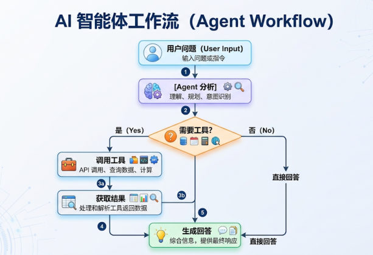
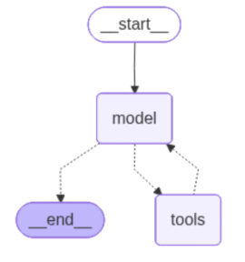
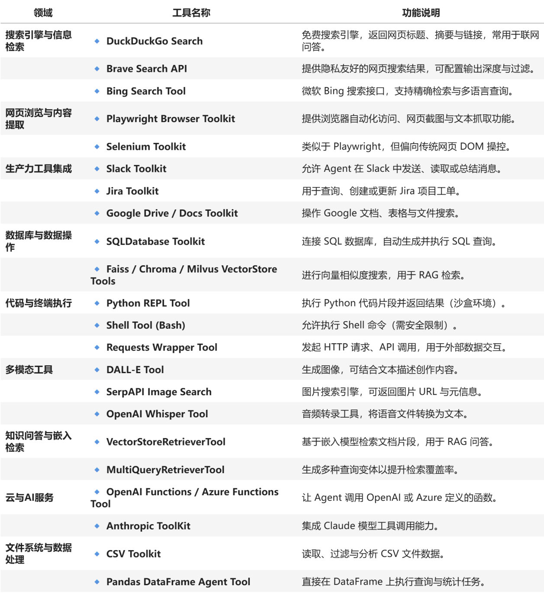
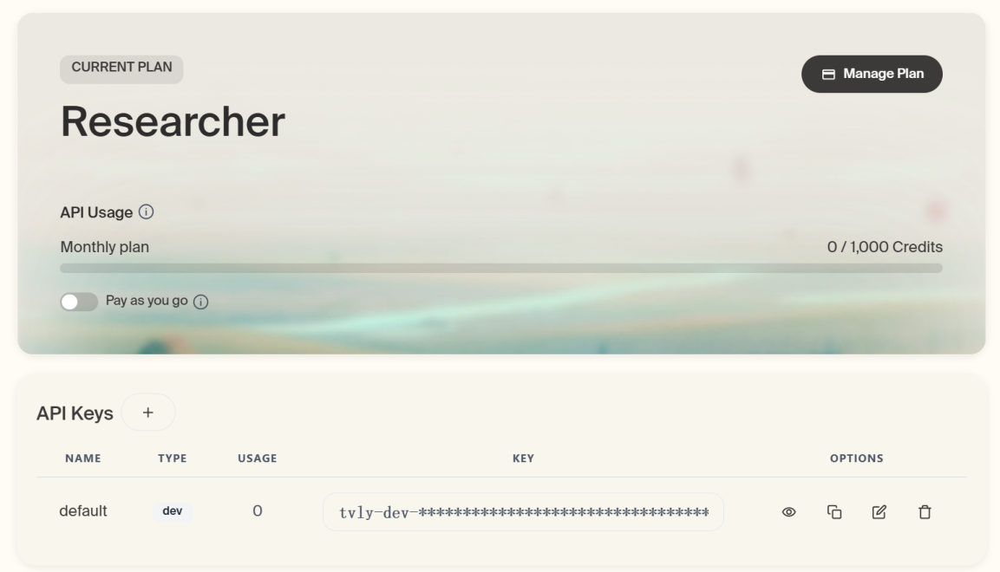
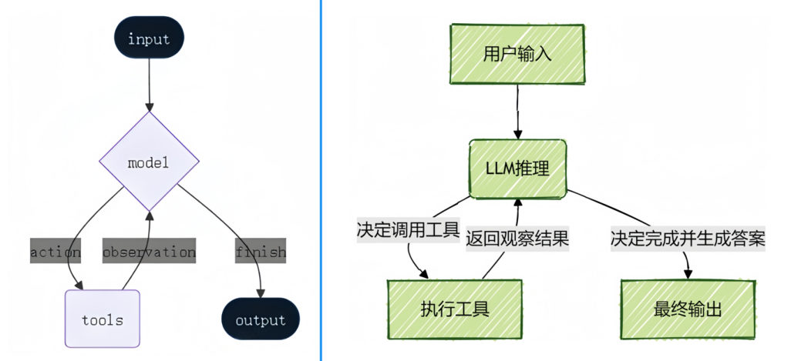
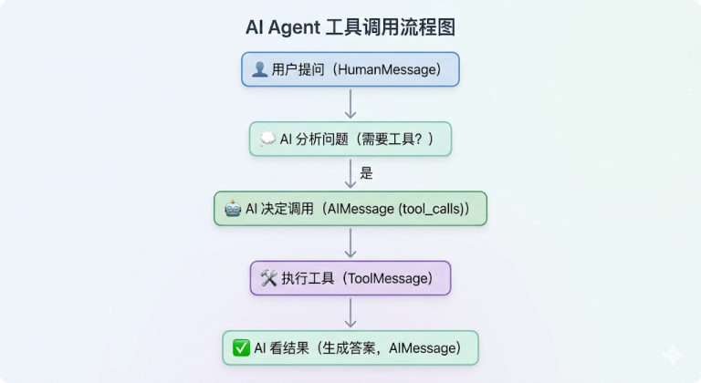
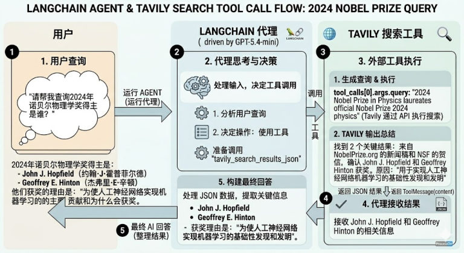

上一篇创建的 Agent 还只会"空口回答"。**只有接入了工具，Agent 的创建才算完整**——这一篇讲怎么给它接工具，以及接上工具后它在内部到底怎么跑。

## 绑定工具

工具可以是 LangChain 内置的，也可以是自定义的。执行时：

- **静态绑定**：创建 Agent 时写死在 `tools=[...]` 里
- **动态绑定**：运行时按条件决定给哪些工具（需要中间件，第 8 章讲）


*图：AI 智能体工作流——用户问题 → Agent 分析 → 判断"需要工具吗" → 需要就调用工具、获取结果，不需要就直接回答，最后生成回答*

### 自定义工具：@tool 装饰器

```python
from langchain.agents import create_agent
from langchain.tools import tool

@tool(parse_docstring=True)
def get_weather(city: str) -> str:
    """天气查询工具

    Args:
        city: 城市名称
    """
    return f"{city}的天气为晴朗，25°C。"

agent = create_agent(
    model=model,
    tools=[get_weather],
)

resp = agent.invoke({
    "messages": [
        {"role": "system", "content": "你是一个天气查询助手，只回答天气相关的问题，其他问题请直接回答：我不清楚这问题答案。"},
        {"role": "user", "content": "北京的天气怎么样？"},
    ]
})
```


*图：给这个 agent 挂上 `get_weather` 之后画出来的图结构——多了 `tools` 节点，模型判断需要工具时就会走 `model → tools → model`*

> [!TIP]
> **`@tool(parse_docstring=True)` 这个参数到底做了什么？**（实测对比）
>
> | 写法 | 工具的 description | 参数的 description |
> | --- | --- | --- |
> | `@tool` | 整个 docstring，含 `Args:` 那一大段 | ❌ 无 |
> | `@tool(parse_docstring=True)` | 只取摘要行「天气查询工具」 | ✅ `city: 城市名称` |
>
> ```text
> 默认 @tool          → "天气查询工具\n\nArgs:\n    city: 城市名称"
> parse_docstring=True → "天气查询工具"，参数描述 {"city": {"description": "城市名称"}}
> ```
>
> 加上这个参数，**你写的 Args 段会变成规范的参数描述**——模型挑工具、填参数都靠这些文字，值得多写一行。

### 内置工具：TavilySearch

LangChain 生态里内置了大量实用工具（完整列表：https://docs.langchain.com/oss/python/integrations/tools）。以网络搜索工具为例：


*图：课程列出的典型内置工具——搜索（DuckDuckGo / Brave / Bing）、网页浏览（Playwright / Selenium）、生产力（Slack / Jira / Google Drive）、数据库（SQLDatabase / 向量库）、代码执行（Python REPL / Shell）、多模态（DALL·E / Whisper）、RAG 检索、云函数与文件处理等*

```python
from langchain_tavily import TavilySearch
import os

web_search = TavilySearch(
    tavily_api_key=os.getenv("TAVILY_API_KEY"),     # 去 tavily 官网注册（每月有免费额度）
    max_results=2,
)

# 它是个高度封装好的工具，可以单独调用看看效果
web_search.invoke("请问2026年足球世界杯有哪些参赛队？")
# 返回：{'query': ..., 'results': [{'url': ..., 'title': ..., 'content': ..., 'score': ...}, ...], 'response_time': 0.79, ...}
```


*图：Tavily 官网账户页的 API Keys 区——把 `tvly-dev-***` 这一串复制出来写进 `.env` 的 `TAVILY_API_KEY`*

直接把实例塞进 `tools` 就能交给 Agent 用：

```python
agent = create_agent(
    model=model,
    tools=[web_search],
    system_prompt="你是一名多才多艺的智能助手，可以调用工具帮助用户解决问题。",
)
```

> [!NOTE]
> 内置工具用起来省事，但**每个工具都有自己的依赖**：TavilySearch 要注册 API-KEY 并写进 `.env` 的 `TAVILY_API_KEY`。用之前先看文档要什么。

### 绑定多个工具

一个 Agent 可以同时挂多个工具，`tools` 传列表即可：

```python
@tool(parse_docstring=True)
def get_weather(city: str):
    """天气查询工具

    Args:
        city: 城市名称
    """
    return f"{city}今天天气挺好"

@tool(parse_docstring=True)
def get_news():
    """新闻查询工具"""
    return "近期废旧手机回收市场迎来“火热潮”，回收价格普遍上涨……"

agent = create_agent(model, tools=[get_weather, get_news])
response = agent.invoke({"messages": ["你好，杭州今天的天气如何？今天有哪些新闻？"]})
```

问一句包含两件事的话，Agent 会**自己判断需要调两个工具**（甚至可能连续调）。

## 运行机制：ReAct 循环

LangChain 的 Agent 把"模型"和"工具"结合起来，在实现上由一张基于 LangGraph 的图来编排执行流程。**本质上就是经典的 ReAct 结构**——一个具备「思考 → 行动 → 观察」不断循环的自主工作者：

```text
用户问题 → AI 思考 → 调用工具 → 观察结果 → 继续思考 → ... → 最终答案
```


*图：ReAct 的两种画法——左边是 LangGraph 视角（input 进 model，模型在 `action` 走 tools、在 `observation` 回到 model、在 `finish` 出 output），右边是"用户输入 → LLM 推理 → 决定调用工具/执行工具 → 决定完成并生成答案"*

它会**在一个循环里反复调用模型和工具**，直到某次模型输出中**不再包含工具调用**则结束，最后综合所有信息给出最终答案。

### 一次完整流程长什么样

以「找出当前最流行的无线耳机并检查库存」为例：

| 步骤 | 发生了什么 |
| --- | --- |
| 1. 输入解析与初始推理 | LLM 分析任务："要找出'最流行'的产品需要最新市场信息，我应该先用搜索工具" |
| 2. 第一次行动 + 观察 | 调用 `search_products("wireless headphones")` → 返回"找到5款匹配产品，Top 结果：WH-1000XM5…" |
| 3. 迭代推理 | "WH-1000XM5 排第一，现在需要确认库存才能回答" |
| 4. 第二次行动 + 观察 | 调用 `check_inventory("WH-1000XM5")` → 返回"库存 10 件" |
| 5. 最终输出 | 信息齐了，生成最终答案，**不再调用工具** |


*图：一次工具调用的消息流——用户提问（HumanMessage）→ AI 分析"需要工具吗" → AI 决定调用（AIMessage 带 tool_calls）→ 执行工具（ToolMessage）→ AI 看结果生成答案（AIMessage）*

从消息层面看，**一次工具调用会产出 4 条消息**（这是典型的 Function calling 流程）：

```text
HumanMessage        # 用户提问
AIMessage           # AI 的工具调用请求（function call）
ToolMessage         # 工具返回结果（function response）
AIMessage           # 最终回答（final response）
```


*图：一次完整的 Function calling 流程（课程以"查 2024 年诺贝尔物理学奖得主"为例）——用户查询 → 代理思考并决定调用工具 → Tavily 生成查询并返回结果（ToolMessage）→ LangChain 构建最终回答*

> [!TIP]
> 循环的**退出条件**是"模型这一轮没有工具调用"。所以工具越多、任务越绕，消息列表就越长——这也解释了为什么 Agent 的 token 消耗会比普通对话高很多。

### 消息里的关键字段：tool_call_id 与 finish_reason

课程把 `resp` 整份打印出来，能看到"请求"和"结果"是靠 **ID 配对**的。看一次问天气的完整消息（节选）：

```text
AIMessage(                              # ← 工具调用请求
  content='',                           # 发起调用时正文是空的
  response_metadata={..., 'finish_reason': 'tool_calls'},   # ← 标记"我要去调工具"
  tool_calls=[
    {
      'name': 'get_weather',
      'args': {'city': '北京'},
      'id': 'call_4dp4PGy6Ghaj5m6WcNkrwKFe',                # ← 这次调用的编号
      'type': 'tool_call'
    }
  ],
  invalid_tool_calls=[]
),
ToolMessage(                            # ← 工具返回结果
  content='北京的天气为晴朗，25°C。',
  name='get_weather',
  id='b5b82403-973c-463b-b9f2-2aa76e0bff77',
  tool_call_id='call_4dp4PGy6Ghaj5m6WcNkrwKFe'              # ← 和上面的 id 一模一样
),
AIMessage(
  content='北京天气晴朗，25°C。',
  response_metadata={..., 'finish_reason': 'stop'},          # ← 这次是真说完了
  tool_calls=[]                                              # ← 没有新的调用
)
```

| 消息 | 关键字段 | 作用 |
| --- | --- | --- |
| `AIMessage`（工具调用请求） | `tool_calls[].id` | 这次调用的**唯一编号** |
| | `tool_calls[].name` / `.args` | 调哪个工具、参数是什么（`{'city': '北京'}`） |
| | `response_metadata['finish_reason']` | `'tool_calls'` 表示"还要干活" |
| `ToolMessage`（工具返回） | `tool_call_id` | **与上面 `tool_calls[].id` 一一对应**——模型就是靠它知道"这个结果属于哪次调用" |
| | `name` | 哪个工具返回的 |
| `AIMessage`（最终回答） | `response_metadata['finish_reason']` | `'stop'` 表示任务结束 |
| | `tool_calls` | `[]`（空列表） |

**一次并行调两个工具时**，一条 `AIMessage` 的 `tool_calls` 里会有两项，随后跟**两条** `ToolMessage`，各自的 `tool_call_id` 分别对上——课程"绑定多个工具"的例子（问一句"杭州天气如何？今天有哪些新闻？"）就是这样：

```text
AIMessage(... tool_calls=[{'name': 'get_weather', ..., 'id': 'call_w9ARuAgN8iqfG2GR7gv00iBq'},
                           {'name': 'get_news',    ..., 'id': 'call_vOLekRymIme8bWuVQdIew4vu'}])
ToolMessage(content='杭州今天天气挺好',  name='get_weather', tool_call_id='call_w9ARuAgN8iqfG2GR7gv00iBq')
ToolMessage(content='近期，受全球储蓄芯片短缺…', name='get_news', tool_call_id='call_vOLekRymIme8bWuVQdIew4vu')
```

> [!NOTE]
> **实测**（用假服务端抓一次真实流转）：`AIMessage` 的 `tool_calls[0].id = 'call_fake01'`，紧接着的 `ToolMessage.tool_call_id` 也是 `'call_fake01'`，`finish_reason` 分别是 `'tool_calls'` 和 `'stop'`——**配对关系和课程完全一致**。
> 自己手工拼消息历史（比如把历史存下来下一轮再传）时，**这两个 ID 必须成对搬运**——`ToolMessage` 的 `tool_call_id` 一定要指向前面某条 `AIMessage` 里真实存在的调用 id。

## 重试机制：让 Agent 自己再试一次

Agent **可以在工具调用结果不满足要求时自主重试**。做法很朴素：**让工具把"临时故障"写在返回值里，再用提示词告诉模型这种情况该怎么办**。

```python
from langchain.agents import create_agent
from langchain.tools import tool
from langchain.messages import SystemMessage, HumanMessage

flag = 0

@tool
def get_weather(city: str):
    """天气查询工具

    Args:
        city: 城市名称
    """
    global flag
    flag += 1
    if flag < 3:
        # 也可以改成抛异常：raise Exception("暂时无法访问")
        return "TEMP_UNAVAILABLE: 天气服务暂时不可用，请稍后重试"
    return f"{city}今天天气挺好"

messages = [
    SystemMessage("""
你是一个天气助手。
当工具返回以 'TEMP_UNAVAILABLE:' 开头的结果时，
说明是临时故障，不要立即放弃；
你应再次调用同一个工具，最多重试 3 次。
如果 3 次后仍失败，再向用户说明服务暂时不可用。
"""),
    HumanMessage("你好，杭州今天的天气如何？"),
]

agent = create_agent(model, tools=[get_weather])
response = agent.invoke({"messages": messages})
```

这里做了三件事：

| 角色 | 做了什么 |
| --- | --- |
| **工具** | 前两次返回 `TEMP_UNAVAILABLE: ...`（模拟临时故障）；第三次才返回真数据 |
| **系统提示词** | 说明"以这个前缀开头的返回 = 临时故障"，并要求**最多重试 3 次**、3 次都失败才放弃 |
| **Agent** | 读到故障标记后**自己再次调用同一个工具**，直到成功 |

> [!WARNING]
> "重试"不是框架内置的自动机制，而是**靠提示词引导模型的行为**。所以：
> - 工具的错误返回值要**有稳定、可识别的标记**（如统一前缀）
> - 提示词里要**写清楚重试几次、最终怎么回答用户**，否则模型可能无限重试或者一次就放弃

### 同样的规则，换个写法：放进 system_prompt

上面那段提示词是**塞在 `messages` 列表**里的。重试规则是"这个 Agent 的规矩"，更适合放进 `system_prompt`——两种写法效果一样，区别只在"只影响这一次调用"还是"整个 Agent 都生效"（第 15 篇细讲）：

```python
from langchain.agents import create_agent
from langchain.tools import tool
from langchain.messages import SystemMessage, HumanMessage

flag = 0

@tool
def get_weather(city: str):
    """天气查询工具

    Args:
        city: 城市名称
    """
    global flag
    flag += 1
    if flag < 3:
        # raise Exception("暂时无法访问")
        return "TEMP_UNAVAILABLE: 天气服务暂时不可用，请稍后重试"
    return f"{city}今天天气挺好"

messages = [
    HumanMessage("你好，杭州今天的天气如何？")     # ← 这次提示词不在这里
]

agent = create_agent(
    model=model,
    tools=[get_weather],
    system_prompt=SystemMessage(                    # ← 规则写在 Agent 上
        "你是一个天气助手。"
        "当工具返回以 'TEMP_UNAVAILABLE:' 开头的结果时，"
        "说明是临时故障，不要立即放弃；"
        "你应再次调用同一个工具，最多重试 3 次。"
        "如果 3 次后仍失败，再向用户说明服务暂时不可用。"
    )
)

response = agent.invoke({"messages": messages})
for msg in response["messages"]:
    msg.pretty_print()
```

`pretty_print()` 打出来的完整过程（**模型真的把同一个工具调了三次**）：

```text
================================ Human Message =================================
你好，杭州今天的天气如何？
================================== Ai Message ==================================
Tool Calls:
  get_weather (call_1NZMHHj1xByT0Zx7WhiK6AO1)
 Call ID: call_1NZMHHj1xByT0Zx7WhiK6AO1
  Args:
    city: 杭州
================================= Tool Message =================================
Name: get_weather

TEMP_UNAVAILABLE: 天气服务暂时不可用，请稍后重试
================================== Ai Message ==================================
Tool Calls:
  get_weather (call_Lgfn3Ll8WTJqQRVVwLIzRQnX)
 Call ID: call_Lgfn3Ll8WTJqQRVVwLIzRQnX
  Args:
    city: 杭州
================================= Tool Message =================================
Name: get_weather

TEMP_UNAVAILABLE: 天气服务暂时不可用，请稍后重试
================================== Ai Message ==================================
Tool Calls:
  get_weather (call_PghYww2kjkigDZK8h6P5Lth0)
 Call ID: call_PghYww2kjkigDZK8h6P5Lth0
  Args:
    city: 杭州
================================= Tool Message =================================
Name: get_weather

杭州今天天气挺好
================================== Ai Message ==================================
杭州今天天气挺好。
```

> [!NOTE]
> 三个细节值得留意：
> 1. **每次调用的 `Call ID` 都不一样**（`call_1NZMH…` / `call_Lgfn3…` / `call_PghYw…`）——每次重试都是**一次全新的工具调用**，不是"重发同一个请求"。
> 2. 用 `system_prompt` 传提示词时，**返回的消息列表里看不到那条 SystemMessage**（输出直接以 Human Message 开头）；写在 `messages` 里时它会作为第一条消息出现在返回值里。
> 3. 最终那条 `Ai Message` 的正文就是"杭州今天天气挺好。"——**第三次工具返回的真数据**，说明提示词里的"最多重试 3 次"被模型老老实实执行了。

## 常见问题

### 问题1：Agent 如何选择工具？

**依据是工具的 docstring**——模型只看得到名字、描述和参数说明。

```python
@tool
def get_weather(city: str) -> str:
    """获取指定城市的天气信息"""      # ← AI Agent 读这个！
    ...

@tool
def calculator(operation: str, a: float, b: float) -> str:
    """执行基本的数学计算"""          # ← AI Agent 也读这个！
    ...
```

它综合判断三件事：① 问题内容 ② 每个工具的描述 ③ 自动选择最匹配的。

### 问题2：Agent 为什么没有调用工具？

| 原因 | 解决 |
| --- | --- |
| 工具的 docstring 不清晰 | 写清楚**能做什么**、**什么时候用** |
| 问题表述不明确 | 把用户问题问清楚 |
| 模型认为不需要工具 | 用系统提示词明确"这类问题必须用工具" |

```python
# ❌ 不好：太模糊
@tool
def tool1(x: str) -> str:
    """做一些事情"""

# ✅ 好：写清用途和参数示例
@tool
def get_weather(city: str) -> str:
    """获取指定城市的实时天气信息

    Args:
        city: 城市名称，如"北京"、"上海"
    """
```

### 问题3：Agent 选错工具？

原因通常是**多个工具的功能描述相似**，或者**工具太多导致混淆**。三条对策：

1. **只给必要的工具**（2-5 个最佳）
2. **工具描述要有明确区分**
3. **在 `system_prompt` 里说明工具使用场景**

```python
# ✅ 好：只给需要的工具
agent = create_agent(model=model, tools=[get_weather, calculator])
```

> [!TIP]
> 这套"工具描述就是文档"的思路和第 09 篇讲 Tool 时完全一致：**模型没有读心术，它只读你写的描述**。

### 问题4：如何知道 Agent 何时完成？

判断依据只有一条：**某条 `AIMessage` 里不含 `tool_calls`**。

```python
from langchain.messages import AIMessage

for msg in response['messages']:
    if isinstance(msg, AIMessage):
        if hasattr(msg, 'tool_calls') and msg.tool_calls:
            print("还在调用工具...")
        else:
            print("完成！最终答案：", msg.content)
```

- `msg.tool_calls` 非空 → 这条 AI 消息是"我要调工具"（`content` 通常是空的），**还没完**
- `msg.tool_calls` 为空 → 这条是**最终回答**，任务结束

> [!TIP]
> **实测**（假服务端跑一次"问天气"）：上面这段代码依次打印
> ```text
> 还在调用工具...
> 完成！最终答案： 杭州今天天气挺好。
> ```
> 想直接拿答案，其实不用循环——`response["messages"][-1].content` 就是它（Agent 返回时保证最后一条是最终回答，见第 13 篇）。

### 问题5：Agent 可以调用多少次工具？

**默认没有限制，直到得到最终答案**。但"没有限制"不是好事，课程点出三种可能的结果：

| 可能的结果 | 说明 |
| --- | --- |
| **超时** | 工具慢 + 调用多，整体耗时不可控 |
| **达到 token 限制** | 消息列表越滚越长（每轮都要把全部历史重发），最终撞上上下文上限 |
| **模型决定停止** | 最好的情况——但它什么时候"觉得够了"由模型说了算，不稳定 |

> [!WARNING]
> **实测补充**：读源码可以看到，`create_agent` 编译图时写了一行 `config = {"recursion_limit": 10_000}`（`langchain/agents/factory.py`），LangGraph 自身的默认值也是 10000。所以"默认没有限制"严格说是"**默认上限 10000 步**"——对普通任务约等于不限。
> 我实测让假服务端**一直返回 `tool_calls`**，Agent 连着调了 **31 次模型都没停**（最后是假服务端改成正常回答才结束）——**一旦模型陷入"我要再查一次"的死循环，Agent 会一直烧钱**，所以问题 6 那个限制值得会写。

### 问题6：如何限制工具调用次数？

`create_agent` 底层是 LangGraph，可以用 **`recursion_limit`** 配置限制：

```python
# 注意：这是高级用法，后续会详细学习
config = {
    "recursion_limit": 5        # 最多 5 步
}

response = agent.invoke(input, config=config)     # input 就是平时那个 {"messages": [...]}
```

> [!IMPORTANT]
> **实测这个参数的真实行为**（假服务端持续返回 `tool_calls`）：
> ```text
> 抛异常： GraphRecursionError -> Recursion limit of 5 reached without hitting a stop condition.
>          You can increase the limit by setting the `recursion_limit` config key.
> ```
> 三个要点：
> 1. **它是"报错"而不是"停下来给答案"**——超限时 Agent 中断并抛出 `GraphRecursionError`，所以它更适合当**防死循环的兜底**，而不是"限制次数后继续正常工作"。
> 2. **计数单位是 LangGraph 的"步"（super-step）**：一次模型调用算一步，一次工具执行也算一步。实测 `recursion_limit=5` 时模型只被调了 **3 次**（模型→工具→模型→工具→模型，正好 5 步）。
> 3. 想要"**限次数但不报错**"，课程在第 8 章给了正经工具——`ToolCallLimitMiddleware`（可按工具限量，还能选"优雅结束"还是"抛错"，见第 20 篇）。`recursion_limit` 是 LangGraph 的通用兜底，两者用途不同。

## 相关

- [创建第一个智能体](/posts/编程学习/langchain学习笔记/13-创建第一个智能体/)
- [Tools工具定义与调用](/posts/编程学习/langchain学习笔记/09-tools工具定义与调用/)
- [系统提示词与Agent名称](/posts/编程学习/langchain学习笔记/15-系统提示词与agent名称/)

## 练习题

### 一、回忆填空（写完再展开对答案）

1. 工具绑定分两种：创建 Agent 时写死在参数里的____绑定，和运行时按条件决定的____绑定（后者需要中间件）
2. `@tool` 默认把整个 docstring 当作工具的____；加上 `____=True` 之后，摘要行做描述、`Args` 段变成**参数**的____——模型挑工具、填参数都靠这些文字
3. 内置工具用起来省事，但**每个工具都有自己的依赖**，比如课程用的网络搜索工具要在 `.env` 里配 `____`；它可以单独 `invoke()` 起来看效果，也能直接塞进工具列表交给 Agent
4. Agent 的内在结构就是经典的 ____ 循环：____ → 行动 → ____ 不断重复，**退出条件是"某轮模型输出里不再包含____"**
5. 一次完整流程（"找最流行的无线耳机并检查库存"）：输入解析与初始推理 → 第一次行动+观察（调搜索工具）→ 迭代推理 → 第二次行动+观察（调库存工具）→ ____（信息齐了、不再调用工具）
6. 一次工具调用产出四条消息：HumanMessage → ____（工具调用请求）→ ____（工具返回结果）→ ____（最终回答）；请求里 `tool_calls[].id` 和结果里的 `____` **必须一一对应**（模型靠它知道"这个结果属于哪次调用"），结果里的 `____` 字段则告诉你哪个工具返回的；发起调用时 `AIMessage.content` 是____、`finish_reason` 是 `'____'`，而最终回答的 `finish_reason` 是 `'____'`、`tool_calls` 是____
7. 一次并行调两个工具时：**一条** `AIMessage` 的 `tool_calls` 里有____项，后面跟**两条** `ToolMessage`，各自的 `tool_call_id` 分别对上
8. 让 Agent 自主重试的做法：工具返回**有稳定、可识别标记**的失败信息（如统一前缀）+ 提示词里写清重试____和最终答复方式；这套规则既可以写在 `messages` 列表里（只影响这一次调用），也可以传给 `system_prompt`（整个 Agent 都生效）——用后者时**返回的消息列表里看不到那条 SystemMessage**
9. 三个"选工具"问题的答案：选工具的依据是工具的____；不调用工具的常见原因是描述太____、问题不明确、模型认为不需要；选错工具的两条对策是只给必要的工具（____ 个最佳）和让描述有明确区分，还可以在系统提示词里说明使用场景
10. 问题 4/5/6 的答案：判断"何时完成"的唯一依据是**某条 `AIMessage` 里不含____**；默认没有调用次数限制，源码里编译图时写的是 `recursion_limit = ____`，一旦死循环会一直烧钱；想限制次数可以用 `____` 配置最多几步，但它超限时是**抛 `____` 而不是停下来给答案**（计数单位是"____"，一次模型调用算一步、一次工具执行也算一步；想要"限次数但不报错"要用 `ToolCallLimitMiddleware`）

> [!TIP]- 填空答案（做完再点开）
> 1. 静态 / 动态　2. description（工具描述） / `parse_docstring` / 描述　3. `TAVILY_API_KEY`　4. ReAct / 思考 / 观察 / 工具调用　5. 最终输出　6. AIMessage / ToolMessage / AIMessage / `tool_call_id` / `name` / 空字符串（`''`） / `tool_calls` / `stop` / 空列表 `[]`　7. 两　8. 次数（最多几次）　9. docstring（描述） / 模糊 / 2-5　10. `tool_calls` / `10_000`（10000） / `recursion_limit` / `GraphRecursionError` / 步（super-step）

### 二、裸写题

- [ ] **2-1 让 Agent 用上一个自定义工具**
  定义一个天气查询工具（带 `Args` 段写清参数含义），创建 Agent 并问"北京的天气怎么样？"，然后**遍历返回的消息列表**，打印每条消息的类型和内容，确认里面出现了工具返回的那条消息（说明模型真的调了工具，不是自己编的）。

  > [!TIP]- 提示（先自己想，实在想不出再点开）
  > **一级 · 思路**：能看到 ToolMessage 就说明工具真被调用了；调用请求那条 AIMessage 的正文是空的
  > **二级 · 方法**：`@tool(parse_docstring=True)` + `create_agent(model=model, tools=[get_weather])`
  > **三级 · 骨架**：`for msg in resp["messages"]: print(type(msg).__name__, msg.content[:40])`

- [ ] **2-2 一句话触发两个工具**
  再定义一个新闻查询工具，把两个工具一起绑定，问"杭州今天的天气如何？今天有哪些新闻？"，然后数一数消息列表里有**几条** AIMessage 带工具调用、有几条工具返回结果，并打印每个结果是哪个工具返回的。

  > [!TIP]- 提示（先自己想，实在想不出再点开）
  > **一级 · 思路**：多工具场景下模型会自己分配任务，甚至可能一次并行调两个
  > **二级 · 方法**：`tools=[get_weather, get_news]`；筛选方式 `[m for m in resp["messages"] if getattr(m, "tool_calls", None)]`
  > **三级 · 骨架**：结果条数用 `type(m).__name__ == "ToolMessage"` 过滤；`msg.name` 就是返回它的工具名

- [ ] **2-3 实现"自主重试"（规则挂在 Agent 上）**
  用一个计数器改造工具：前两次返回"临时故障"（用固定的前缀标记），第三次才返回真实天气。然后把**重试规则写进 Agent 的系统提示词**（不是塞在本次调用的消息列表里）：遇到这个前缀说明是临时故障，最多重试 3 次，3 次后如实告知用户。运行后确认最终拿到了真实天气，并检查返回的消息列表里**有没有那条系统消息**。

  > [!TIP]- 提示（先自己想，实在想不出再点开）
  > **一级 · 思路**：工具负责"报错"，提示词负责"怎么处理错误"——重试不是框架内置机制
  > **二级 · 方法**：`global flag` 计数器 + `system_prompt=SystemMessage(...)`
  > **三级 · 骨架**：提示词里务必写"最多重试 3 次"和"失败后怎么回复用户"，否则模型可能死循环或一次就放弃

- [ ] **2-4 看清一次工具调用的消息流转**
  让 Agent 查一次天气，然后从返回的消息列表里挑出"发起工具调用的那条"和"工具返回结果的那条"，打印：
  ① 调用请求的正文内容（观察它是不是空的）② 它这次的结束原因 ③ 被调用的工具名和参数 ④ 请求里的调用编号与结果里的配对编号，并验证两者一致；最后打印最终回答的结束原因和它的工具调用计划。

  > [!TIP]- 提示（先自己想，实在想不出再点开）
  > **一级 · 思路**：请求和结果是靠**编号配对**的；两种"结束原因"分别代表"还要干活"和"说完了"
  > **二级 · 方法**：`next(m for m in resp["messages"] if getattr(m, "tool_calls", None))` 找请求、`type(m).__name__ == "ToolMessage"` 找结果；`req.response_metadata["finish_reason"]`、`req.tool_calls[0]["id"]`、`res.tool_call_id`
  > **三级 · 骨架**：`tool_calls=[{'name': ..., 'args': {...}, 'id': 'call_xxx'}]`；最终回答的 `tool_calls` 是空列表

> [!TIP]- 参考答案（做完再点开）
> ```python
> import os
>
> from dotenv import load_dotenv
> from langchain.agents import create_agent
> from langchain.chat_models import init_chat_model
> from langchain.messages import AIMessage, HumanMessage, SystemMessage
> from langchain.tools import tool
>
> load_dotenv(override=True)
>
> model = init_chat_model(
>     model="deepseek-v4-flash",
>     model_provider="openai",
>     api_key=os.getenv("DEEPSEEK_API_KEY"),
>     base_url=os.getenv("DEEPSEEK_BASE_URL"),
> )
>
> # ---------- 2-1 让 Agent 用上一个自定义工具 ----------
> @tool(parse_docstring=True)
> def get_weather(city: str) -> str:
>     """天气查询工具
>
>     Args:
>         city: 城市名称
>     """
>     return f"{city}的天气为晴朗，25°C。"
>
> agent = create_agent(
>     model=model,
>     tools=[get_weather],
>     system_prompt="你是一个天气查询助手，只回答天气相关的问题。",
> )
> resp = agent.invoke({"messages": [{"role": "user", "content": "北京的天气怎么样？"}]})
>
> for msg in resp["messages"]:
>     print(type(msg).__name__, "→", msg.content[:40])
> # HumanMessage → 北京的天气怎么样？
> # AIMessage    → ''                        ← 带 tool_calls，正文是空的
> # ToolMessage  → 北京的天气为晴朗，25°C。    ← 工具真的被调用了
> # AIMessage    → （最终回答）
> print("有没有 ToolMessage：", any(type(m).__name__ == "ToolMessage" for m in resp["messages"]))
>
> # ---------- 2-2 一句话触发两个工具 ----------
> @tool(parse_docstring=True)
> def get_news() -> str:
>     """新闻查询工具"""
>     return "近期废旧手机回收市场迎来“火热潮”，回收价格普遍上涨。"
>
> agent2 = create_agent(model=model, tools=[get_weather, get_news])
> resp2 = agent2.invoke({"messages": ["杭州今天的天气如何？今天有哪些新闻？"]})
>
> calls = [m for m in resp2["messages"] if getattr(m, "tool_calls", None)]
> results = [m for m in resp2["messages"] if type(m).__name__ == "ToolMessage"]
> print(f"模型发起 {len(calls)} 轮工具调用，工具返回 {len(results)} 条结果")
> for r in results:
>     print(" ", r.name, "→", r.content[:20])
>
> # ---------- 2-3 自主重试（规则写进 system_prompt）----------
> flag = 0
>
> @tool(parse_docstring=True)
> def get_weather_flaky(city: str) -> str:
>     """天气查询工具
>
>     Args:
>         city: 城市名称
>     """
>     global flag
>     flag += 1
>     if flag < 3:
>         return "TEMP_UNAVAILABLE: 天气服务暂时不可用，请稍后重试"
>     return f"{city}今天天气挺好"
>
> agent3 = create_agent(
>     model=model,
>     tools=[get_weather_flaky],
>     system_prompt=SystemMessage(          # ← 规则挂在 Agent 上，每次调用都生效
>         "你是一个天气助手。"
>         "当工具返回以 'TEMP_UNAVAILABLE:' 开头的结果时，"
>         "说明是临时故障，不要立即放弃；"
>         "你应再次调用同一个工具，最多重试 3 次。"
>         "如果 3 次后仍失败，再向用户说明服务暂时不可用。"
>     ),
> )
>
> resp3 = agent3.invoke({"messages": [HumanMessage("你好，杭州今天的天气如何？")]})
> print("最终回答:", resp3["messages"][-1].content)
> print("工具实际被调用次数:", flag)          # 3：模型真的老老实实重试到成功
> print("返回的消息里有 SystemMessage 吗:",
>       any(type(m).__name__ == "SystemMessage" for m in resp3["messages"]))   # False
>
> # ---------- 2-4 看清一次工具调用的消息流转 ----------
> req = next(m for m in resp3["messages"] if getattr(m, "tool_calls", None))
> res = next(m for m in resp3["messages"] if type(m).__name__ == "ToolMessage")
>
> print("调用请求 content:", repr(req.content))                    # ''：发起调用时正文是空的
> print("调用请求 finish_reason:", req.response_metadata.get("finish_reason"))   # tool_calls
> print("tool_calls[0]:", req.tool_calls[0]["name"], req.tool_calls[0]["args"])
> print("请求里的调用编号:", req.tool_calls[0]["id"])
> print("结果里的配对编号:", res.tool_call_id)
> print("两个编号是否一致:", req.tool_calls[0]["id"] == res.tool_call_id)        # True
>
> last = resp3["messages"][-1]
> print("最终回答 finish_reason:", last.response_metadata.get("finish_reason"),   # stop
>       "| tool_calls:", last.tool_calls)                                        # []
>
> # 怎么知道 Agent 何时完成：看 AIMessage 里还有没有工具调用
> for msg in resp3["messages"]:
>     if isinstance(msg, AIMessage):
>         if getattr(msg, "tool_calls", None):
>             print("还在调用工具...")
>         else:
>             print("完成！最终答案：", msg.content)
> ```

### 三、综合题

- [ ] **3-1 给 Agent 加一根"安全绳"：判断完成 + 限制步数**
  分三步做：
  1. 写一个**永远查不完**的工具：每次调用都返回"数据还没准备好，请再查一次"（用固定前缀标记）；配上系统提示词要求"看到这个前缀就再调用一次同一个工具"
  2. 先用"判断完成"的标准写法遍历消息：某条 AI 消息里还有工具调用就打印"还在调用工具…"，否则打印"完成！最终答案：…"
  3. 给这次调用加上"最多 5 步"的限制再跑一次，观察：超限时抛的是什么异常？工具被执行了几次、模型被调用了几次？（提示：一次模型调用算一步、一次工具执行也算一步）

  > [!TIP]- 提示（先自己想，实在想不出再点开）
  > **一级 · 思路**：第 2 步是"事后判断"，第 3 步是"事前限制"——限制是靠"调用时传配置"实现的，超限是**报错**而不是优雅结束
  > **二级 · 方法**：`config = {"recursion_limit": 5}`；`agent.invoke(input, config=config)`；异常是 `from langgraph.errors import GraphRecursionError`
  > **三级 · 骨架**：用 `try/except GraphRecursionError as e` 包住 invoke，打印 `type(e).__name__` 和错误信息；工具里加一个计数器就能知道它执行了几次

> [!TIP]- 参考答案（做完再点开）
> ```python
> import os
>
> from dotenv import load_dotenv
> from langchain.agents import create_agent
> from langchain.chat_models import init_chat_model
> from langchain.messages import AIMessage
> from langchain.tools import tool
> from langgraph.errors import GraphRecursionError
>
> load_dotenv(override=True)
>
> model = init_chat_model(
>     model="deepseek-v4-flash",
>     model_provider="openai",
>     api_key=os.getenv("DEEPSEEK_API_KEY"),
>     base_url=os.getenv("DEEPSEEK_BASE_URL"),
> )
>
> # ---------- 第 1 步：一个"永远查不完"的工具 ----------
> tool_runs = 0
>
> @tool(parse_docstring=True)
> def check_stock(city: str) -> str:
>     """库存查询工具
>
>     Args:
>         city: 城市名称
>     """
>     global tool_runs
>     tool_runs += 1
>     return "STOCK_NOT_READY: 库存数据还没准备好，请再查一次"
>
> agent = create_agent(
>     model=model,
>     tools=[check_stock],
>     system_prompt=(
>         "你是一个库存查询助手。"
>         "当工具返回以 'STOCK_NOT_READY:' 开头的结果时，说明数据还没准备好，"
>         "你应该再调用一次同一个工具。"
>     ),
> )
>
> # ---------- 第 2 步：判断"Agent 何时完成" ----------
> # 这一步如果直接跑（不设限制），会一直查下去——所以下面用带限制的写法演示
> # 想只看判断逻辑，可以在拿到 resp 之后这么遍历：
> #   for msg in resp["messages"]:
> #       if isinstance(msg, AIMessage):
> #           print("还在调用工具..." if msg.tool_calls else f"完成！最终答案：{msg.content}")
>
> # ---------- 第 3 步：最多 5 步 ----------
> config = {"recursion_limit": 5}
> try:
>     resp = agent.invoke({"messages": ["帮我查一下杭州的库存"]}, config=config)
>     for msg in resp["messages"]:
>         if isinstance(msg, AIMessage):
>             print("还在调用工具..." if msg.tool_calls else f"完成！最终答案：{msg.content}")
> except GraphRecursionError as e:
>     print("超限中断:", type(e).__name__)
>     print("异常信息:", str(e)[:60])
>
> print("工具被执行次数:", tool_runs)
> # 实测：超限中断 GraphRecursionError
> #       Recursion limit of 5 reached without hitting a stop condition.
> #       工具被执行次数: 2（模型→工具→模型→工具→模型，正好 5 步）
> # 结论：recursion_limit 是"防死循环的兜底"，超限是**报错**而不是"限制次数后继续正常工作"；
> #       想要"限次数但不报错"，用 ToolCallLimitMiddleware（第 20 篇）
> ```
