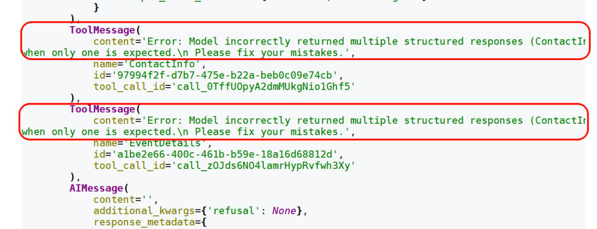
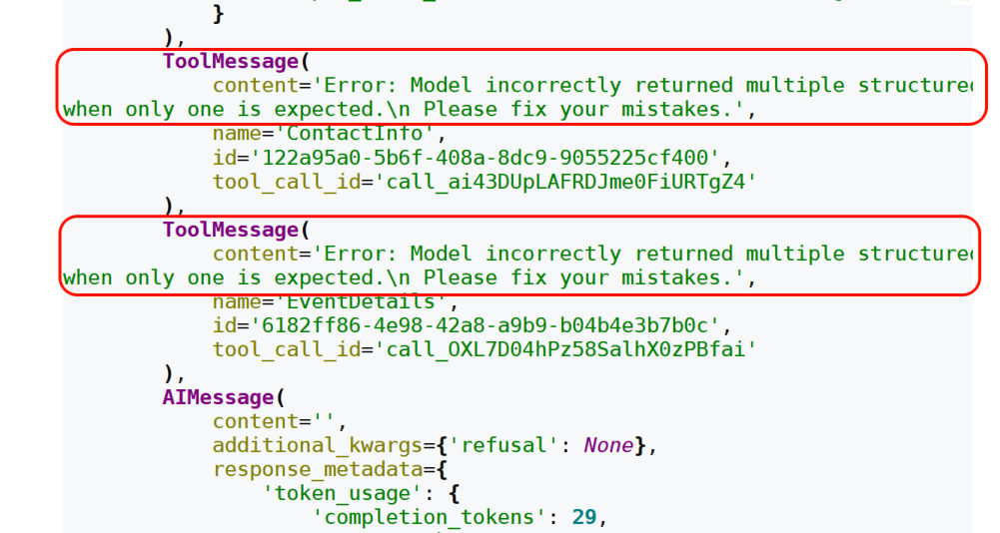
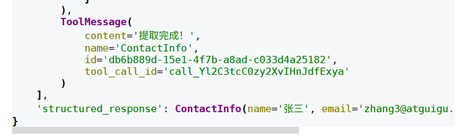
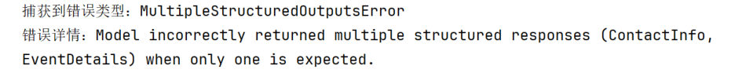
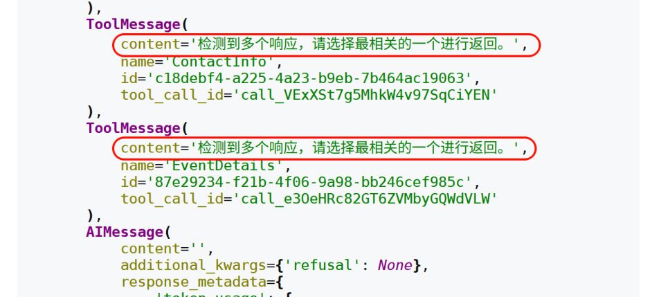

第 6 章学过**模型**的结构化输出（`with_structured_output`）。**Agent** 也能做结构化输出，但用法和时机都不一样——这一篇讲清楚区别，以及四种策略怎么选。

## 模型 vs Agent 的结构化输出

| 维度 | 模型的结构化输出 | Agent 的结构化输出 |
| --- | --- | --- |
| **操作对象** | 大模型对象 | Agent |
| **解析时机** | 每次模型调用生成 `AIMessage` 时都会解析 | **仅在 Agent 决定"任务结束"并输出最终答案时**解析 |
| **数据流转** | 模型 → 结构化对象 | 模型 → 工具 → 反思 → …… → 结构化对象 |
| **绑定方式** | `with_structured_output` | `response_format` 参数 |
| **适用场景** | 单次、确定性的任务（提取字段、翻译、分类） | 多步、复杂推理的任务（查文档后汇总报表） |

一句话：**模型的结构化输出是"一问一答的格式约束"，Agent 的结构化输出是"整段任务结束时的交付格式"**。

## 四种策略

`create_agent()` 通过 `response_format` 参数设置期望的输出模式，支持四类取值：

```python
response_format: Union[
    ToolStrategy[StructuredResponseT],
    ProviderStrategy[StructuredResponseT],
    type[StructuredResponseT],     # 直接给类型（自动选择）
    None,
]
```

模型生成结构化数据后，系统会自动捕获、验证，并把结果存进 **Agent 状态的 `structured_response` 键**：

```python
if "structured_response" in result:
    analysis = result["structured_response"]
```

### ① ProviderStrategy：用模型厂商的原生能力

"原生结构化输出"指大模型提供商通过 API 直接在**响应阶段强制保证**输出格式符合规范的能力（比如 OpenAI 的 strict json_schema）。**只适用于支持原生结构化输出的模型**，如 OpenAI、Anthropic Claude、xAI Grok 等。

```python
from langchain.agents.structured_output import ProviderStrategy
from pydantic import BaseModel, Field

class ContactInfo(BaseModel):
    """个人联系信息"""
    name: str = Field(description="姓名")
    email: str = Field(description="电子邮箱")
    phone: str = Field(description="手机号")

agent = create_agent(model=model, response_format=ProviderStrategy(ContactInfo))
```

> [!NOTE]
> **实测看看它到底发了什么请求**（用假服务端抓包）：
> - 请求体里**没有 tools**，而是多了一个 `response_format` 字段：
>   ```text
>   {'response_format': {'type': 'json_schema',
>                        'json_schema': {'name': 'ContactInfo', 'strict': False,
>                                        'schema': {'properties': {'name': {'description': '姓名', ...}}}}}}
>   ```
> - 模型按原生 JSON Schema 返回内容（不是工具调用），LangChain 再解析成 Pydantic 对象。
>
> 这也解释了为什么它**只认支持原生结构化输出的模型**：换到不支持的模型上，这个字段会被忽略或报错。

### ② ToolStrategy：用工具调用实现（推荐）

对于**不支持原生结构化输出**的模型，LangChain 用"工具调用"的方式实现结构化输出——**把 Schema 当成一个工具传给模型**，模型"调用"它，参数就是结构化数据。

```python
from langchain.agents.structured_output import ToolStrategy

agent = create_agent(model=model, response_format=ToolStrategy(ContactInfo))
response = agent.invoke({
    "messages": [HumanMessage("从这段话中抽取结构化信息：小明的邮箱地址为：songhk@atguigu.com，手机号：12345678912")]
})
print(response["structured_response"])
# name='小明' email='songhk@atguigu.com' phone='12345678912'
```

> [!IMPORTANT]
> **ToolStrategy 会往消息列表末尾追加一条"伪 ToolMessage"**——让链路完整（模型发了工具调用，总要有工具响应），但**实际上没有执行任何工具**。
>
> 实测一次调用的完整消息流：
>
> ```text
> HumanMessage    content='从这段话中抽取结构化信息：小明的邮箱 songhk@atguigu.com…'
> AIMessage       content=''             ← 发起工具调用（工具名就是 Schema 类名 ContactInfo）
> ToolMessage     name='ContactInfo'     ← 伪消息，内容是 "Returning structured response: name='小明' …"
> ```
>
> 而返回的字典里有两个键：`['messages', 'structured_response']`，`structured_response` 就是 **Pydantic 对象**（`type(...)` 是 `ContactInfo`）。

**官方推荐用 ToolStrategy**：它适用于**任何支持工具调用的现代模型**，兼容性最好。

### ③ 直接传类型 / AutoStrategy：自动选择

把类型直接给 `response_format`，LangChain 会自动包装成 `AutoStrategy`，**自动选择策略**：支持原生结构化输出的模型优先用 ProviderStrategy，否则用 ToolStrategy。

```python
agent = create_agent(
    model=model,
    response_format=ContactInfo,     # Auto-selects ProviderStrategy/ToolStrategy
)
print(result["structured_response"])
# name='John Doe' email='john@atguigu.com' phone='(010) 56253825'
```

> [!WARNING]
> 课程提到：**LangChain 1.0 及以上版本不再支持直接传类型**，必须显式写 `ToolStrategy` 或 `ProviderStrategy`（但经测试 **1.2 版本还能用**）。
> **建议**：新代码一律显式写策略，别依赖这种"自动"——将来版本收紧时会直接报错。

#### 源码里才看得到的 AutoStrategy

课程强调了一句：**这种策略官方没在参数列表或文档里列出来，是读源码才看到的**。LangChain 源码里的类型别名长这样：

```python
ResponseFormat = ToolStrategy[SchemaT] | ProviderStrategy[SchemaT] | AutoStrategy[SchemaT]
"""Union type for all supported response format strategies."""
```

也就是说三种策略在源码里是**平级**的，`create_agent` 的参数表只是把"直接传类型"（会自动包装成 `AutoStrategy`）单独写了一种形态。

既然它存在，也可以**显式写出来**（更明确地表达"我就是要让框架自己挑"）：

```python
from langchain.agents.structured_output import AutoStrategy

agent = create_agent(
    model=model,
    response_format=AutoStrategy(ContactInfo),
)

result = agent.invoke({
    "messages": [{"role": "user", "content": "联系人信息: John Doe, john@atguigu.com, (010) 56253825"}]
})
print(result["structured_response"])
# name='John Doe' email='john@atguigu.com' phone='(010) 56253825'
```

> [!NOTE]
> `AutoStrategy(ContactInfo)` 与 `response_format=ContactInfo` **等价**：支持原生结构化输出的模型走 ProviderStrategy，否则走 ToolStrategy。
> 换句话说，`response_format` 一共是**三种显式写法 + 一个 None**：`ToolStrategy(...)`、`ProviderStrategy(...)`、`AutoStrategy(...)`（或直接给类型），以及 `None`。

### ④ None（默认）

`response_format=None` 是默认配置，表示**不做结构化输出**，Agent 用自然语言回答。

## ToolStrategy 详解

```python
class ToolStrategy(Generic[SchemaT]):
    schema: type[SchemaT]                                    # 必需
    tool_message_content: str | None                          # 可选
    handle_errors: Union[bool, str, type[Exception], tuple[type[Exception], ...], Callable[[Exception], str]]   # 可选，默认 True
```

### 参数1：schema（支持哪些 Schema）

与模型结构化输出一致，支持 **Pydantic 模型、TypedDict、JSON Schema、数据类（@dataclass）**，另外还支持**联合类型** `Union[类型1, 类型2]`——允许模型根据输入内容选择最匹配的数据结构：

```python
agent = create_agent(
    model=model,
    response_format=ToolStrategy(Union[ContactInfo, EventDetails]),
)
```

> [!NOTE]
> **TypedDict 当 Schema 的三条要点**（第 12 篇实测过它不做运行时校验）：
> 1. 字段写成 `Annotated[类型, 默认值, "描述"]` 格式
> 2. 可选字段用 `Optional` 包装，默认值也写在 `Annotated` 里
> 3. **TypedDict 不支持运行时验证**——写错了不会报错，只会悄悄出错

### 参数2：tool_message_content（自定义伪消息）

既然那条 ToolMessage 是"假的"，它的内容就可以自己定：**默认用展示输出数据的标准语句**（`Returning structured response: ...`），也可以换成更自然的说法。

```python
agent = create_agent(
    model=model,
    response_format=ToolStrategy(
        ContactInfo,
        tool_message_content="提取完成！",
    ),
)
```

有什么用？两个场景：

1. 在最终用户可见的对话流里，**用更自然的消息替代原始数据**（不然用户会看到一大串字段）
2. 用简短的确认信息替代很长的数据块，**减少 token 消耗**

> [!TIP]
> 无论 `tool_message_content` 怎么设，**结构化数据最终都会正确存进 `result["structured_response"]`**——自定义消息只影响对话历史里的那一条记录。

### 参数3：handle_errors（校验失败怎么办）

受限于模型能力，输出**可能不符合格式要求**。`handle_errors` 决定这时候怎么办：

| 取值 | 行为 | 适用场景 |
| --- | --- | --- |
| `True`（默认） | 捕获所有异常，用 LangChain **内置的错误消息模板**提示模型重试 | 大多数通用场景 |
| `False` | **关闭重试**，任何异常直接抛出、中断程序 | 需要自己处理异常 / 调试 |
| `"自定义字符串"` | 捕获所有异常，但把**固定字符串**当错误消息回给模型 | 需要统一、友好的提示或业务引导 |
| `ExceptionType` | **只捕获指定类型**（如 `ValueError`）的异常并重试，其他直接抛出 | 精准控制，只重试特定错误 |
| `callable` | 用**自定义函数**处理异常，可按异常类型返回不同提示 | 复杂、精细化的错误处理 |

**最典型的错误**是"多结构化输出错误"：模型本该输出**一个**结构化结果，却发起了**多个**工具调用请求。

```python
agent = create_agent(
    model=model,
    response_format=ToolStrategy(
        Union[ContactInfo, EventDetails],
        tool_message_content="提取完成！",
        handle_errors=True,
        # handle_errors="请检查输入数据"
    ),
)
```


*图：`handle_errors=True` 时的真实消息流——模型一次发了两个结构化结果，系统回给它两条带内置错误模板的 ToolMessage（"Error: Model incorrectly returned multiple structured responses … Please fix your mistakes."），模型据此重试*

这种情况下：

1. 用 `Union[ContactInfo, EventDetails]` 指定多个类型时，**最终只会转换成一种**结构化类型输出
2. 内部生成结构化类型的工具会报错，此时 `handle_errors=True`（默认）开始发挥作用：系统生成一条 ToolMessage，明确告诉模型
   `Error: Model incorrectly returned multiple structured responses (ContactInfo, EventDetails) when only one is expected.`
   模型收到这个精准反馈后会**重新推理**，最终选一个最符合要求的 Schema
3. 如果 `handle_errors=False`，程序**直接报错**

常见的两个异常类型：`MultipleStructuredOutputsError`（输出多个结构化结果）、`StructuredOutputValidationError`（结果不符合 Schema）。


*图：`handle_errors=(MultipleStructuredOutputsError, StructuredOutputValidationError)` 时——异常被捕获（程序没中断），回给模型的仍是内置错误模板，模型重新推理*


*图：重试成功后——ToolMessage 的 content 变成了自定义的"提取完成！"，`structured_response` 里正常拿到 `ContactInfo(name='张三', …)`*

> [!WARNING]
> 格式化输出出错时，Agent 内部会**反复重试**直到输出符合要求——可能要重试多次。这意味着**错误处理是有成本的**（额外的模型调用）。


*图：`handle_errors=custom_error_handler` 时，自定义处理函数里打印出的异常类型与详情（这里捕获到的是 `MultipleStructuredOutputsError`）*


*图：自定义处理函数的返回值被直接当作 ToolMessage 的内容回给模型——"检测到多个响应，请选择最相关的一个进行返回。"*

## 四种 Schema 的完整案例

课程在 `schema` 参数这一节走了**四种写法**，并统一用一个综合案例（客户分析报告）演示。先看准备工作，再逐个写法。

### 准备：两个模型供应商（因为支持力度不同）

> 课程原话：**不同的 Schema 在不同模型供应商下表现的支持力度不同**（上一章有说明），所以提供了两套模型，大家自己选。

```python
# 供应商一：CloseAI 平台（OpenAI 兼容，课程默认用这套）
from langchain.chat_models import init_chat_model
from dotenv import load_dotenv
import os

load_dotenv(override=True)

model = init_chat_model(
    model="gpt-5.4-mini",
    model_provider="openai",
    api_key=os.getenv("CLOSEAI_API_KEY"),
    base_url=os.getenv("CLOSEAI_BASE_URL"),
)
```

```python
# 供应商二：OpenRouter 平台（需要梯子）
from langchain_openrouter import ChatOpenRouter
from dotenv import load_dotenv
import os

load_dotenv(override=True)

model = ChatOpenRouter(
    model="openai/gpt-5.4-mini",          # ← 用「供应商/模型名」的写法
    api_key=os.getenv("OPENROUTER_API_KEY"),
    base_url=os.getenv("OPENROUTER_API_BASE"),
)
```

> [!NOTE]
> `ChatOpenRouter` 来自第三方包 **`langchain-openrouter`**（本机环境里已装 `0.1.0`），用法与别的 Chat 模型一致：一样能塞进 `create_agent(model=...)`、一样能配 `ToolStrategy`。
> **实测**（把自己的假服务端当 OpenRouter 端点）：`ChatOpenRouter(model="openai/gpt-5.4-mini", api_key="sk-fake", base_url="http://127.0.0.1:8774")` 能正常发出请求（请求体里的 `model` 字段就是 `openai/gpt-5.4-mini`），配 `ToolStrategy(ContactInfo)` 也能拿到 `name='小明' email='a@b.com' phone='123'`。
> 只是本机没有 OpenRouter 的真密钥，所以下面的例子依旧沿用本机的 DeepSeek 模型——**代码结构完全一样，只换 `model` 那一段**。

### 写法1：Pydantic —— 客户分析报告（完整综合案例）

这是本节的"主案例"：Agent 不只输出结构化结果，还要**先查数据库、VIP 才发邮件**，最后交一份报告。它把"工具调用"和"结构化输出"放在了同一次任务里。

```python
from langchain_core.messages import SystemMessage
from pydantic import BaseModel, Field
from typing import Literal
from langchain.agents import create_agent
from langchain.agents.structured_output import ToolStrategy
from langchain.tools import tool

# ---------- 1. 两个"真"工具 ----------
@tool(parse_docstring=True)
def search_customer_database(query: str) -> str:
    """在客户数据库中搜索信息

    Args:
        query (str): 客户查询字符串，例如 "张三" 或 "李四"

    Returns:
        str: 客户记录字符串，包含客户姓名、等级、最近购买日期和累计消费
    """
    # 模拟数据库查询结果
    if "张三" in query.lower():
        return "客户记录：张三，VIP客户，最近购买日期：2026-01-15，累计消费：$15,000"
    elif "李四" in query.lower():
        return "客户记录：李四，普通客户，最近购买日期：2025-12-20，累计消费：$3,200"
    else:
        return f"关于客户{query}，无记录"


@tool(parse_docstring=True)
def send_email(customer: str) -> str:
    """发送感谢邮件

    Args:
        customer (str): 客户名称，例如 "张三" 或 "李四"

    Returns:
        str: 确认消息，包含已发送的客户名称
    """
    return f"已向 {customer} 发送感谢邮件"


# ---------- 2. 定义 Pydantic Schema ----------
class CustomerAnalysis(BaseModel):
    """客户分析报告"""
    customer_name: str = Field(None, description="客户姓名")
    customer_tier: Literal["潜在客户", "普通客户", "VIP客户", "流失风险"] = Field(
        "潜在客户", description="客户等级,只能是潜在客户、普通客户、VIP客户或流失风险"
    )
    recent_activity: str = Field(None, description="最近活动")
    spending_level: Literal["低", "中", "高"] = Field(None, description="消费水平")
    send_email: bool = Field(False, description="是否已发送感谢邮件")


# ---------- 3. 创建智能体 ----------
agent = create_agent(
    model=model,
    system_prompt=SystemMessage(content=""
        "请分析指定客户的情况："
        "1. 先搜索客户数据库了解最新情况 "
        "2. 如果是VIP客户，则发送感谢邮件 "
        "3. 基于搜索结果生成结构化分析报告 "
        "4. 如果用户提问与客户记录无关或找不到客户信息，则返回空对象，不发送感谢邮件"
    ),
    tools=[search_customer_database, send_email],     # 工具 + 结构化输出同时用
    response_format=ToolStrategy(CustomerAnalysis),
)

# ---------- 4. 执行分析 ----------
result = agent.invoke({
    "messages": [{"role": "user", "content": "请分析客户张三"}]
    # "messages": [{"role": "user", "content": "请分析客户李四"}]
    # "messages": [{"role": "user", "content": "请分析客户王五"}]
    # "messages": [{"role": "user", "content": "今天天气如何"}]
})

# ---------- 5. 处理结果 ----------
if "structured_response" in result:
    analysis = result["structured_response"]
    print(analysis)
```

输出：

```text
customer_name='张三' customer_tier='VIP客户' recent_activity='最近购买日期：2026-01-15' spending_level='高' send_email=True
```

| 写法 | 为什么这么写 |
| --- | --- |
| 枚举字段用 **`Literal["潜在客户", "普通客户", "VIP客户", "流失风险"]`** | 把取值**锁死在几个选项里**，模型不会自创"金牌客户""白金会员"这类值 |
| 字段都给**默认值**（`Field("潜在客户", ...)` / `Field(False, ...)`） | 信息缺失时有兜底，不至于因为一个空字段整份报告校验失败 |
| `send_email: bool` 字段 | 它是一个**状态标记**："这封感谢邮件到底发没发"，和同名工具配合使用 |
| 系统提示词的**四条指令** | 把"先查库 → VIP 才发邮件 → 再出报告 → 查不到就返回空对象"的顺序讲清楚，第 4 条尤其关键——**没有它，模型会反反复复地查一个不存在的客户** |
| 最后用 `if "structured_response" in result` 取值 | 不是每次调用都一定有结构化结果，先判断再取，避免 `KeyError` |

> [!NOTE]
> **实测这个案例能跑通**（用假服务端扮演模型，按"查库 → 发邮件 → 出报告"三步返回工具调用）：
> ```text
> 消息类型链: HumanMessage → AIMessage → ToolMessage → AIMessage → ToolMessage → AIMessage → ToolMessage
> structured_response: customer_name='张三' customer_tier='VIP客户' recent_activity='最近购买日期：2026-01-15' spending_level='高' send_email=True
> 类型: CustomerAnalysis
> ```
> 两个观察：
> - 消息链里**两个真工具先跑**（各一对 AI/Tool），**结构化输出排在最后**——整条链的第 7 条（最后那条 `ToolMessage`）就是伪消息，它的 `name='CustomerAnalysis'`。这正是"任务结束才解析结构化输出"的直观体现。
> - `structured_response` 是 **`CustomerAnalysis` 对象**（不是 dict），可以直接 `analysis.customer_tier` 这样取值。

### 写法2：TypedDict

字段的写法是 `Annotated[类型, 默认值, "描述"]`，可选字段用 `Optional` 包装——三条要点在本篇「参数1」里已经列过，这里只补一句：**同样的客户分析案例，把 `class CustomerAnalysis(BaseModel)` 换成 `class CustomerAnalysis(TypedDict)` 就能跑**，但因为它不做运行时校验，字段写错只会悄悄出错。

### 写法3：手写 JSON Schema 字典

不定义类，直接给一个符合 **JSON Schema 规范**的字典——适合需要与多种编程语言/系统交换结构定义的场景。

```python
# 把所有字段定义成一个标准 JSON Schema 字典（替代上面的 Pydantic 模型）
customer_analysis_schema = {
    "title": "CustomerAnalysis",           # 结构名（会当"虚拟工具"的名字用）
    "type": "object",                      # 表示"这是一个对象"
    "description": "客户分析报告",
    "properties": {                        # 每个字段的定义
        "customer_name": {
            "type": "string",
            "default": "",
            "description": "客户姓名",
        },
        "customer_tier": {
            "type": "string",
            "enum": ["潜在客户", "普通客户", "VIP客户", "流失风险"],   # ← 枚举写在这里
            "default": "潜在客户",
            "description": "客户等级",
        },
        "recent_activity": {
            "type": "string",
            "default": "",
            "description": "最近活动",
        },
        "spending_level": {
            "type": "string",
            "enum": ["低", "中", "高"],
            "default": "低",
            "description": "消费水平",
        },
        "send_email": {
            "type": "boolean",             # ← 布尔类型（注意 JSON 里写 false）
            "default": False,
            "description": "是否已发送感谢邮件",
        },
    },
    # 所有字段都是必须输出的
    "required": ["customer_name", "customer_tier", "recent_activity", "spending_level"],
}

agent = create_agent(
    model=model,
    system_prompt=SystemMessage(content="...同写法1的四条指令..."),
    tools=[search_customer_database, send_email],
    response_format=ToolStrategy(customer_analysis_schema),   # ← 直接把字典交给 ToolStrategy
)
```

| 关键字 | 作用 |
| --- | --- |
| `title` | 结构名，会作为"虚拟工具"名 |
| `type` | 结构类型，对象写 `"object"` |
| `description` | 结构/字段的说明文字（模型读它） |
| `properties` | 字段字典：每个字段写 `type`、`description`，可选 `enum`、`default` |
| `enum` | **枚举**可选值（如客户等级、消费水平） |
| `default` | 默认值 |
| `required` | **必须输出**的字段名列表 |

> [!TIP]
> 课程原话：`title, description, type, properties, required` 都是**遵循 JSON Schema 规范的标准关键字，是固定写法**（细节在第 06 章 2.3 节，也就是本笔记讲模型结构化输出的 11/12 篇）。
> **实测补充**：用手写字典做 Schema 时，`result["structured_response"]` 拿到的是**普通 `dict`**（`{'name': '小明', 'email': ..., 'phone': ...}`），**不是** Pydantic 对象——想要对象属性和自动校验，还是用 Pydantic 类。

### 写法4：@dataclass

`@dataclass` 是 Python 3.7 引入的装饰器，用来简化"只存数据"的类定义：

```python
from dataclasses import dataclass
from langchain.agents import create_agent
from langchain.agents.structured_output import ToolStrategy
from langchain.messages import HumanMessage
from pydantic import Field              # ← 课程举例1 的片段里没写这一行，得自己补

@dataclass
class ContactInfo:
    """用户的联系方式"""
    name: str = Field(description="用户姓名")
    email: str = Field(description="用户邮箱地址")
    phone: str = Field(description="用户手机号")

agent = create_agent(
    model=model,
    response_format=ToolStrategy(ContactInfo),
)

response = agent.invoke({
    "messages": [
        HumanMessage("从这段话中抽取结构化信息：小明的邮箱地址为：songhk@atguigu.com，手机号：12345678912")
    ]
})

for msg in response["messages"]:
    msg.pretty_print()
```

输出里那条伪 ToolMessage 的正文是**数据类的表示形式**（注意和 Pydantic 的 `name='小明'` 写法不同）：

```text
================================== Ai Message ==================================
Tool Calls:
  ContactInfo (call_3MRoBpJHDaoYB6jK7plgW1YF)
 Call ID: call_3MRoBpJHDaoYB6jK7plgW1YF
  Args:
    name: 小明
    email: songhk@atguigu.com
    phone: 12345678912
================================= Tool Message =================================
Name: ContactInfo

Returning structured response: ContactInfo(name='小明', email='songhk@atguigu.com', phone='12345678912')
```

> [!WARNING]
> `@dataclass` 这个写法有坑，**实测（langchain 1.2.12）**如下：
> 1. 字段写的 `Field(description=...)` 是 **Pydantic 的 `Field`**，必须 `from pydantic import Field`；课程举例1 的代码片段里没有这行 import，单独复制会直接 `NameError`。
> 2. 用 `Field(...)` 当默认值时，`dataclasses.fields(ContactInfo)` 里每个字段的 `default` 是一个 **`FieldInfo` 对象**（不是"无默认值"）——所以 `ContactInfo()` 直接构造出来的字段值会是一堆 `FieldInfo`。
> 3. 好消息是**走 Agent 时没问题**：实测发给模型的工具定义里 description 正常带上、`result["structured_response"]` 也正确返回了 `ContactInfo(...)` 实例。
> 4. **不写 `Field`、纯 `@dataclass`（`name: str` 这样）也能跑通**，只是字段**没有 description**（模型少了一部分信息）。
>
> **结论**：想要描述信息 + 强校验，用 Pydantic `BaseModel`；只是想少写点样板代码，`@dataclass` 也能用，但别指望它做校验。

## 写 Agent 结构化输出时的四个注意点

课程踩坑总结，值得贴在手边：

1. **结构化输出的要求写在系统提示词的最后**。如果提示词里"先"要求输出结构化结果（Agent 以为任务已完成），**可能会导致一些工具不再被调用**。
2. 系统提示词里要**最后加上"未找到用户"时的处理提示**，避免程序一直调用工具反复查找不存在的用户信息（死循环）。
3. TypedDict 那三条（`Annotated[类型, 默认值, "描述"]` / `Optional` 包装可选字段 / 不支持运行时验证）。
4. `Union` 多类型最终只输出一种；靠 `handle_errors` 兜底重试。

## 相关

- [结构化输出](/posts/编程学习/langchain学习笔记/11-结构化输出/)
- [另外三种模式与类型校验](/posts/编程学习/langchain学习笔记/12-另外三种模式与类型校验/)
- [系统提示词与Agent名称](/posts/编程学习/langchain学习笔记/15-系统提示词与agent名称/)

## 练习题

### 一、回忆填空（写完再展开对答案）

1. 模型的结构化输出绑在____上（方法名 `with_structured_output`），Agent 的结构化输出写在 `create_agent` 的 `____` 参数里；解析时机也不同——模型是____都解析，Agent 只在它决定"____"、输出最终答案时才解析，所以结构化结果总是排在消息链的____；适用场景也不同：模型适合____的任务（提取字段、翻译、分类），Agent 适合____的任务（查文档后汇总报表）
2. 四种策略：____只走模型厂商的原生能力（请求体里多出一个 `response_format` 字段、内容是 `json_schema`，而且 `tools` 是空的），所以**只适用于支持原生结构化输出的模型**（OpenAI / Claude / Grok 等）；____把 Schema 当成一个"工具"传给模型（官方推荐、兼容性最好，适用于任何支持工具调用的模型）；直接传类型会被自动包装成 ____；`None`（默认）表示____。**建议**：新代码一律____写策略
3. 结构化结果存在 Agent 状态的 `____` 键里，取之前先写 `if "____" in result`，避免____；ToolStrategy 还会在消息列表末尾追加一条____的 ToolMessage（实际**没有执行任何工具**），它的 `name` 就是____，返回字典的两个键是 `messages` 和 `structured_response`
4. ToolStrategy 三个参数：`____`（必需，支持 Pydantic、TypedDict、JSON Schema 字典、`@dataclass` 四类，还支持____——此时最终只会转换成一种结构）、`____`（自定义伪消息内容，让对话更自然 / 少占 token，但**不影响**结构化结果）、`____`（校验失败怎么办，默认 `True`）
5. `handle_errors` 的五种取值：`True` 用____模板提示模型重试；`False` 关闭重试、异常直接____；字符串则把这句话当____回给模型；传异常类型只重试____的异常；传 callable 用自定义函数处理。最典型的错误是"____"错误，两个常见异常是 `MultipleStructuredOutputsError` 和____
6. TypedDict 当 Schema 的三条要点：字段写成 `____` 格式；可选字段用____包装；**不支持____校验**（写错只会悄悄出错）
7. 手写 JSON Schema 字典的标准关键字：`title`（结构名，会当作____的名字）、`type`、`description`、`properties`（字段字典）、____（枚举可选值）、`default`、____（必须输出的字段名列表）；用这种写法拿到的 `structured_response` 是普通____，不是 Pydantic 对象
8. `@dataclass` 写法：字段描述用的是____的 `Field`（课程代码片段里缺这行 import，单独复制会 `NameError`）；`Field(...)` 当默认值时，字段的 `default` 是____对象；不写 `Field` 也能跑通，只是字段____
9. 客户分析案例的三个技巧：枚举字段用____把取值锁死、所有字段都给____兜底、`send_email: bool` 充当"邮件发没发"的____；系统提示词的最后一条必须写"____"，否则模型会反复查一个不存在的客户。另外，结构化输出的要求要写在系统提示词的____，写在前面可能让部分工具____
10. 两个模型供应商：供应商一用 `init_chat_model(..., model_provider="____")` 走 OpenAI 兼容；供应商二用第三方包 `____` 的 `ChatOpenRouter`，模型名要写成"____"的格式。源码里 `ResponseFormat` 把三种策略写成____关系，`AutoStrategy(Schema)` 与"____"等价

> [!TIP]- 填空答案（做完再点开）
> 1. 大模型（模型对象） / `response_format` / 每次模型调用 / 任务结束 / 最后 / 单次、确定性的任务（提取字段、翻译、分类） / 多步、复杂推理的任务（查文档后汇总报表）　2. ProviderStrategy / ToolStrategy / AutoStrategy / 不做结构化输出（自然语言回答） / 显式　3. `structured_response` / `structured_response` / KeyError / 伪（假的） / Schema 类名（如 `ContactInfo`）　4. `schema` / 联合类型 `Union[...]` / `tool_message_content` / `handle_errors`　5. 内置错误消息 / 抛出（中断程序） / 错误消息 / 指定类型 / 多结构化输出 / `StructuredOutputValidationError`
> 6. `Annotated[类型, 默认值, "描述"]` / `Optional` / 运行时　7. "虚拟工具" / `enum` / `required` / 字典（`dict`）　8. pydantic / `FieldInfo` / 没有 description（模型少了一部分信息）　9. `Literal[...]` / 默认值 / 状态标记 / 查不到客户就返回空对象（不发送感谢邮件） / 最后 / 不再被调用　10. openai / `langchain-openrouter` / 供应商/模型名 / 平级（`|` 联合） / 直接传类型（`response_format=Schema`）

### 二、裸写题

- [ ] **2-1 用"工具调用式"策略抽取联系人信息**
  定义一个"个人联系信息"数据模型（姓名 / 邮箱 / 手机号三个字段，每个字段都带中文说明），创建一个 Agent 并把这份模型声明成它的**交付格式**；然后从"小明的邮箱地址为：songhk@atguigu.com，手机号：12345678912"里抽取信息，打印最终的结构化结果（打印前先判断有没有拿到）。

  > [!TIP]- 提示（先自己想，实在想不出再点开）
  > **一级 · 思路**：Schema 写在数据模型类里；"什么时候解析"由 Agent 的交付格式参数决定——用官方推荐的那种（靠工具调用实现的）
  > **二级 · 方法**：`from langchain.agents.structured_output import ToolStrategy`；`create_agent(model=..., response_format=ToolStrategy(ContactInfo))`
  > **三级 · 骨架**：先 `if "structured_response" in response:` 再打印，否则可能 `KeyError`；顺便 `print(type(...))`，确认拿到的是对象还是字典

- [ ] **2-2 观察那条"伪消息"，再把它换成自己的话**
  在 2-1 的基础上遍历返回的消息列表，打印每条消息的类型、`name`、`content`：找出哪一条是"伪消息"（模型发出工具调用之后、系统补上的那条响应），它的 `name` 是什么、"模型调用的工具名"和它是不是同一个？然后给交付格式再加一个参数，把这条伪消息的内容改成"提取完成！"重跑一次，确认伪消息内容变了、而结构化结果没受影响。

  > [!TIP]- 提示（先自己想，实在想不出再点开）
  > **一级 · 思路**：那条消息是为了"补链路"（模型发了工具调用，总得有个响应），实际没执行任何工具；它的内容可以自定义，但只影响对话历史里的那一条记录
  > **二级 · 方法**：`type(msg).__name__` + `getattr(msg, "name", None)`；`ToolStrategy(ContactInfo, tool_message_content="提取完成！")`（`ToolMessage` 就是那条伪消息的类型）
  > **三级 · 骨架**：改完再打印 `response2["messages"][-1].content` 对比；顺便想想自定义伪消息的两个用途（用户看到的对话更自然、少占 token）

- [ ] **2-3 客户分析报告：查库 → 发邮件 → 出报告**
  把"工具调用"和"结构化输出"放进同一次任务：
  ① 定义两个工具：一个查客户数据库（命中"张三"返回 `客户记录：张三，VIP客户，最近购买日期：2026-01-15，累计消费：$15,000`，命中"李四"返回普通客户记录，其他返回"无记录"）；一个给客户发感谢邮件（返回"已向 xx 发送感谢邮件"）。两个工具的 docstring 都按 `Args` / `Returns` 规范写。
  ② 定义一份"客户分析报告"数据模型：客户姓名、客户等级（只能是 潜在客户 / 普通客户 / VIP客户 / 流失风险 之一）、最近活动、消费水平（只能是 低 / 中 / 高 之一）、是否已发送感谢邮件（布尔）。每个字段都给默认值兜底。
  ③ 系统提示词按四步写清顺序：先查库 → 是 VIP 才发邮件 → 基于搜索结果生成报告 → 查不到客户就返回空对象、不发邮件。
  ④ 用"请分析客户张三"调用，打印结构化结果，并打印整条消息链的类型序列：数一数一共几条消息、最后那条 ToolMessage 的 `name` 是什么。

  > [!TIP]- 提示（先自己想，实在想不出再点开）
  > **一级 · 思路**：枚举字段要"锁死"取值（不然模型会自创"金牌客户"这种值）；`send_email` 是"邮件发没发"的状态标记、和同名工具配合；取值前先判断有没有结构化结果
  > **二级 · 方法**：`Literal["潜在客户", "普通客户", "VIP客户", "流失风险"]`、`Field(默认值, description=...)`；`create_agent(model=..., system_prompt=SystemMessage(content=...), tools=[...], response_format=ToolStrategy(CustomerAnalysis))`
  > **三级 · 骨架**：预期消息链是 人 → AI → 工具 → AI → 工具 → AI → 工具（第 7 条就是伪消息）；想验证"VIP 才发邮件"，把输入换成"请分析客户李四"再跑一次，看还会不会调发邮件工具

- [ ] **2-4 同一份 Schema 换三种写法**
  把 2-1 的"个人联系信息"再写三遍，每次都从同一段文本里抽取：
  ① 不写类，直接给一个符合 JSON Schema 规范的结构字典（写清结构名、对象类型、字段说明、"手机号"可省略、必填字段列表）；
  ② 用"带类型的字典"声明（字段写成 类型标注 + 描述，"手机号"可选）；
  ③ 用数据类声明（字段描述沿用 Pydantic 的字段函数，注意补 import）。
  每跑完一种就打印结果的类型，然后回答三个问题：拿到的是对象还是普通字典？字段说明有没有真的传给模型？哪种写法会做运行时校验？

  > [!TIP]- 提示（先自己想，实在想不出再点开）
  > **一级 · 思路**：三种写法在"校验"和"结果类型"上差别很大——课程反复强调"想要强校验就用 Pydantic"
  > **二级 · 方法**：`ToolStrategy(字典)`；`TypedDict` + `Annotated[类型, "描述"]`；`@dataclass` + `from pydantic import Field`
  > **三级 · 骨架**：① 工具名就是字典的 `title`（或类名）——想看清"工具名从哪来"，可以把三种写法的结构名取得不一样；想确认"说明有没有传给模型"，去翻请求体里 `tools[0].function.parameters`；③ 记得 `from pydantic import Field`，否则 `NameError`，另外打印一下 `dataclasses.fields(类)` 的 `default`，会看到意外的东西

### 三、综合题

- [ ] **3-1 联合类型 + 出错重试策略的三种取值**
  ① 定义两个数据模型：联系人（姓名 / 邮箱 / 手机号）和活动详情（活动名称 / 日期）。
  ② 创建一个 Agent，把"两种结构二选一"声明成交付格式（提示：联合类型），分别用"小明的邮箱地址为：songhk@atguigu.com，手机号：12345678912"和"2026年高考报名人数突破1200万"调用，看它每次选中哪个结构。
  ③ 把出错重试策略依次设成三种：默认打开、关闭、给一个固定字符串（如"请检查输入数据"），比较三次调用的表现；想看细节就去翻消息列表里的 ToolMessage 内容。

  > [!TIP]- 提示（先自己想，实在想不出再点开）
  > **一级 · 思路**：联合类型让模型"选一个"；出错重试策略决定"选错 / 一次选了多个"时怎么办
  > **二级 · 方法**：`ToolStrategy(Union[ContactInfo, EventDetails], tool_message_content="提取完成！", handle_errors=True)`
  > **三级 · 骨架**：最典型的错误是"多结构化输出"——模型一次发了两个工具调用；默认重试时消息里会出现 LangChain 内置模板 `Error: Model incorrectly returned multiple structured responses (ContactInfo, EventDetails) when only one is expected.`，关闭重试时直接抛 `MultipleStructuredOutputsError`；想知道自定义处理函数收到哪个异常，在函数里 `print(type(e).__name__)`

> [!TIP]- 参考答案（做完再点开）
> ```python
> import os
> from dataclasses import dataclass, fields as dataclass_fields
> from typing import Annotated, Literal, Optional, TypedDict, Union
>
> from dotenv import load_dotenv
> from langchain.agents import create_agent
> from langchain.agents.structured_output import ToolStrategy
> from langchain.chat_models import init_chat_model
> from langchain.messages import HumanMessage
> from langchain.tools import tool
> from langchain_core.messages import SystemMessage
> from pydantic import BaseModel, Field
>
> load_dotenv(override=True)
>
> model = init_chat_model(
>     model="deepseek-v4-flash",
>     model_provider="openai",
>     api_key=os.getenv("DEEPSEEK_API_KEY"),
>     base_url=os.getenv("DEEPSEEK_BASE_URL"),
> )
>
> # ---------- 2-1 最简 ToolStrategy ----------
> class ContactInfo(BaseModel):
>     """个人联系信息"""
>     name: str = Field(description="姓名")
>     email: str = Field(description="电子邮箱")
>     phone: str = Field(description="手机号")
>
> agent = create_agent(model=model, response_format=ToolStrategy(ContactInfo))
> question = HumanMessage("从这段话中抽取结构化信息：小明的邮箱地址为：songhk@atguigu.com，手机号：12345678912")
> response = agent.invoke({"messages": [question]})
> if "structured_response" in response:
>     print(response["structured_response"])          # name='小明' email='songhk@atguigu.com' phone='12345678912'
>     print(type(response["structured_response"]))    # <class '__main__.ContactInfo'>
>
> # ---------- 2-2 伪 ToolMessage + 自定义内容 ----------
> for msg in response["messages"]:
>     print(type(msg).__name__, "| name =", getattr(msg, "name", None), "| content =", str(msg.content)[:60])
> # HumanMessage | name = None | content = 从这段话中抽取结构化信息：…
> # AIMessage    | name = None | content =                     ← 发起工具调用，工具名就是 Schema 类名
> # ToolMessage  | name = 'ContactInfo' | content = Returning structured response: name='小明' …
>
> agent2 = create_agent(model=model, response_format=ToolStrategy(ContactInfo, tool_message_content="提取完成！"))
> response2 = agent2.invoke({"messages": [question]})
> print(response2["messages"][-1].content)      # 提取完成！
> print(response2["structured_response"])       # 结构化结果照样正确
>
> # ---------- 2-3 客户分析报告（工具 + 结构化） ----------
> @tool(parse_docstring=True)
> def search_customer_database(query: str) -> str:
>     """在客户数据库中搜索信息
>
>     Args:
>         query (str): 客户查询字符串，例如 "张三" 或 "李四"
>
>     Returns:
>         str: 客户记录字符串，包含客户姓名、等级、最近购买日期和累计消费
>     """
>     if "张三" in query.lower():
>         return "客户记录：张三，VIP客户，最近购买日期：2026-01-15，累计消费：$15,000"
>     elif "李四" in query.lower():
>         return "客户记录：李四，普通客户，最近购买日期：2025-12-20，累计消费：$3,200"
>     return f"关于客户{query}，无记录"
>
> @tool(parse_docstring=True)
> def send_email(customer: str) -> str:
>     """发送感谢邮件
>
>     Args:
>         customer (str): 客户名称，例如 "张三" 或 "李四"
>
>     Returns:
>         str: 确认消息，包含已发送的客户名称
>     """
>     return f"已向 {customer} 发送感谢邮件"
>
> class CustomerAnalysis(BaseModel):
>     """客户分析报告"""
>     customer_name: str = Field(None, description="客户姓名")
>     customer_tier: Literal["潜在客户", "普通客户", "VIP客户", "流失风险"] = Field(
>         "潜在客户", description="客户等级,只能是潜在客户、普通客户、VIP客户或流失风险"
>     )
>     recent_activity: str = Field(None, description="最近活动")
>     spending_level: Literal["低", "中", "高"] = Field(None, description="消费水平")
>     send_email: bool = Field(False, description="是否已发送感谢邮件")
>
> agent3 = create_agent(
>     model=model,
>     system_prompt=SystemMessage(content=""
>         "请分析指定客户的情况："
>         "1. 先搜索客户数据库了解最新情况 "
>         "2. 如果是VIP客户，则发送感谢邮件 "
>         "3. 基于搜索结果生成结构化分析报告 "
>         "4. 如果用户提问与客户记录无关或找不到客户信息，则返回空对象，不发送感谢邮件"),
>     tools=[search_customer_database, send_email],
>     response_format=ToolStrategy(CustomerAnalysis),
> )
> result = agent3.invoke({"messages": [{"role": "user", "content": "请分析客户张三"}]})
> print("消息类型链:", " → ".join(type(m).__name__ for m in result["messages"]))
> # HumanMessage → AIMessage → ToolMessage → AIMessage → ToolMessage → AIMessage → ToolMessage
> print([m.name for m in result["messages"] if type(m).__name__ == "ToolMessage"][-1])   # CustomerAnalysis
> if "structured_response" in result:
>     print(result["structured_response"])
>     # customer_name='张三' customer_tier='VIP客户' recent_activity='最近购买日期：2026-01-15' spending_level='高' send_email=True
>     print(result["structured_response"].customer_tier)                                  # 对象属性取值：VIP客户
>
> # ---------- 2-4 同一份 Schema 的三种写法 ----------
> # ① 手写 JSON Schema 字典
> contact_schema = {
>     "title": "ContactInfo",              # 结构名 = 虚拟工具名
>     "type": "object",
>     "description": "个人联系信息",
>     "properties": {
>         "name": {"type": "string", "default": "", "description": "姓名"},
>         "email": {"type": "string", "default": "", "description": "电子邮箱"},
>         "phone": {"type": "string", "default": "", "description": "手机号（可省略）"},
>     },
>     "required": ["name", "email"],       # 只要求前两个
> }
> agent4 = create_agent(model=model, response_format=ToolStrategy(contact_schema))
> r4 = agent4.invoke({"messages": [question]})
> print(type(r4["structured_response"]).__name__)        # dict ← 普通字典，没有属性访问
>
> # ② TypedDict（Annotated[类型, 描述]；可选字段用 Optional）
> class ContactInfoTD(TypedDict):
>     """个人联系信息"""
>     name: Annotated[str, "姓名"]
>     email: Annotated[str, "电子邮箱"]
>     phone: Annotated[Optional[str], "手机号"]
>
> agent5 = create_agent(model=model, response_format=ToolStrategy(ContactInfoTD))
> r5 = agent5.invoke({"messages": [question]})
> print(type(r5["structured_response"]).__name__)        # dict ← 同样不做运行时校验
>
> # ③ @dataclass（注意 Field 来自 pydantic）
> @dataclass
> class ContactInfoDC:
>     """用户的联系方式"""
>     name: str = Field(description="用户姓名")
>     email: str = Field(description="用户邮箱地址")
>     phone: str = Field(description="用户手机号")
>
> agent6 = create_agent(model=model, response_format=ToolStrategy(ContactInfoDC))
> r6 = agent6.invoke({"messages": [question]})
> print(type(r6["structured_response"]))                 # <class '__main__.ContactInfoDC'> ← 是对象
> print([f.default for f in dataclass_fields(ContactInfoDC)][0])
> # FieldInfo(annotation=NoneType, required=True, description='用户姓名') ← 坑：default 被 Field 占了
>
> # ---------- 3-1 Union 多类型 + handle_errors ----------
> class EventDetails(BaseModel):
>     """活动详情"""
>     event_name: str = Field(description="活动名称")
>     date: str = Field(description="活动日期")
>
> agent7 = create_agent(
>     model=model,
>     response_format=ToolStrategy(Union[ContactInfo, EventDetails], tool_message_content="提取完成！"),
> )
> for text in [
>     "从这段话中抽取结构化信息：小明的邮箱地址为：songhk@atguigu.com，手机号：12345678912",
>     "从这段话中抽取结构化信息：2026年高考报名人数突破1200万",
> ]:
>     r = agent7.invoke({"messages": [HumanMessage(text)]})
>     if "structured_response" in r:
>         print(type(r["structured_response"]).__name__, r["structured_response"])
> # ContactInfo name='小明' email='songhk@atguigu.com' phone='12345678912'
> # EventDetails event_name='2026年高考报名人数突破1200万' date='…'
>
> # 把 handle_errors 换成 False / "请检查输入数据" 再跑一次，对比失败时的表现：
> agent8 = create_agent(
>     model=model,
>     response_format=ToolStrategy(
>         Union[ContactInfo, EventDetails],
>         tool_message_content="提取完成！",
>         handle_errors=True,        # 改 False：直接抛 MultipleStructuredOutputsError；改字符串：当作错误提示回传
>     ),
> )
> r8 = agent8.invoke({"messages": [HumanMessage("从这段话中抽取结构化信息：小明的邮箱地址为：songhk@atguigu.com，手机号：12345678912")]})
> for m in r8["messages"]:
>     if type(m).__name__ == "ToolMessage":
>         print(m.name, "->", str(m.content)[:110])
> # 触发"多结构化输出"错误时（模型一次返回两个结构化结果）：
> #   ContactInfo  -> Error: Model incorrectly returned multiple structured responses (ContactInfo, EventDetails) …
> #   EventDetails -> Error: Model incorrectly returned multiple structured responses (ContactInfo, EventDetails) …
> #   ContactInfo  -> 提取完成！        ← 重试成功，用的还是自定义的伪消息内容
> ```
