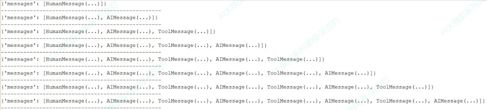
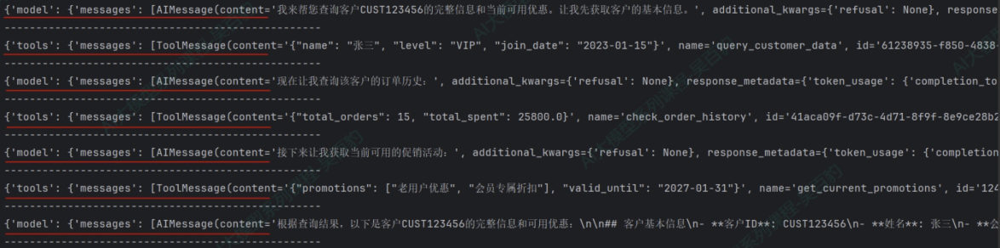
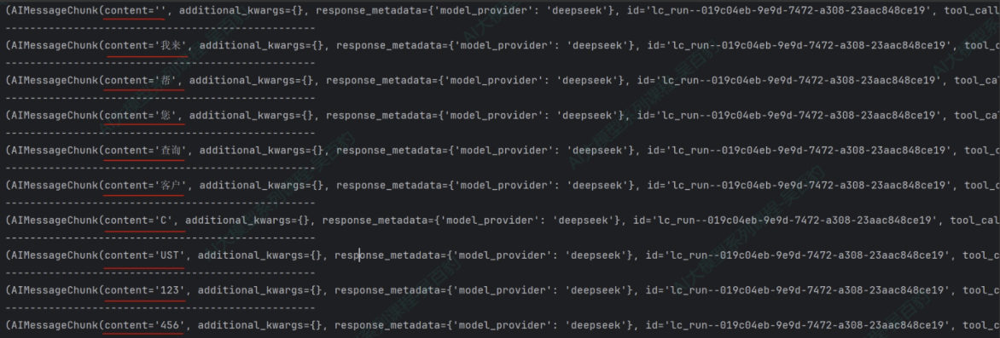
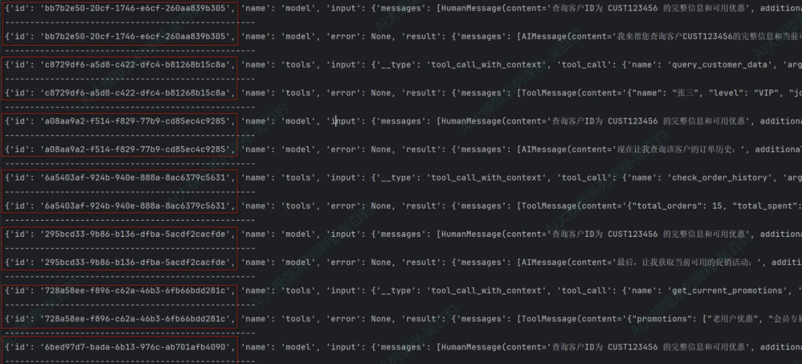
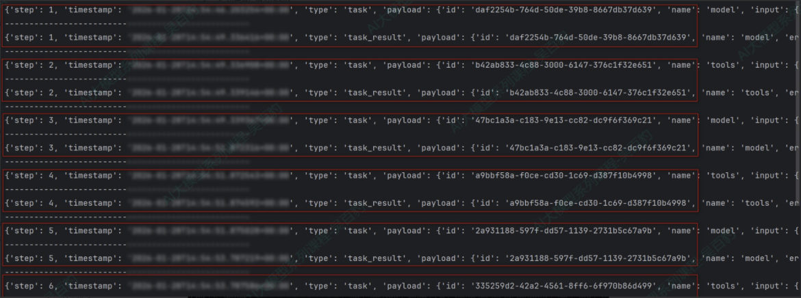
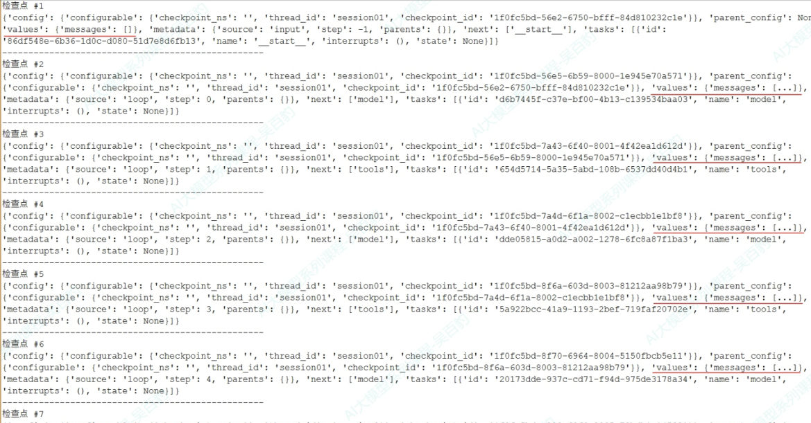
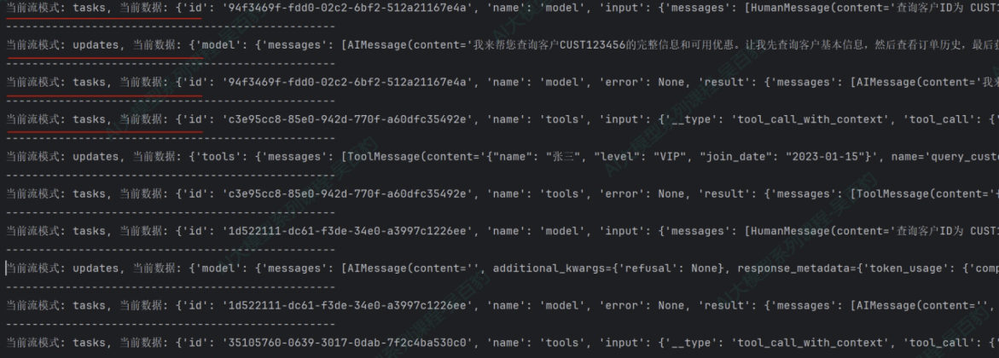

## 为什么需要流式输出

用 `invoke` 调用 Agent 时，**内部可能经历多次模型和工具调用**——用户敲完问题后，界面上长时间没有任何反应，体验很差。

**流式调用（渐进式显示输出）** 能实时显示 Agent 运行过程中的更新，尤其在处理 LLM 延迟时有效：

- 大模型生成完整响应通常要几秒，长输出可能 **10-20 秒**；用户期望即时反馈，流式让等待更可控
- 相比"干等一个完整响应"，流式可以立刻看到文字逐渐出现的效果，**大幅降低等待焦虑**

设置方式：**`agent.stream(stream_mode=指定模式)`**。

## 七种输出模式

| 模式 | 输出内容 | 使用场景 |
| --- | --- | --- |
| `values` | 每个步骤执行后，输出**完整的状态信息** | 每一步都要获取完整状态、状态持久化 |
| `updates`（默认） | 每个步骤执行后，只**增量更新**状态中发生变化的内容 | 监控 Agent 执行进度（何时决定调工具、工具返回了什么） |
| `messages` | 流式返回的 **Token** 及相关元数据（如来自哪个节点） | 实现类似 ChatGPT 的**打字机效果** |
| `tasks` | 当前 task 任务**开始和结束的时间**，含任务结果和错误信息 | 监控任务的生命周期 |
| `debug` | 与 tasks 类似，但多输出任务步骤、时间戳、task 类型 | 调试、监控 task 生命周期 |
| `checkpoints` | **每当检查点（checkpoint）被创建**时触发，输出检查点中的状态 | 状态持久化、工作流恢复、分布式执行跟踪 |
| `custom` | 通过 `get_stream_writer` 在工具或节点内部**自定义发送的数据** | 输出业务进度信息（"已处理 10/100 条"）、自定义日志或指标 |

下面用一个"客户服务 Agent"贯穿演示（三个工具：查客户信息、查订单历史、查促销活动）：

```python
from langchain.agents import create_agent
from langchain.tools import tool
from typing import Dict, Any

@tool
def query_customer_data(customer_id: str) -> Dict[str, Any]:
    """查询客户基本信息

    Args:
        customer_id: 客户ID，用于唯一标识客户

    Returns:
        包含客户基本信息的字典，如姓名、等级、加入日期等
    """
    return {"name": "张三", "level": "VIP", "join_date": "2023-01-15"}

@tool
def check_order_history(customer_id: str) -> Dict[str, Any]:
    """查询客户订单历史

    Args:
        customer_id: 客户ID，用于唯一标识客户
    """
    return {"total_orders": 15, "total_spent": 25800.00}

@tool
def get_current_promotions() -> Dict[str, Any]:
    """获取当前可用促销活动"""
    return {"promotions": ["老用户优惠", "会员专属折扣"], "valid_until": "2027-01-31"}

customer_service_agent = create_agent(
    model=model,
    tools=[query_customer_data, check_order_history, get_current_promotions],
)

QUESTION = {"messages": [{"role": "user", "content": "查询客户id为cust1234的完整的信息、历史订单和可用优惠"}]}
```

### values：每步的完整状态

```python
for chunk in customer_service_agent.stream(QUESTION, stream_mode="values"):
    rprint(chunk)
    print("-" * 50)
```


*图：values 模式的输出——每一片都是"到目前为止的完整状态"，消息列表一片比一片长（`[HumanMessage]` → `[HumanMessage, AIMessage]` → … → 最后一条是最终回答）*

适合**每一步都要完整状态**的场景（每片都是"到目前为止的全量状态"，消息列表会越来越长）。

### updates：只看变化（默认）

```python
for chunk in customer_service_agent.stream(QUESTION, stream_mode="updates"):
    rprint(chunk)
    print("-" * 50)
```


*图：updates 模式的输出——每一片只带 `model` 或 `tools` 这一个节点的增量（模型决定调工具 / 工具返回了什么），比 values 清爽得多*

**不传 `stream_mode` 时就是它**。每片只包含这一步新增/变化的内容——想观察"Agent 决定调用哪个工具、工具返回了什么"，用这个最清爽。

### messages：打字机效果

```python
for chunk in customer_service_agent.stream(QUESTION, stream_mode="messages"):
    # chunk 是元组：(消息片段, 元数据)
    print(chunk[0].content, end="", flush=True)
```


*图：messages 模式的输出——一片片 `AIMessageChunk`，`content` 就是"我""来""帮""您""查""询"这样一个字一个字冒出来的 token*

> [!TIP]
> **实测 `messages` 模式的 chunk 结构**：它是一个**二元元组**。
>
> | 位置 | 内容 |
> | --- | --- |
> | `chunk[0]` | `AIMessageChunk` 对象（`.content` 就是这一小段文字） |
> | `chunk[1]` | 元数据字典，含 `langgraph_node`（来自 model 还是 tools 节点）、`langgraph_step`、`ls_model_name` 等 |
>
> 所以"打字机效果"的标准写法就是 `print(chunk[0].content, end="", flush=True)`；想区分"这段话是模型的回答还是工具的输出"，就去看 `chunk[1]["langgraph_node"]`。

### tasks / debug：监控任务生命周期

```python
for chunk in customer_service_agent.stream(QUESTION, stream_mode="tasks"):
    rprint(chunk)
    print("-" * 50)
```


*图：tasks 模式的输出——每个 task 都带 `id`、`name`（model / tools）、`input`、`error`、`result`，`model` 和 `tools` 交替出现，一眼看清任务生命周期*

`tasks` 输出任务的开始/结束时间、结果与错误；`debug` 在它基础上多出任务步骤、时间戳、task 类型（`task` / `task_result`）。**排查"Agent 卡在哪一步"时很好用。**


*图：debug 模式的输出——比 tasks 多出 `step`（第几步）、`timestamp`、`type`（`task` 开始 / `task_result` 结束），而且开始和结束是成对出现的*

### checkpoints：需要先开检查点

```python
from langgraph.checkpoint.memory import InMemorySaver

checkpointer = InMemorySaver()

customer_service_agent = create_agent(
    model=model,
    tools=[query_customer_data, check_order_history, get_current_promotions],
    checkpointer=checkpointer,        # ← 启用检查点
)

config = {"configurable": {"thread_id": "session01"}}     # ← 唯一会话 ID

checkpoint_count = 0
for chunk in customer_service_agent.stream(
    {"messages": [{"role": "user", "content": "查询客户ID为 CUST123456 的完整信息和可用优惠"}]},
    config=config,
    stream_mode="checkpoints",
):
    checkpoint_count += 1
    print(f"检查点 #{checkpoint_count}")
    print(chunk)
```


*图：checkpoints 模式的输出——检查点 #1 到 #7 依次触发，每片都带 `checkpoint_id`、`parent_config`、`source`（input / loop）、`next`（下一个节点）、`tasks` 等状态信息*

> [!NOTE]
> 这个模式必须配合 **`checkpointer`（检查点存储）** 使用，而且调用时要传 `config={"configurable": {"thread_id": ...}}`——**检查点和"记忆"是第 9 章的主题**，这里先知道有这么个模式即可。

> [!NOTE]
> 课程对这个模式还有一句关键说明：**每次输出都会把相关的 MESSAGE 追加到 `values.messages` 中**。
> 也就是说，每个检查点里的状态不仅有"图走到哪一步了"，还有"**到那一刻为止的完整对话**"——所以检查点才能用来做**会话恢复/记忆**（第 9 章的短期记忆就是靠它落地的）：从某个 `checkpoint_id` 把 `values.messages` 取回来，就能接着往下聊。

### custom：在工具内部自定义进度

工具执行过程中想往外面"报进度"，用 `get_stream_writer`：

```python
from langgraph.config import get_stream_writer
from langchain.tools import tool
import time

@tool
def generate_sales_report() -> str:
    """生成销售报告"""
    writer = get_stream_writer()
    writer({"type": "生成销售报告", "message": "开始生成销售报告"})

    for i in range(1, 4):                      # 模拟数据处理
        time.sleep(0.5)
        writer({"type": "生成销售报告", "message": f"生成销售报告进度百分比：{i * 25}%"})

    writer({"type": "生成销售报告", "message": "报告生成完成"})
    return "销售报告：总收入150万元，同比增长12%"

reporting_agent = create_agent(model=model, tools=[generate_sales_report])

for chunk in reporting_agent.stream(
    {"messages": [{"role": "user", "content": "生成销售报告和库存报告"}]},
    stream_mode="custom",
):
    print(chunk)
```

工具里 `writer(...)` 发出去的东西，就会从这个流里冒出来——**长耗时任务给用户实时进度条**就靠它。

#### 完整例子：两个工具交替上报

课程给了一个更真实的场景——**同时要两份报告**，于是两个工具各报各的进度，流里两条进度线交错出现：

```python
from langchain.agents import create_agent
from langgraph.config import get_stream_writer
from langchain.tools import tool
import time

@tool
def generate_sales_report() -> str:
    """生成销售报告"""
    writer = get_stream_writer()

    writer({"type": "生成销售报告", "message": "开始生成销售报告"})

    # 模拟数据处理
    for i in range(1, 4):
        time.sleep(0.5)
        writer({"type": "生成销售报告", "message": f"生成销售报告进度百分比：{i * 25}%"})

    writer({"type": "生成销售报告", "message": "报告生成完成"})

    return f"销售报告：总收入150万元，同比增长12%"


@tool
def generate_inventory_report() -> str:
    """生成库存报告"""
    writer = get_stream_writer()
    writer("开始库存分析...")          # ← 这里直接发字符串，不一定是字典
    time.sleep(0.5)
    writer("检查当前库存量...")
    time.sleep(0.5)
    writer("生成库存报告...")

    return "当前库存量为10000件，库存充足，无异常"

# 创建报告生成 agent
reporting_agent = create_agent(model=model, tools=[generate_sales_report, generate_inventory_report])

for chunk in reporting_agent.stream(
    {"messages": [{"role": "user", "content": "生成销售报告和库存报告"}]},
    stream_mode="custom",
):
    print(chunk)
    print("-" * 50)
```

输出（片子的顺序就是**真实的实时顺序**）：

```text
{'type': '生成销售报告', 'message': '开始生成销售报告'}
--------------------------------------------------
开始库存分析...
--------------------------------------------------
{'type': '生成销售报告', 'message': '生成销售报告进度百分比：25%'}
--------------------------------------------------
检查当前库存量...
--------------------------------------------------
{'type': '生成销售报告', 'message': '生成销售报告进度百分比：50%'}
--------------------------------------------------
生成库存报告...
--------------------------------------------------
{'type': '生成销售报告', 'message': '生成销售报告进度百分比：75%'}
--------------------------------------------------
{'type': '生成销售报告', 'message': '报告生成完成'}
--------------------------------------------------
```

> [!TIP]
> 看这段输出有两个收获：
> - **`writer(...)` 的入参想发什么就发什么**：字典（带 `type` 字段，方便前端按任务分组）或纯字符串都行，流里冒出来的就是原样——两种在这一份案例里都出现了。
> - **两条进度线是交错的**：模型一次就派发了两个工具，所以销售报告的 25% 和库存报告的"检查当前库存量"交替出现。前端做进度条时**按 `type` 或内容分组**，别假设"一个工具的进度会连续跑完"。

## 怎么选：四条经验

| 目标 | 选哪个模式 |
| --- | --- |
| 实现**实时对话交互** | `messages` |
| 观察 Agent 的**思考与执行步骤** | `updates` |
| 需要查看**每一步状态** | `values` / `tasks` / `debug` |
| 工具执行时输出**自定义业务日志** | `custom` |

**模式还能组合**：传列表即可，比如同时指定 `stream_mode=["tasks", "updates"]`，同一个循环里既能看到任务执行内容，又能看到每一步的更新：

```python
for stream_mode, chunk in customer_service_agent.stream(
    QUESTION,
    stream_mode=["tasks", "updates"],
):
    print(f"当前流模式: {stream_mode}, 当前数据: {chunk}")
```


*图：同时指定 `["tasks", "updates"]` 时的输出——每一片前面都会标出"当前流模式: tasks"或"当前流模式: updates"，两类信息交错出现*

> [!TIP]
> 组合模式下**每片多了一个"模式名"**：`for stream_mode, chunk in ...` 就能知道这一片是哪来的（单个模式时不需要这样解包）。

## 相关

- [Agent的结构化输出](/posts/编程学习/langchain学习笔记/16-agent的结构化输出/)
- [实战：多功能智能助手](/posts/编程学习/langchain学习笔记/18-实战多功能智能助手/)
- [给智能体绑定工具与运行机制](/posts/编程学习/langchain学习笔记/14-给智能体绑定工具与运行机制/)

## 练习题

### 一、回忆填空（写完再展开对答案）

1. 流式调用能解决 `invoke` 的____体验问题；设置方式是 `agent.____(stream_mode=...)`
2. `values` 模式每个步骤输出____状态；`updates` 模式只输出____的内容，它也是____模式
3. `messages` 模式输出流式 Token，用于实现____效果；它的 chunk 是____元组，`chunk[____]` 是消息片段
4. `messages` 模式元数据里的 `____` 字段能告诉你这段输出来自哪个节点（model / tools）
5. `tasks` 模式输出任务的____时间、结果与错误；`____` 模式比它多输出任务步骤、时间戳、task 类型
6. `checkpoints` 模式需要配合 `____` 参数使用，调用时还要传 `config={"configurable": {"thread_id": ...}}`
7. `custom` 模式里，在工具内部用 `____()` 拿到 writer，把自定义数据发到流里，适合输出____进度
8. 模式可以组合：传____即可，此时循环要写成 `for ____, chunk in ...`

> [!TIP]- 填空答案（做完再点开）
> 1. 等待（用户体验） / `stream`　2. 完整（全量） / 增量变化 / 默认　3. 打字机 / 二元 / `0`　4. `langgraph_node`　5. 开始和结束 / `debug`　6. `checkpointer`　7. `get_stream_writer` / 业务（任务）　8. 列表 / `stream_mode`

### 二、裸写题

- [ ] **2-1 用 updates 模式看 Agent 的每一步**
  定义两个工具（查库存、查价格），创建 Agent，用 `stream_mode="updates"` 问一个需要两个工具的问题，把每一步的 chunk 打印出来，观察哪一步是"模型决定调工具"、哪一步是"工具返回结果"。

  > [!TIP]- 提示（先自己想，实在想不出再点开）
  > **一级 · 思路**：updates 是"只报变化"，所以每片很轻
  > **二级 · 方法**：`for chunk in agent.stream({...}, stream_mode="updates")`
  > **三级 · 骨架**：打印时能看到 chunk 里的键（节点名），据此判断是哪一步

- [ ] **2-2 实现打字机效果**
  用 `stream_mode="messages"` 重跑 2-1 的问题，用 `print(chunk[0].content, end="", flush=True)` 把回答"一个字一个字"打出来；再顺便打印 `chunk[1]["langgraph_node"]`，看看 ToolMessage 是从哪个节点来的。

  > [!TIP]- 提示
  > **一级 · 思路**：messages 模式的每片是一小段 token，不是完整消息
  > **二级 · 方法**：`chunk[0].content` + `chunk[1]` 元数据
  > **三级 · 骨架**：`end=""` 和 `flush=True` 两个参数别丢，否则看不清"渐进"效果

- [ ] **2-3 给工具加进度上报**
  写一个"生成报表"工具，内部用 `get_stream_writer()` 每隔一段时间发一条进度（如 25% / 50% / 75%），用 `stream_mode="custom"` 消费这个流，把进度打印出来。

  > [!TIP]- 提示
  > **一级 · 思路**：进度是"工具自己发的"，不是模型发的
  > **二级 · 方法**：`from langgraph.config import get_stream_writer`，在工具里 `writer({"message": ...})`
  > **三级 · 骨架**：配合 `time.sleep(0.5)` 模拟耗时，才能看出"实时"的效果

> [!TIP]- 参考答案（做完再点开）
> ```python
> import os
> import time
>
> from dotenv import load_dotenv
> from langchain.agents import create_agent
> from langchain.chat_models import init_chat_model
> from langchain.tools import tool
> from langgraph.config import get_stream_writer
>
> load_dotenv(override=True)
>
> model = init_chat_model(
>     model="deepseek-v4-flash",
>     model_provider="openai",
>     api_key=os.getenv("DEEPSEEK_API_KEY"),
>     base_url=os.getenv("DEEPSEEK_BASE_URL"),
> )
>
> # ---------- 2-1 / 2-2 的工具 ----------
> @tool
> def check_stock(product: str) -> str:
>     """查询库存
>
>     Args:
>         product: 商品名称
>     """
>     return f"{product} 当前库存 120 件"
>
> @tool
> def check_price(product: str) -> str:
>     """查询价格
>
>     Args:
>         product: 商品名称
>     """
>     return f"{product} 售价 2999 元"
>
> agent = create_agent(model=model, tools=[check_stock, check_price])
> question = {"messages": [{"role": "user", "content": "蓝牙耳机的库存和价格分别是多少？"}]}
>
> # 2-1 updates 模式
> for chunk in agent.stream(question, stream_mode="updates"):
>     print(chunk)
>     print("-" * 50)
>
> # 2-2 messages 模式（打字机）
> for chunk in agent.stream(question, stream_mode="messages"):
>     print(chunk[0].content, end="", flush=True)
>     # 想看来源节点：
>     # print(chunk[1].get("langgraph_node"), end=" ")
>
> # ---------- 2-3 custom 模式 ----------
> @tool
> def generate_report() -> str:
>     """生成销售报表"""
>     writer = get_stream_writer()
>     writer("开始生成报表……")
>     for i in range(1, 4):
>         time.sleep(0.5)
>         writer(f"进度：{i * 25}%")
>     writer("报表生成完成")
>     return "报表：本月销售额 150 万元，同比 +12%"
>
> report_agent = create_agent(model=model, tools=[generate_report])
> for chunk in report_agent.stream(
>     {"messages": [{"role": "user", "content": "生成一份销售报表"}]},
>     stream_mode="custom",
> ):
>     print(chunk)
>     print("-" * 50)
> ```
