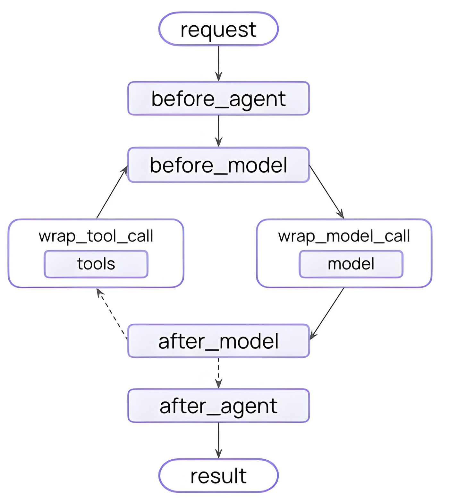
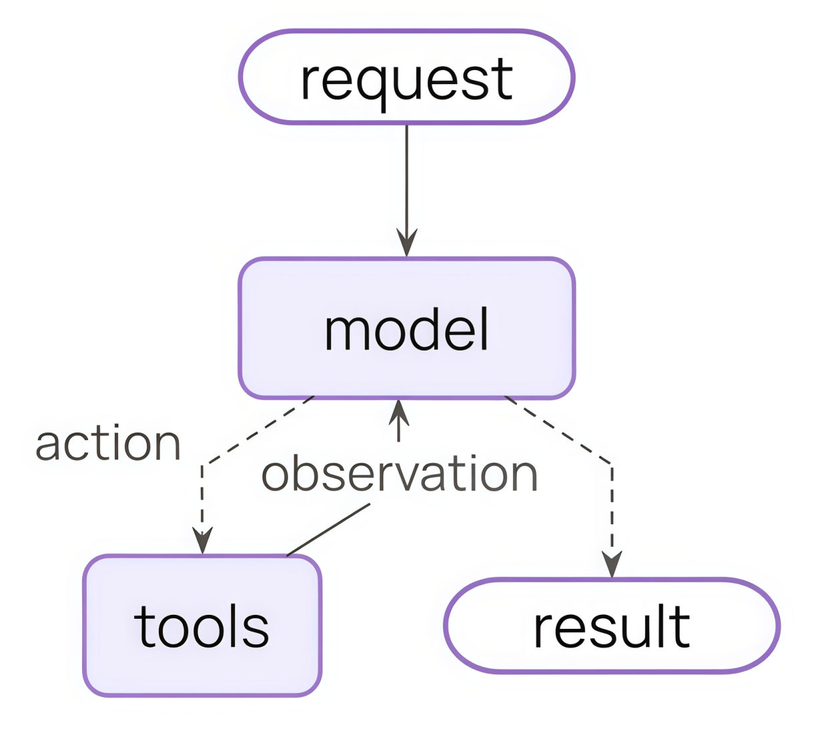
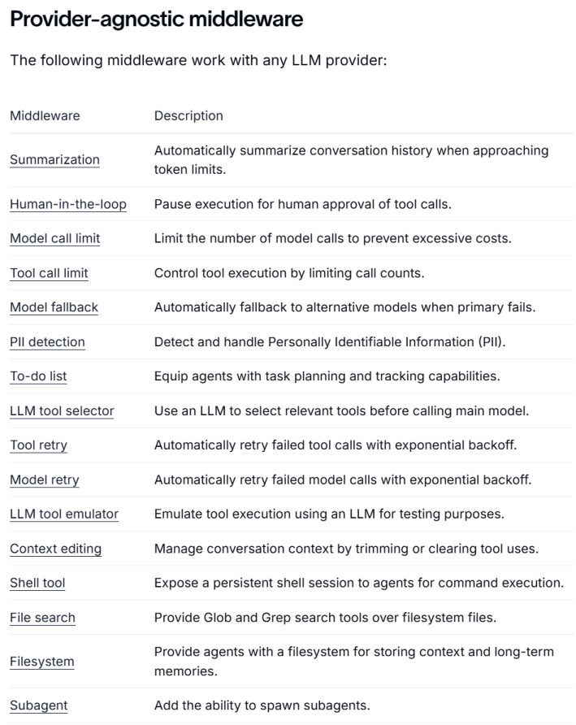
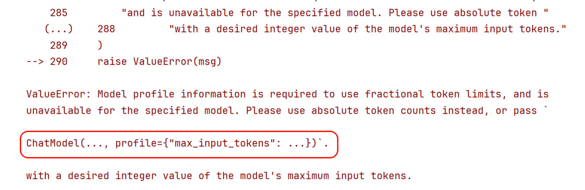
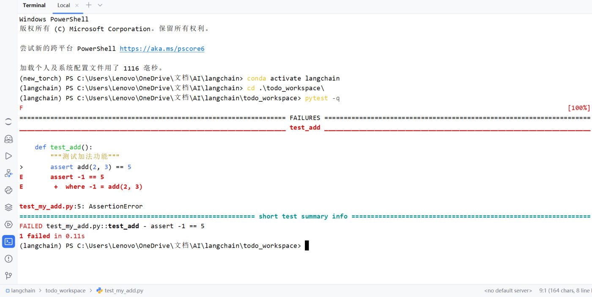

## create_agent 背后的四个组件

| 组件 | 比喻 | 职责 |
| --- | --- | --- |
| **模型（Model）** | 大脑 | 理解任务与决策推理 |
| **工具（Tools）** | 手脚 | 执行模型做不到的外部操作 |
| **系统提示词（System Prompt）** | 角色 | 告诉模型该怎么想、参考什么上下文 |
| **中间件（Middleware）** | 中枢 | 在**执行流程的关键节点**进行拦截、控制和增强 |

```python
from langchain.agents import create_agent
from langchain.agents.middleware import SummarizationMiddleware, HumanInTheLoopMiddleware

agent = create_agent(
    model="deepseek-v4-flash",
    tools=[...],
    middleware=[
        SummarizationMiddleware(...),
        HumanInTheLoopMiddleware(...),
    ],
)
```

## 什么是中间件

**中间件就是 Agent 执行过程中的钩子函数**，是 LangChain 1.x 的"王牌"工程化能力。

**钩子（hook）** 是框架在某些关键执行点暴露的扩展接口——你可以"挂上"自己的逻辑，在那些点上插入、修改或替换行为，**而不必改动主流程代码**。就像在流水线上某个环节设置一个"检查点"或"插入器"。

在 LangChain 的 Agent 执行循环里（"模型调用前"、"模型调用后"、"工具调用前后"）设置钩子，就能在不改 Agent 主体逻辑的前提下实现各种策略与治理。


*图：添加中间件之后的 Agent 执行架构——六个 hook 分别挂在哪个节点上*

## 为什么需要中间件

没有中间件时，Agent 流程很直接：

```text
用户输入 → 拼接提示词/消息 → 调用模型 → 如有需要调用工具 → 返回结果
```


*图：没有中间件时的 Agent 执行流程*

简单场景够用，但真实项目里很快会冒出一堆需求：

- 想根据问题复杂度**动态切换模型**
- 想**限制**某些用户只能调用部分工具
- 想在工具报错时**自动重试**或返回兜底结果
- 想在模型调用前**插入额外的系统提示**
- 想记录每一步的**执行日志**，方便排查问题
- 想在敏感信息出现时**阻断执行**
- 想在正式执行工具前增加**人工审批**

这些需求的共同点是：**不是 Agent 的核心业务逻辑，却会影响执行过程**。全塞进主流程会带来四个问题：

| 问题 | 说明 |
| --- | --- |
| 主流程迅速变乱 | 日志、鉴权、重试、风控、审计都塞进去，主逻辑臃肿 |
| 横切需求难以复用 | 日志/重试/风控往往是多个 Agent 都需要，写死就产生重复代码 |
| 流程控制粒度不够细 | 有些逻辑必须在"模型调用前"，有些要在"工具调用后"，没有统一拦截点就只能手改主流程 |
| 后期维护成本高 | 加一条"所有外部工具调用前先审计"，没中间件就要改很多处 |

> [!IMPORTANT]
> **中间件的价值**在于把这些"与业务无关、但与执行过程强相关"的横切逻辑，从 Agent 主流程中**分离**出来——让 Agent 主体聚焦业务，中间件负责**拦截流程、修改流程、增强流程**。
>
> 一句话记住四类能力：**日志与分析**（追踪、调试、性能监控）、**转换**（改提示词、工具选择、输出格式）、**容错**（重试、降级、早期终止）、**安全**（限流、守护规则、PII 检测）。

## 中间件的分类

按来源分三类：

| 类别 | 说明 |
| --- | --- |
| **自定义中间件** | 开发者自己实现，灵活度最高（第 21 篇） |
| **内置中间件** | LangChain 实现并提供，1.0 起有 16 个预置中间件，开箱即用 |
| **模型供应商定制的中间件** | 依赖特定模型服务的实现（不是本课重点） |

与模型供应商**无关**的内置中间件，按用途分六类：

| 类型 | 目标 | 包含 |
| --- | --- | --- |
| **成本与资源控制** | 控成本、控配额、避免无限调用 | Model call limit、Tool call limit、Summarization、Context editing |
| **稳定性与容错** | 服务不中断、失败自动恢复 | Model fallback、Model retry、Tool retry |
| **安全与合规风控** | 可控、可审、合规 | Human-in-the-loop、PII detection、调用次数限制 |
| **决策增强与智能编排** | 提升决策质量与任务拆解 | To-do list、LLM tool selector、Subagent |
| **执行能力扩展** | 给 Agent 更多"手脚" | Shell tool、File search、Filesystem |
| **开发调试与测试辅助** | 方便开发验证 | LLM tool emulator 等 |


*图：官方文档汇总的"与模型供应商无关"的内置中间件清单*

本篇讲**常用的四个**：Summarization、HumanInTheLoop、PII、TodoList。

## SummarizationMiddleware：上下文快满时自动摘要

**作用**：对历史消息列表进行摘要，达到**压缩上下文**的效果。

**原理**：达到触发条件时，调用大模型对历史消息做摘要，**把摘要结果作为 HumanMessage 放到消息列表最开始的位置**。

```python
from langchain.agents.middleware import SummarizationMiddleware

agent = create_agent(
    model=model,
    middleware=[
        SummarizationMiddleware(
            model=model,                     # 用于摘要的模型（名称或对象）
            trigger=[                        # 满足任一条件就触发
                ("tokens", 100),
                ("messages", 6),
                ("fraction", 0.001),
            ],
            keep=("messages", 2),            # 保留最近 2 条原始消息
        )
    ],
)
```

**参数说明**：

| 参数 | 含义 |
| --- | --- |
| `model` | 用于摘要的模型；传字符串时底层会调 `init_chat_model` |
| `trigger` | 触发条件，**列表**形式（元组），满足**任一**条件即触发：`("tokens", n)` / `("messages", n)` / `("fraction", 比例)` |
| `keep` | 摘要时保留的原始消息，**同一时间只接受一种**条件 |
| `token_counter` | 统计 token 的函数，默认 `count_tokens_approximately`（先算字符数再粗估 token），一般不用改 |
| `summary_prompt` | 自定义摘要提示词，**必须包含 `{messages}` 占位符** |
| `trim_tokens_to_summarize` | 摘要时历史消息的最大 token 数，超出会被裁剪，默认 4000 |

> [!WARNING]
> **两个实测踩坑点**：
>
> **① `fraction` 需要模型的"档案（profile）"里有 `max_input_tokens`。** DeepSeek 模型的 profile 为空，直接用会报错：
>
> ```text
> ValueError: Model profile information is required to use fractional token limits,
> and is unavailable for the specified model.
> ```
>
> 解决：手动给模型传 profile（DeepSeek-V3.2 的上下文长度是 128K）：
>
> ```python
> model = ChatDeepSeek(..., profile={"max_input_tokens": 128_000})
> ```
>
> **② 摘要后，最早的系统提示词也会"被摘要掉"。** 实测把 6 条消息（含开头的 SystemMessage）喂进去，触发摘要后发给模型的消息变成：
>
> ```text
> [HumanMessage] content='Here is a summary of the conversation to date:\n\n<摘要内容>'
> [AIMessage]    content='你高兴得太早了'
> [HumanMessage] content='呵呵，你什么意思'
> ```
>
> 原来的 SystemMessage 不在列表里了——**重要的人设/规则建议用 `system_prompt` 参数传**（它是 Agent 级别的，不占历史消息），而不是塞在 messages 列表里。


*图：用 fraction 触发摘要却没配 profile 时抛出的 ValueError*

## HumanInTheLoopMiddleware：关键工具调用前先审批

**作用**：在**工具调用前**中断 Agent 运行，等待用户对工具调用请求做决策。三种决策：

| 决策 | 含义 |
| --- | --- |
| `approve` | 同意执行 |
| `edit` | 编辑调用配置后执行（可改参数） |
| `reject` | 拒绝执行 |

```python
from langchain.agents.middleware import HumanInTheLoopMiddleware
from langgraph.checkpoint.memory import InMemorySaver
from langgraph.types import Command

agent = create_agent(
    model=model,
    tools=[get_weather, get_news, read_email_tool, send_email_tool],
    checkpointer=InMemorySaver(),           # ← 必须：中断后要能"接着跑"
    middleware=[
        HumanInTheLoopMiddleware(
            interrupt_on={
                "get_weather": True,                                   # 三种决策都允许
                "get_news": True,
                "read_email_tool": False,                              # 不中断，直接执行
                "send_email_tool": {                                   # 精细控制
                    "allowed_decisions": ["approve", "reject"],
                    "description": "发送邮件中断了...",
                },
            },
            description_prefix="中断啦！！",                             # 中断描述前缀（默认 "Tool execution requires approval"）
        ),
    ],
)

config = {"configurable": {"thread_id": "1"}}
response = agent.invoke({"messages": [HumanMessage("查天气、查新闻，再发一封邮件")]}, config=config)
```

**参数说明**：

| 参数 | 含义 |
| --- | --- |
| `interrupt_on` | `工具名 → 中断策略` 的映射。策略可以是 `True`（允许全部决策）、`False`（不中断），或一个配置字典（`allowed_decisions`、`description`） |
| `description_prefix` | 自定义中断描述前缀；单个工具的 `description` 优先级更高 |

> [!TIP]
> **实测这次中断的完整结构**（用假服务端复现）：
>
> **① 调用后返回的字典多了一个键**：`['messages', '__interrupt__']`
>
> **② `__interrupt__` 里装着待审批的请求**（`interrupts[0].value` 有两个键 `action_requests` / `review_configs`）：
>
> ```json
> [{"name": "get_weather", "args": {"city": "北京市"},
>   "description": "需要审批：\n\nTool: get_weather\nArgs: {'city': '北京市'}"},
>  {"name": "get_news", "args": {}, "description": "需要审批：\n\nTool: get_news\nArgs: {}"}]
> ```
>
> **③ 用 `Command(resume=...)` 提交决策继续执行**：
>
> ```python
> decisions = {"decisions": [{"type": "approve"}, {"type": "reject"}]}
> resumed = agent.invoke(Command(resume=decisions), config=config)
> ```
>
> 结果：approve 的工具**真的被执行了**（打印里能看到），reject 的那个生成了：
>
> ```text
> ToolMessage: User rejected the tool call for `get_news` with id call_1
> ```
>
> 想改参数就用 `{"type": "edit", "edited_action": {"name": "get_weather", "args": {"city": "上海市"}}}`——模型下一轮拿到的就是改过的参数。

> [!WARNING]
> **两个硬性要求**：
> 1. **必须配 `checkpointer`**（短期记忆），否则中断了没法"接着跑"——这是第 9 章的主题，这里先记住固定用法
> 2. **恢复时要用同一个 `config`**（同一个 `thread_id`），否则加载不到中断现场

## PIIMiddleware：敏感信息保护

**作用**：检测并处理对话中的个人身份信息（Personally Identifiable Information，PII）。

```python
from langchain.agents.middleware import PIIMiddleware

middleware=[
    PIIMiddleware("email", strategy="redact", apply_to_input=True),
    PIIMiddleware("credit_card", strategy="mask", apply_to_input=True),
    PIIMiddleware("url", strategy="hash", apply_to_input=True),
    PIIMiddleware("mac_address", strategy="mask", apply_to_input=True),
    PIIMiddleware("ip", strategy="block", apply_to_input=True),
]
```

**参数说明**：

| 参数 | 含义 |
| --- | --- |
| `pii_type` | 检测类型，内置：`email`、`credit_card`、`url`、`mac_address`、`ip`（也支持自定义类型 + 正则） |
| `strategy` | 处理策略，见下表 |
| `detector` | 自定义检测函数或正则；不提供则用内置检测器 |
| `apply_to_input` | 调用模型**前**是否检测（默认 True） |
| `apply_to_output` | 模型调用**后**是否检测（默认 False） |
| `apply_to_tool_results` | 工具输出是否检测（默认 False） |

**四种处理策略**：

| 策略 | 效果 | 适用场景 |
| --- | --- | --- |
| `redact` | 替换为 `[REDACTED_EMAIL]` / `[REDACTED_CREDIT_CARD]` 这类标签，**完全擦除** | 日志清洗、合规、公开输出 |
| `mask` | 用 `***` 遮蔽一部分（如 `****-********-1234`），保留少量可辨识信息 | 用户界面、前端显示 |
| `hash` | 替换为哈希值（如 `<email_hash:a1b2c3d4>`） | 统计分析、匿名追踪 |
| `block` | 检测到就直接**抛异常** | 隐私要求极高的场景 |

> [!TIP]
> **实测 `redact` 的效果**：用户输入"我的邮箱是 zhangsan@example.com，请记下来"，**实际发给模型的消息**变成了：
>
> ```json
> [{"content": "我的邮箱是 [REDACTED_EMAIL]，请记下来", "role": "user"}]
> ```
>
> **建议：通常只在模型调用前检测**（`apply_to_input=True`）——因为 PII 检测的主要目的就是**避免把敏感信息发给模型服务**造成泄露。

## TodoListMiddleware：复杂任务的待办清单

**作用**：赋予 Agent **任务规划**和**追踪进度**的能力，应对复杂的多步任务。

什么时候需要它？课程给了个决策树：

```text
你的任务是否需要拆解？
├── 否（问答、翻译、单次函数调用） ──> ❌ 绝不需要，浪费算力
└── 是（比如写一个包含多文件的工程）
    └── 步骤是否多变且需要应对失败？
        ├── 否（步骤完全固定 A→B→C） ──> ❌ 传统的 LangGraph 线性节点即可
        └── 是（AI 需要边做边调计划） ──> ✅ 引入 TodoListMiddleware
```

为什么有用？当一个大任务要拆成 3 个以上子任务、且前后依赖时，不列清单的大模型**执行到第 3 步容易忘记最初目标**，或者在工具反复报错后"应激"——直接跳过验证去回答用户。TodoListMiddleware 强迫它**把计划挂在全局状态里**，时刻提醒"下一步该干什么"。

> 打个比方：普通 Agent 像"想到哪写到哪"的实习生；带上 TodoListMiddleware 的 Agent 像"先写方案、再列 CheckList、最后按部就班执行"的资深工程师。

```python
from langchain.agents.middleware import TodoListMiddleware

agent = create_agent(
    model=model,
    tools=[list_files, read_file, write_file, run_tests],
    middleware=[TodoListMiddleware()],
)
```

**参数只有两个**（一般不用改）：`system_prompt`（自定义使用 todo 的提示词）、`tool_description`（自定义 write_todos 工具的描述）。

> [!TIP]
> **实测**：加上这个中间件后，**请求里的工具自动多了一个 `write_todos`**（`['write_todos']`）——Agent 就是靠调用它来创建和维护清单的。
>
> **协同契约**（三者缺一不可）：
>
> ```text
> [用户请求] → [Agent 思考：这是多步任务]
>            → [调用 write_todos(tasks=[...])]
>            → [中间件拦截：解析参数，更新 State 里的 {"todos": [...]}]
>            → [继续执行：读文件、修改、测试……]
>            → [最终返回：final_state 里带着最新的 todos]
> ```
>
> **todos 的数据结构**是两部分：
>
> | 字段 | 说明 |
> | --- | --- |
> | `content` | 待办事项内容 |
> | `status` | 状态，三种取值：`pending`（待执行）、`in_progress`（进行中）、`completed`（已完成） |
>
> 每完成一个步骤，Agent 就会调用一次 `write_todos` 更新列表——所以你可以在前端 UI 上实时展示 Agent 的"思考与执行进度"。

### 完整实战案例：让 Agent 自己修好"测试跑不过"的代码

光看参数不过瘾，课程真正值钱的是这个**端到端案例**——让 Agent 自己扫描目录、跑测试、改代码、再跑测试，而且 `todos` 全程可见。

**任务目标**：扫描工作目录，测试并修复工作区下的 `my_add.py` 文件。

**为此提供四个工具**：

| 工具 | 作用 |
| --- | --- |
| `list_files` | 扫描工作目录，列出其中的所有文件 |
| `read_file` | 读取指定文件，返回文件内容 |
| `write_file` | 向指定文件写入内容 |
| `run_tests` | 运行测试，底层基于 pytest 实现 |

**第一步：准备一个"有 Bug"的工作区**

在项目根目录下创建 `todo_workspace` 作为工作空间，往里放两个文件。

`todo_workspace/my_add.py` —— 故意把"和"写成"差"：

```python
def add(a: int, b: int) -> int:
    """返回两个整数的和"""
    return a - b
```

`todo_workspace/test_my_add.py` —— 四条断言，专门抓这个 Bug：

```python
from my_add import add

def test_add():
    """测试加法功能"""
    assert add(2, 3) == 5
    assert add(-1, 1) == 0
    assert add(0, 0) == 0
    assert add(10, -5) == 5
```

**第二步：先把 pytest 跑起来（知道"红"长什么样）**

`run_tests` 底层就是 `pytest -q`，所以先在 PyCharm 终端里手动跑一遍确认环境：

```bash
conda activate langchain
cd .\todo_workspace\
pytest -q
```


*图：PyCharm 终端里执行 pytest -q——FAILURES 段直接指出 test_my_add.py 第 5 行断言失败、实际得到 -1*

课程对这段日志的四点分析：

1. pytest 会扫描目录下所有以 `test_` 开头或以 `_test` 结尾的文件，视为测试文件
2. 然后执行测试文件中所有以 `test` 开头的函数
3. 执行出错会打印到控制台，如上所示
4. 测试函数的逻辑是调用 `my_add.py` 中的 `add` 函数，得不到符合预期的结果则抛出异常（这里 `add(2, 3)` 返回 `-1`，于是 `assert -1 == 5` 挂掉）

> [!TIP]
> **本机实测**：把同样两个文件放进一个临时目录，用 conda 环境跑 `python -m pytest -q`，输出与课程截图一致：
>
> ```text
> F                                                                        [100%]
> ================================== FAILURES ===================================
> __________________________________ test_add ___________________________________
>
>     def test_add():
>         """测试加法功能"""
> >       assert add(2, 3) == 5
> E       assert -1 == 5
> E        +  where -1 = add(2, 3)
>
> test_my_add.py:5: AssertionError
> =========================== short test summary info ===========================
> FAILED test_my_add.py::test_add - assert -1 == 5
> 1 failed in 0.14s
> ```
>
> 把 `return a - b` 改成 `return a + b` 后再跑一次，输出变成 `1 passed in 0.01s`——这就是 Agent 最终要做的事。

> [!WARNING]
> **本机环境差异（实测）**：课程里 `pytest` 命令开箱可用（conda 环境已激活）；本机 miniconda **base 环境没装 pytest**，得用 `python -m pytest`，或者切到 conda 环境 `langchain1.2`（里面是 pytest 9.0.3）。
> 而下面的 `run_tests` 工具是用 `subprocess.run(["pytest", "-q"], ...)` **直接起 `pytest` 这个命令**的，所以跑 Agent 之前必须先把带 pytest 的环境激活，否则工具只会顺着 `except` 返回"运行测试失败: ..."。

**第三步：业务代码——模型初始化 + 四个工具**

```python
import os
from pathlib import Path
import subprocess

from dotenv import load_dotenv
from langchain.chat_models import init_chat_model
from langchain.tools import tool

load_dotenv(override=True)

model = init_chat_model(
    model="deepseek-v4-flash",
    model_provider="openai",
    api_key=os.getenv("DEEPSEEK_API_KEY"),
    base_url=os.getenv("DEEPSEEK_BASE_URL"),
)

# 工作区：相对"运行脚本时的当前目录"（课程里脚本放在子目录，所以用了 ..）
WORKSPACE = Path("../todo_workspace")

@tool
def list_files(path: str = ".") -> str:
    """
    列出工作区指定目录下的文件和子目录。path 只能是相对路径。
    Args:
        path: 工作区下的相对路径，一定指向目录，默认为.，表示工作区根路径，不能访问工作区外的目录
    """
    target = (WORKSPACE / path).resolve()
    workspace_root = WORKSPACE.resolve()
    if not str(target).startswith(str(workspace_root)):
        return "错误：只允许访问工作区内的目录。"
    if not target.exists():
        return f"错误：目录不存在: {path}"
    if not target.is_dir():
        return f"错误：不是目录: {path}"
    items = sorted(target.iterdir(), key=lambda p: (p.is_file(), p.name.lower()))
    if not items:
        return f"目录为空: {path}"
    lines = []
    for item in items:
        rel = item.relative_to(workspace_root)
        kind = "[DIR]" if item.is_dir() else "[FILE]"
        lines.append(f"{kind} {rel.as_posix()}")
    return "\n".join(lines)

@tool
def read_file(path: str) -> str:
    """
    读取工作区中的文本文件内容。path 只能是相对路径。
    Args:
        path: 工作区内的文件名
    """
    file_path = (WORKSPACE / path).resolve()
    if not str(file_path).startswith(str(WORKSPACE.resolve())):
        return "错误：只允许读取工作区内的文件。"
    if not file_path.exists():
        return f"错误：文件不存在: {path}"
    return file_path.read_text(encoding="utf-8")

@tool
def write_file(path: str, content: str) -> str:
    """
    写入工作区中的文本文件。path 只能是相对路径。
    Args:
        path: 工作区内的文件名
        content: 写入文件的内容
    """
    file_path = (WORKSPACE / path).resolve()
    if not str(file_path).startswith(str(WORKSPACE.resolve())):
        return "错误：只允许写入工作区内的文件。"
    file_path.write_text(content, encoding="utf-8")
    return f"已写入文件: {path}"

@tool
def run_tests() -> str:
    """
    在工作区运行 pytest -q，并返回输出。
    不接收任何参数，返回格式为
    returncode=0|1
    STDOUT:
    STDERR:
    """
    try:
        result = subprocess.run(
            ["pytest", "-q"],
            cwd=str(WORKSPACE),
            capture_output=True,
            text=True,
            timeout=20,
        )
        return (
            f"returncode={result.returncode}\n\n"
            f"STDOUT:\n{result.stdout}\n\n"
            f"STDERR:\n{result.stderr}"
        )
    except Exception as e:
        return f"运行测试失败: {e}"
```

> [!NOTE]
> 注意三个工具的**路径沙箱**写法：都先 `(WORKSPACE / path).resolve()` 再判断 `startswith(工作区根目录)`——防止模型用 `../../` 越出工作区。这是给 Agent 配"文件系统工具"时的标准防护姿势。

**第四步：挂上 TodoListMiddleware 跑起来**

```python
from langchain.agents import create_agent
from langchain.agents.middleware import TodoListMiddleware
from langchain.messages import HumanMessage
from rich import print as rprint

# 1. 初始化 Agent
agent = create_agent(
    model=model,
    # 除 write_todos 等工具外，TodoListMiddleware 需要配合这些业务工具使用
    tools=[list_files, read_file, write_file, run_tests],
    # 引入 Todo 列表中间件
    middleware=[TodoListMiddleware()],
    system_prompt=(
        "你是一个代码修复助手。遇到多步骤任务时，先使用 write_todos 制定待办事项；"
        "然后读取文件、修复代码并运行测试。工作全部在工作区下进行。"
    ),
)

# 2. 同步调用：让 Agent 自己改到测试通过
print("正在执行 Agent 任务...")
final_state = agent.invoke(
    {"messages": [HumanMessage(content="请测试并修复工作区下 my_add.py 文件中的代码")]}
)

# 3. 直观展示中间件产生的数据结果
rprint(final_state)
# TodoListMiddleware 运行期间，会自动把规划好的步骤注入到 state 的 "todos" 字段
todos = final_state.get("todos", [])
if todos:
    for i, item in enumerate(todos, 1):
        print(f"{i}. [{item.get('status', 'unknown')}] {item.get('content')}")
else:
    print("未检测到待办事项（可能 Agent 认为不需要规划，或未触发 write_todos 工具）")
```

**第五步：看输出——写清单 → 跑测试 → 改代码 → 再跑测试**

模型第一轮就把计划列了出来（`finish_reason: 'tool_calls'`，调用的是 `write_todos`）：

```python
AIMessage(tool_calls=[
    {'name': 'write_todos',
     'args': {'todos': [
         {'content': '检查工作区结构并定位 my_add.py', 'status': 'in_progress'},
         {'content': '阅读 my_add.py 及相关测试/调用代码，确认问题', 'status': 'pending'},
         {'content': '修复 my_add.py 中的代码缺陷', 'status': 'pending'},
         {'content': '运行 pytest 验证修复结果', 'status': 'pending'},
     ]},
     'id': 'call_bvFfyZG1YVvKbqPBpUsHJbHa', 'type': 'tool_call'}
])
```

每一步做完，Agent 再调一次 `write_todos` 把 status 往后推，工具返回的是更新后的整份清单：

```text
ToolMessage(content="Updated todo list to [
  {'content': '检查工作区结构并定位 my_add.py', 'status': 'completed'},
  {'content': '阅读 my_add.py 及相关测试/调用代码，确认问题', 'status': 'completed'},
  {'content': '修复 my_add.py 中的代码缺陷', 'status': 'completed'},
  {'content': '运行 pytest 验证修复结果', 'status': 'in_progress'}]",
  name='write_todos')
```

而 `final_state["todos"]` 里存着最终清单（**独立于 messages**，所以做进度条直接读它就行）：

```python
'todos': [
    {'content': '检查工作区结构并定位 my_add.py', 'status': 'completed'},
    {'content': '阅读 my_add.py 及相关测试/调用代码，确认问题', 'status': 'completed'},
    {'content': '修复 my_add.py 中的代码缺陷', 'status': 'completed'},
    {'content': '运行 pytest 验证修复结果', 'status': 'completed'},
]
```

最终回复（AIMessage）就是把减法改回加法的总结：

````text
已修复 `my_add.py`，把减法改成了加法。

```python
def add(a: int, b: int) -> int:
    """返回两个整数的和"""
    return a + b
```
````

**分析（课程原话归纳）**：为了让 TodoListMiddleware 生效，Agent、工具和中间件三者之间必须满足特定的协同契约——

1. **todos 列表的维护是通过工具调用实现的**：一次完整的更新流程就是 `AIMessage(tool_calls=[write_todos...])` → `ToolMessage("Updated todo list to [...]")`
2. **每条 todo 的信息分两部分**：`status`（状态）和 `content`（内容）；状态只有三种取值 —— `in_progress`（正在进行）、`completed`（已完成）、`pending`（待执行）
3. **每进行一个步骤，Agent 就会更新一次 To-do list**——所以你在前端看到的"进度"其实来自一长串 `write_todos` 调用

> [!WARNING]
> 课程输出里还有一句值得留意："我尝试运行测试，但当前工作区环境里 `pytest` 命令不可用/找不到"——这正是前面那条"环境差异"警告的现场版本：**工具报错不会被隐藏，它会作为 ToolMessage 回到对话里**，模型据此如实汇报。所以"Agent 说它测不了"时，先查是不是跑 Agent 的那个解释器没装 pytest。

## 相关

- [其它内置中间件与执行顺序](/posts/编程学习/langchain学习笔记/20-其它内置中间件与执行顺序/)
- [自定义中间件与hook函数](/posts/编程学习/langchain学习笔记/21-自定义中间件与hook函数/)
- [创建第一个智能体](/posts/编程学习/langchain学习笔记/13-创建第一个智能体/)

## 练习题

### 一、回忆填空（写完再展开对答案）

1. 中间件视角下的四个组件：模型像____、工具像____、系统提示词像角色、中间件像____
2. 中间件本质上是 Agent 执行过程中的____函数；它挂在执行循环的关键节点上（模型调用____、模型调用后、工具调用前后），把"与业务无关、却影响执行过程"的____逻辑从主流程里分离出来；它的四类能力是日志与分析、转换、____、____；没中间件时，日志、鉴权、重试、风控全塞进主流程 → 主流程变乱、同类需求难以____、控制粒度不够细、维护成本高
3. 按来源分，中间件有自定义中间件、____、模型供应商定制的中间件三类，其中主流内置中间件从 1.0 起有____个预置成品；按用途又分成六类，比如成本与资源控制、稳定性与容错、____、决策增强与智能编排、执行能力扩展、开发调试与测试辅助
4. 摘要中间件的原理：达到触发条件时调模型做摘要，再把摘要结果当成一条____消息放到消息列表的____位置；触发条件写成____形式，满足____条件即触发，三种度量是 tokens、messages 和____；保留多少条原文由 `keep` 指定，它同一时间只接受____种条件；统计 token 的函数默认是 `count_tokens_approximately`，摘要时喂给摘要模型的原文上限由____控制（默认 4000），自定义摘要提示词时必须包含____占位符
5. 摘要的两个坑：按 fraction 触发要求模型的"档案"里有____，DeepSeek 得手动补；摘要会把最早的那条____消息一起摘要掉，所以重要人设要用创建 Agent 时的____参数传
6. 人工审批中间件在"工具调用____"时中断流程，三种决策是 approve、____、____；中断配置的三种写法是 True（允许全部决策）、____（不中断）、以及一个配置字典（可写 `allowed_decisions` 和单条 `description`）；中断描述前缀的默认值是 "Tool execution requires ____"，单个工具的 `description` 优先级更高
7. 中断时返回的字典会多出____键，其中 `interrupts[0].value` 装着 `action_requests` 和 `review_configs`；恢复执行用 `Command(resume={"____": [...]})`，想改参数就用类型为____的决策、把新参数放进 `edited_action`；被拒绝的工具不会执行，模型收到的是一条内容形如 "User rejected the tool call for …" 的____消息；两个硬性要求是必须配____、而且恢复时要用同一个 `config`（同一个 thread_id）
8. 敏感信息中间件的五种内置检测类型是 email、credit_card、url、____、____；也能识别自定义类型，这时要用 `detector` 参数传检测函数或____；四种处理策略是完全擦除的____、部分遮蔽的____、哈希替代的 hash、直接抛异常的 block；三个检测开关的默认值是调用模型前____、模型返回后 False、工具结果 False——通常只开第一个就够，因为检测的目的就是别把敏感信息发给模型服务
9. 待办清单中间件的决策树：任务压根不需要拆解就别用它；需要拆解时再看"步骤是否____且要应对失败"——是就用它，步骤完全固定则用传统的 LangGraph 线性节点；挂上它之后，请求里的工具会自动多出一个____，模型靠调用它来创建和维护清单，这个工具的返回是一句话形如 "Updated todo list to [...]" 的____；每条待办有内容 `content` 和状态 `status` 两部分，状态只有 pending、____、completed 三种取值；最终清单存在 `final_state["____"]` 里，它____（独立于／依赖于）messages，所以前端进度条直接读它就行；它的两个参数是 `system_prompt` 和____
10. 端到端案例里配了四个业务工具：列目录、读文件、写文件、跑测试；跑测试底层是____命令，返回值里带着 `returncode`；pytest 会把"以 `test_` 开头或以____结尾的文件"当作测试文件，再执行文件里所有以____开头的函数；四个工具都先 `resolve()` 再判断路径前缀，为的是防止模型越出____；本机 base 环境没装 pytest 时可以把命令换成____；工具报错不会被隐藏，它会作为一条工具消息回到消息列表里，模型据此____

> [!TIP]- 填空答案（做完再点开）
> 1. 大脑 / 手脚 / 中枢（拦截与增强）　2. 钩子（hook） / 前 / 横切 / 容错 / 安全 / 复用　3. 内置中间件 / 16 / 安全与合规风控　4. HumanMessage / 最开始 / 列表（元组列表） / 任一 / fraction / 一 / `trim_tokens_to_summarize` / `{messages}`　5. `max_input_tokens` / SystemMessage（系统消息） / `system_prompt`　6. 之前 / edit / reject / False / approval　7. `__interrupt__` / decisions / edit / ToolMessage（工具消息） / checkpointer（短期记忆）　8. mac_address / ip / 正则 / redact / mask / True　9. 多变 / `write_todos` / ToolMessage（工具消息） / in_progress / todos / 独立于 / `tool_description`　10. `pytest -q` / `_test` / `test` / 工作区 / `python -m pytest` / 如实汇报

### 二、裸写题

- [ ] **2-1 上下文快满时自动摘要**
  建一个带摘要中间件的 Agent：**消息数达到 6 条就触发摘要**，摘要时保留最近 2 条原文。然后连续调用若干轮（每轮把上一轮返回的消息列表继续传进去，再追加一句新话），打印每轮的消息条数与每条的类名，找出"触发摘要"的那一轮——条数会突然掉下来，第一条也换成了摘要内容。
  挑战：把触发条件换成"按上下文比例"的写法（比例阈值 0.5），看它报什么错；再想办法让报错消失（DeepSeek 的上下文长度是 128K）。

  > [!TIP]- 提示（先自己想，实在想不出再点开）
  > **一级 · 思路**：摘要的判断发生在"下一次请求之前"，所以要连续调几轮才看得到效果
  > **二级 · 方法**：`SummarizationMiddleware(model=model, trigger=[("messages", 6)], keep=("messages", 2))`
  > **三级 · 骨架**：按比例触发的写法就是把元组换成 `("fraction", 0.5)`；它报的错来自模型"档案"缺字段，用 `ChatDeepSeek(..., profile={"max_input_tokens": 128_000})` 补上再跑

- [ ] **2-2 同一句话，三种脱敏结局（外加一种直接报错）**
  用同一条带邮箱的话（以及一条**能通过校验**的银行卡号），分别试四种敏感信息处理策略：完全擦除、部分遮蔽、哈希替代、直接报错。前三种让模型"原样复述"这句话，从它的复述里看出差别；第四种用 `try/except` 接住异常并打印异常类型。
  挑战：换成另一种内置检测类型（比如网卡地址或 IP）再试一遍。

  > [!TIP]- 提示（先自己想，实在想不出再点开）
  > **一级 · 思路**：脱敏发生在"发给模型之前"，所以模型只能复述它真正看到的内容
  > **二级 · 方法**：`PIIMiddleware("email", strategy="redact", apply_to_input=True)`，strategy 依次换 `redact` / `mask` / `hash` / `block`
  > **三级 · 骨架**：把策略写成列表循环跑，各自 `create_agent(...)` 再 `invoke`；银行卡号要能通过 Luhn 校验才会被识别

- [ ] **2-3 关键工具调用前先审批**
  定义一个"发邮件"工具（函数体里打印一行"真的执行了"），让它需要人工审批，并配好短期记忆和一个固定的线程号。然后跑三次，分别提交三种决策：拒绝、同意、改参数后同意。每次都要打印"待审批的工具与参数"和最后的"工具结果"，确认：拒绝时函数体没被执行、同意时打印了、改参数时工具拿到的是改过的参数。

  > [!TIP]- 提示（先自己想，实在想不出再点开）
  > **一级 · 思路**：中断 → 审批 → 恢复是一条完整链路，三样东西缺一不可
  > **二级 · 方法**：`checkpointer=InMemorySaver()` + `config={"configurable": {"thread_id": "1"}}` + `Command(resume={"decisions": [...]})`
  > **三级 · 骨架**：`interrupts = resp.get("__interrupt__", [])`，`interrupts[0].value["action_requests"]` 就是待审批列表；改参数的决策写成 `{"type": "edit", "edited_action": {"name": ..., "args": {...}}}`

- [ ] **2-4 先列清单，再动手**
  给 Agent 挂上"待办清单"中间件，让它完成一个**需要三步以上**的小任务（比如"先算 12+34，再算这个结果的 3 倍，最后把两步结果加起来"），自己准备两个最简单的业务工具（加法、乘法）就够。
  跑完后打印三样东西：① 这次运行一共更新了几次清单、每次清单里每条事项的状态；② 从最终状态里读出的那份清单——它不在消息列表里，是状态自己的一个字段；③ 消息列表里"写清单"这类工具调用出现了几次，和 ① 的次数对不对得上。
  挑战：把同一个任务交给一个**不挂中间件**的 Agent 再跑一遍，比较两次的工具调用有什么差别。

  > [!TIP]- 提示（先自己想，实在想不出再点开）
  > **一级 · 思路**：清单不是靠提示词"写"出来的，而是中间件给模型偷偷加了一个写清单的工具，靠一次次工具调用来维护——所以既能在消息里看到这些调用，也能在最终状态里读到结果
  > **二级 · 方法**：`TodoListMiddleware()`；最终清单在 `final_state["todos"]`，每条是 `{"content": ..., "status": ...}`，状态只有 `pending` / `in_progress` / `completed` 三种
  > **三级 · 骨架**：`final_state = agent.invoke({...})`；遍历 `final_state["messages"]`，把 `tool_calls` 里 name 为 `write_todos` 的挑出来打印 `tc["args"]["todos"]`；state 里那份用 `final_state.get("todos", [])` 读

> [!TIP]- 参考答案（做完再点开）
> ```python
> # ---------- 2-1 自动摘要 ----------
> import os
>
> from dotenv import load_dotenv
> from langchain.agents import create_agent
> from langchain.agents.middleware import SummarizationMiddleware
> from langchain.chat_models import init_chat_model
> from langchain.messages import HumanMessage
>
> load_dotenv(override=True)
>
> model = init_chat_model(
>     model="deepseek-v4-flash",
>     model_provider="openai",
>     api_key=os.getenv("DEEPSEEK_API_KEY"),
>     base_url=os.getenv("DEEPSEEK_BASE_URL"),
> )
>
> agent_sum = create_agent(
>     model=model,
>     tools=[],
>     middleware=[
>         SummarizationMiddleware(
>             model=model,                    # 摘要用哪个模型
>             trigger=[("messages", 6)],      # 消息数达到 6 条就触发
>             keep=("messages", 2),           # 摘要时保留最近 2 条原文
>         )
>     ],
> )
>
> messages = [HumanMessage("你好，我是老王")]
> for i in range(4):
>     r = agent_sum.invoke({"messages": messages})
>     messages = r["messages"]
>     print(f"第 {i + 1} 轮: 共 {len(messages)} 条 | {[type(m).__name__ for m in messages]}")
>     messages.append(HumanMessage(f"继续聊，这是第 {i + 2} 句"))
> # 触发那一轮的条数会明显掉下来，第一条变成内容形如
> # "Here is a summary of the conversation to date: ..." 的 HumanMessage
>
> # ---------- 2-1 挑战：fraction 触发要先有 profile ----------
> try:
>     agent_frac = create_agent(
>         model=model,
>         tools=[],
>         middleware=[SummarizationMiddleware(model=model, trigger=[("fraction", 0.5)])],
>     )
>     agent_frac.invoke({"messages": [HumanMessage("你好")]})
> except ValueError as e:
>     print("意料之中的报错:", str(e)[:60], "...")
>
> # 解法：手动补上 profile（DeepSeek-V3.2 的上下文长度是 128K）
> from langchain_deepseek import ChatDeepSeek
>
> model_p = ChatDeepSeek(
>     model="deepseek-v4-flash",
>     api_key=os.getenv("DEEPSEEK_API_KEY"),
>     api_base=os.getenv("DEEPSEEK_BASE_URL"),
>     profile={"max_input_tokens": 128_000},
> )
> agent_frac_ok = create_agent(
>     model=model_p,
>     tools=[],
>     middleware=[SummarizationMiddleware(model=model_p, trigger=[("fraction", 0.5)])],
> )
> print("补了 profile 之后:", agent_frac_ok.invoke({"messages": [HumanMessage("你好")]})["messages"][-1].content)
> # ---------- 2-2 PII 的四种处理策略 ----------
> from langchain.agents.middleware import PIIMiddleware
>
> def ask(strategy: str, text: str, pii_type: str = "email"):
>     """用指定策略建 Agent，问一句带敏感信息的话，返回模型回答"""
>     agent = create_agent(
>         model=model,
>         tools=[],
>         middleware=[PIIMiddleware(pii_type, strategy=strategy, apply_to_input=True)],
>     )
>     return agent.invoke({"messages": [HumanMessage(text)]})["messages"][-1].content
>
> # 让模型"原样复述"最容易看出脱敏效果：它只能复述自己真正看到的内容
> print("原文     :", "我的邮箱是 zhangsan@example.com")
> for s in ["redact", "mask", "hash"]:
>     print(f"{s:8s} :", ask(s, "我的邮箱是 zhangsan@example.com。请原样复述我这句话。"))
>
> # 银行卡号用 mask 看得最清楚（注意：内置检测器要求卡号能通过 Luhn 校验，"…1234" 这种编造号认不出来）
> print("信用卡 mask:", ask("mask", "我的卡号是 4111-1111-1111-1111。请原样复述我这句话。", "credit_card"))
>
> # block：检测到就直接抛异常，Agent 根本不会启动模型调用
> try:
>     ask("block", "我的邮箱是 zhangsan@example.com")
> except Exception as e:
>     print("block    :", type(e).__name__, str(e)[:80])
> # ---------- 2-3 关键工具调用前先审批 ----------
> from langchain.agents.middleware import HumanInTheLoopMiddleware
> from langchain.tools import tool
> from langgraph.checkpoint.memory import InMemorySaver
> from langgraph.types import Command
>
> @tool
> def send_email_tool(recipient: str, subject: str, body: str) -> str:
>     """发送邮件
>
>     Args:
>         recipient: 收件人邮箱
>         subject: 邮件标题
>         body: 邮件正文
>     """
>     print("   >>> 真的执行发送邮件工具了")
>     return f"已发送给 {recipient}：{subject}"
>
> agent_hitl = create_agent(
>     model=model,
>     tools=[send_email_tool],
>     checkpointer=InMemorySaver(),            # 硬性要求①：没有它中断后没法"接着跑"
>     middleware=[
>         HumanInTheLoopMiddleware(
>             interrupt_on={
>                 "send_email_tool": {
>                     "allowed_decisions": ["approve", "edit", "reject"],   # 三种决策都允许
>                     "description": "要发邮件了，请确认",
>                 },
>             },
>             description_prefix="需要你审批：",
>         ),
>     ],
> )
>
> QUESTION = "帮我给 abc@qq.com 发一封邮件，标题'测试'，内容'你好'"
>
> def run(decision: dict, thread_id: str, label: str):
>     config = {"configurable": {"thread_id": thread_id}}     # 硬性要求②：恢复要用同一个 config
>     resp = agent_hitl.invoke({"messages": [HumanMessage(QUESTION)]}, config=config)
>     interrupts = resp.get("__interrupt__", [])
>     print(f"[{label}] 中断了吗: {bool(interrupts)}")
>     for req in interrupts[0].value["action_requests"]:
>         print(f"   待审批: {req['name']} | 参数 {req['args']}")
>     out = agent_hitl.invoke(Command(resume={"decisions": [decision]}), config=config)
>     for m in out["messages"]:
>         if type(m).__name__ == "ToolMessage":
>             print(f"   工具结果: {str(m.content)[:70]}")
>
> run({"type": "reject"}, "1", "reject 拒绝")
> run({"type": "approve"}, "2", "approve 同意")
> run(
>     {
>         "type": "edit",
>         "edited_action": {
>             "name": "send_email_tool",
>             "args": {"recipient": "abc@qq.com", "subject": "改过的标题", "body": "改过的正文"},
>         },
>     },
>     "3",
>     "edit 改参数",
> )
> # ---------- 2-4 待办清单：先列清单再动手 ----------
> from langchain.agents.middleware import TodoListMiddleware
> from langchain.tools import tool
>
> @tool
> def add(a: int, b: int) -> int:
>     """返回两个整数的和
>
>     Args:
>         a: 第一个整数
>         b: 第二个整数
>     """
>     return a + b
>
> @tool
> def multiply(a: int, b: int) -> int:
>     """返回两个整数的积
>
>     Args:
>         a: 第一个整数
>         b: 第二个整数
>     """
>     return a * b
>
> # 挂上中间件：模型能用的工具里会自动多一个"写清单"的工具
> agent_todo = create_agent(
>     model=model,
>     tools=[add, multiply],
>     middleware=[TodoListMiddleware()],
>     system_prompt="遇到多步骤任务时，先用 write_todos 列出计划，再一步一步执行。",
> )
>
> TASK = "先算 12+34，再算这个结果的 3 倍，最后把两步的结果加起来是多少？"
> final_state = agent_todo.invoke({"messages": [HumanMessage(TASK)]})
>
> # ① 这次运行一共更新了几次清单，每次清单里每条事项的状态
> updates = []
> for m in final_state["messages"]:
>     for tc in getattr(m, "tool_calls", None) or []:
>         if tc["name"] == "write_todos":
>             updates.append(tc["args"]["todos"])
>     if type(m).__name__ == "ToolMessage" and m.name == "write_todos":
>         print("工具返回:", str(m.content)[:56], "...")
> print(f"一共更新了 {len(updates)} 次清单：")
> for i, todos in enumerate(updates, 1):
>     print(f"  第 {i} 次:", [(t["content"], t["status"]) for t in todos])
>
> # ② state 里那份独立于消息列表的清单（前端进度条读的就是它）
> print("最终清单（来自 state，不属于 messages）:")
> for i, item in enumerate(final_state.get("todos", []), 1):
>     print(f"  {i}. [{item.get('status')}] {item.get('content')}")
>
> # ③ 这次运行里出现过的三种状态
> seen = {t["status"] for todos in updates for t in todos}
> print("出现过的状态:", sorted(seen))
> print("最终回答:", final_state["messages"][-1].content)
>
> # 挑战：同一个任务，不挂中间件再跑一次（请求里没有"写清单"这个工具）
> agent_plain = create_agent(model=model, tools=[add, multiply])
> plain_state = agent_plain.invoke({"messages": [HumanMessage(TASK)]})
> plain_calls = [tc["name"] for m in plain_state["messages"] for tc in (getattr(m, "tool_calls", None) or [])]
> print("不挂中间件时的工具调用:", plain_calls, "| state 里有 todos 吗:",
>       "todos" in plain_state)
> ```

### 三、综合题

- [ ] **3-1 让 Agent 自己修好"测试跑不过"的代码（端到端）**
  分四步做一个能"自己修 Bug"的 Agent：
  1. 在工作区目录里准备两个文件——`my_add.py`（故意把"和"写成"差"）和 `test_my_add.py`（四条断言）；先在终端里手动跑一次 pytest，记住"红"的样子；
  2. 写四个工具：列目录、读文件、写文件、跑测试（跑测试内部调 pytest，输出里带上 `returncode`）；
  3. 建 Agent：挂上待办清单中间件、四个工具全给它，系统提示词里要求"先列清单再动手"；
  4. 让它执行"请测试并修复工作区下 `my_add.py` 文件中的代码"，然后① 从消息里找出它写清单的那次工具调用与返回，② 打印这次运行最终状态里那份独立于消息列表的清单，③ 看一眼文件内容是不是真的修好了。

  > [!TIP]- 提示（先自己想，实在想不出再点开）
  > **一级 · 思路**：清单是靠一次工具调用维护的，所以既能从"调用的参数"看，也能从"返回的文本"看
  > **二级 · 方法**：`middleware=[TodoListMiddleware()]`；最终清单在 `final_state["todos"]`（它独立于 messages）
  > **三级 · 骨架**：四个工具都用 `@tool` 装饰；跑测试用 `subprocess.run([sys.executable, "-m", "pytest", "-q"], cwd=..., capture_output=True, text=True)`；路径判断先 `resolve()` 再 `startswith()`

> [!TIP]- 参考答案（做完再点开）
> ```python
> # ---------- 3-1 综合题：让 Agent 自己"扫描 → 跑测试 → 改代码 → 再跑测试" ----------
> import os
> import subprocess
> import sys
> from pathlib import Path
>
> from dotenv import load_dotenv
> from langchain.agents import create_agent
> from langchain.agents.middleware import TodoListMiddleware
> from langchain.chat_models import init_chat_model
> from langchain.messages import HumanMessage
> from langchain.tools import tool
>
> load_dotenv(override=True)
>
> model = init_chat_model(
>     model="deepseek-v4-flash",
>     model_provider="openai",
>     api_key=os.getenv("DEEPSEEK_API_KEY"),
>     base_url=os.getenv("DEEPSEEK_BASE_URL"),
> )
>
> # 第一步：准备一个"有 Bug"的工作区（my_add.py 里故意把和写成差）
> WORKSPACE = Path(__file__).resolve().parent / "todo_workspace"
> WORKSPACE.mkdir(exist_ok=True)
> (WORKSPACE / "my_add.py").write_text(
>     'def add(a: int, b: int) -> int:\n    """返回两个整数的和"""\n    return a - b\n',
>     encoding="utf-8",
> )
> (WORKSPACE / "test_my_add.py").write_text(
>     "from my_add import add\n\n\ndef test_add():\n"
>     '    """测试加法功能"""\n'
>     "    assert add(2, 3) == 5\n"
>     "    assert add(-1, 1) == 0\n"
>     "    assert add(0, 0) == 0\n"
>     "    assert add(10, -5) == 5\n",
>     encoding="utf-8",
> )
>
> # 第二步：四个工具（都先 resolve 再判断前缀，防止模型用 ../../ 跑出工作区）
> @tool
> def list_files(path: str = ".") -> str:
>     """列出工作区指定目录下的文件和子目录。path 只能是相对路径。
>
>     Args:
>         path: 工作区下的相对路径，一定指向目录，默认为 .（工作区根目录）
>     """
>     target = (WORKSPACE / path).resolve()
>     root = WORKSPACE.resolve()
>     if not str(target).startswith(str(root)):
>         return "错误：只允许访问工作区内的目录。"
>     if not target.is_dir():
>         return f"错误：不是目录: {path}"
>     lines = [
>         f"[{'DIR' if p.is_dir() else 'FILE'}] {p.relative_to(root).as_posix()}"
>         for p in sorted(target.iterdir(), key=lambda p: (p.is_file(), p.name.lower()))
>     ]
>     return "\n".join(lines) or f"目录为空: {path}"
>
> @tool
> def read_file(path: str) -> str:
>     """读取工作区中的文本文件内容。path 只能是相对路径。
>
>     Args:
>         path: 工作区内的文件名
>     """
>     file_path = (WORKSPACE / path).resolve()
>     if not str(file_path).startswith(str(WORKSPACE.resolve())):
>         return "错误：只允许读取工作区内的文件。"
>     if not file_path.exists():
>         return f"错误：文件不存在: {path}"
>     return file_path.read_text(encoding="utf-8")
>
> @tool
> def write_file(path: str, content: str) -> str:
>     """写入工作区中的文本文件。path 只能是相对路径。
>
>     Args:
>         path: 工作区内的文件名
>         content: 写入文件的内容
>     """
>     file_path = (WORKSPACE / path).resolve()
>     if not str(file_path).startswith(str(WORKSPACE.resolve())):
>         return "错误：只允许写入工作区内的文件。"
>     file_path.write_text(content, encoding="utf-8")
>     return f"已写入文件: {path}"
>
> @tool
> def run_tests() -> str:
>     """在工作区运行 pytest -q 并返回输出。不接收任何参数。"""
>     try:
>         result = subprocess.run(
>             # 用"当前解释器 -m pytest"，就不会踩"环境里没有 pytest 命令"的坑
>             [sys.executable, "-m", "pytest", "-q"],
>             cwd=str(WORKSPACE),
>             capture_output=True,
>             text=True,
>             timeout=60,
>         )
>         return (
>             f"returncode={result.returncode}\n\n"
>             f"STDOUT:\n{result.stdout}\n\n"
>             f"STDERR:\n{result.stderr}"
>         )
>     except Exception as e:  # noqa: BLE001
>         return f"运行测试失败: {e}"
>
> # 第三步：挂上待办清单中间件跑起来
> agent = create_agent(
>     model=model,
>     tools=[list_files, read_file, write_file, run_tests],   # 第 5 个「写清单」工具由中间件自动加
>     middleware=[TodoListMiddleware()],
>     system_prompt=(
>         "你是一个代码修复助手。遇到多步骤任务时，先使用 write_todos 制定待办事项；"
>         "然后读取文件、修复代码并运行测试。工作全部在工作区下进行。"
>     ),
> )
>
> print("正在执行 Agent 任务...")
> final_state = agent.invoke(
>     {"messages": [HumanMessage(content="请测试并修复工作区下 my_add.py 文件中的代码")]}
> )
>
> # 第四步：从消息里找出模型写的清单（write_todos 的调用与工具返回）
> for m in final_state["messages"]:
>     for tc in getattr(m, "tool_calls", None) or []:
>         if tc["name"] == "write_todos":
>             print("模型写了清单:", [t["content"] for t in tc["args"]["todos"]])
>     if type(m).__name__ == "ToolMessage" and m.name == "write_todos":
>         print("工具返回:", str(m.content)[:60], "...")
>     if type(m).__name__ == "ToolMessage" and m.name == "run_tests":
>         print("测试结果:", str(m.content).splitlines()[0])      # returncode=0 就是全绿
>
> # todos 独立于 messages，存在 state 里 —— 前端进度条读它就行
> for i, item in enumerate(final_state.get("todos", []), 1):
>     print(f"{i}. [{item.get('status')}] {item.get('content')}")
>
> print("修复后的文件内容:", (WORKSPACE / "my_add.py").read_text(encoding="utf-8").splitlines()[-1])
> ```
