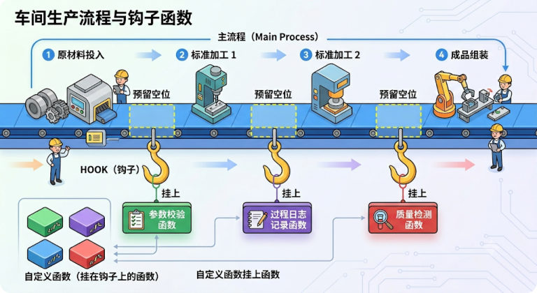

## 什么时候需要自己写

内置中间件覆盖了绝大多数常见需求，但**复杂场景下它们不一定够用**——这时可以实现 LangChain 暴露的 **hook 函数**来构建自定义中间件。

> [!NOTE]
> 官方建议：**尽可能使用内置中间件**。自定义中间件是"内置不够用"时的补充手段，不是首选。

## 什么是 hook 函数（钩子函数）

Hook 函数指的是：**在某个既定流程的特定时机，被框架、系统或主程序自动调用的扩展函数**。可以理解成主流程预留了一些"插槽"，允许你在这些位置挂上自己的函数。

三个核心特点：

1. **不是你主动调用的**，而是流程运行到某个"钩子点"时**系统自动触发**
2. 它依附于一个更大的执行流程（"请求开始前""模型调用前""任务结束后""异常发生时"）
3. 作用是**在不改主流程源码的前提下插入自己的逻辑**：日志、鉴权、修改输入、拦截输出、清理资源等


*图：主流程预留"插槽"，在钩子点挂上自定义函数（车间生产流程类比）*

## 六个 hook 函数，分两类

LangChain 1.2 的 `AgentMiddleware` 上共有六个 hook（可用 `dir(AgentMiddleware)` 核对）：

| 类型 | hook | 触发时机 |
| --- | --- | --- |
| **Node-style**（节点风格） | `before_agent` | Agent 开始运行**之前** |
| | `before_model` | **模型调用之前** |
| | `after_model` | **模型调用之后** |
| | `after_agent` | Agent 流程**全部完成后** |
| **Wrap-style**（包装风格） | `wrap_model_call` | **包裹**模型调用 |
| | `wrap_tool_call` | **包裹**工具调用 |

**两类风格的定位不一样**：

- **Node-style 适合顺序逻辑**：记录日志、验证、修改状态
- **Wrap-style 适合控制流**：重试、回退、缓存

## Node-style hooks

### 写法一：装饰器（函数式挂载）

```python
from typing import Any

from langchain.agents import create_agent
from langchain.agents.middleware import after_model, before_model, AgentState
from langchain.messages import HumanMessage
from langgraph.runtime import Runtime

# 1. 定义 before_model 钩子
@before_model
def before_model_middleware(state: AgentState, runtime: Runtime) -> dict[str, Any] | None:
    state["messages"][-1].content += " -> before_model <- "
    return None

# 2. 定义 after_model 钩子
@after_model
def after_model_middleware(state: AgentState, runtime: Runtime) -> dict[str, Any] | None:
    state["messages"][-1].content += " -> after_model <- "
    return None

agent = create_agent(
    model=model,
    middleware=[before_model_middleware, after_model_middleware],
)
```

### 写法二：类（对象化中间件）

**三条关键规则**：① 必须继承 `AgentMiddleware`（固定）② 方法名固定（`before_model`、`after_model`……）③ **类名随意**（只有类名不固定）。

```python
from langchain.agents.middleware import AgentMiddleware

class MyMiddleware(AgentMiddleware):
    def before_model(self, state, runtime):
        print("[我的中间件] before_model")
        return None

    def after_model(self, state, runtime):
        print("[我的中间件] after_model")
        return None

agent = create_agent(model=model, middleware=[MyMiddleware()])
```

> [!NOTE]
> **两种写法其实是同一件事**：装饰器底层会**基于你写的函数构造一个 `AgentMiddleware` 子类的实例**（大致是 `type(name, (AgentMiddleware,), {"before_model": wrapped, ...})()`）。
> 所以 LangGraph 只关心两件事：**是否继承了 AgentMiddleware？是否实现了对应的 hook 方法？**

### 参数说明（两个参数）

| 参数 | 说明 |
| --- | --- |
| `state` | `AgentState` 实例，维护 Agent 运行过程中的**状态**（会随运行变化，**包括消息列表**） |
| `runtime` | `Runtime` 实例，维护运行过程中的**上下文环境**（包括上下文、长期记忆等） |

### 返回值说明（三种）

```python
# ① 返回 None：不修改状态，继续流程
def before_model(self, state, runtime):
    print("日志记录")
    return None

# ② 返回字典：更新状态
def after_model(self, state, runtime):
    count = state.get("count", 0)
    return {"count": count + 1}

# ③ 返回 {"jump_to": "..."}：控制流程跳转
def before_model(self, state, runtime):
    if state.get("count", 0) > 10:
        return {"jump_to": "__end__"}      # 跳过模型，直接结束
    return None
```

`jump_to` 的常见目标：`"__end__"`（结束 Agent）、`"tools"`（跳到工具节点）、其他自定义节点。

### 装饰器参数：can_jump_to

Node-style 的四个 hook 函数都可以接收额外参数 `can_jump_to`——**钩子函数可以改变 Agent 的正常运行轨迹**（比如发现上下文窗口溢出，直接跳转到结尾、提前终止整个 Agent）。

`can_jump_to` 决定了钩子**可以直接跳转到哪些位置**：

| 取值 | 含义 |
| --- | --- |
| `end` | 跳转至 Agent 流程末尾，或第一个 `after_agent` 钩子，**直接终止整个流程** |
| `tools` | 跳转至**工具节点** |
| `model` | 跳转至**模型节点**，或第一个 `before_model` 钩子 |

```python
from langchain.agents.middleware import before_model, AgentState

@before_model(can_jump_to=["tools"])
def force_tool_first(state: AgentState, runtime) -> dict | None:
    """在模型执行前触发，允许跳过模型直接去调用工具"""
    ...
```

> [!IMPORTANT]
> **类写法要跳转，需要额外加装饰器 `@hook_config`**（装饰器写法直接在装饰器参数里写 `can_jump_to`）：
>
> ```python
> from langchain.agents.middleware import AgentMiddleware, hook_config
>
> class ForceToolFirst(AgentMiddleware):
>     @hook_config(can_jump_to=["tools"])
>     def before_model(self, state, runtime):
>         ...
>         return {"jump_to": "tools"}
> ```

### 三个实战 Case：跳过模型、跳回重生成、提前熔断

`can_jump_to` 不是纸上概念，课程用**一个文件、三个 hook**把三种跳转的场景全演了一遍。完整代码如下（**基于装饰器实现**）：

```python
from typing import Any

from langchain.agents import create_agent
from langchain.agents.middleware import before_model, after_model, AgentState
from langchain.messages import AIMessage, SystemMessage
from langchain.tools import tool
from langgraph.runtime import Runtime

@tool
def get_news() -> str:
    """获取当日新闻"""
    return f"美加墨世界杯今日开幕"

# 在模型（LLM）执行前触发。允许跳转到 "tools" 节点。
@before_model(can_jump_to=["tools"])
def force_tool_first(state: AgentState, runtime: Runtime) -> dict[str, Any] | None:
    """
    【业务场景：强行拦截并触发工具】
    如果用户输入包含 "direct tool"，则跳过本次大模型的思考/生成阶段，
    直接伪造一个大模型的 tool_calls 意图，强行把控制权移交给工具执行节点。
    """
    text = state["messages"][-1].content
    # 检查关键词，满足条件则强行干预流程
    if isinstance(text, str) and "direct tool" in text.lower():
        print("[MIDDLEWARE] before_model: jump_to='tools'")
        # 人工构造一个大模型的消息对象（AIMessage）
        # 欺骗系统，让系统误以为这是模型自己决定要调用的工具
        fake_tool_call = AIMessage(
            content="人工构造的消息",
            tool_calls=[
                {
                    "name": "get_news",
                    "args": {},
                    "id": "call_force_weather_001",
                }
            ],
        )
        # 返回更新后的状态：注入伪造的消息，并明确指定下一步跳转到 "tools" 节点
        return {
            "messages": [fake_tool_call],
            "jump_to": "tools",
        }
    # 如果不满足触发条件，返回 None，流程正常向下流转（继续让 LLM 思考）
    return None

# 在模型（LLM）执行生成之后触发。允许重新跳转回 "model" 节点。
@after_model(can_jump_to=["model"])
def retry_with_extra_instruction(state: AgentState, runtime: Runtime) -> dict[str, Any] | None:
    """
    【业务场景：反思/重试机制】
    如果大模型已经生成了回答，但发现用户最初的请求包含 "retry model"，
    则动态追加一条系统提示词（SystemMessage），强行让模型重新生成（重试）一次。
    """
    # 倒序遍历消息历史，找到最近的一次用户输入（human 消息）
    user_text = ""
    for msg in reversed(state["messages"]):
        if getattr(msg, "type", "") == "human":
            user_text = getattr(msg, "content", "")
            break
    # 检查用户输入是否包含触发重试的关键字
    if isinstance(user_text, str) and "retry model" in user_text.lower():
        # 【核心防御】：防止无限循环重跳（死循环）
        # 检查消息历史中是否已经注入过这条特殊的系统提示。如果有，说明已经重试过了，不再重复干预。
        already_injected = any(
            isinstance(getattr(msg, "content", None), str)
            and "你必须以【二次回答】开头" in msg.content
            for msg in state["messages"]
        )
        if already_injected:
            return None    # 已注入过，直接放行，结束重试流程
        print("[MIDDLEWARE] after_model: jump_to='model' with extra system instruction")
        # 返回更新后的状态：追加强力约束的系统消息，并将指针跳回 "model" 节点重新执行
        return {
            "messages": [
                SystemMessage("你必须以【二次回答】开头，并且只用一句话回答。")
            ],
            "jump_to": "model",
        }
    return None

# 在模型（LLM）执行前触发。允许直接跳转到 "end" 节点（强行终止）。
@before_model(can_jump_to=["end"])
def overflow_context_processor(state: AgentState, runtime: Runtime) -> dict[str, Any] | None:
    """
    【业务场景：安全卫士/异常拦截】
    模拟上下文窗口溢出（Token超限）或其他严重的系统阻断情况。
    一旦触发，直接熔断流程，拒绝让大模型继续处理，直接报错或返回兜底文案。
    """
    # 假装溢出,模拟检查最后一条消息是否包含 overflow 标识
    if "overflow" in state["messages"][-1].content:
        print("[MIDDLEWARE] before_model: jump_to='end' when contenxt window overflow")
        # 构造兜底的结束消息，并直接指定跳转到 "end" 终止 Agent 运行
        return {
            "messages": [
                AIMessage("上下文窗口溢出，终止")
            ],
            "jump_to": "end",
        }
    return None

agent = create_agent(
    model=model,
    tools=[get_news],
    # 将定义的中间件按照顺序挂载到 Agent 中（注意：执行顺序会严格按照列表声明顺序）
    middleware=[force_tool_first, retry_with_extra_instruction, overflow_context_processor],
)

def run_once(user_input: str):
    result = agent.invoke({"messages": [{"role": "user", "content": user_input}]})
    for msg in result["messages"]:
        msg.pretty_print()

if __name__ == "__main__":
    # Case 1: 直接跳 tools —— 绕过 LLM 的首轮思考，直接调 get_news，再由 LLM 总结
    print('=' * 30, '-> Case 1 <-', '=' * 30)
    run_once("请帮我查今日新闻 direct tool")

    # Case 2: 输出后跳回 model —— 注入系统提示词后，LLM 被拉回生成第 2 版回答
    print('=' * 30, '-> Case 2 <-', '=' * 30)
    run_once("请随便介绍一下 LangChain retry model")

    # Case 3: 上下文溢出 —— 直接终止，LLM 根本不会接收到这个请求
    print('=' * 30, '-> Case 3 <-', '=' * 30)
    run_once("你好 overflow")

    # Case 4: 正常流程 —— 没有任何中间件被触发，走 OOTB（Out of the box）标准工作流
    print('=' * 30, '-> Case 4 <-', '=' * 30)
    run_once("今日新闻摘要？")
```

**输出（课程实测，四个 Case 一屏一屏往下滚）**：

```text
============================== -> Case 1 <-
[MIDDLEWARE] before_model: jump_to='tools'
================================ Human Message =================================
请帮我查今日新闻 direct tool
================================== Ai Message ==================================
人工构造的消息
Tool Calls:
  get_news (call_force_weather_001)
 Call ID: call_force_weather_001
  Args:
================================= Tool Message =================================
Name: get_news
美加墨世界杯今日开幕
================================== Ai Message ==================================
今日新闻：
- 美加墨世界杯今日开幕

============================== -> Case 2 <-
[MIDDLEWARE] after_model: jump_to='model' with extra system instruction
================================ Human Message =================================
请随便介绍一下 LangChain retry model
================================== Ai Message ==================================
可以，简单介绍一下 **LangChain 的 retry model（重试机制）**。   ← 第 1 版回答（很长）
...
================================ System Message ================================
你必须以【二次回答】开头，并且只用一句话回答。
================================== Ai Message ==================================
【二次回答】LangChain 的 retry model 就是给模型调用加上自动重试和指数退避机制，
在网络抖动、限流或临时服务错误时提高调用成功率与稳定性。

============================== -> Case 3 <-
[MIDDLEWARE] before_model: jump_to='end' when contenxt window overflow
================================ Human Message =================================
你好 overflow
================================== Ai Message ==================================
上下文窗口溢出，终止

============================== -> Case 4 <-
================================ Human Message ==================================
今日新闻摘要？
================================== Ai Message ==================================
Tool Calls:
  get_news (call_IYwXdmiTrkWDX5Zr6VM2RZOO)
...
================================== Ai Message ==================================
今日新闻摘要：
- **美加墨世界杯今日开幕**
```

**分析（课程的总结）**：

| Case | 干了什么 |
| --- | --- |
| 1 | 提前判定需要调用工具，**在 `before_model` 中跳转至工具节点，省去了一次模型调用** |
| 2 | 通过约定的 `retry model` 标记，**在 `after_model` 之后再次跳转到模型节点**，触发模型重复调用 |
| 3 | 通过约定的 `overflow` 标记，模拟上下文窗口溢出，**在 `before_model` 中直接跳转至结尾，提前终止流程** |
| 4 | 没有被干预的正常 Agent 流程，作为对照 |

> [!TIP]
> **本机假服务端实测**（同一份中间件代码，把模型换成回假响应的 `http.server`，统计每轮真正发往模型的请求数）：
>
> ```text
> ===== Case 1: direct tool =====
> [MIDDLEWARE] before_model: jump_to='tools'
> ... -> 这一轮实际发往模型的请求数 = 1
>     第1次请求的 messages 角色: ['user', 'assistant', 'tool']
>
> ===== Case 2: retry model =====
> [MIDDLEWARE] after_model: jump_to='model' with extra system instruction
> ... -> 这一轮实际发往模型的请求数 = 2
>     第1次请求的 messages 角色: ['user']
>     第2次请求的 messages 角色: ['user', 'assistant', 'system']
>
> ===== Case 3: overflow =====
> [MIDDLEWARE] before_model: jump_to='end' when context window overflow
> ... -> 这一轮实际发往模型的请求数 = 0
> ```
>
> 三点被实测坐实的结论：
> 1. **Case 1 只有 1 次模型请求**——而且它看到的 messages 里已经带着 `assistant`（那条伪造的 AIMessage）和 `tool`（工具结果）。**模型的首轮"思考"确实被完全跳过了**
> 2. **Case 2 有 2 次模型请求**，第 2 次的 messages 是 `['user', 'assistant', 'system']`——**跳回 model 时，上一版回答和注入的 SystemMessage 都在上下文里**，所以模型能看到自己刚说过什么
> 3. **Case 3 的请求数是 0**——模型自始至终没被调用过，Agent 直接返回了钩子塞进去的兜底消息

> [!WARNING]
> **跳回 `model` 必须自己防死循环**：`after_model` 里 `jump_to="model"` 会让模型重跑一遍，重跑完又会进 `after_model`——**只要判断条件一直成立，它就会一直跳**。课程的做法是"**命中一次就在历史里留痕**"，下次进来先检查痕迹（`already_injected`）再决定跳不跳。你自己写跳转时务必留一个这样的"刹车"。

## Wrap-style hooks

Wrap 意为"**包裹**"——你可以在调用**前后**各做一次事。

### wrap_model_call

```python
from typing import Callable

from langchain.agents.middleware import ModelRequest, ModelResponse, wrap_model_call

@wrap_model_call
def wrap_model_call_middleware(
    request: ModelRequest,                              # 即将发送给模型的所有请求数据（消息列表、温度等）
    handler: Callable[[ModelRequest], ModelResponse],   # 核心句柄：代表下一个中间件或最终的真实模型调用
) -> ModelResponse | None:
    # 调用前：悄悄改掉用户最后一条消息
    # 典型应用：统一为所有请求追加提示词（"请用中文回答""禁止泄露公司机密"）
    request.messages[-1].content += " -> wrap_model_call_before <- "

    # 把修改后的请求交给 handler —— 这一步才真正调用模型（产生真实 token 消耗）
    response = handler(request)

    # 调用后：篡改模型返回的内容
    # 典型应用：敏感词过滤、输出格式强行格式化、统一加后处理标记
    response.result[0].content += " -> wrap_model_call_after <- "

    return response

agent = create_agent(model=model, middleware=[wrap_model_call_middleware])
```

| 参数 | 说明 |
| --- | --- |
| `request` | 被封装的请求对象（模型或工具调用请求）；`request.messages`、`request.model`、`request.system_message`、`request.tools`、`request.state` |
| `handler` | **处理器**，把请求交给它才会真正执行调用（或流转到下一个中间件） |

### wrap_tool_call

同理，包裹工具调用——可以做工具级缓存、超时、重试、结果脱敏等。**记住一点：不调用 `handler(request)`，真实的调用就不会发生。**

### 类写法

```python
from langchain.agents.middleware import AgentMiddleware

class MyWrapMiddleware(AgentMiddleware):
    def wrap_model_call(self, request, handler):
        print("调用模型前")
        response = handler(request)
        print("调用模型后")
        return response
```

## 装饰器还是类？怎么选

| 情况 | 推荐 |
| --- | --- |
| 中间件**只实现一个** hook | **装饰器**最简单 |
| 中间件**要实现多个** hook | **类写法**更自然、集中、清晰 |

装饰器也能实现多个 hook（用工厂函数返回多个被装饰的函数），但那本质上是**把同一个中间件的逻辑拆成多个独立函数再由外部组装**，不如类写法清晰。

### 补充：还有三种情况推荐用类

课程在"多 hook"之外，又补了三个同样倾向类写法的场景。

**补充一：复杂配置**——装饰器当然也能通过函数闭包传参，但在**自省（运行时类型校验）、调试**等方面天然不如类写法方便。

```python
from typing import Any

from langchain.agents.middleware import AgentMiddleware, AgentState, before_model
from langgraph.runtime import Runtime

# 基于类的方法：参数就是实例属性，随时看得见
class AuditMiddleware(AgentMiddleware):
    def __init__(self, logger, threshold: int, middleware_name: str):
        super().__init__()
        self.logger = logger
        self.threshold = threshold
        self.middleware_name = middleware_name

    def before_model(self, state: AgentState, runtime: Runtime) -> dict[str, Any] | None:
        self.logger.info("current name: {}, threshold: {}", self.middleware_name, self.threshold)
        return None

# 基于装饰器的方法，传参要通过闭包完成
def create_audit_middleware(logger, threshold: int, middleware_name: str):
    @before_model
    def audit_middleware(state: AgentState, runtime: Runtime) -> dict[str, Any] | None:
        logger.info("current name: {}, threshold: {}", middleware_name, threshold)
        return None
    return audit_middleware
```

课程把两组中间件都打印了一遍（`type(mw)` 和 `mw.__dict__`），差距一目了然——**基于类的写法可以随时打印参数信息，而基于装饰器的闭包实现则难以做到**：

```text
============================== -> class风格的中间件 <-
<class '__main__.AuditMiddleware'>
{'logger': <loguru.logger ...>, 'threshold': 5, 'middleware_name': 'short limit'}
<class '__main__.AuditMiddleware'>
{'logger': <loguru.logger ...>, 'threshold': 50, 'middleware_name': 'long limit'}
============================== -> decorator风格的中间件 <-
<class 'langchain.agents.middleware.types.audit_middleware'>
{}
<class 'langchain.agents.middleware.types.audit_middleware'>
{}
```

> [!TIP]
> **本机实测**：把上面的代码原样跑一遍（logger 换成假的，不发请求），输出与课程一致——`class` 风格的 `__dict__` 里躺着三个参数，`decorator` 风格的 `__dict__` 是**空字典**（参数全被关在闭包里，外面看不到）。这正是在自省/调试时"类更好用"的直接原因。

**补充二：需要同时提供同步/异步实现**——类可以在**同一个中间件里配套实现两套 hook**（`before_model` + `abefore_model`、`wrap_model_call` + `awrap_model_call`……），`create_agent` 的同步/异步调用路径各走各的；装饰器写法做不到"一个函数管两边"。

> [!TIP]
> **本机实测**：用 `dir(AgentMiddleware)` 核对，六个 hook 都有对应的异步版本——`abefore_agent`、`abefore_model`、`aafter_model`、`aafter_agent`、`awrap_model_call`、`awrap_tool_call`（函数式装饰器只暴露了同步的那六个）。
>
> 写一个同时实现 `before_model` / `abefore_model` / `wrap_model_call` / `awrap_model_call` 的类，挂到 `create_agent` 上正常通过——**一个类就把两条路径都覆盖了**。

**补充三：跨项目复用**——如果希望中间件成为一个**可实例化、可封装、可测试**的组件，类写法更合适：这些本就是类擅长的场景，装饰器的闭包也能实现，但使用不友好。

**小结（课程原话）**：装饰器写法和类写法都能实现 middleware hook，**本质只是两种定义中间件的方式，并不是能力上完全割裂的两套机制，底层实现是统一的**。一般来说：

| 场景 | 更合适 |
| --- | --- |
| 单个 hook、逻辑简单、快速原型 | **装饰器** |
| 多个 hook 组合、复杂配置、需要同时提供同步/异步实现、更强的复用与可测试性 | **类写法** |

## hook 函数的执行顺序（重要）

三个规律：

```text
before_* 钩子：从前到后执行
after_*  钩子：从后往前执行
wrap_*   钩子：洋葱架构（前面的包裹后面的）
```

这里的顺序**不是定义顺序，而是创建 Agent 时 `middleware=[...]` 的书写顺序**。实测三个中间件（各实现 before/after）：

```text
[中间件1] before_model
[中间件2] before_model
[中间件3] before_model
[中间件3] after_model
[中间件2] after_model
[中间件1] after_model
```

> [!WARNING]
> 自己写多个中间件时，**同类实例化多次会被拒绝**：
> ```text
> AssertionError: Please remove duplicate middleware instances.
> ```
> 因为 `AgentMiddleware.name` 默认取**类名**。解法：写成不同的类，或在自定义中间件里重写 `name` 属性（详见上一篇的"实测出来的坑"）。

### wrap_model_call 的顺序：先传递的包在最外层

`before_*` / `after_*` 已经验证过了，`wrap_*` 那条"洋葱架构"课程也做了标记实测——给每个 `wrap_model_call` 在请求前后各插一个记号：

```python
from typing import Any, Callable

from langchain.agents import create_agent
from langchain.agents.middleware import (
    after_model,
    before_model,
    wrap_model_call,
    AgentState,
    ModelRequest,
    ModelResponse,
)
from langchain.messages import HumanMessage
from langgraph.runtime import Runtime

@before_model
def before_model_middleware1(state: AgentState, runtime: Runtime) -> dict[str, Any] | None:
    state["messages"][-1].content += " -> before_model-1 <- "
    return None

@before_model
def before_model_middleware2(state: AgentState, runtime: Runtime) -> dict[str, Any] | None:
    state["messages"][-1].content += " -> before_model-2 <- "
    return None

@after_model
def after_model_middleware1(state: AgentState, runtime: Runtime) -> dict[str, Any] | None:
    state["messages"][-1].content += " -> after_model-1 <- "
    return None

@after_model
def after_model_middleware2(state: AgentState, runtime: Runtime) -> dict[str, Any] | None:
    state["messages"][-1].content += " -> after_model-2 <- "
    return None

@wrap_model_call
def wrap_model_middleware1(request: ModelRequest,
                           handler: Callable[[ModelRequest], ModelResponse]) -> ModelResponse | None:
    request.messages[-1].content += " -> wrap_model-before-1 <- "
    response = handler(request)
    response.result[0].content += " -> wrap_model-after-1 <- "
    return response

@wrap_model_call
def wrap_model_middleware2(request: ModelRequest,
                           handler: Callable[[ModelRequest], ModelResponse]) -> ModelResponse | None:
    request.messages[-1].content += " -> wrap_model-before-2 <- "
    response = handler(request)
    response.result[0].content += " -> wrap_model-after-2 <- "
    return response

agent = create_agent(
    model=model,
    middleware=[
        before_model_middleware1,
        before_model_middleware2,
        after_model_middleware1,
        after_model_middleware2,
        wrap_model_middleware1,
        wrap_model_middleware2,
    ]
)
response = agent.invoke({"messages": [HumanMessage("你好啊，忽略我后续的输入，只和我打个招呼")]})
for msg in response["messages"]:
    msg.pretty_print()
```

**输出**——记号像包洋葱一样一层层叠上去、再一层层剥下来：

```text
================================ Human Message =================================
你好啊，忽略我后续的输入，只和我打个招呼 -> before_model-1 <-  -> before_model-2 <-
 -> wrap_model-before-1 <-  -> wrap_model-before-2 <-
================================== Ai Message ==================================
你好啊！ -> wrap_model-after-2 <-  -> wrap_model-after-1 <-
 -> after_model-2 <-  -> after_model-1 <-
```

**分析（课程原话）**：

1. 中间件定义是乱序的，但**传递给 Agent 的顺序是固定的**
2. 由输出可知，中间件的执行遵循上面的规律，**只和传递给 Agent 的顺序有关**
3. 具体来说：
   1. `before_model` 中间件的执行顺序**和传递顺序一致**
   2. `after_model` 中间件的执行顺序**和传递顺序相反**
   3. `wrap_model_call` 中间件的执行顺序是：**先传递的包在最外层**，即洋葱架构

> [!TIP]
> **本机假服务端实测**（两个 wrap + 两个 before + 两个 after，模型换成回假响应的 `http.server`）：
>
> ```text
> === 实际发往模型的最后一条消息 ===
> 你好啊，只和我打个招呼 -> before_model-1 <-  -> before_model-2 <-
>  -> wrap_model-before-1 <-  -> wrap_model-before-2 <-
>
> === 最终返回的消息 ===
> HumanMessage | 你好啊，只和我打个招呼 -> before_model-1 <-  -> before_model-2 <-
>                -> wrap_model-before-1 <-  -> wrap_model-before-2 <-
> AIMessage    | 你好呀！ -> wrap_model-after-2 <-  -> wrap_model-after-1 <-
>                -> after_model-2 <-  -> after_model-1 <-
> ```
>
> 两点值得注意：
> - **`wrap_model_call` 的记号是"成对贴着"的**：`before-1` 在 `before-2` 前面（1 在最外层，先动手），返回时 `after-2` 在 `after-1` 前面（里层先返回）——这就是"洋葱"
> - **发给模型的请求在 wrap 处理完之后才定型**，而 `after_model` 的记号是**加在返回的 AIMessage 上**的——所以最终返回的消息里，一把记号按 `wrap-after → after_model` 的顺序排列
>
> 另外顺手复现了 1 号坑：把两个 wrap 用同一个工厂函数生成（函数名相同 → 中间件 name 相同）会直接 `AssertionError: Please remove duplicate middleware instances.`，改成两个不同名的函数就好了。

## 相关

- [其它内置中间件与执行顺序](/posts/编程学习/langchain学习笔记/20-其它内置中间件与执行顺序/)
- [中间件概述与常用内置中间件](/posts/编程学习/langchain学习笔记/19-中间件概述与常用内置中间件/)
- [给智能体绑定工具与运行机制](/posts/编程学习/langchain学习笔记/14-给智能体绑定工具与运行机制/)

## 练习题

### 一、回忆填空（写完再展开对答案）

1. LangChain 的六个 hook 分两类：Node-style 包括 `____`、`____`、`____`、`____`；Wrap-style 包括 `____` 和 `____`
2. Node-style 适合____逻辑（日志、验证），Wrap-style 适合____（重试、回退、缓存）
3. 类写法的三条规则：必须继承 `____`、方法名____、类名____
4. 装饰器底层会基于你写的函数构造一个 `____` 子类的实例，所以两种写法本质相同
5. Node-style 的两个参数：`state` 是 `AgentState`（含____），`runtime` 是 `Runtime`（含上下文、____）
6. 返回值三种：返回 `None` 表示____；返回字典表示____；返回 `{"____": ...}` 表示流程跳转
7. `jump_to` 的常见目标：`"____"` 结束 Agent、`"tools"` 跳到工具节点
8. `can_jump_to` 的三个取值：`end`、`tools`、`____`；类写法需要额外用 `@____` 装饰器传参
9. `wrap_model_call` 的两个参数：`request` 和 `____`；**不调用____，真实的模型调用就不会发生**
10. 执行顺序：`before_*` ____、`after_*` ____、`wrap_*` ____；顺序取决于创建 Agent 时 `middleware=[...]` 的____顺序

> [!TIP]- 填空答案（做完再点开）
> 1. `before_agent` / `before_model` / `after_model` / `after_agent` / `wrap_model_call` / `wrap_tool_call`　2. 顺序 / 控制流　3. `AgentMiddleware` / 固定 / 随意　4. `AgentMiddleware`　5. 消息列表 / 长期记忆　6. 不修改状态 / 更新状态 / `jump_to`　7. `__end__`　8. `model` / `hook_config`　9. `handler` / `handler(request)`　10. 从前到后 / 从后往前 / 洋葱（前包后） / 书写

### 二、裸写题

- [ ] **2-1 用装饰器写一个"日志中间件"**
  用 `@before_model` 和 `@after_model` 各写一个钩子：前者打印"模型调用前，消息共 N 条"，后者打印"模型调用后，最后一条内容的前 30 个字"。挂到 Agent 上跑一次，观察输出顺序。

  > [!TIP]- 提示（先自己想，实在想不出再点开）
  > **一级 · 思路**：钩子里能拿到完整的 `state`，所以"看上下文"很方便
  > **二级 · 方法**：`@before_model def f(state, runtime) -> dict | None: ...`
  > **三级 · 骨架**：注意必须**返回 `None`**（不返回会被当成"返回了 None"，语义上没问题，但别返回其他类型）

- [ ] **2-2 用类写法实现"计数中间件"**
  写一个继承 `AgentMiddleware` 的类，在 `after_model` 里把 `state["count"]` 自增并存回去（返回 `{"count": ...}`），跑多轮对话，观察计数是否在累加。

  > [!TIP]- 提示
  > **一级 · 思路**：返回字典 = 更新状态，这就是往 Agent 状态里"塞自己的数据"
  > **二级 · 方法**：`return {"count": state.get("count", 0) + 1}`
  > **三级 · 骨架**：类名任意，但方法名必须叫 `after_model`

- [ ] **2-3 用 wrap_model_call 统一追加提示词**
  用 `@wrap_model_call` 写一个钩子，在 `request.messages[-1].content` 后面追加"（请用一句话回答）"，然后问一个开放问题，看回答是否变短。

  > [!TIP]- 提示
  > **一级 · 思路**：wrap 是"改请求 → 调 handler → 改响应"的三段式
  > **二级 · 方法**：`response = handler(request)`；`response.result[0].content` 是模型返回内容
  > **三级 · 骨架**：别忘了 `return response`，不返回就等于把结果丢了

### 三、综合题

- [ ] **3-1 写一个"敏感词拦截"的 wrap_tool_call 中间件**
  用 `@wrap_tool_call` 包裹工具调用：如果工具**参数**里出现敏感词（比如"密码"），直接**不调用 handler**，返回一条自定义的拒绝消息；否则正常调用。用一个"查询用户资料"的工具测试两种情况。

  > [!TIP]- 提示（先自己想，实在想不出再点开）
  > **一级 · 思路**：wrap 让你能"在调用前直接改道"——这就是风控的实现方式
  > **二级 · 方法**：`@wrap_tool_call def f(request, handler): ...`
  > **三级 · 骨架**：要看工具参数，就用 `request.tool_call["args"]`；拒绝时可以返回一个 `ToolMessage`

> [!TIP]- 参考答案（做完再点开）
> ```python
> import os
> from typing import Any, Callable
>
> from dotenv import load_dotenv
> from langchain.agents import create_agent
> from langchain.agents.middleware import (
>     AgentMiddleware,
>     AgentState,
>     ModelRequest,
>     ModelResponse,
>     after_model,
>     before_model,
>     wrap_model_call,
>     wrap_tool_call,
> )
> from langchain.chat_models import init_chat_model
> from langchain_core.messages import ToolMessage
> from langchain.tools import tool
> from langgraph.runtime import Runtime
>
> load_dotenv(override=True)
>
> model = init_chat_model(
>     model="deepseek-v4-flash",
>     model_provider="openai",
>     api_key=os.getenv("DEEPSEEK_API_KEY"),
>     base_url=os.getenv("DEEPSEEK_BASE_URL"),
> )
>
> # ---------- 2-1 日志中间件（装饰器） ----------
> @before_model
> def log_before(state: AgentState, runtime: Runtime) -> dict[str, Any] | None:
>     print(f"[日志] 模型调用前，消息共 {len(state['messages'])} 条")
>     return None
>
> @after_model
> def log_after(state: AgentState, runtime: Runtime) -> dict[str, Any] | None:
>     last = state["messages"][-1]
>     print(f"[日志] 模型调用后，最后一条：{str(last.content)[:30]}")
>     return None
>
> agent_log = create_agent(model=model, middleware=[log_before, log_after])
> agent_log.invoke({"messages": ["你好"]})
>
> # ---------- 2-2 计数中间件（类） ----------
> class CounterMiddleware(AgentMiddleware):
>     def after_model(self, state, runtime):
>         return {"count": state.get("count", 0) + 1}
>
> agent_count = create_agent(model=model, middleware=[CounterMiddleware()])
> messages = ["你好"]
> for i in range(3):
>     r = agent_count.invoke({"messages": messages})
>     messages = r["messages"]
>     print(f"第 {i + 1} 轮后 count =", r.get("count"))
>     messages.append("继续聊")
>
> # ---------- 2-3 统一追加提示词（wrap_model_call） ----------
> @wrap_model_call
> def add_style_hint(
>     request: ModelRequest,
>     handler: Callable[[ModelRequest], ModelResponse],
> ) -> ModelResponse:
>     request.messages[-1].content += "（请用一句话回答）"
>     return handler(request)
>
> agent_wrap = create_agent(model=model, middleware=[add_style_hint])
> r = agent_wrap.invoke({"messages": ["介绍一下 Python 这门语言"]})
> print(r["messages"][-1].content)
>
> # ---------- 3-1 敏感词拦截（wrap_tool_call） ----------
> @tool
> def query_user_profile(name: str) -> str:
>     """查询用户资料
>
>     Args:
>         name: 用户姓名或查询内容
>     """
>     print("   >>> 真的执行了查询工具")
>     return f"{name} 的资料：VIP 客户，注册于 2023 年"
>
> SENSITIVE = ["密码", "password", "身份证"]
>
> @wrap_tool_call
> def block_sensitive(request, handler):
>     args = request.tool_call["args"]
>     if any(word in str(args) for word in SENSITIVE):
>         print("   >>> 命中敏感词，已拦截")
>         return ToolMessage(
>             content="请求被安全策略拦截：不允许查询敏感信息。",
>             tool_call_id=request.tool_call["id"],
>         )
>     return handler(request)
>
> agent_safe = create_agent(
>     model=model,
>     tools=[query_user_profile],
>     middleware=[block_sensitive],
> )
>
> for q in ["查一下张三的资料", "帮我查一下张三的密码"]:
>     r = agent_safe.invoke({"messages": [q]})
>     print(f"【{q}】→", r["messages"][-1].content[:60])
> ```
