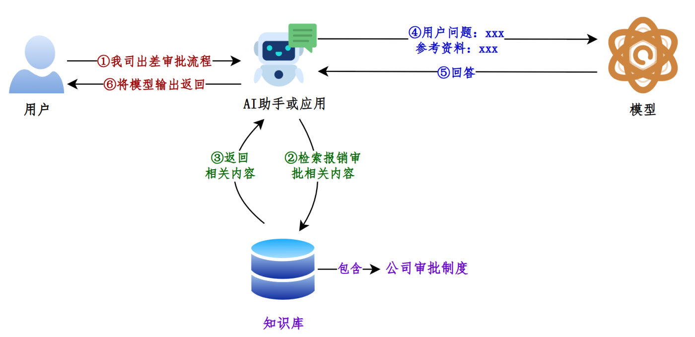
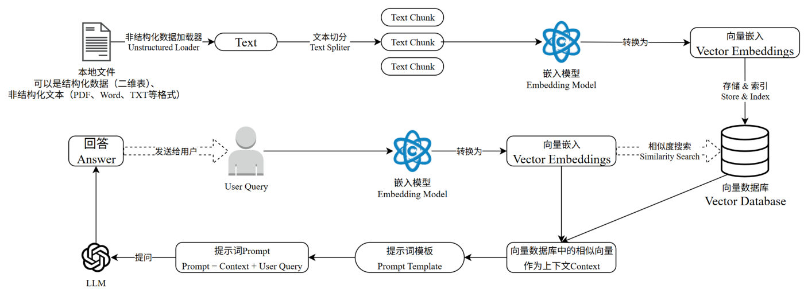
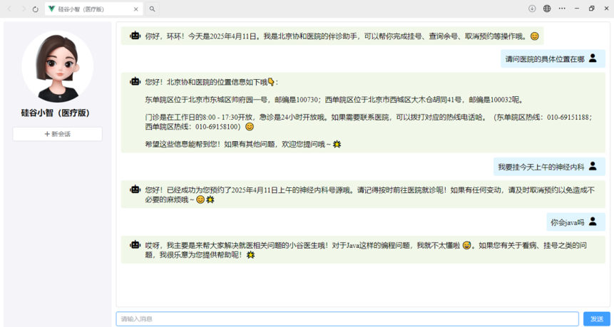
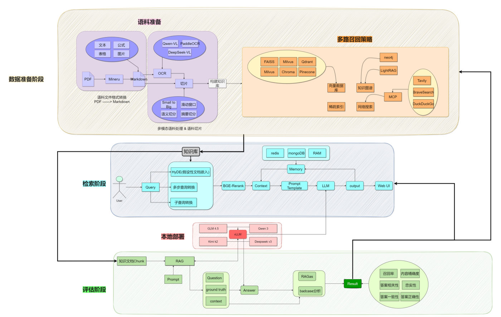
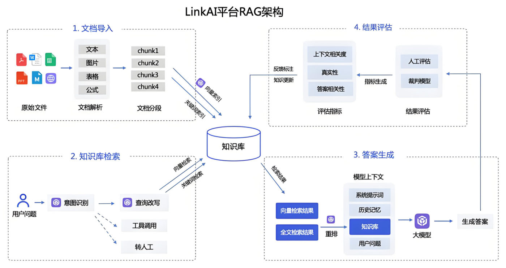
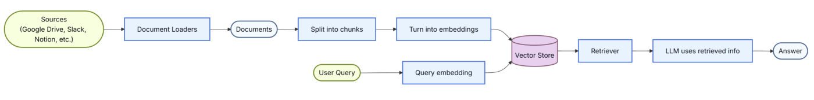
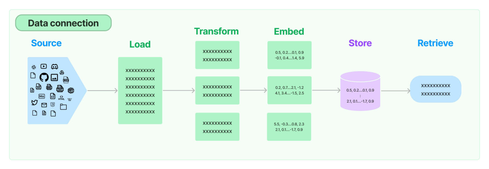
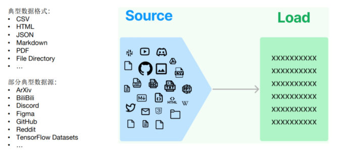
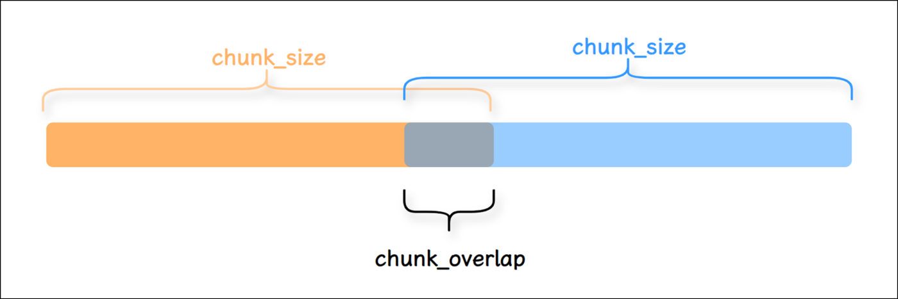
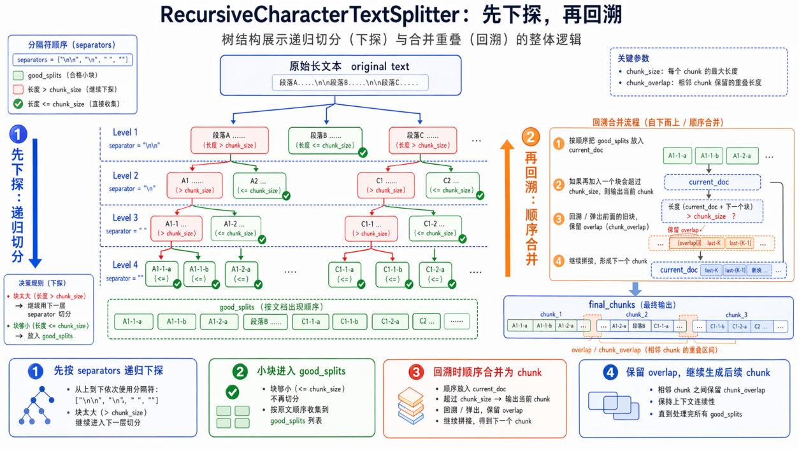

## 大模型的三个局限

| 局限 | 说明 |
| --- | --- |
| **知识滞后** | LLM 训练数据有**截止日期**，无法反映最新信息。比如"请推荐当前热门影片"这类时间敏感的问题 |
| **知识缺失** | 训练依赖网络上**海量公开的静态数据**，某些**特定领域**（企业内部资料、专有技术文档）或**你的私有数据**是缺乏的 |
| **幻觉** | 模型会"胡言乱语"：错误陈述、编造事实、错误推理，或复杂语境下理解不足 |

**幻觉为什么严重**：大模型生成内容不可控。在**金融、医疗**等领域，**一次金额评估错误、一次诊断失误，哪怕只出现一次都是致命的**——而对非专业人士来说可能难以辨识。目前还没有能 100% 解决这个问题的方案。

幻觉产生的原因有四条：训练知识存在**偏差**、训练时**过度泛化**、**没有真正理解**训练数据的深层含义、**缺乏某些领域知识**时会编造不存在的信息。

**当前的共识方案**：① 先为大模型**提供一定的上下文信息**，让输出更稳定；② 用 RAG 把**检索出来的文档 + 提示词**一起送给大模型，生成更可靠的答案。

## 什么是 RAG

**RAG（Retrieval-Augmented Generation，检索增强生成）** 是一种结合**信息检索**与**文本生成**的技术，目的是提升大语言模型回答专业问题时的**准确性和可靠性**。


*图：RAG 的检索流程（官方）——①用户提问 ②检索知识库 ③返回相关内容 ④用户问题+参考资料一起送给模型 ⑤模型回答 ⑥结果返回用户*

> 打个比方：如果说 LangChain 相当于给 LLM 这个"大脑"安装"四肢和躯干"，那么 **RAG 就是为 LLM 提供了接入"人类知识图书馆"的能力**。


*图：RAG 的完整链路——非结构化数据加载 → 文本切分 → 嵌入模型转成向量 → 向量数据库存储索引 → 相似度搜索 → 拼进提示词模板 → LLM 生成回答*

目前已有非常多的产品几乎完全建立在 RAG 之上：**客服系统**、基于大模型的数据分析，以及成千上万的数据驱动聊天应用。


*图：RAG 项目举例——智能客服助手（医疗版"硅谷小智"），能回答医院院区位置、门诊时间，甚至直接完成挂号预约；被问到"你会 java 吗"时它明确说自己只解决就医问题*


*图：RAG 项目举例——一套完整的企业级 RAG 系统架构，覆盖数据准备（语料处理、切片、多路召回）、检索、本地部署与评估四个阶段*


*图：RAG 项目举例——LinkAI 平台的 RAG 架构：文档导入 → 知识库检索（意图识别、查询改写）→ 答案生成（检索结果重排后进模型上下文）→ 结果评估*

| RAG 的优点 | RAG 的缺点 |
| --- | --- |
| 相比提示词工程，有更丰富的上下文和数据样本，不需要用户提供过多背景描述 | 每次问答都涉及外部系统数据检索，**响应时延相对较高** |
| 相比模型微调，能提升问答内容的**时效性和可靠性** | 引用的外部知识数据会**消耗大量模型 Token** |
| 在一定程度上保护业务数据的**隐私性** | |

## RAG 工作流程（六个环节）

```text
Source（数据源） → Load（加载） → Transform（转换，含切分） → Embed（嵌入） → Store（存储） → Retrieve（检索） → 生成回答
```


*图：LangChain 官方给出的 RAG 简化流程——Sources → Document Loaders → Documents → Split into chunks / Query embedding → Vector Store → Retriever → LLM uses retrieved info → Answer*

| 环节 | 说明 |
| --- | --- |
| **1. Source（数据源）** | 外挂的知识库。类型多样：视频、图片、文本、代码、文档；形式多样：上百个 csv、上千个 json、上万个 pdf，或某业务系统的 API、网站实时数据 |
| **2. Load（加载）** | **文档加载器**把非结构化文本加载到内存，成为 **Document 对象**（包含内容和元数据）。支持**延迟加载**（lazy load）以缓解大文件的内存压力 |
| **3. Transform（转换）** | **文档转换器**：文本拆分器、冗余过滤器、元数据提取器、多语言转换器、对话转换器。**其中拆分器是必须的** |
| **3.1 Text Splitting** | 切块之后才能向量化并入库。LangChain 不仅能切普通文本，还能切 Markdown、JSON、HTML、代码 |
| **4. Embed（嵌入）** | 把文本转成**向量表示**，使相似文本在向量空间中距离相近（"猫"和"犬"的向量夹角小于"猫"和"汽车"） |
| **5. Store（存储）** | 把嵌入存进**向量数据库**或缓存，避免重复计算 |
| **6. Retrieve（检索）** | **检索器**响应非结构化查询、返回符合条件的文档；通过配置不同检索器平衡精度、召回率与效率 |


*图：RAG 工作流程总览——Source → Load → Transform → Embed → Store → Retrieve，每个环节的数据形态（原始数据、Document、Text Chunk、向量）都不同*

> [!IMPORTANT]
> 课程特别强调：**拆分/分块是整条链路中最具挑战性的环节之一，它显著影响检索效果**。目前**没有通用方法**能说清哪种分块策略最有效——不同场景、不同数据类型都会影响选择。

## 环境准备

RAG 涉及的依赖较多且大，**不在之前的依赖文件里**，需要单独补装：

```bash
pip install -r requirements_full.txt     # 完整版依赖（见资料目录）
pip check                                # 检查依赖冲突，正常输出 No broken requirements found.
```

再把 `knowledge.txt` 放到项目根目录，`asset` 文件夹解压后同样放到根目录。

## 文档加载器（Document Loaders）

**Document 对象**是加载的产物，它有两部分：**`page_content`（文档内容）+ `metadata`（元数据）**。


*图：Source → Load：典型数据格式有 CSV、HTML、JSON、Markdown、PDF、File Directory，典型数据源有 ArXiv、BiliBili、Discord、Figma、GitHub、Reddit、TensorFlow Datasets——加载器就是把这些统一变成 Document*

```python
from langchain_community.document_loaders import TextLoader

loader = TextLoader("./test.txt", encoding="utf-8")
docs = loader.load()
print(docs[0].page_content)     # 文档内容
print(docs[0].metadata)         # {'source': './test.txt'}
```

各类格式的加载器（完整列表见官方 Integrations → Document loaders）：

| 格式 | 加载器 | 备注 |
| --- | --- | --- |
| txt | `TextLoader` | 最基础 |
| CSV | `CSVLoader` | 每行变成一个 Document，metadata 带 `row` |
| JSON | `JSONLoader` | 用 `jq_schema` 指定要抽取的字段 |
| PDF | `PyPDFLoader` | 每页一个 Document；`extraction_mode="plain"/"layout"` |
| 网页 | `WebBaseLoader` | 抓网页正文，metadata 带 `title`/`language` |
| Word | `UnstructuredWordDocumentLoader` | 需 `unstructured`；`mode="single"/"elements"` |
| Markdown | `UnstructuredMarkdownLoader` | 需 `unstructured`；`mode=` + `strategy=` |
| HTML | `UnstructuredHTMLLoader` | 需 `unstructured`；`mode="elements"` 会拆成 16 个 Document |
| 目录 | `DirectoryLoader` | 批量加载整个文件夹；`glob=` 过滤、`loader_cls=` 指定底层加载器 |

> [!NOTE]
> **本机实测（conda 环境 `langchain1.2`）**：`TextLoader`、`CSVLoader` **开箱即用**；`WebBaseLoader`（本机已装 `beautifulsoup4`）也能直接抓网页，实测抓 `https://example.com` 得到 1 个 Document，`metadata={'source': ..., 'title': 'Example Domain', 'language': 'en'}`。
> 而 `PyPDFLoader` 提示 `ImportError: 'pypdf' package not found`（`pip install pypdf`）、`JSONLoader` 提示 `ImportError: jq package not found`（`pip install jq`）、`UnstructuredMarkdownLoader` 提示 `No module named 'unstructured'`、`UnstructuredHTMLLoader` 提示 `ImportError: unstructured package not found`。
> **结论：用哪个格式的加载器，就按提示补它需要的依赖**——这些都在 `requirements_full.txt` 里。
>
> 顺带一个替代方案：本机装了 `pymupdf`，所以 **`PyMuPDFLoader` 可以直接用**（实测加载同一份 PDF 正常返回 Document）。装依赖时要看实际提示，不要照抄教程里的包名。

**加载 + 切分可以一步完成**，加载器自带 `load_and_split()`——**能用，但官方已不推荐**，因为 `BaseLoader.load_and_split()` 的源码注释里明写着"**不要重写此方法。它应被视为已弃用！**"：

```python
# langchain_core/document_loaders/base.py（本机实测源码）
def load_and_split(self, text_splitter: TextSplitter | None = None) -> list[Document]:
    """Load `Document` and split into chunks.

    !!! danger
        Do not override this method. It should be considered to be deprecated!
    """
    text_splitter_ = text_splitter or RecursiveCharacterTextSplitter()   # 不传就用默认的递归切分器（参数全是默认值）
    docs = self.load()
    return text_splitter_.split_documents(docs)
```

**所以推荐写成两步**：自己 `load()` 得到 Document，再显式交给切分器——参数看得见、切分器也方便复用：

```python
loader = CSVLoader("../asset/load/02-load.csv", encoding="utf-8")
docs = loader.load()                                   # 第一步：加载

text_splitter = RecursiveCharacterTextSplitter(chunk_size=200, chunk_overlap=80)
chunks = text_splitter.split_documents(docs)           # 第二步：切分（✅ 推荐写法）
```

### 网页加载：WebBaseLoader

`WebBaseLoader` 是课程列出的常用加载器之一，专门吃 HTTP(S) 链接：

```python
from langchain_community.document_loaders import WebBaseLoader

loader = WebBaseLoader("https://example.com")
docs = loader.load()
print(docs[0].metadata)      # {'source': 'https://example.com', 'title': 'Example Domain', 'language': 'en'}
print(docs[0].page_content)  # 已经去掉 HTML 标签的正文
```

> [!TIP]
> **本机实测**：`WebBaseLoader` 依赖 `beautifulsoup4`，本机已装、可以直接跑。返回的 `metadata` 里多了 `title` 和 `language` 两个字段——**检索时正好拿来做"出处展示"**。
> 另外抓取时控制台会提示 `USER_AGENT environment variable not set, consider setting it to identify your requests.`：想标识自己的抓取身份，设一个 `USER_AGENT=xxx` 环境变量即可。

### PDF 加载（方式 1）：PyPDFLoader

PDF 的来源格式有扫描版（图片 PDF）、电子文本版、混合版，布局又有单栏、双栏甚至竖排，还可能包含段落、标题、页眉页脚、表格、数学公式、化学式、图片——所以 **PDF 解析本身挑战很大**，复杂 PDF 需要文本提取、布局检测、表格解析、公式识别等一整套处理。课程给了两种方式。

`PyPDFLoader` 是轻量方案：**每一页变成一个 Document**，还支持直接传在线链接。

```python
from langchain_community.document_loaders import PyPDFLoader

loader = PyPDFLoader(
    # 文件路径，支持本地文件和在线文件链接
    # file_path="../asset/load/04-sample.pdf",
    file_path="https://arxiv.org/pdf/alg-geom/9202012",
    # 提取模式：控制如何从 PDF 中解析和提取文本结构
    #   plain  提取文本，默认值
    #   layout 布局感知提取模式，通常会通过插入大量的空格、换行符，
    #          来模拟原文档中的多栏、缩进和间距
    #          （适用场景：学术论文（如 arXiv 论文）、多栏报刊杂志、带左右分栏的合同）
    extraction_mode="plain",
)
docs = loader.load()
print(len(docs))          # 每个页面一个 Document
```

> [!WARNING]
> **本机实测**：`PyPDFLoader` 依赖 `pypdf`，而本机 conda 环境 `langchain1.2` **没有装**，直接跑会报
> `ImportError: 'pypdf' package not found, please install it with 'pip install pypdf'`。
> 想跑就先补依赖（在 `requirements_full.txt` 里）；本机已装 `pymupdf`，所以**替代方案 `PyMuPDFLoader` 可以直接用**（实测加载同一份 PDF 正常返回 Document，metadata 里带 `page`、`total_pages`、`format` 等）。

### PDF 加载（方式 2）：MinerU

MinerU 提供了 PDF、Word、PPT、图片等文件的解析，**支持图像提取、OCR、公式、表格解析**等功能；调用在线服务（https://mineru.net/apiManage/docs ）可以从本地批量上传文件进行解析，并接收解析结果。

需要在 `.env` 里提供：

```bash
# MinerU的API_TOKEN
MINERU_API_TOKEN=<你的API TOKEN>
```

完整脚本分三步：**申请上传链接并逐个上传 → 轮询批量任务状态 → 把解析结果的 zip 下载到本地**：

```python
import os
import time
import requests
from dotenv import load_dotenv

load_dotenv(override=True)


def upload_files(file_paths: list[str]) -> str:
    """批量上传文件"""
    url = "https://mineru.net/api/v4/file-urls/batch"
    api_token = os.getenv("MINERU_API_TOKEN")
    header = {
        "Content-Type": "application/json",
        "Authorization": f"Bearer {api_token}",
    }

    files_info = [
        {
            "name": os.path.basename(file_path),
            "is_ocr": True,            # 扫描版 PDF 要开 OCR
            "data_id": f"file_{i}",    # 自定义任务标识，用于后续对账
        }
        for i, file_path in enumerate(file_paths)
    ]

    data = {
        "enable_formula": True,        # 解析公式
        "enable_table": True,          # 解析表格
        "language": "ch",              # 文档语言
        "files": files_info,
    }

    try:
        response = requests.post(url, headers=header, json=data)
        if response.status_code == 200:
            result = response.json()
            print("response success. result:{}".format(result))

            if result["code"] == 0:
                batch_id = result["data"]["batch_id"]
                urls = result["data"]["file_urls"]
                print("batch_id:{}\nurls:{}".format(batch_id, urls))

                # 拿到预签名 URL 后，用 PUT 把文件本体传上去
                for i in range(0, len(urls)):
                    with open(file_paths[i], "rb") as f:
                        res_upload = requests.put(urls[i], data=f)
                        if res_upload.status_code == 200:
                            print(f"{urls[i]} upload success")
                        else:
                            print(f"{urls[i]} upload failed")
                            return None

                return batch_id
            else:
                print("apply upload url failed, reason:{}".format(result.get("msg")))
                return None
        else:
            print(
                "response not success. status:{} ,result:{}".format(
                    response.status_code, response.text
                )
            )
            return None

    except Exception as err:
        print(err)
        return None


def download_files(batch_id):
    """批量获取任务结果"""
    if not batch_id:
        print("batch_id为空，跳过下载")
        return

    os.makedirs("parsed_files", exist_ok=True)

    url = f"https://mineru.net/api/v4/extract-results/batch/{batch_id}"
    api_token = os.getenv("MINERU_API_TOKEN")
    header = {
        "Content-Type": "application/json",
        "Authorization": f"Bearer {api_token}",
    }

    failed_files = set()
    done_files = set()

    while True:
        res = requests.get(url, headers=header)
        result_json = res.json()

        if res.status_code != 200 or result_json.get("code") != 0:
            print("get result failed:", result_json)
            break

        extract_results = result_json["data"]["extract_result"]

        for result in extract_results:
            data_id = result["data_id"]

            if result["state"] == "failed":
                failed_files.add(data_id)

            elif result["state"] == "done" and data_id not in done_files:
                done_files.add(data_id)

                full_zip_url = result["full_zip_url"]
                res_download = requests.get(full_zip_url, stream=True)

                with open(
                    f"parsed_files/{result['file_name']}_{result['data_id']}.zip", "wb"
                ) as f:
                    for chunk in res_download.iter_content(chunk_size=1024):
                        if chunk:
                            f.write(chunk)

        # 全部任务都有结果（成功或失败）才退出轮询
        if len(failed_files) + len(done_files) == len(extract_results):
            break

        time.sleep(5)      # 每 5 秒查一次

    for i in failed_files:
        print("failed:", i)

    for i in done_files:
        print("done:", i)


file_paths = ["../asset/load/04-sample.pdf"]
batch_id = upload_files(file_paths)

if batch_id:
    download_files(batch_id)
```

> [!NOTE]
> **本机没有配置 `MINERU_API_TOKEN`，所以这段脚本没有实测**——它走的是 MinerU 在线服务，需要先注册拿 Token。
> 课程资料里已经用它解析好的产物（`chapter10-RAG/parsed_files/`：`full.md` + `images/` + `*_content_list.json`），可以直接感受解析质量——**PDF 里的公式、表格、图片都被单独抽了出来，还带版面坐标**，这正是 PyPDFLoader 做不到的部分。

### Word 加载：UnstructuredWordDocumentLoader

```python
from langchain_community.document_loaders import UnstructuredWordDocumentLoader

loader = UnstructuredWordDocumentLoader(
    file_path="../asset/load/05-sgg_chat.docx",
    # 加载模式：
    #   single   返回单个 Document 对象
    #   elements 按标题等元素切分文档
    mode="single",
)
docs = loader.load()
print(len(docs))
print(docs)
```

> [!NOTE]
> 需要 `unstructured` 包（已在 `requirements_full.txt` 里）。`mode="single"` 整篇一个 Document；`mode="elements"` 会按标题等元素把文档拆成多个 Document——和下面 Markdown 的玩法完全一样。

### Markdown 加载：UnstructuredMarkdownLoader

**举例1：整篇加载（`mode="single"`）**

```python
from langchain_community.document_loaders import UnstructuredMarkdownLoader
from pprint import pprint

loader = UnstructuredMarkdownLoader(
    file_path="../asset/load/06-load.md",
    # 加载模式:
    #   single 返回单个Document对象
    #   elements 按标题等元素切分文档
    mode="single",
    # 解析策略：
    #   "fast"（快速模式），它会以最快的速度提取文本，不进行复杂的版面分析
    #   "hi_res" 高分辨率模式
    strategy="fast",
)
docs = loader.load()
print(len(docs))
pprint(docs)
```

**举例2：精细分割文档，保留结构信息（`mode="elements"`）**

把 Markdown 按语义元素（标题、段落、列表、表格等）拆分成多个独立的小文档（Element 对象），而不是返回单个大文档——指定 `mode="elements"` 就能保持这种分离：

```python
md_loader = UnstructuredMarkdownLoader(
    file_path="../asset/load/06-load.md",
    mode="elements",
    strategy="fast",
)
docs = md_loader.load()
print(len(docs))          # 19：一篇文档被拆成 19 个小块
for doc in docs:
    pprint(doc.page_content)
```

课程示例的拆解结果是**标题、段落、列表项各自成块**：

```text
'自然语言处理技术文档'
'本文档用于测试UnstructuredMarkdownLoader的中文处理能力。'
'第一章：简介'
'自然语言处理(NLP)是人工智能的重要分支，主要技术包括：'
'文本分类'
...
'2.2 代码示例'
'```python from transformers import pipeline'
```

### HTML 加载：UnstructuredHTMLLoader

```python
from langchain_community.document_loaders import UnstructuredHTMLLoader

# strategy:
#   "fast" 解析加载html文件速度比较快（但可能丢失部分结构或元数据）
#   "hi_res" (高分辨率解析) 解析精准（速度慢一些）
#   "ocr_only" 强制使用ocr提取文本，仅仅适用于图像（对HTML无效）
#
# mode ：one of `{'paged', 'elements', 'single'}`
#   "elements" 按语义元素（标题、段落、列表、表格等）拆分成多个独立的小文档
loader = UnstructuredHTMLLoader(
    file_path="../asset/load/07-load.html",
    mode="elements",
    strategy="fast",
)
docs = loader.load()
print(len(docs))     # 16  ← 一个 HTML 文件拆出 16 个 Document
for doc in docs:
    pprint(doc)
```

> [!NOTE]
> Word / Markdown / HTML 这三个 unstructured 系加载器的**输出条数（Word 1 条、Markdown single 1 条 / elements 19 条、HTML elements 16 条）取自课程实测**——本机没装 `unstructured`，这几个数字没有在本机复现；本机能确认的是它们的**类名与参数**（类都存在，缺依赖时按提示 `pip install unstructured` 即可）。

### 目录批量加载：DirectoryLoader

除了单个文件，也可以**批量加载一个文件夹内的所有文件**：

```python
from langchain_community.document_loaders import DirectoryLoader
from langchain_community.document_loaders import PythonLoader

directory_loader = DirectoryLoader(
    path="../asset/load",
    glob="*.py",             # 文件匹配模式（过滤器）。使用标准的 Unix 路径通配符
    use_multithreading=True, # 是否启用多线程。True 表示 LangChain 会并发读取多个文件
    show_progress=True,      # 是否显示进度条
    loader_cls=PythonLoader, # 指定底层核心加载器
)
docs = directory_loader.load()
print(len(docs))
```

**本机实测**（同一目录下的 4 个 `.py`）：控制台先打印进度条 `100%|██████████| 4/4 [00:00<00:00, 2251.67it/s]`，随后 `len(docs) == 4`，每个 Document 的 metadata 是 `{'source': '..\\asset\\load\\08-fun.py'}` 这种形式。

> [!TIP]
> `glob` 不只是"按后缀过滤"：`"*.py"`、`"**/*.md"`、`"data_*.csv"` 都能写。
> **`loader_cls` 决定文件夹里每个文件用哪个加载器**：不传就退回默认的 `UnstructuredFileLoader`（需要 `unstructured`），传了 `PythonLoader` / `TextLoader` 这类就不必装那个重依赖了。

### 了解：BaseLoader 与 Document 类

一方面，LangChain 在设计时要保证 Source 中各种不同的数据源，接下来的流程可以用**统一的形式**读取、调用；另一方面，**为什么 `PDFLoader`、`TextLoader` 等 Document Loader 都用 `load()` 加载、都用 `.page_content` 和 `.metadata` 读取数据？**

【解答】每一个在 LangChain 中集成的文档加载器，都要继承自 **`BaseLoader`（文档加载器）**，`BaseLoader` 提供了一个名为 `load` 的公开方法，用于从配置的不同数据源加载数据，全部作为 `Document` 对象。实现逻辑如下（本机实测源码）：

```python
class BaseLoader(ABC):
    """Interface for loading documents.

    Implementations should implement the lazy-loading method using generators
    to avoid loading all documents into memory at once.

    The `load` method will remain as is for backwards compatibility, but its
    implementation should be just `list(self.lazy_load())`.
    """

    # Sub-classes should not implement this method directly. Instead, they
    # should implement the lazy load method.
    def load(self) -> list[Document]:
        """Load data into `Document` objects."""
        return list(self.lazy_load())

    async def aload(self) -> list[Document]:
        """Load data into `Document` objects."""
        return [document async for document in self.alazy_load()]
```

这解释了三条约定：

1. 任何具体实现的 loader，**最少要实现 `load()`**；实际更推荐实现生成器版的 `lazy_load()`——"**延迟加载**缓解大文件内存压力"这句话就是这么来的；
2. `load()` 本身**不应被重写**，它干的事就是 `list(self.lazy_load())`；异步接口则是 `aload()` / `alazy_load()`；
3. `load_and_split()` 也定义在这个基类里，并且**已标注为弃用**（见上文）。

**`Document` 类**允许用户与文档内容交互，其继承体系如下（本机实测 `Document.__mro__`）：

```text
Serializable
   ↑
BaseMedia
   ├── id: str | None        # 可选的文档标识符（理想是 UUID，但不强制）
   ├── metadata: dict        # 与内容关联的任意元数据
   ↑
Document
   ├── page_content: str     # 真正的文档内容
   └── type: Literal["Document"] = "Document"
```

`Document` 源码（本机实测，注释原意保留）：

```python
class Document(BaseMedia):
    """Class for storing a piece of text and associated metadata.

    !!! note

        `Document` is for **retrieval workflows**, not chat I/O. For sending text
        to an LLM in a conversation, use message types from `langchain.messages`.
    """

    page_content: str
    """String text."""

    type: Literal["Document"] = "Document"

    def __init__(self, page_content: str, **kwargs: Any) -> None:
        """Pass page_content in as positional or named arg."""
        # my-py is complaining that page_content is not defined on the base class.
        # Here, we're relying on pydantic base class to handle the validation.
        super().__init__(page_content=page_content, **kwargs)
```

> [!IMPORTANT]
> **`Document` 用于检索工作流，而不是聊天输入输出**——这是源码注释里的原话。如果你要把文本发给 LLM 对话，应该用 `langchain.messages` 里的消息类型（`HumanMessage` / `SystemMessage` 等，见第 07 篇）。两者的字段长相相似，但**职责完全不同**：`Document` 面向"存储、索引、检索"，Message 面向"对话"。
>
> 另外注意 `__str__` 被重写过：打印 `Document` 只会输出 `page_content='...' metadata={...}`，方便你把 Document 直接塞进 prompt 里调试。

## 文档切分器（Text Splitters）

### 为什么必须切

**切块之后才能向量化并存入数据库**；同时切块也决定了每次送给模型的上下文片段有多长（要适配模型的上下文窗口限制）。

获取 Document 对象后之所以必须把它切成一个个小块（Chunk），课程给了三条理由：

| 理由 | 说明 |
| --- | --- |
| **长文档问题** | 大模型存在最大输入的 Token 限制，一个 Document 如果非常大，输入大模型时会被截断，导致信息缺失 |
| **检索精度** | Document 可能包含非常多无关信息，这些无效信息会干扰大模型的生成，而**切成小块检索更精准** |
| **成本控制** | 减少不必要的 token 消耗 |

无论是在存储还是检索过程中，都以这些**块（chunk）为基本单位**——这样才能有效避免内容噪声干扰和超出最大 Token 的问题。

### 五种切分策略

| 策略 | 做法 | 评价 |
| --- | --- | --- |
| 1. 按句子切分 | 按自然句子边界切，保持语义完整 | 简单场景可用 |
| 2. 按固定字符数切分 | 按字符数硬切 | **可能在不适当的位置切断句子** |
| 3. 固定字符数 + 重叠窗口 | 在方法 2 基础上让相邻块有重叠 | 避免切断关键内容，保持连贯 |
| 4. **递归字符切分** | 递归地动态确定切分点，按文档复杂度调整块大小 | ✅ **通常是首选策略** |
| 5. 按语义内容切分 | 依据语义内容划分块 | 保持语义最完整，但**效率低、块长极不均匀**，不适合所有情况 |

方法 2、3 只看字符、**不考虑语义**，容易造成主题断裂；方法 4 结合了固定长度与语义分析，能更好保证每段落含完整主题；方法 5 精度高但慢。

### TextSplitter 源码分析

所有切分器都继承自 **`TextSplitter`**（本机实测源码）：

```python
class TextSplitter(BaseDocumentTransformer, ABC):
    """用于将文本切分为多个块的接口。"""

    def __init__(
        self,
        chunk_size: int = 4000,
        chunk_overlap: int = 200,
        length_function: Callable[[str], int] = len,
        keep_separator: bool | Literal["start", "end"] = False,
        add_start_index: bool = False,
        strip_whitespace: bool = True,
    ) -> None:
        ...
```

| 参数 | 默认值 | 含义 |
| --- | --- | --- |
| `chunk_size` | 4000 | 返回的文本块的最大大小 |
| `chunk_overlap` | 200 | 文本块之间重叠的字符数 |
| `length_function` | `len` | 衡量给定文本块长度的函数（可以换成 token 计数器） |
| `keep_separator` | `False` | 是否保留分隔符，以及将其放在对应文本块中的哪个位置（`True` 等价于 `"start"`） |
| `add_start_index` | `False` | 为 `True` 时在 metadata 中包含文本块的起始索引 |
| `strip_whitespace` | `True` | 为 `True` 时去除每个文档开头和结尾的空白字符 |

（前三个参数在下面的"核心参数"里会以 `CharacterTextSplitter` 为例再展开；`keep_separator` / `add_start_index` / `strip_whitespace` 是基类提供的通用能力，本节后面也会给实测例子。）

**三条初始化校验**（本机实测，都会抛 `ValueError`）：

```text
CharacterTextSplitter(chunk_size=0)                     -> ValueError: chunk_size must be > 0, got 0
CharacterTextSplitter(chunk_size=10, chunk_overlap=-1)  -> ValueError: chunk_overlap must be >= 0, got -1
CharacterTextSplitter(chunk_size=10, chunk_overlap=20)  -> ValueError: Got a larger chunk overlap (20) than chunk size (10), should be smaller.
```

一眼就能看出：**`chunk_overlap > chunk_size` 是直接报错的**，不是警告。

**三种调用方式与调用链**：

| 方式 | 传入 | 返回 | 说明 |
| --- | --- | --- | --- |
| ① `split_text(text)` | 单个字符串 | `list[str]` | **抽象方法**，具体切分逻辑由子类实现 |
| ② `create_documents(texts, metadatas=None)` | 字符串列表（可选 metadata 列表） | `list[Document]` | 底层遍历 `texts`，对每个 `text` 调用 `split_text()`，再把切出的字符串封装成 Document |
| ③ `split_documents(documents)` | `Iterable[Document]` | `list[Document]` | 取出 `page_content` 和 `metadata`，再调用 `create_documents()` |

```text
split_documents(documents)
    -> create_documents(texts, metadatas=metadatas)
        -> split_text(text)
```

**另外两个接口**：

- **`transform_documents(documents)`**：实现的是 `BaseDocumentTransformer` 的接口，内部就一行 `return self.split_documents(list(documents))`——它的意义是让切分器能塞进"文档转换器链"里统一调用。
- **`from_huggingface_tokenizer(tokenizer, **kwargs)` / `from_tiktoken_encoder(encoding_name="gpt2", model_name=None, ...)`**：两个 `@classmethod` 构造器，用来把 `length_function` 换成 token 计数器（详见下文"Token 与按 Token 切分"）。

```python
@classmethod
def from_tiktoken_encoder(
    cls,
    encoding_name: str = "gpt2",
    model_name: str | None = None,     # 提供该参数时会覆盖 encoding_name
    allowed_special: Literal["all"] | AbstractSet[str] = set(),
    disallowed_special: Literal["all"] | Collection[str] = "all",
    **kwargs: Any,
) -> Self:
    ...
```

> [!TIP]
> 想直观看看"文本到底是怎么被切开的"，可以用课程推荐的可视化工具 https://chunkviz.up.railway.app/ ——把文本和自己的切分参数丢进去，它会按块着色显示。

### 核心参数

以 `CharacterTextSplitter` 为例：

| 参数 | 默认值 | 含义 |
| --- | --- | --- |
| `chunk_size` | 4000 | 每个切块的**最大字符数** |
| `chunk_overlap` | 200 | 相邻两个切块之间的**最大重叠字符数**（保证段间语义完整） |
| `separator` | `"\n\n"` | 分割使用的分隔符 |
| `length_function` | `len` | 计算切块长度的方法 |


*图：`chunk_size` 是每个切块的最大长度，`chunk_overlap` 是相邻两个切块之间的重叠部分（不重叠就不会切出灰块那一段）*

> [!WARNING]
> **实测一个反直觉的点**：把 `separator=""` 时表示"**禁用分隔符优先**"。这时切块长度**可能小于 `chunk_size`**（尤其对中文）：
>
> ```python
> cs = CharacterTextSplitter(chunk_size=50, chunk_overlap=5, separator="")
> # 结果：[50 字符的块, 20 字符的块]  ← 第二块只有 20 字
> ```
> 课程提醒：如果必须禁用分隔符（比如处理无空格文本），**要容忍实际块长略小于 `chunk_size`**。

### 四种具体实现（实测）

| 切分器 | 特点 | 实测结果（同一段中文，chunk_size=50） |
| --- | --- | --- |
| `CharacterTextSplitter` | 按字符/分隔符切 | 2 块（50、20 字） |
| `RecursiveCharacterTextSplitter` | **首选**，默认分隔符 `["\n\n", "\n", " ", ""]`，逐级尝试 | 3 块（9、49、16 字）——按换行优先切，块长更贴近语义 |
| `TokenTextSplitter` | 按 **token** 数切（更贴近模型的真实限制） | 5 块（23、16、17、17、5 字）⚠️ 见下方警告 |
| `MarkdownHeaderTextSplitter` | 按 Markdown 标题层级切，**并把标题写进 metadata** | `{'h1': '一级标题', 'h2': '二级标题'}` |


*图：`RecursiveCharacterTextSplitter` 的"先下探、再回溯"——① 按 `separators` 从 `\n\n`、`\n`、` ` 到 `""` 逐级递归切分，超长块继续往下探，合格的块进 `good_splits`；② 再按顺序把小块合并回 chunk，超过 `chunk_size` 就输出并保留 `chunk_overlap`*

> [!WARNING]
> **中文场景慎用 `TokenTextSplitter`**。本机实测（同一段中文知识拆成 11 块）**有 9 块出现 `�` 乱码**：
>
> ```text
> 块1: ❌ '退换货政策：客户在收到�'
> 块2: ❌ '�品之后 7 个自然日内，如果�'
> ...
> 块11: ❌ '�。'
> ```
>
> 原因：它按 tiktoken 的**字节级 token** 边界切割，一个中文字符可能由多个 token 组成，**在 token 边界切开就会把字符劈成两半**。
> **结论：中文文本老老实实用 `RecursiveCharacterTextSplitter`**（它按字符切，不会有这个问题）。

```python
from langchain_text_splitters import RecursiveCharacterTextSplitter

splitter = RecursiveCharacterTextSplitter(
    chunk_size=200,
    chunk_overlap=80,
    separators=["\n\n", "\n", "。", " ", ""],   # 切分策略：优先按段落，其次句子
)
chunks = splitter.split_documents(documents)     # 直接吃 Document 列表
print(f"文档共切分为 {len(chunks)} 个 chunk")
```

> [!TIP]
> **实战里最值得抄的一招**：在客服知识库案例中，作者给 `separators` 加了一个**自定义业务分隔符**——`"\n==============================\n"`，也就是知识库里条目之间的分隔线。**先按业务边界切，再按自然语言边界切**，这样更容易让每条知识落在同一个 chunk 里。
>
> **但要注意一个实测坑**：`RecursiveCharacterTextSplitter` 默认 `keep_separator=True`（把分隔符留在块里），于是**那行分隔线会自己变成一个"只有一行等号"的块**，白占一个向量库名额：
>
> ```text
> keep_separator=True（默认）→ 3 块
>   块1(48): '退换货政策：客户在收到商品之后 7 个自然日内可以申请无理由退货，15 个自然日内可以申请换货。'
>   块2(30): '=============================='        ← 只装分隔符的块
>   块3(36): '发货时间：订单支付成功后 24 小时内发货，遇到大促或法定节假日会顺延。'
>
> keep_separator=False → 2 块
>   块1(48): '退换货政策：…'
>   块2(36): '发货时间：…'
> ```
>
> **所以用业务分隔符时，记得一起设置 `keep_separator=False`**（或者事后再过滤掉这种"只有分隔符"的块）。
>
> 另外注意 `split_documents(documents)` 与 `split_text(text)` 的区别：前者吃 `Document` 列表、返回 `Document` 列表（**保留并合并 metadata**），后者吃纯字符串。

### separator 优先原则（四条）

给 `CharacterTextSplitter` 指定 `separator`（比如 `"。"`）之后，**切分器会先尝试在分隔符处分割，然后再考虑 `chunk_size`**——这是为了避免在句子中间硬性切断。这套设计带来四条必须记住的结论：

1. **优先保持语义完整性**（不切断句子）
2. **避免产生无意义的碎片**（如半个单词、不完整句子）
3. **如果 `chunk_size` 比片段还小，就无法拆分片段，导致 `overlap` 失效**
4. **`chunk_overlap` 仅在合并后的片段之间生效**（前提是 `chunk_size` 足够大）；如果没有片段被合并，`overlap` 同样失效

实测（`text = "这是第一段文本。这是第二段内容。最后一段结束。"`）：

```python
# ① chunk_size=6 比"这是第一段文本"（7 字）还小 → 块长超标，块与块之间没有任何重叠
CharacterTextSplitter(separator="。", chunk_size=6, chunk_overlap=3)
#   Created a chunk of size 7, which is longer than the specified 6     ← 控制台会打印这句
#   块1(7): '这是第一段文本' / 块2(7): '这是第二段内容' / 块3(6): '最后一段结束'

# ② chunk_size=20 足够大 → 相邻块之间出现重叠（"这是第二段内容"被前后两块共享）
CharacterTextSplitter(separator="。", chunk_size=20, chunk_overlap=8)
#   块1(15): '这是第一段文本。这是第二段内容'
#   块2(14): '这是第二段内容。最后一段结束'
```

> [!WARNING]
> **块长可以超过 `chunk_size`**——这不是 bug。当按 separator 切出来的某一段本身就比 `chunk_size` 长、又不能再往下切时，切分器只能打印一句警告后原样输出：
>
> ```text
> Created a chunk of size 33, which is longer than the specified 30
> ```
>
> 课程 `CharacterTextSplitter(chunk_size=30, chunk_overlap=5, separator="。")` 的例子里出现 **33 字的块**，原因就在这里：**`chunk_size` 是"尽量不超过"的目标，不是硬约束**。

### keep_separator 的三种取值

`keep_separator` 控制**分隔符本身要不要留在块里**。实测对比（同一段文本，`chunk_size=20, chunk_overlap=8`）：

| 取值 | 实测结果 | 说明 |
| --- | --- | --- |
| `False`（默认） | `'这是第一段文本。这是第二段内容'` / `'这是第二段内容。最后一段结束'` | 分隔符被丢掉，**块尾没有句号** |
| `True`（等价于 `"start"`） | `'这是第一段文本。这是第二段内容'` / `'。这是第二段内容。最后一段结束。'` | 分隔符留在**下一块的开头** |
| `"end"` | `'这是第一段文本。这是第二段内容。'` / `'最后一段结束。'` | 分隔符留在**上一块的结尾** |

**什么时候要在意它？**处理中文时，句尾标点承载着语气和逻辑，课程自定义中文标点切分就配了 `keep_separator=True`；反过来，用业务分隔线（`"\n=====…=====\n"`）切分时就要设 `False`，免得分隔线自己变成一个块（见上文那招）。

> [!NOTE]
> **默认值因切分器而异**：`CharacterTextSplitter`、`TokenTextSplitter` 默认 `keep_separator=False`，而 **`RecursiveCharacterTextSplitter` 默认是 `True`**（本机实测 `RecursiveCharacterTextSplitter()._keep_separator == True`）——所以上文那个"分隔线自己变成一个块"的坑，正是递归切分器的默认行为造成的，必须显式关掉。

### 中文文档：自定义分隔符

有些书写系统**没有单词边界**，例如中文、日文和泰文。使用默认分隔符列表 `["\n\n", "\n", " ", ""]` 分割这类文本，可能导致句子被错误地切断。为了尽量让句子待在一起、保持语义完整，可以**自定义分割字符**，覆盖分隔符列表以包含额外的标点符号：

```python
from langchain_text_splitters import RecursiveCharacterTextSplitter

text_splitter = RecursiveCharacterTextSplitter(
    chunk_size=200,
    chunk_overlap=20,      # 增加重叠字符
    separators=["\n\n", "\n", "。", "！", "？", "……", "，", ""],  # 添加中文标点
    length_function=len,
    keep_separator=True,   # 保留句尾标点（如 ……），避免切割后丢失语气和逻辑
    add_start_index=True,  # 在 metadata 里记下每块在原文中的起始位置
)
```

效果：算法会**优先在句号、感叹号、问号、省略号、逗号处切割**，尽量保持句子完整。`add_start_index=True` 则让每个 Document 的 metadata 里多出一个 `start_index`（本机实测形如 `{'start_index': 0}`）——排查"这句话到底来自原文哪个位置"时特别有用。

> [!TIP]
> 课程用 `PyPDFLoader` 加载《骆驼祥子》节选做示例（`chunk_size=200, chunk_overlap=0, add_start_index=True`），切出的第二块 metadata 是：
> `{'producer': 'Microsoft® Word 2019', ..., 'source': '../asset/load/04-load.pdf', 'total_pages': 1, 'page': 0, 'page_label': '1', 'start_index': 198}`
> ——**PDF 自带的元数据（page、page_label）和切分器添加的 `start_index` 是合并在一起的**，这正是"切分不丢来源信息"的价值：检索命中后能直接说清"来自第几页、第几个字符"。

### 递归切分的底层：先拆分、后合并

`RecursiveCharacterTextSplitter` 的底层处理逻辑分两步（了解即可）：

**① 先拆分（下探）**

1. 底层的 `self._split_text()` 按照分隔符列表的顺序，用当前递归层可用的**第一个分隔符**把文档切成若干块；
2. 如果切分后的块大小仍 `> chunk_size`，就调用 `self._split_text()` 用**下一个分隔符**递归处理大块；
3. 直到所有块大小都不超过 `chunk_size`，停止递归。

**② 后合并（回溯）**

合并过程不是一次完成的，为便于理解可以抽象成"一次合并"，最终得到完整块列表 `final_chunks`：

1. 遍历切分后的 chunk 列表：对每个当前 chunk，先判断把它加入候选窗口后，加上必要的合并分隔符（默认为 `""`），候选窗口长度会不会超过 `chunk_size`；若超过，则先把历史块合并为整体，添加到 `final_chunks`；
2. 然后从候选列表左侧逐个弹出 chunk，直到：① 剩余 chunk 拼接后的累计长度不大于 `chunk_overlap`；② 并且"剩余部分 + 下一个 chunk + 合并分隔符长度"之和不超过 `chunk_size`；
3. 这样可以让**拆分过细的小块同时出现在前后两个相邻的块中**——这就是`chunk_overlap` 重叠的来源。

处理完成后，就得到了既满足 `chunk_size` 约束、又按 `chunk_overlap` 保留重叠区域的 chunk 列表。

> [!TIP]
> 一句话记忆：**拆分 = 下探**（对超长块继续递归细分），**合并 = 回溯**（把合格小块按顺序重新组织为最终 chunk，并在相邻 chunk 之间保留 overlap）。配上上文那张"递归切分下探与回溯"的示意图看更直观。

### Token 与按 Token 切分

**什么是 Token？**对模型而言，Token 是文本的最小处理单位：

| 文本 | Token 数（课程说法） |
| --- | --- |
| 英文 `"hello"` | 1 个 Token |
| 英文 `"ChatGPT"` | 2 个 Token（"Chat" + "GPT"） |
| 中文 `"人工智能"` | 可能拆分为 2-3 个 Token（取决于分词器） |

**为什么按 Token 分割？**

1. 语言模型对输入长度的限制是基于 **Token 数**（如 GPT-4 的 8k / 32k Token 上限），直接按字符或单词分割可能导致实际 Token 数超限；
2. 大语言模型通常以 **token 数量作为计量（或收费）的依据**，所以按 token 切分也有助于控制成本。

`TokenTextSplitter` 的核心依据是 **Token 数量 + 自然边界**：严格按 token 数量切分，但会优先在自然边界（如句尾）处切断，以尽量保证语义完整。

| 维度 | 说明 |
| --- | --- |
| 优点 | 与 LLM 的 Token 计数逻辑一致，能尽量保持语义完整 |
| 缺点 | 对非英语或特定领域文本，Token 化效果可能不佳 |
| 典型场景 | 需要精确控制输入 LLM 的 Token 数的场景 |

它会用到 **token 编码器**：把文本切分为 token 序列，再把 token 序列映射为 ID 序列——本质上是一个 tokenizer。可选编码器位于 `openai_public.py` 的全局变量中：

```python
ENCODING_CONSTRUCTORS = {
    "gpt2": gpt2,
    "r50k_base": r50k_base,
    "p50k_base": p50k_base,
    "p50k_edit": p50k_edit,
    "cl100k_base": cl100k_base,
    "o200k_base": o200k_base,
    "o200k_harmony": o200k_harmony,
}
```

```python
from langchain_text_splitters import TokenTextSplitter

text_splitter = TokenTextSplitter(
    chunk_size=33,                 # 最大 token 数为 33
    chunk_overlap=0,               # 重叠 token 数为 0
    # model_name="gpt-4",          # 选择 GPT-4 模型的编码器（会覆盖 encoding_name）
    encoding_name="cl100k_base",   # 使用 OpenAI 的编码器，将文本转换为 token 序列
)
```

**也可以把任意切分器的 `length_function` 换成 token 计数器**——这样 `chunk_size` 数的就是 token 而不是字符：

```python
from langchain_text_splitters import CharacterTextSplitter
import tiktoken  # 用于计算Token数量

text_splitter = CharacterTextSplitter.from_tiktoken_encoder(
    encoding_name="cl100k_base",  # 使用 OpenAI 的编码器
    chunk_size=18,                 # 注意：这里的 18 是 18 个 token
    chunk_overlap=0,
    separator="。",                 # 指定中文句号为分隔符
    keep_separator=False,
)
```

> [!WARNING]
> **Token 数完全取决于编码器，不要背课件里的数字**。课程说 `"ChatGPT"` = 2 个 Token、`"人工智能"` = 2~3 个 Token，但本机实测（用课件自己指定的 `cl100k_base`）对不上：
>
> ```text
> cl100k_base：  hello=1   ChatGPT=3    人工智能=5     LangChain=2
> o200k_base ：  hello=1   ChatGPT=2    人工智能=2     LangChain=2
> gpt2       ：  hello=1   ChatGPT=3    人工智能=8     LangChain=3
> ```
>
> 课件的说法对应较新的 `o200k_base`（GPT-4o 一类的编码器）；而课件代码里写的是 `cl100k_base`，同一个词会多出好几个 token。**结论：用哪个编码器，就用它自己数一遍**——这也解释了为什么 `TokenTextSplitter` 在中文场景容易踩坑（见上文实测的 `�` 乱码），中文老老实实用 `RecursiveCharacterTextSplitter`。

### 语义分块：SemanticChunker

**Semantic Chunking（语义分块）**是 LangChain 中一种更高级的文本分割方法：它超越传统的"按字符数或固定大小"的分块方式，而是**根据文本的语义结构**进行智能分块，使每个分块保持语义完整性，从而提高 RAG 的效果。

做法是：把文本转成向量（Embedding），**计算前后句子的语义差异**；当发现前后两句的语义变化很大（超过设定的阈值）时，就在这里一刀切断。这样能保证切分出来的每个 Chunk 在含义上是完整、连贯的。

| 特性 | 语义分割（SemanticChunker） | 传统字符分割（RecursiveCharacter） |
| --- | --- | --- |
| 分割依据 | 嵌入向量相似度 | 固定字符 / 换行符 |
| 语义完整性 | ✅ 保持主题连贯 | ❌ 可能切断句子逻辑 |
| 计算成本 | ❌ 高（需要嵌入模型） | ✅ 低 |
| 适用场景 | 需要高语义一致性的任务 | 简单文本预处理 |

```python
# pip install langchain_experimental
from langchain_experimental.text_splitter import SemanticChunker

# embedding_model 就是嵌入模型（下一章 25 详讲：init_embeddings(...) 或 OpenAIEmbeddings(...)）
text_splitter = SemanticChunker(
    embeddings=embedding_model,
    breakpoint_threshold_type="percentile",      # 断点阈值类型
    breakpoint_threshold_amount=65.0,            # 断点阈值数量（阈值越低 → 分割越敏感）
    sentence_split_regex=r"(?<=[。？！])\s+",     # 句子切分正则
)
docs = text_splitter.create_documents(texts=[state_of_the_union])
```

**参数说明：**

| 参数 | 取值 | 原理与适用场景 |
| --- | --- | --- |
| `breakpoint_threshold_type` | `percentile` | 计算相邻句子嵌入向量的余弦距离，取距离分布的第 N 百分位值作为阈值，高于此值则分割。常规文本（文章、报告） |
| | `standard_deviation` | 以"均值 + N 倍标准差"为阈值，识别语义突变点。语义变化剧烈的文档（如技术手册） |
| | `interquartile` | 用四分位距（IQR）定义异常值边界，超过则分割。长文档（如书籍） |
| | `gradient` | 基于嵌入向量变化的梯度检测分割点（需自定义实现）。实验性需求 |
| `breakpoint_threshold_amount` | `percentile`：0.0~100.0 | **默认 95.0**。数值越小切分越敏感（语义稍有不同就切开，碎片多而小）；越大越迟钝（只有话题剧烈转变时才切开，块很大）。课程设 65.0，意思是"只有语义差距超过全篇 65% 的句子间距时才切" |
| | `standard_deviation`：浮点数 | 如 1.5 表示"均值 + 1.5 倍标准差" |
| | `interquartile`：倍数 | 如 1.5 是 IQR 标准值 |
| `sentence_split_regex` | 正则字符串 | 自定义句子切分正则；不传时默认为 `r"(?<=[.?!])\s+"`。中文场景要自己写，如 `r"(?<=[。？！])\s+"`——遇到中文的句号、感叹号、问号**且后面带空格**时切出一句 |

**底层逻辑**：先按正则把文本切成 chunk 列表 → 计算相邻 chunk 之间的距离 → 按 `breakpoint_threshold_type` / `breakpoint_threshold_amount` 的规则确定切分位置 → 按切分位置合并相邻块。

> [!NOTE]
> **本机实测**：`SemanticChunker` 在 `langchain_experimental` 包里，本机已装、可以跑。用 `DeterministicFakeEmbedding(size=64)` 顶替真嵌入时也能跑通（`percentile` 模式把 4 句中文切成 3 块；`standard_deviation` / `interquartile` 模式切成 1 块）——
> **但伪嵌入没有语义，切在哪里完全是随机的，没有参考价值**。想真正评估语义分块的效果，必须换成真嵌入模型（要花 API 额度）。

### 其它切分器

**① HTMLHeaderTextSplitter：按 HTML 标题切**

它根据 HTML 的标题标签（`<h1>`、`<h2>` 等）把文档划分为逻辑分块，同时**保留标题的层级结构信息**：

```python
from langchain_text_splitters import HTMLHeaderTextSplitter

headers_to_split_on = [("h1", "标题1"), ("h2", "标题2"), ("h3", "标题3")]
html_splitter = HTMLHeaderTextSplitter(headers_to_split_on=headers_to_split_on)
html_header_splits = html_splitter.split_text(html_string)
```

本机实测输出（**标题自己也会变成一个块，每个块的 metadata 自动继承各级标题**）：

```text
metadata={'标题1': '欢迎来到尚硅谷！'}                                  content='欢迎来到尚硅谷！'
metadata={'标题1': '欢迎来到尚硅谷！'}                                  content='尚硅谷是专门培训IT技术方向'
metadata={'标题1': '欢迎来到尚硅谷！', '标题2': '尚硅谷老师简介'}           content='尚硅谷老师简介'
metadata={'标题1': '欢迎来到尚硅谷！', '标题2': '尚硅谷老师简介'}           content='尚硅谷老师拥有多年教学经验，都是从一线互联网下来'
metadata={'标题1': '欢迎来到尚硅谷！', '标题2': ..., '标题3': '尚硅谷北京校区'}  content='尚硅谷北京校区'
```

**② CodeTextSplitter：按代码语法切**

专为代码文件设计。本机实测支持的语言（28 种）：

```text
['cpp', 'go', 'java', 'kotlin', 'js', 'ts', 'php', 'proto', 'python', 'r', 'rst', 'ruby',
 'rust', 'scala', 'swift', 'markdown', 'latex', 'html', 'sol', 'csharp', 'cobol', 'c',
 'lua', 'perl', 'haskell', 'elixir', 'powershell', 'visualbasic6']
```

用法是 `RecursiveCharacterTextSplitter.from_language(...)`——它根据编程语言的语法结构（函数、类、代码块等）智能拆分代码，**不会在函数或类的中间截断**：

```python
from langchain_text_splitters import Language, RecursiveCharacterTextSplitter

python_splitter = RecursiveCharacterTextSplitter.from_language(
    language=Language.PYTHON,
    chunk_size=50,
    chunk_overlap=0,
)
python_docs = python_splitter.create_documents(texts=[PYTHON_CODE])
```

本机实测（两个函数、`chunk_size=50`）：两个函数**各自完整成一个块**，没有被切一半——

```text
'def hello_world():\n    print("Hello, World!")'
'def hello_world1():\n    print("Hello, World1!")'
```

**③ MarkdownTextSplitter：按 Markdown 语法切**

因为 Markdown 由 `#` / `##` 等多级标题组织内容，它的切分策略就是**根据标题来分割**：

```python
from langchain_text_splitters import MarkdownTextSplitter

splitter = MarkdownTextSplitter(chunk_size=30, chunk_overlap=0)
splitter._is_separator_regex = True    # 关键步骤：直接修改实例属性，强制把分隔符视为正则表达式
docs = splitter.create_documents(texts=[markdown_text])
```

它的默认分隔符本身就是一组正则（本机实测）：

```text
['\n#{1,6} ', '```\n', '\n\\*\\*\\*+\n', '\n---+\n', '\n___+\n', '\n\n', '\n', ' ', '']
```

`_is_separator_regex = True` 就是让"按标题切"这条规则真正生效——本机实测切出的两块正好是 `'# 一级标题\n这是一级标题下的内容'` 和 `'## 二级标题\n- 二级下列表项1\n- 二级下列表项2'`，**列表项没有和自己的标题被拆散**。

> [!TIP]
> **`MarkdownHeaderTextSplitter` 和 `MarkdownTextSplitter` 不是一回事**：前者按标题切、把标题写进 metadata；后者是"Markdown 语法版的递归字符切分器"，靠正则分隔符（标题行、代码块围栏、分割线、段落、换行）来切。要"章节级"分块用前者，要"块大小可控"用后者。

## 相关

- [嵌入模型与向量存储实战](/posts/编程学习/langchain学习笔记/25-嵌入模型与向量存储实战/)
- [Agent的结构化输出](/posts/编程学习/langchain学习笔记/16-agent的结构化输出/)
- [实战多功能智能助手](/posts/编程学习/langchain学习笔记/18-实战多功能智能助手/)

## 练习题

### 一、回忆填空（写完再展开对答案）

1. 大模型的三个局限：知识____、知识____、____
2. RAG 的全称是____，它结合了信息____与文本____
3. RAG 相比提示词工程的优点是上下文更____；相比模型微调的优点是能提升____和可靠性；缺点是响应____较高、消耗大量____
4. RAG 六个环节：Source → ____ → Transform → ____ → Store → ____
5. 加载器把数据加载成 ____ 对象，它由 `____` 和 `metadata` 两部分组成
6. 加载器用 `____()` 加载、用 `____()` 一步完成加载+切分
7. 五种切分策略中最常用的是____字符切分；它通过____方式动态确定切分点
8. `CharacterTextSplitter` 的两个核心参数：`____`（每块最大字符数，默认 4000）和 `____`（块间重叠字符数，默认 200）
9. 按 Markdown 标题切分的切分器是 `____TextSplitter`，它会把标题写进____
10. `split_documents()` 吃的是 Document 列表，返回的也是____列表（保留 metadata）；`split_text()` 吃的是____

> [!TIP]- 填空答案（做完再点开）
> 1. 滞后 / 缺失 / 幻觉　2. Retrieval-Augmented Generation（检索增强生成） / 检索 / 生成　3. 丰富 / 时效性 / 时延 / Token　4. Load / Embed / Retrieve　5. Document / `page_content`　6. `load` / `load_and_split`　7. 递归 / 递归　8. `chunk_size` / `chunk_overlap`　9. `MarkdownHeader` / metadata　10. Document / 纯字符串

### 二、裸写题

- [ ] **2-1 加载一个 txt 并看清 Document 对象**
  自己造一个 `test.txt`（写两三句中文），用 `TextLoader` 加载，打印：文档数量、`page_content`、`metadata`。

  > [!TIP]- 提示（先自己想，实在想不出再点开）
  > **一级 · 思路**：加载器干的事就是"读文件 → 包成 Document"
  > **二级 · 方法**：`TextLoader("test.txt", encoding="utf-8").load()`
  > **三级 · 骨架**：中文文件**一定要显式传 `encoding="utf-8"`**，否则 Windows 下可能乱码

- [ ] **2-2 三种切分器对比**
  用同一段 100 字左右的中文，分别用 `CharacterTextSplitter(chunk_size=50)`、`RecursiveCharacterTextSplitter(chunk_size=50, chunk_overlap=10)`、`TokenTextSplitter(chunk_size=33)` 切分，打印每块的**长度和内容**，比较差异。

  > [!TIP]- 提示
  > **一级 · 思路**：都是"切"，差别在"从哪里下刀"
  > **二级 · 方法**：`splitter.split_text(text)`
  > **三级 · 骨架**：观察 Recursive 是否更倾向在换行/句号处断开

- [ ] **2-3 用 Markdown 切分器保住标题结构**
  造一个带 `# 一级标题`、`## 二级标题` 的 md 文本，用 `MarkdownHeaderTextSplitter(headers_to_split_on=[('#', 'h1'), ('##', 'h2')])` 切分，打印每块的 `content` 和 `metadata`。

  > [!TIP]- 提示
  > **一级 · 思路**：标题变成了 metadata，正文才是 content
  > **二级 · 方法**：`headers_to_split_on` 是 `(标题符号, 元数据键名)` 的元组列表
  > **三级 · 骨架**：想一想：检索时"标题进 metadata"有什么用？（提示：可以按章节过滤）

### 三、综合题

- [ ] **3-1 给一份知识文档设计切分方案**
  自造一份"客服知识库"文本：**3 条较长的问答**（每条 100 字以上），条目之间用 `\n==============================\n` 分隔。然后依次做四件事：
  1. 用 `TextLoader` 加载成 `Document`
  2. 用 `RecursiveCharacterTextSplitter(chunk_size=100, chunk_overlap=0, separators=[分隔线, "\n\n", "\n", "。", " "])` 切分，打印每块的字符数和内容
  3. 观察两个现象：**长条目会被切成两块**、**那行分隔线自己成了一个块**；然后加上 `keep_separator=False` 再切一次，看分隔线块是否消失
  4. 再用 `TokenTextSplitter(chunk_size=30)` 切同一段中文，检查有没有出现 `�` 乱码，并解释原因

  > [!TIP]- 提示（先自己想，实在想不出再点开）
  > **一级 · 思路**：切分的目标不是"块数少"，而是"每块自成一个小主题、且不含垃圾内容"
  > **二级 · 方法**：`separators=[sep, "\n\n", "\n", "。", " "]` + `keep_separator=False`
  > **三级 · 骨架**：判断"垃圾块"的简单标准——`chunk.page_content` 里有没有实际信息（比如只剩分隔线就得处理掉）

> [!TIP]- 参考答案（做完再点开）
> ```python
> import os
>
> from langchain_community.document_loaders import TextLoader
> from langchain_text_splitters import (
>     CharacterTextSplitter,
>     MarkdownHeaderTextSplitter,
>     RecursiveCharacterTextSplitter,
>     TokenTextSplitter,
> )
>
> BASE = os.path.dirname(os.path.abspath(__file__))
>
> # ---------- 2-1 加载 txt ----------
> txt_path = os.path.join(BASE, "test.txt")
> with open(txt_path, "w", encoding="utf-8") as f:
>     f.write("LangChain 是一个用于开发语言模型应用的框架。\n它提供了一套工具和抽象。\n")
>
> docs = TextLoader(txt_path, encoding="utf-8").load()
> print("文档数量:", len(docs))
> print("内容:", docs[0].page_content)
> print("元数据:", docs[0].metadata)
>
> # ---------- 2-2 三种切分器对比 ----------
> text = ("LangChain 是一个用于开发由语言模型驱动的应用程序的框架，"
>         "它提供了一套工具和抽象，使开发者能够更容易地构建复杂的应用程序。"
>         "它让模型能够结合检索、记忆与工具调用完成任务。")
>
> cs = CharacterTextSplitter(chunk_size=50, chunk_overlap=0, separator="")
> rs = RecursiveCharacterTextSplitter(chunk_size=50, chunk_overlap=10)
> ts = TokenTextSplitter(chunk_size=33, chunk_overlap=5)
>
> for name, splitter in [("Character", cs), ("Recursive", rs)]:
>     chunks = splitter.split_text(text)
>     print(f"\n【{name}】共 {len(chunks)} 块")
>     for i, c in enumerate(chunks, 1):
>         print(f"  块{i} ({len(c)} 字): {c}")
>
> # ---------- 2-3 Markdown 切分 ----------
> md = "# 一级标题\n\n正文一\n\n## 二级标题\n\n正文二\n"
> md_splitter = MarkdownHeaderTextSplitter(headers_to_split_on=[("#", "h1"), ("##", "h2")])
> for d in md_splitter.split_text(md):
>     print("\ncontent:", repr(d.page_content), "| metadata:", d.metadata)
>
> # ---------- 3-1 知识库切分方案 ----------
> sep = "\n==============================\n"
> entries = [
>     "退换货政策：客户在收到商品之后 7 个自然日内，如果商品不影响二次销售，可以申请无理由退货；"
>     "15 个自然日内，如果商品存在质量问题，可以申请换货。退货运费由谁承担要看具体原因：质量问题由平台承担，"
>     "非质量问题由客户承担。特殊商品（如定制商品、生鲜）不支持无理由退货。",
>     "发货时间：正常情况下，订单支付成功后 24 小时内由仓库安排发货，遇到大促或法定节假日会顺延。"
>     "发货后会推送物流单号，客户可以在订单详情页实时查看物流轨迹。若超过 48 小时仍未发货，可以联系客服加急处理。",
>     "运费说明：单笔订单金额满 99 元包邮；不满 99 元收取 8 元基础运费。偏远地区（新疆、西藏等）单独计费，"
>     "具体金额以下单页面显示为准。会员用户每月享有 3 次免运费权益，权益当月有效，不累计到下个月。",
> ]
>
> kb_path = os.path.join(BASE, "knowledge.txt")
> with open(kb_path, "w", encoding="utf-8") as f:
>     f.write(sep.join(entries))
> documents = TextLoader(kb_path, encoding="utf-8").load()
>
> def show(label, splitter, docs_in):
>     chunks = splitter.split_documents(docs_in)
>     print(f"\n【{label}】{len(chunks)} 块")
>     for i, c in enumerate(chunks, 1):
>         body = c.page_content.replace("\n", "⏎")
>         print(f"  块{i}({len(c.page_content)}字): {body[:60]}{'…' if len(body) > 60 else ''}")
>     return chunks
>
> # ① 默认 keep_separator=True：分隔线会自己变成一个块
> show(
>     "业务分隔线优先（默认 keep_separator=True）",
>     RecursiveCharacterTextSplitter(chunk_size=100, chunk_overlap=0,
>                                    separators=[sep, "\n\n", "\n", "。", " "]),
>     documents,
> )
>
> # ② keep_separator=False：分隔线被丢掉，块更干净
> show(
>     "业务分隔线优先（keep_separator=False）",
>     RecursiveCharacterTextSplitter(chunk_size=100, chunk_overlap=0, keep_separator=False,
>                                    separators=[sep, "\n\n", "\n", "。", " "]),
>     documents,
> )
>
> # ③ TokenTextSplitter 切中文：会出现 � 乱码（按字节级 token 边界切开汉字）
> print("\n【TokenTextSplitter 切中文】")
> tt = TokenTextSplitter(chunk_size=30, chunk_overlap=0)
> for i, c in enumerate(tt.split_text(entries[0]), 1):
>     print(f"  块{i}: {'❌乱码' if '�' in c else '✅正常'} {c[:36]!r}")
>
> # 结论：
> # 1) 中文用 RecursiveCharacterTextSplitter，别用 TokenTextSplitter
> # 2) 用业务分隔符切分时设 keep_separator=False，避免"只有一行等号"的垃圾块进向量库
> ```
