# MySQL-运维篇 · 4. 读写分离

## 4.1 介绍

读写分离,简单地说是把对数据库的读和写操作分开,以对应不同的数据库服务器。主数据库提供写操作，从数据库提供读操作，这样能有效地减轻单台数据库的压力。

通过MyCat即可轻易实现上述功能，不仅可以支持MySQL，也可以支持Oracle和SQL Server。

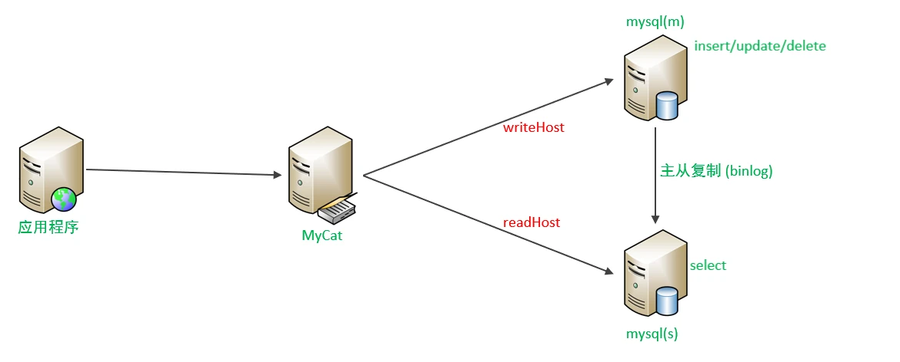

## 4.2 一主一从

### 4.2.1 原理

MySQL的主从复制，是基于二进制日志（binlog）实现的。

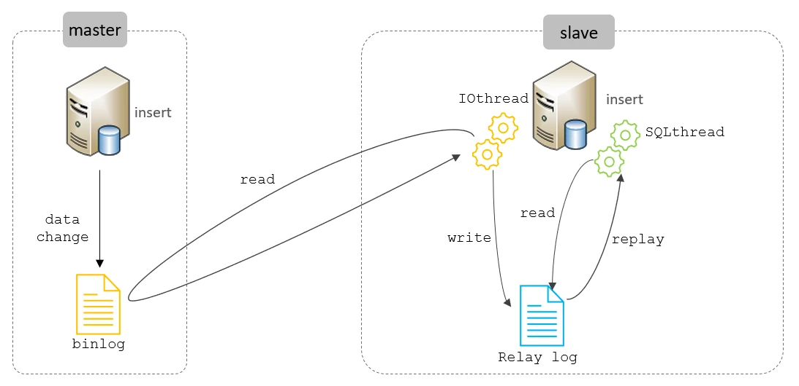

### 4.2.2 准备

| 主机 | 角色 | 用户名 | 密码 |
| --- | --- | --- | --- |
| 192.168.200.211 | master | root | 1234 |
| 192.168.200.212 | slave | root | 1234 |

备注：主从复制的搭建，可以参考前面课程中 **主从复制** 章节讲解的步骤操作。

## 4.3 一主一从读写分离

MyCat控制后台数据库的读写分离和负载均衡由schema.xml文件datahost标签的balance属性控制。

### 4.3.1 schema.xml配置

```
<!-- 配置逻辑库 -->
<schema name="ITCAST_RW" checkSQLschema="true" sqlMaxLimit="100" dataNode="dn7"></schema>

<dataNode name="dn7" dataHost="dhost7" database="itcast" />

<dataHost name="dhost7" maxCon="1000" minCon="10" balance="1" writeType="0"dbType="mysql" dbDriver="jdbc" switchType="1"  slaveThreshold="100">
    <heartbeat>select user()</heartbeat>

    <writeHost host="master1" url="jdbc:mysql://192.168.200.211:3306?
useSSL=false&amp;serverTimezone=Asia/Shanghai&amp;characterEncoding=utf8"
user="root" password="1234" >
        <readHost host="slave1" url="jdbc:mysql://192.168.200.212:3306?
useSSL=false&amp;serverTimezone=Asia/Shanghai&amp;characterEncoding=utf8"
user="root" password="1234" />
    </writeHost>
</dataHost>
```

上述配置的具体关联对应情况如下：

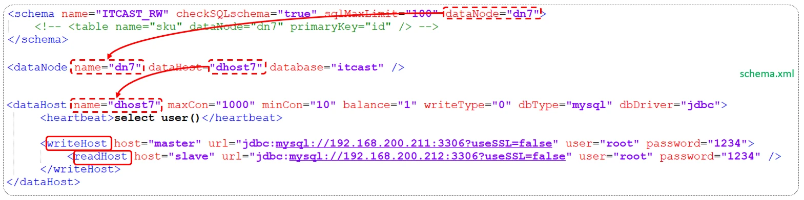

writeHost代表的是写操作对应的数据库，readHost代表的是读操作对应的数据库。 所以我们要想实现读写分离，就得配置writeHost关联的是主库，readHost关联的是从库。

而仅仅配置好了writeHost以及readHost还不能完成读写分离，还需要配置一个非常重要的负责均衡的参数 balance，取值有4种，具体含义如下：

| 参数值 | 含义 |
| --- | --- |
| 0 | 不开启读写分离机制 , 所有读操作都发送到当前可用的writeHost上 |
| 1 | 全部的readHost 与 备用的writeHost 都参与select 语句的负载均衡（主要针对于双主双从模式） |
| 2 | 所有的读写操作都随机在writeHost , readHost上分发 |
| 3 | 所有的读请求随机分发到writeHost对应的readHost上执行, writeHost不负担读压力 |

所以，在一主一从模式的读写分离中，balance配置1或3都是可以完成读写分离的。

### 4.3.2 server.xml配置

配置root用户可以访问SHOPPING、ITCAST 以及 ITCAST_RW逻辑库。

```
<user name="root" defaultAccount="true">
    <property name="password">123456</property>
    <property name="schemas">SHOPPING,ITCAST,ITCAST_RW</property>

    <!-- 表级 DML 权限设置 -->
    <!--
    <privileges check="true">
        <schema name="DB01" dml="0110" >
            <table name="TB_ORDER" dml="1110"></table>
        </schema>
    </privileges>
    -->
</user>
```

### 4.3.3 测试

配置完毕MyCat后，重新启动MyCat。

```
bin/mycat stop
bin/mycat start
```

然后观察，在执行增删改操作时，对应的主库及从库的数据变化。 在执行查询操作时，检查主库及从库对应的数据变化。

在测试中，我们可以发现当主节点Master宕机之后，业务系统就只能够读，而不能写入数据了。

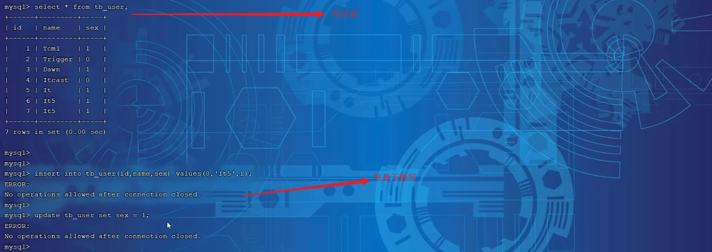

那如何解决这个问题呢？这个时候我们就得通过另外一种主从复制结构来解决了，也就是我们接下来讲解的双主双从。

## 4.4 双主双从

### 4.4.1 介绍

一个主机 Master1 用于处理所有写请求，它的从机 Slave1 和另一台主机 Master2 还有它的从机 Slave2 负责所有读请求。当 Master1 主机宕机后，Master2 主机负责写请求，Master1 、Master2 互为备机。架构图如下:

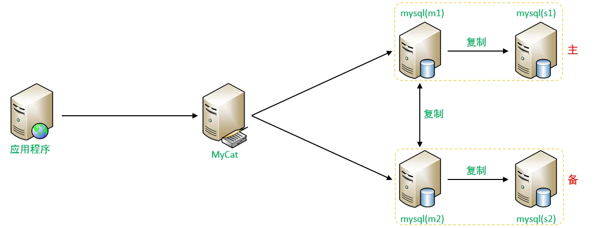

### 4.4.2 准备

我们需要准备5台服务器，具体的服务器及软件安装情况如下：

| 编号 | IP | 预装软件 | 角色 |
| --- | --- | --- | --- |
| 1 | 192.168.200.210 | MyCat、MySQL | MyCat中间件服务器 |
| 2 | 192.168.200.211 | MySQL | M1 |
| 3 | 192.168.200.212 | MySQL | S1 |
| 4 | 192.168.200.213 | MySQL | M2 |
| 5 | 192.168.200.214 | MySQL | S2 |

关闭以上所有服务器的防火墙：

  - systemctl stop firewalld
  - systemctl disable firewalld

### 4.4.3 搭建

#### 4.4.3.1 主库配置

**1). Master1(192.168.200.211)**

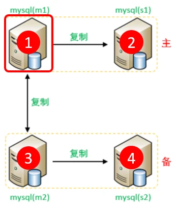

A. 修改配置文件 /etc/my.cnf

```
#mysql 服务ID，保证整个集群环境中唯一，取值范围：1 – 2^32-1，默认为1
server-id=1
#指定同步的数据库
binlog-do-db=db01
binlog-do-db=db02
binlog-do-db=db03
# 在作为从数据库的时候，有写入操作也要更新二进制日志文件
log-slave-updates
```

B. 重启MySQL服务器

```
systemctl  restart  mysqld
```

C. 创建账户并授权

```
#创建itcast用户，并设置密码，该用户可在任意主机连接该MySQL服务
CREATE  USER  'itcast'@'%' IDENTIFIED WITH mysql_native_password BY 'Root@123456';
#为 'itcast'@'%' 用户分配主从复制权限
GRANT  REPLICATION  SLAVE  ON  *.*  TO  'itcast'@'%';
```

通过指令，查看两台主库的二进制日志坐标

```sql
show  master  status ;
```

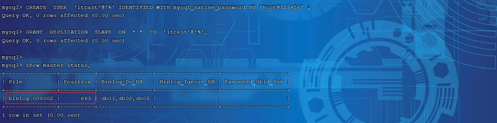

**2). Master2(192.168.200.213)**

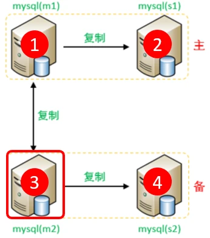

A. 修改配置文件 /etc/my.cnf

```
#mysql 服务ID，保证整个集群环境中唯一，取值范围：1 – 2^32-1，默认为1
server-id=3
#指定同步的数据库
binlog-do-db=db01
binlog-do-db=db02
binlog-do-db=db03
# 在作为从数据库的时候，有写入操作也要更新二进制日志文件
log-slave-updates
```

B. 重启MySQL服务器

```
systemctl  restart  mysqld
```

C. 创建账户并授权

```
#创建itcast用户，并设置密码，该用户可在任意主机连接该MySQL服务
CREATE  USER  'itcast'@'%' IDENTIFIED WITH mysql_native_password BY 'Root@123456';
#为 'itcast'@'%' 用户分配主从复制权限
GRANT  REPLICATION  SLAVE  ON  *.*  TO  'itcast'@'%';
```

通过指令，查看两台主库的二进制日志坐标

```sql
show  master  status ;
```

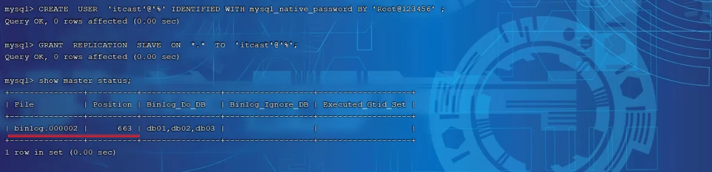

#### 4.4.3.2 从库配置

**1). Slave1(192.168.200.212)**

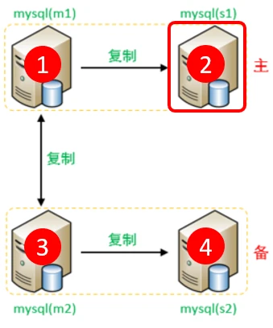

A. 修改配置文件 /etc/my.cnf

```
#mysql 服务ID，保证整个集群环境中唯一，取值范围：1 – 232-1，默认为1
server-id=2
```

B. 重新启动MySQL服务器

```
systemctl  restart  mysqld
```

**2). Slave2(192.168.200.214)**

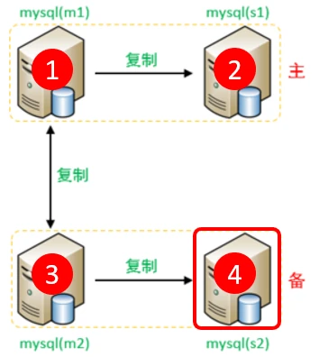

A. 修改配置文件 /etc/my.cnf

```
#mysql 服务ID，保证整个集群环境中唯一，取值范围：1 – 232-1，默认为1
server-id=4
```

B. 重新启动MySQL服务器

```
systemctl  restart  mysqld
```

#### 4.4.3.3 从库关联主库

**1). 两台从库配置关联的主库**

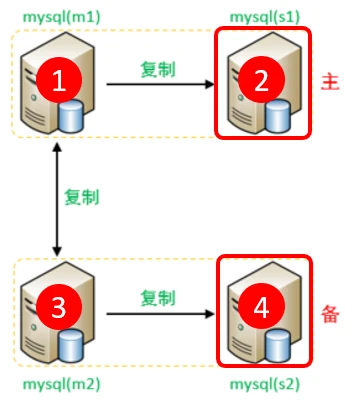

需要注意slave1对应的是master1，slave2对应的是master2。

A. 在 slave1(192.168.200.212)上执行

```
CHANGE MASTER TO MASTER_HOST='192.168.200.211', MASTER_USER='itcast',
MASTER_PASSWORD='Root@123456', MASTER_LOG_FILE='binlog.000002',
MASTER_LOG_POS=663;
```

B. 在 slave2(192.168.200.214)上执行

```
CHANGE MASTER TO MASTER_HOST='192.168.200.213', MASTER_USER='itcast',
MASTER_PASSWORD='Root@123456', MASTER_LOG_FILE='binlog.000002',
MASTER_LOG_POS=663;
```

C. 启动两台从库主从复制，查看从库状态

```sql
start slave;
show  slave  status \G;
```

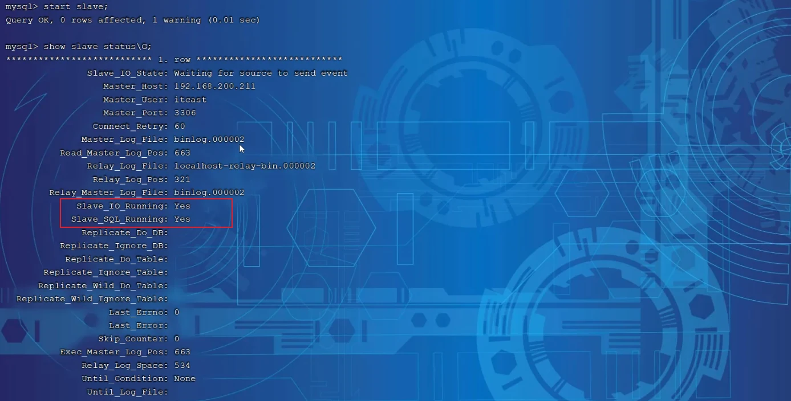

**2). 两台主库相互复制**

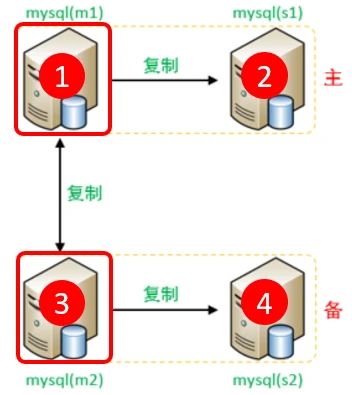

```
Master2 复制 Master1，Master1 复制 Master2。
```

A. 在 Master1(192.168.200.211)上执行

```
CHANGE MASTER TO MASTER_HOST='192.168.200.213', MASTER_USER='itcast',
MASTER_PASSWORD='Root@123456', MASTER_LOG_FILE='binlog.000002',
MASTER_LOG_POS=663;
```

B. 在 Master2(192.168.200.213)上执行

```
CHANGE MASTER TO MASTER_HOST='192.168.200.211', MASTER_USER='itcast',
MASTER_PASSWORD='Root@123456', MASTER_LOG_FILE='binlog.000002',
MASTER_LOG_POS=663;
```

C. 启动两台从库主从复制，查看从库状态

```sql
start slave;
show  slave  status \G;
```

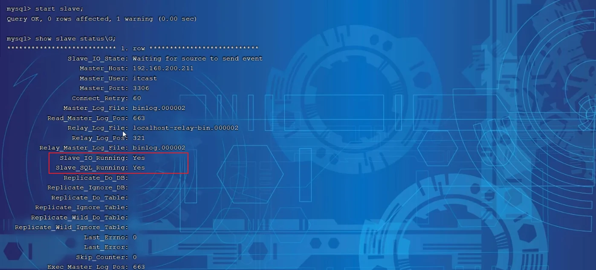

经过上述的三步配置之后，双主双从的复制结构就已经搭建完成了。 接下来，我们可以来测试验证一下。

### 4.4.4 测试

分别在两台主库Master1、Master2上执行DDL、DML语句，查看涉及到的数据库服务器的数据同步情况。

```sql
create database db01;
use db01;
create table tb_user(
    id int(11) not null primary key  ,
    name varchar(50) not null,
    sex varchar(1)
)engine=innodb default charset=utf8mb4;

insert into tb_user(id,name,sex) values(1,'Tom','1');
```

```sql
insert into tb_user(id,name,sex) values(2,'Trigger','0');
insert into tb_user(id,name,sex) values(3,'Dawn','1');
insert into tb_user(id,name,sex) values(4,'Jack Ma','1');
insert into tb_user(id,name,sex) values(5,'Coco','0');
insert into tb_user(id,name,sex) values(6,'Jerry','1');
```

- 在Master1中执行DML、DDL操作，看看数据是否可以同步到另外的三台数据库中。
- 在Master2中执行DML、DDL操作，看看数据是否可以同步到另外的三台数据库中。

完成了上述双主双从的结构搭建之后，接下来，我们再来看看如何完成这种双主双从的读写分离。

## 4.5 双主双从读写分离

### 4.5.1 配置

MyCat控制后台数据库的读写分离和负载均衡由schema.xml文件datahost标签的balance属性控制，通过writeType及switchType来完成失败自动切换的。

1). schema.xml

配置逻辑库：

```
<schema name="ITCAST_RW2" checkSQLschema="true" sqlMaxLimit="100" dataNode="dn7"></schema>
```

配置数据节点：

```
<dataNode name="dn7" dataHost="dhost7" database="db01" />
```

配置节点主机：

```
<dataHost name="dhost7" maxCon="1000" minCon="10" balance="1" writeType="0"dbType="mysql" dbDriver="jdbc" switchType="1"  slaveThreshold="100">
    <heartbeat>select user()</heartbeat>

    <writeHost host="master1" url="jdbc:mysql://192.168.200.211:3306?
useSSL=false&amp;serverTimezone=Asia/Shanghai&amp;characterEncoding=utf8"
user="root" password="1234" >
       <readHost host="slave1" url="jdbc:mysql://192.168.200.212:3306?
useSSL=false&amp;serverTimezone=Asia/Shanghai&amp;characterEncoding=utf8"
user="root" password="1234" />
    </writeHost>

    <writeHost host="master2" url="jdbc:mysql://192.168.200.213:3306?
useSSL=false&amp;serverTimezone=Asia/Shanghai&amp;characterEncoding=utf8"
user="root" password="1234" >
       <readHost host="slave2" url="jdbc:mysql://192.168.200.214:3306?
useSSL=false&amp;serverTimezone=Asia/Shanghai&amp;characterEncoding=utf8"
user="root" password="1234" />
    </writeHost>
</dataHost>
```

具体的对应情况如下：

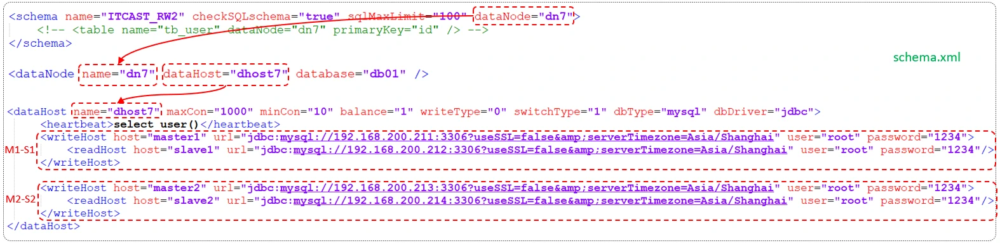

属性说明：

balance="1"

  - 代表全部的 readHost 与 stand by writeHost 参与 select 语句的负载均衡，简

单的说，当双主双从模式(M1->S1，M2->S2，并且 M1 与 M2 互为主备)，正常情况下，M2,S1,S2 都参与 select 语句的负载均衡 ;

writeType

  - 0 : 写操作都转发到第1台writeHost, writeHost1挂了, 会切换到writeHost2上;
  - 1 : 所有的写操作都随机地发送到配置的writeHost上 ;

switchType

  - -1 : 不自动切换
  - 1 : 自动切换

2). user.xml

配置root用户也可以访问到逻辑库 ITCAST_RW2。

```
<user name="root" defaultAccount="true">
    <property name="password">123456</property>
    <property name="schemas">SHOPPING,ITCAST,ITCAST_RW2</property>

    <!-- 表级 DML 权限设置 -->
    <!--
    <privileges check="true">
        <schema name="DB01" dml="0110" >
            <table name="TB_ORDER" dml="1110"></table>
        </schema>
    </privileges>
    -->
</user>
```

### 4.5.2 测试

登录MyCat，测试查询及更新操作，判定是否能够进行读写分离，以及读写分离的策略是否正确。

当主库挂掉一个之后，是否能够自动切换。
