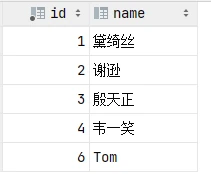
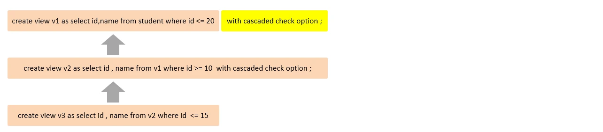
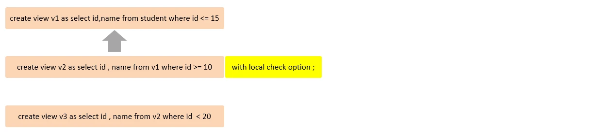
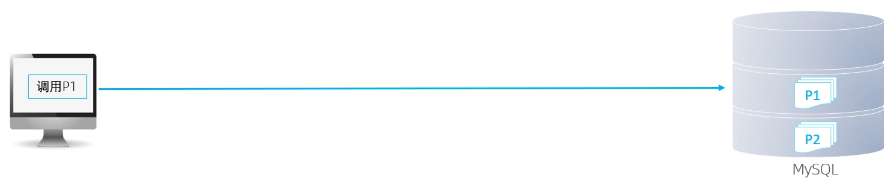
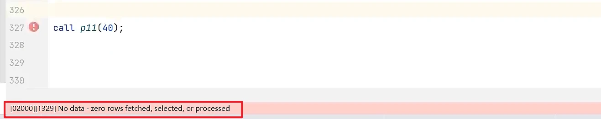
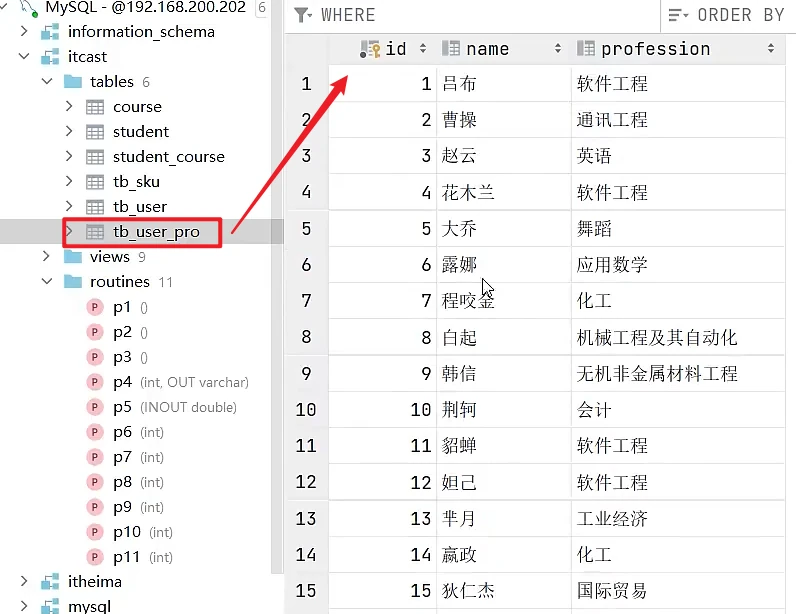
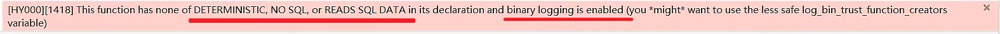

# MySQL-进阶篇 · 4. 视图/存储过程/触发器

## 4.1 视图

### 4.1.1 介绍

视图（View）是一种虚拟存在的表。视图中的数据并不在数据库中实际存在，行和列数据来自定义视图的查询中使用的表，并且是在使用视图时动态生成的。

通俗的讲，视图只保存了查询的SQL逻辑，不保存查询结果。所以我们在创建视图的时候，主要的工作就落在创建这条SQL查询语句上。

### 4.1.2 语法

1). 创建

```sql
CREATE   [OR REPLACE]   VIEW  视图名称[(列名列表)]   AS   SELECT语句   [ WITH [
CASCADED  |  LOCAL ]  CHECK  OPTION ]
```

2). 查询

```
查看创建视图语句：SHOW  CREATE  VIEW  视图名称;
查看视图数据：SELECT  *  FROM   视图名称 ...... ;
```

3). 修改

```
方式一：CREATE   [OR REPLACE]   VIEW  视图名称[(列名列表)]   AS   SELECT语句   [ WITH[ CASCADED  |  LOCAL ]  CHECK  OPTION ]
方式二：ALTER   VIEW  视图名称[(列名列表)]   AS   SELECT语句   [ WITH [ CASCADED  |LOCAL ]  CHECK  OPTION ]
```

4). 删除

```sql
DROP  VIEW  [IF EXISTS]   视图名称   [,视图名称]  ...
```

演示示例：

```
-- 创建视图
create or replace view stu_v_1 as select id,name from student where id <= 10;
-- 查询视图
show create view stu_v_1;

select * from stu_v_1;
select * from stu_v_1 where id < 3;

-- 修改视图
create or replace view stu_v_1 as select id,name,no from student where id <= 10;
alter view stu_v_1 as select id,name from student where id <= 10;

-- 删除视图
drop view if exists stu_v_1;
```

上述我们演示了，视图应该如何创建、查询、修改、删除，那么我们能不能通过视图来插入、更新数据呢？ 接下来，做一个测试。

```sql
create or replace view stu_v_1 as select id,name from student where id <= 10 ;
select * from stu_v_1;

insert into stu_v_1 values(6,'Tom');

insert into stu_v_1 values(17,'Tom22');
```

执行上述的SQL，我们会发现，id为6和17的数据都是可以成功插入的。 但是我们执行查询，查询出来的数据，却没有id为17的记录。



因为我们在创建视图的时候，指定的条件为 id<=10, id为17的数据，是不符合条件的，所以没有查询出来，但是这条数据确实是已经成功的插入到了基表中。

如果我们定义视图时，如果指定了条件，然后我们在插入、修改、删除数据时，是否可以做到必须满足条件才能操作，否则不能够操作呢？ 答案是可以的，这就需要借助于视图的检查选项了。

### 4.1.3 检查选项

当使用WITH CHECK OPTION子句创建视图时，MySQL会通过视图检查正在更改的每个行，例如 插入，更新，删除，以使其符合视图的定义。 MySQL允许基于另一个视图创建视图，它还会检查依赖视图中的规则以保持一致性。为了确定检查的范围，mysql提供了两个选项： CASCADED 和 LOCAL ，默认值为 CASCADED 。

1). CASCADED

级联。

比如，v2视图是基于v1视图的，如果在v2视图创建的时候指定了检查选项为 cascaded，但是v1视图创建时未指定检查选项。 则在执行检查时，不仅会检查v2，还会级联检查v2的关联视图v1。



2). LOCAL

本地。

比如，v2视图是基于v1视图的，如果在v2视图创建的时候指定了检查选项为 local ，但是v1视图创建时未指定检查选项。 则在执行检查时，知会检查v2，不会检查v2的关联视图v1。



### 4.1.4 视图的更新

要使视图可更新，视图中的行与基础表中的行之间必须存在一对一的关系。如果视图包含以下任何一项，则该视图不可更新：

A. 聚合函数或窗口函数（SUM()、 MIN()、 MAX()、 COUNT()等）

B. DISTINCT

C. GROUP BY

D. HAVING

E. UNION 或者 UNION ALL

示例演示:

```sql
create view stu_v_count as select count(*) from student;
```

上述的视图中，就只有一个单行单列的数据，如果我们对这个视图进行更新或插入的，将会报错。

```sql
insert into stu_v_count values(10);
```


### 4.1.5 视图作用

1). 简单

视图不仅可以简化用户对数据的理解，也可以简化他们的操作。那些被经常使用的查询可以被定义为视图，从而使得用户不必为以后的操作每次指定全部的条件。

2). 安全

数据库可以授权，但不能授权到数据库特定行和特定的列上。通过视图用户只能查询和修改他们所能见到的数据

3). 数据独立

视图可帮助用户屏蔽真实表结构变化带来的影响。

### 4.1.6 案例

1). 为了保证数据库表的安全性，开发人员在操作tb_user表时，只能看到的用户的基本字段，屏蔽手机号和邮箱两个字段。

```sql
create view tb_user_view as select id,name,profession,age,gender,status,createtime from tb_user;

select * from tb_user_view;
```

2). 查询每个学生所选修的课程（三张表联查），这个功能在很多的业务中都有使用到，为了简化操作，定义一个视图。

```sql
create view tb_stu_course_view as select s.name student_name , s.no student_no ,c.name course_name from student s, student_course sc , course c where s.id =
sc.studentid and sc.courseid = c.id;

select * from tb_stu_course_view;
```

## 4.2 存储过程

### 4.2.1 介绍

存储过程是事先经过编译并存储在数据库中的一段 SQL 语句的集合，调用存储过程可以简化应用开发人员的很多工作，减少数据在数据库和应用服务器之间的传输，对于提高数据处理的效率是有好处的。存储过程思想上很简单，就是数据库 SQL 语言层面的代码封装与重用。



特点:

- 封装，复用 -----------------------> 可以把某一业务SQL封装在存储过程中，需要用到的时候直接调用即可。
- 可以接收参数，也可以返回数据 --------> 再存储过程中，可以传递参数，也可以接收返回值。
- 减少网络交互，效率提升 -------------> 如果涉及到多条SQL，每执行一次都是一次网络传输。 而如果封装在存储过程中，我们只需要网络交互一次可能就可以了。

### 4.2.2 基本语法

1). 创建

```sql
CREATE  PROCEDURE   存储过程名称 ([ 参数列表 ])
BEGIN
    -- SQL语句
END ;
```

2). 调用

```
CALL  名称  ([ 参数 ]);
```

3). 查看

```sql
SELECT * FROM INFORMATION_SCHEMA.ROUTINES WHERE ROUTINE_SCHEMA = 'xxx';  -- 查询指定数据库的存储过程及状态信息
SHOW  CREATE  PROCEDURE   存储过程名称 ;  -- 查询某个存储过程的定义
```

4). 删除

```sql
DROP  PROCEDURE   [ IF EXISTS ]  存储过程名称 ；
```

注意:

  - 在命令行中，执行创建存储过程的SQL时，需要通过关键字 delimiter 指定SQL语句的

结束符。

演示示例:

```
-- 存储过程基本语法
-- 创建
create procedure p1()
begin
    select count(*) from student;
end;

-- 调用
call p1();

-- 查看
select * from information_schema.ROUTINES where ROUTINE_SCHEMA = 'itcast';

show create procedure p1;

-- 删除
drop procedure if exists p1;
```

### 4.2.3 变量

在MySQL中变量分为三种类型: 系统变量、用户定义变量、局部变量。

#### 4.2.3.1 系统变量

系统变量 是MySQL服务器提供，不是用户定义的，属于服务器层面。分为全局变量（GLOBAL）、会话变量（SESSION）。

1). 查看系统变量

```sql
SHOW  [ SESSION | GLOBAL ]   VARIABLES ;                    -- 查看所有系统变量
SHOW  [ SESSION | GLOBAL ]   VARIABLES  LIKE  '......';     -- 可以通过LIKE模糊匹配方式查找变量
SELECT  @@[SESSION | GLOBAL]  系统变量名;                    --  查看指定变量的值
```

2). 设置系统变量

```sql
SET  [ SESSION | GLOBAL ]   系统变量名 = 值 ;
SET  @@[SESSION | GLOBAL]系统变量名 = 值 ;
```

注意:

  - 如果没有指定SESSION/GLOBAL，默认是SESSION，会话变量。

```
mysql服务重新启动之后，所设置的全局参数会失效，要想不失效，可以在 /etc/my.cnf 中配置。
```

  - A. 全局变量(GLOBAL): 全局变量针对于所有的会话。
  - B. 会话变量(SESSION):  会话变量针对于单个会话，在另外一个会话窗口就不生效了。

演示示例:

```
-- 查看系统变量
show session variables ;

show session variables like 'auto%';
show global variables like 'auto%';

select @@global.autocommit;
select @@session.autocommit;

-- 设置系统变量
set session autocommit = 1;

insert into course(id, name) VALUES (6, 'ES');

set global autocommit  = 0;

select @@global.autocommit;
```

#### 4.2.3.2 用户定义变量

用户定义变量 是用户根据需要自己定义的变量，用户变量不用提前声明，在用的时候直接用 "@变量名" 使用就可以。其作用域为当前连接。

1). 赋值

方式一:

```sql
SET   @var_name = expr  [, @var_name = expr] ... ;
SET   @var_name := expr  [, @var_name := expr] ... ;
```

赋值时，可以使用 = ，也可以使用 := 。

方式二:

```sql
SELECT   @var_name := expr  [, @var_name := expr] ... ;
SELECT  字段名  INTO @var_name  FROM  表名;
```

2). 使用

```sql
SELECT   @var_name ;
```

注意: 用户定义的变量无需对其进行声明或初始化，只不过获取到的值为NULL。

演示示例:

```
-- 赋值
set @myname = 'itcast';
set @myage := 10;
set @mygender := '男',@myhobby := 'java';

select @mycolor := 'red';
select count(*) into @mycount from tb_user;

-- 使用
select @myname,@myage,@mygender,@myhobby;

select @mycolor , @mycount;
```

```sql
select @abc;
```

#### 4.2.3.3 局部变量

局部变量 是根据需要定义的在局部生效的变量，访问之前，需要DECLARE声明。可用作存储过程内的局部变量和输入参数，局部变量的范围是在其内声明的BEGIN ... END块。

1). 声明

```
DECLARE 变量名 变量类型 [DEFAULT ... ] ;
```

变量类型就是数据库字段类型：INT、BIGINT、CHAR、VARCHAR、DATE、TIME等。

2). 赋值

```sql
SET  变量名 = 值 ;
SET  变量名 := 值 ;
SELECT  字段名  INTO  变量名  FROM  表名 ... ;
```

演示示例:

```
-- 声明局部变量 - declare
-- 赋值
create procedure p2()
begin
    declare stu_count int default 0;
    select count(*) into stu_count from student;
    select stu_count;
end;

call p2();
```

### 4.2.4 if

1). 介绍

if 用于做条件判断，具体的语法结构为：

```
IF  条件1  THEN
    .....
ELSEIF  条件2  THEN       -- 可选
    .....
ELSE                     -- 可选
    .....
END  IF;
```

在if条件判断的结构中，ELSE IF 结构可以有多个，也可以没有。 ELSE结构可以有，也可以没有。2). 案例

根据定义的分数score变量，判定当前分数对应的分数等级。

- score >= 85分，等级为优秀。
- score >= 60分 且 score < 85分，等级为及格。
- score < 60分，等级为不及格。

```sql
create procedure p3()
begin
    declare score int default 58;
    declare result varchar(10);

    if score >= 85 then
        set result := '优秀';
    elseif score >= 60 then
        set result := '及格';
    else
        set result := '不及格';
    end if;
    select result;
end;

call p3();
```

上述的需求我们虽然已经实现了，但是也存在一些问题，比如：score 分数我们是在存储过程中定义死的，而且最终计算出来的分数等级，我们也仅仅是最终查询展示出来而已。

那么我们能不能，把score分数动态的传递进来，计算出来的分数等级是否可以作为返回值返回呢？ 答案是肯定的，我们可以通过接下来所讲解的 参数 来解决上述的问题。

### 4.2.5 参数

1). 介绍

参数的类型，主要分为以下三种：IN、OUT、INOUT。 具体的含义如下：

| 类型 | 含义 | 备注 |
| --- | --- | --- |
| IN | 该类参数作为输入，也就是需要调用时传入值 | 默认 |
| OUT | 该类参数作为输出，也就是该参数可以作为返回值 |  |
| INOUT | 既可以作为输入参数，也可以作为输出参数 |  |

用法：

```sql
CREATE  PROCEDURE   存储过程名称 ([ IN/OUT/INOUT  参数名  参数类型 ])
BEGIN
    -- SQL语句
END ;
```

2). 案例一

根据传入参数score，判定当前分数对应的分数等级，并返回。

- score >= 85分，等级为优秀。
- score >= 60分 且 score < 85分，等级为及格。
- score < 60分，等级为不及格。

```sql
create procedure p4(in score int, out result varchar(10))
begin
    if score >= 85 then
        set result := '优秀';
    elseif score >= 60 then
```

```sql
        set result := '及格';
    else
        set result := '不及格';
    end if;
end;

-- 定义用户变量 @result来接收返回的数据, 用户变量可以不用声明
call p4(18, @result);

select @result;
```

3). 案例二

将**传入**的200分制的分数，进行换算，换算成百分制，然后**返回**。

```sql
create procedure p5(inout score double)
begin
    set score := score * 0.5;
end;

set @score = 198;
call p5(@score);

select @score;
```

### 4.2.6 case

1). 介绍

case结构及作用，和我们在基础篇中所讲解的流程控制函数很类似。有两种语法格式：

语法1：

```
-- 含义： 当case_value的值为 when_value1时，执行statement_list1，当值为 when_value2时，执行statement_list2， 否则就执行 statement_list
CASE  case_value
    WHEN  when_value1  THEN  statement_list1
   [ WHEN  when_value2  THEN  statement_list2] ...
   [ ELSE  statement_list ]
END  CASE;
```

语法2：

```
-- 含义： 当条件search_condition1成立时，执行statement_list1，当条件search_condition2成立时，执行statement_list2， 否则就执行 statement_list
CASE
  WHEN  search_condition1  THEN  statement_list1
  [WHEN  search_condition2  THEN  statement_list2] ...
  [ELSE  statement_list]
END CASE;
```

2). 案例

根据传入的月份，判定月份所属的季节（要求采用case结构）。

- 1-3月份，为第一季度4-6月份，为第二季度7-9月份，为第三季度10-12月份，为第四季度

```sql
create procedure p6(in month int)
begin
    declare result varchar(10);
    case
        when month >= 1 and month <= 3 then
            set result := '第一季度';
        when month >= 4 and month <= 6 then
            set result := '第二季度';
        when month >= 7 and month <= 9 then
            set result := '第三季度';
```

```
        when month >= 10 and month <= 12 then
            set result := '第四季度';
        else
            set result := '非法参数';
    end case ;

    select concat('您输入的月份为: ',month, ', 所属的季度为: ',result);
end;

call  p6(16);
```

注意：如果判定条件有多个，多个条件之间，可以使用 and 或 or 进行连接。

### 4.2.7 while

1). 介绍

while 循环是有条件的循环控制语句。满足条件后，再执行循环体中的SQL语句。具体语法为：

```
-- 先判定条件，如果条件为true，则执行逻辑，否则，不执行逻辑
WHILE  条件  DO
    SQL逻辑...
END WHILE;
```

2). 案例

计算从1累加到n的值，n为传入的参数值。

```
-- A. 定义局部变量, 记录累加之后的值;
-- B. 每循环一次, 就会对n进行减1 , 如果n减到0, 则退出循环

create procedure p7(in n int)
begin
    declare total int default 0;

    while n>0 do
```

```sql
         set total := total + n;
         set n := n - 1;
    end while;

    select total;
end;

call p7(100);
```

### 4.2.8 repeat

1). 介绍

repeat是有条件的循环控制语句, 当满足until声明的条件的时候，则退出循环 。具体语法为：

```
-- 先执行一次逻辑，然后判定UNTIL条件是否满足，如果满足，则退出。如果不满足，则继续下一次循环REPEAT
    SQL逻辑...
    UNTIL  条件
END REPEAT;
```

2). 案例

计算从1累加到n的值，n为传入的参数值。(使用repeat实现)

```
-- A. 定义局部变量, 记录累加之后的值;
-- B. 每循环一次, 就会对n进行-1 , 如果n减到0, 则退出循环
create procedure p8(in n int)
begin
    declare total int default 0;

    repeat
        set total := total + n;
        set n := n - 1;
    until  n <= 0
    end repeat;

    select total;
```

```
end;

call p8(10);
call p8(100);
```

### 4.2.9 loop

1). 介绍

LOOP 实现简单的循环，如果不在SQL逻辑中增加退出循环的条件，可以用其来实现简单的死循环。LOOP可以配合一下两个语句使用：

- LEAVE ：配合循环使用，退出循环。
- ITERATE：必须用在循环中，作用是跳过当前循环剩下的语句，直接进入下一次循环。

```
[begin_label:]  LOOP
    SQL逻辑...
END  LOOP  [end_label];
```

```
LEAVE  label;   -- 退出指定标记的循环体
ITERATE  label; -- 直接进入下一次循环
```

上述语法中出现的 begin_label，end_label，label 指的都是我们所自定义的标记。

2). 案例一

计算从1累加到n的值，n为传入的参数值。

```
-- A. 定义局部变量, 记录累加之后的值;
-- B. 每循环一次, 就会对n进行-1 , 如果n减到0, 则退出循环 ----> leave xx

create procedure p9(in n int)
begin
    declare total int default 0;

    sum:loop
        if n<=0 then
            leave sum;
```

```
        end if;

        set total := total + n;
        set n := n - 1;
    end loop sum;

    select total;
end;

call p9(100);
```

3). 案例二

计算从1到n之间的偶数累加的值，n为传入的参数值。

```
-- A. 定义局部变量, 记录累加之后的值;
-- B. 每循环一次, 就会对n进行-1 , 如果n减到0, 则退出循环 ----> leave xx
-- C. 如果当次累加的数据是奇数, 则直接进入下一次循环. --------> iterate xx

create procedure p10(in n int)
begin
    declare total int default 0;

    sum:loop
        if n<=0 then
            leave sum;
        end if;

        if n%2 = 1 then
            set n := n - 1;
            iterate sum;
        end if;

        set total := total + n;
        set n := n - 1;
    end loop sum;
```

```sql
    select total;
end;

call p10(100);
```

### 4.2.10 游标

1). 介绍

游标（CURSOR）是用来存储查询结果集的数据类型 , 在存储过程和函数中可以使用游标对结果集进行循环的处理。游标的使用包括游标的声明、OPEN、FETCH 和 CLOSE，其语法分别如下。

A. 声明游标

```
DECLARE   游标名称  CURSOR  FOR  查询语句 ;
```

B. 打开游标

```
OPEN   游标名称 ;
```

C. 获取游标记录

```
FETCH  游标名称  INTO  变量 [, 变量  ] ;
```

D. 关闭游标

```
CLOSE   游标名称 ;
```

2). 案例

根据传入的参数uage，来查询用户表tb_user中，所有的用户年龄小于等于uage的用户姓名（name）和专业（profession），并将用户的姓名和专业插入到所创建的一张新表(id,name,profession)中。

```
-- 逻辑:
-- A. 声明游标, 存储查询结果集
-- B. 准备: 创建表结构
-- C. 开启游标
-- D. 获取游标中的记录
-- E. 插入数据到新表中
```

```
-- F. 关闭游标

create procedure p11(in uage int)
begin
    declare uname varchar(100);
    declare upro varchar(100);
    declare u_cursor cursor for select name,profession from tb_user where age <=uage;

    drop table if exists tb_user_pro;
    create table if not exists tb_user_pro(
        id int primary key auto_increment,
        name varchar(100),
        profession varchar(100)
    );

    open u_cursor;
    while true do
        fetch u_cursor into uname,upro;
        insert into tb_user_pro values (null, uname, upro);
    end while;
    close u_cursor;

end;

call p11(30);
```

上述的存储过程，最终我们在调用的过程中，会报错，之所以报错是因为上面的while循环中，并没有退出条件。当游标的数据集获取完毕之后，再次获取数据，就会报错，从而终止了程序的执行。



但是此时，tb_user_pro表结构及其数据都已经插入成功了，我们可以直接刷新表结构，检查表结构中的数据。



上述的功能，虽然我们实现了，但是逻辑并不完善，而且程序执行完毕，获取不到数据，数据库还报错。 接下来，我们就需要来完成这个存储过程，并且解决这个问题。

要想解决这个问题，就需要通过MySQL中提供的 条件处理程序 Handler 来解决。

### 4.2.11 条件处理程序

1). 介绍

条件处理程序（Handler）可以用来定义在流程控制结构执行过程中遇到问题时相应的处理步骤。具体语法为：

```
DECLARE   handler_action   HANDLER FOR    condition_value  [, condition_value]...   statement ;

handler_action 的取值：
    CONTINUE: 继续执行当前程序
    EXIT: 终止执行当前程序

condition_value 的取值：
    SQLSTATE  sqlstate_value: 状态码，如 02000

    SQLWARNING: 所有以01开头的SQLSTATE代码的简写
    NOT FOUND: 所有以02开头的SQLSTATE代码的简写
    SQLEXCEPTION: 所有没有被SQLWARNING 或 NOT FOUND捕获的SQLSTATE代码的简写
```

2). 案例

我们继续来完成在上一小节提出的这个需求，并解决其中的问题。

根据传入的参数uage，来查询用户表tb_user中，所有的用户年龄小于等于uage的用户姓名（name）和专业（profession），并将用户的姓名和专业插入到所创建的一张新表(id,name,profession)中。

A. 通过SQLSTATE指定具体的状态码

```
-- 逻辑:
-- A. 声明游标, 存储查询结果集
-- B. 准备: 创建表结构
-- C. 开启游标
-- D. 获取游标中的记录
-- E. 插入数据到新表中
-- F. 关闭游标

create procedure p11(in uage int)
begin
    declare uname varchar(100);
    declare upro varchar(100);
    declare u_cursor cursor for select name,profession from tb_user where age <=uage;
```

```
    -- 声明条件处理程序 ： 当SQL语句执行抛出的状态码为02000时，将关闭游标u_cursor，并退出declare exit handler for SQLSTATE '02000' close u_cursor;

    drop table if exists tb_user_pro;
    create table if not exists tb_user_pro(
        id int primary key auto_increment,
        name varchar(100),
        profession varchar(100)
    );

    open u_cursor;
    while true do
        fetch u_cursor into uname,upro;
        insert into tb_user_pro values (null, uname, upro);
    end while;
    close u_cursor;

end;

call p11(30);
```

B. 通过SQLSTATE的代码简写方式 NOT FOUND

02 开头的状态码，代码简写为 NOT FOUND

```sql
create procedure p12(in uage int)
begin
    declare uname varchar(100);
    declare upro varchar(100);
    declare u_cursor cursor for select name,profession from tb_user where age <=uage;
     -- 声明条件处理程序 ： 当SQL语句执行抛出的状态码为02开头时，将关闭游标u_cursor，并退出declare exit handler for not found close u_cursor;

    drop table if exists tb_user_pro;
    create table if not exists tb_user_pro(
        id int primary key auto_increment,
```

```
        name varchar(100),
        profession varchar(100)
    );

    open u_cursor;
    while true do
        fetch u_cursor into uname,upro;
        insert into tb_user_pro values (null, uname, upro);
    end while;
    close u_cursor;

end;

call p12(30);
```

具体的错误状态码，可以参考官方文档：

**https://dev.mysql.com/doc/refman/8.0/en/declare-handler.html**

**https://dev.mysql.com/doc/mysql-errors/8.0/en/server-error-reference.html**

## 4.3 存储函数

1). 介绍

存储函数是有返回值的存储过程，存储函数的参数只能是IN类型的。具体语法如下：

```sql
CREATE  FUNCTION   存储函数名称 ([ 参数列表 ])
RETURNS  type  [characteristic ...]
BEGIN
    -- SQL语句
    RETURN ...;
END ;
```

characteristic说明：

- DETERMINISTIC：相同的输入参数总是产生相同的结果
- NO SQL ：不包含 SQL 语句。
- READS SQL DATA：包含读取数据的语句，但不包含写入数据的语句。

2). 案例

计算从1累加到n的值，n为传入的参数值。

```sql
create function fun1(n int)
returns int deterministic
begin
    declare total int default 0;

    while n>0 do
        set total := total + n;
        set n := n - 1;
    end while;

    return total;
end;

select fun1(50);
```

在mysql8.0版本中binlog默认是开启的，一旦开启了，mysql就要求在定义存储过程时，需要指定characteristic特性，否则就会报如下错误：



## 4.4 触发器

### 4.4.1 介绍

触发器是与表有关的数据库对象，指在insert/update/delete之前(BEFORE)或之后(AFTER)，触发并执行触发器中定义的SQL语句集合。触发器的这种特性可以协助应用在数据库端确保数据的完整性 , 日志记录 , 数据校验等操作 。

使用别名OLD和NEW来引用触发器中发生变化的记录内容，这与其他的数据库是相似的。现在触发器还只支持行级触发，不支持语句级触发。

| 触发器类型 | NEW 和 OLD |
| --- | --- |
| INSERT 型触发器 | NEW 表示将要或者已经新增的数据 |
| UPDATE 型触发器 | OLD 表示修改之前的数据 , NEW 表示将要或已经修改后的数据 |
| DELETE 型触发器 | OLD 表示将要或者已经删除的数据 |

### 4.4.2 语法

1). 创建

```sql
CREATE  TRIGGER  trigger_name
BEFORE/AFTER  INSERT/UPDATE/DELETE
ON tbl_name   FOR EACH ROW  -- 行级触发器
BEGIN
    trigger_stmt ;
END;
```

2). 查看

```sql
SHOW  TRIGGERS ;
```

3). 删除

```sql
DROP  TRIGGER  [schema_name.]trigger_name ;  -- 如果没有指定 schema_name，默认为当前数据库 。
```

### 4.4.3 案例

通过触发器记录 tb_user 表的数据变更日志，将变更日志插入到日志表user_logs中, 包含增加, 修改 , 删除 ;

表结构准备:

```
-- 准备工作 : 日志表 user_logs
create table user_logs(
  id int(11) not null auto_increment,
  operation varchar(20) not null comment '操作类型, insert/update/delete',
  operate_time datetime not null comment '操作时间',
  operate_id int(11) not null comment '操作的ID',
  operate_params varchar(500) comment '操作参数',
  primary key(`id`)
)engine=innodb default charset=utf8;
```

A. 插入数据触发器

```sql
create trigger tb_user_insert_trigger
    after insert on tb_user for each row
begin
    insert into user_logs(id, operation, operate_time, operate_id, operate_params)VALUES
    (null, 'insert', now(), new.id, concat('插入的数据内容为:
id=',new.id,',name=',new.name, ', phone=', NEW.phone, ', email=', NEW.email, ',profession=', NEW.profession));
end;
```

测试:

```
-- 查看
show triggers ;

-- 插入数据到tb_user
insert into tb_user(id, name, phone, email, profession, age, gender, status,
createtime) VALUES (26,'三皇子','18809091212','erhuangzi@163.com','软件工
程',23,'1','1',now());
```

测试完毕之后，检查日志表中的数据是否可以正常插入，以及插入数据的正确性。

B. 修改数据触发器

```sql
create trigger tb_user_update_trigger
    after update on tb_user for each row
begin
    insert into user_logs(id, operation, operate_time, operate_id, operate_params)VALUES
    (null, 'update', now(), new.id,
        concat('更新之前的数据: id=',old.id,',name=',old.name, ', phone=',
old.phone, ', email=', old.email, ', profession=', old.profession,
            ' | 更新之后的数据: id=',new.id,',name=',new.name, ', phone=',
NEW.phone, ', email=', NEW.email, ', profession=', NEW.profession));
end;
```

测试:

```
-- 查看
show triggers ;

-- 更新
update tb_user set profession = '会计' where id = 23;
update tb_user set profession = '会计' where id <= 5;
```

测试完毕之后，检查日志表中的数据是否可以正常插入，以及插入数据的正确性。

C. 删除数据触发器

```sql
create trigger tb_user_delete_trigger
    after delete on tb_user for each row
begin
    insert into user_logs(id, operation, operate_time, operate_id, operate_params)VALUES
    (null, 'delete', now(), old.id,
        concat('删除之前的数据: id=',old.id,',name=',old.name, ', phone=',
old.phone, ', email=', old.email, ', profession=', old.profession));
end;
```

测试:

```
-- 查看
show triggers ;

-- 删除数据
delete from tb_user where id = 26;
```

测试完毕之后，检查日志表中的数据是否可以正常插入，以及插入数据的正确性。
