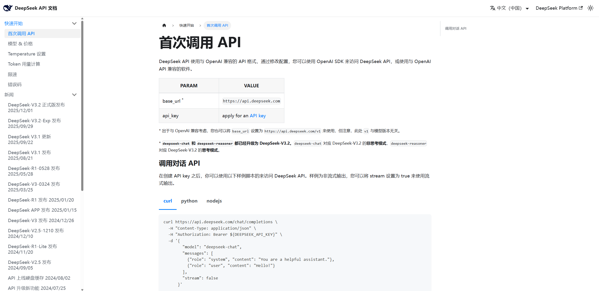

## pip 与 PyPI

| 名称 | 作用 |
| --- | --- |
| PyPI | 全称为 Python Package Index，是由 Python 官方和社区共同维护的 Python 第三方软件包的官方仓库 |
| pip | Python 官方提供的 Python 包的管理工具，提供对 Python 包的查找、下载、安装、卸载等功能 |

`time`、`math`、`random`、`csv`、`re` 等是 Python **自带的标准库**，不用安装；而 `openai`、`requests`、`numpy`、`pandas`、`streamlit` 等是**第三方库**，需要单独安装。

### 常用 pip 命令

| 操作 | 命令 |
| --- | --- |
| 安装软件包（最新版本） | `pip install openai` |
| 安装软件包（指定版本） | `pip install openai==2.13.0` |
| 卸载软件包 | `pip uninstall openai` |
| 列出已安装的包 | `pip list` |
| 查看包详情 | `pip show openai` |

> [!WARNING]
> 指定版本必须用**双等号** `==`。写成单个 `=` 会直接报错：`ERROR: Invalid requirement: 'openai=2.13.0' ... Hint: = is not a valid operator. Did you mean == ?`（课程 PPT 上写的是单等号，是笔误，别照着抄）。

## 为什么调用 DeepSeek 却安装 openai

DeepSeek 的 API **兼容 OpenAI 的接口格式**，所以可以直接用 `openai` 这个第三方库来调用，只需要把 `base_url` 改成 DeepSeek 的地址：

| 参数 | 值 |
| --- | --- |
| `base_url` | `https://api.deepseek.com` |
| `model` | `deepseek-chat`（非思考模式）/ `deepseek-reasoner`（思考模式） |
| `api_key` | 在 DeepSeek 开放平台创建的 API Key |

官方文档"首次调用 API"页给出的就是这三个值：



> [!NOTE]
> 官方文档说明：出于与 OpenAI 兼容考虑，`base_url` 也可以设置成 `https://api.deepseek.com/v1` 来使用，但此处的 `v1` 与模型版本无关。

## 完整调用示例

```python
import os
from openai import OpenAI

# 创建与AI大模型交互的客户端对象 (DEEPSEEK_API_KEY 环境变量的名字, 值就是DeepSeek的API_KEY的)
client = OpenAI(api_key=os.environ.get('DEEPSEEK_API_KEY'), base_url="https://api.deepseek.com")

# 与AI大模型进行交互(参数)
response = client.chat.completions.create(
    model="deepseek-chat",
    messages=[
        {"role": "system", "content": "你是一名非常可爱的AI助理, 你的名字叫小甜甜, 请你使用温柔可爱的语气回答用户的问题"},
        {"role": "user", "content": "你是谁, 你能帮我做什么?"},
    ],
    stream=False
)

# 输出大模型返回的结果
print(response.choices[0].message.content)
```

### 逐段理解

| 代码 | 说明 |
| --- | --- |
| `os.environ.get('DEEPSEEK_API_KEY')` | 从**环境变量**读 API Key，避免把密钥写死在代码里 |
| `OpenAI(api_key=..., base_url=...)` | 创建客户端对象，`base_url` 决定请求发给谁 |
| `client.chat.completions.create(...)` | 发起一次对话请求（对应 HTTP POST `/chat/completions`） |
| `stream=False` | 非流式：一次性拿到完整回答 |
| `response.choices[0].message.content` | 取出模型回复的文本。`choices` 是列表，取第一个候选，再取 `message.content` |

> [!TIP]
> 环境变量的设置方式（Windows PowerShell）：`$env:DEEPSEEK_API_KEY="sk-xxxx"`；CMD：`set DEEPSEEK_API_KEY=sk-xxxx`。在 PyCharm 里也可以直接配置到运行配置的 Environment variables 中。

> [!WARNING]
> 调用可能失败（网络断开、余额不足、Key 失效）。写正式程序时建议用 `try...except` 包住，例如 `except Exception as e: print("调用失败:", e)`，避免程序直接崩溃。

## 下一步

| 想解决 | 看 |
| --- | --- |
| 让回复逐字蹦出来（打字机效果） | [实战-AI智能伴侣-流式输出](/posts/编程学习/python学习笔记/37-实战-ai智能伴侣-流式输出/) |
| 让 AI 记住之前的对话 | [实战-AI智能伴侣-会话记忆](/posts/编程学习/python学习笔记/38-实战-ai智能伴侣-会话记忆/) |
| 让 AI 按指定身份和风格回答 | [提示词工程](/posts/编程学习/python学习笔记/34-提示词工程/) |
